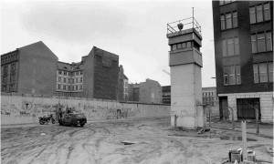
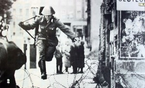
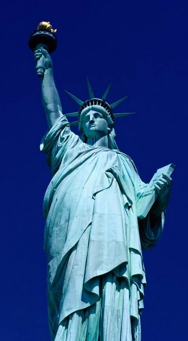

# ＜摇光＞从把枪口抬高一厘米说起

**如果我们的法律要求我们把每一件事情都作对，那么最终的结果就是整个社会除了法律明文允许的事情之外，做什么事情都可能被“良心”这样模糊的善恶观所惩罚。整个社会里除了道德的卫道士和虚伪的传教者之外没有一个人敢站出来呼唤自己本真的自由。** 

# 从把枪口抬高一厘米说起

## 文/ 张韧刚（北斗撰稿人）

记的很久很久以前读到过一个案例，是讲在柏林墙倒塌之前，一个站岗的士兵发现了一个准备逃亡西柏林的逃亡者，他接到命令开枪并且打死了这个逃亡者。 在后来的审判中，这位士兵被定了罪，原因是你接到命令开枪，但是你有把枪口抬高一厘米的权力，而没有这样去做。 柏林法庭最后的判决是，这名士兵，英格·亨里奇三年半徒刑，不予假释。法庭对此的解释是：“东德的法律要你杀人，可是你明明知道这些唾弃暴政而逃亡的人是无辜的，明知他无辜而杀他，就是有罪。这个世界在法律之外，还有‘良知’这个东西。” 这个案例无疑激动人心，正义最终得到了声张，法庭的审判并没有保护一个专制政权下合法的行为，它被无数人拿来引证，作为面对专制和暴政时个人有权利选择不合作的经典案例。它向人们一再的证明一个观点，法律之上还有良知。 

 ** **

**然而我则不得不站出来反对这个观点。** ** ** 法律判例应该有他的公平性，它应该保证的是程序正义，而非一个人们心中的终极正义。在我看来，在这个案例中要求最终正义的这个结果无疑违背了法律的精神。 在审判中，我们必须承认在东德的法律中，士兵接到命令向逃亡者开枪，这是绝对合法的。而如果这件事是合法的，同时英格·亨里奇又因为开枪击中了逃亡者而被判刑的话，这等于说，你可以合法地去打，但是打中就违法了。这是一个相当荒谬的逻辑。 而这个荒谬的逻辑的根本在那里？如果我们深究下去，我们会发现，英格·亨里奇开枪时所遵循的法律本身就违背了“良知”，这本质上是一个立法问题，应该为那个逃亡者的死最终买单的，是制定这条法律的人。是他们，混淆了善恶的界限，把原本罪恶的行为定为无罪。 而执行法律的过程是绝对不偏离程序正义的原则的。尤其是在我们这样一个从来都认为终极正义大于程序正义的国家。然而在我们这样一个国家里，背弃程序正义带来的恶劣后果也是最多的，从最早反右及其扩大化过程中我们不审判就将很多人定为右派进行迫害，到文化大革命的十年浩劫，再到83年的严打，然而离我们最近的一次，就是重庆打黑行动。 也许其中有一些摆脱程序正义去追求终极正义的努力带来的是一个看起来不错的结果，也许如本文开头一样，我们欢欣鼓舞都看着又一个集权的工具被判为有罪，但是法律本身的目的并不是让我们把每一件事情都做对，而是公正地惩罚每一个做错的行为。放弃程序正义，最终放弃的是对善恶的界定。如果我们不去深究立法本身的错误放弃法律的程序正义去追求所谓最终正义，那么最后的结果就是反右这样颠倒黑白的事情一而再的发生，几十万人被打成右派之后又陆续被平反。最后剩下6个人，他们最后被定为右派至今未能平反。这样的反右运动难道是正义的？83年因为调戏妇女被关上20年的那些人，所做的事情，不过是在我们今天看来完全正常的男女关系而已。 

**如果我们的法律要求我们把每一件事情都作对，那么最终的结果就是整个社会除了法律明文允许的事情之外，做什么事情都可能被“良心”这样模糊的善恶观所惩罚。整个社会里除了道德的卫道士和虚伪的传教者之外没有一个人敢站出来呼唤自己本真的自由。**

** ** 那些让人欢欣鼓舞的，脱离了程序正义，达到了所谓“终极正义”的判例，往前再走一步，就是法律的精神的背叛。在人们冷静下来的时候，我们会最终发现，那些判例都是对自由的侵犯。  当我们今天狂热的追求正义的时候，必须有人冷静下来深究法律意义和立法的正义，否则，我们会再度堕入一个可怕的时代，在那个时代里，每一个人都为虚幻的正义欢欣鼓舞，欢欣鼓舞过后，我们发现我们必须虚伪地去附和那些虚幻的正义，而且已经没有任何公正和自由留给自己。 

（采编：黄理罡 责编：黄理罡）

