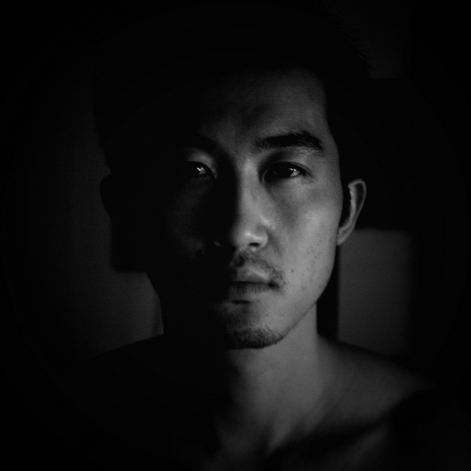
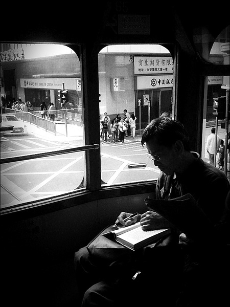

# ＜摇光＞从政治控的悲剧说开去

**或许一个平凡的女人就能拯救一个无可救药的男政治控，让他的世界豁然开朗，发现这个世界其实还有很多其它的美。当一个人变成你生活的一部分，你会愿意为她改变很多，在义无反顾地去拯救天下苍生之前，你或许首先要考虑的是如何取悦你身边的这个女人，然后她与你组建家庭，为你生儿育女，你有了牵挂，你不再那么无所畏惧，这个时候，你或许会说，此身许君，再难许国。** 

# 从政治控的悲剧说开去

## 文/刘桂新（武汉大学）

 刚刚在校内上看到赵觉成那篇“到哪里寻找属于一个政治控的幸福”，让我有点内心难平。不得不说，很多话戳到了我的痛处，同时也为有这么一个人能跟我同声相应、同气相求而感到欣喜。 有人给此文下了总结，说中心思想是在内心深沉呼唤：“政治控妹子，你在哪里？”（王倩茹） 嗯，这个总结有点解构，但我个人却表示中枪了。 政治控的男生（其实女生也是）有些自命清高，发誓要找一个跟自己志同道合的人，如果找不到甚至有一种此生不娶的架势。 

 我想这些人之所以被称为政治控，就在于他们想让他们的一切都与他们的政治理想、社会关怀联系起来，包括自己的爱情和女人。当然，这里政治控的政治指的不是权力欲作怪的从政理想，而毋宁是哈维尔所说的反政治的政治。 有人提醒说，政治不是生活的全部啊。是的，政治不是生活的全部。但政治却像小王子星球上的猴面包树一样，一不小心就把我们的全部生活空间给挤占了，像迅速传染的病菌，像疯狂繁殖的水葫芦。 从此，生活沦陷了。 从初中的时候就开始看NBA，那个时候为艾弗森疯狂，大学的时候也在为姚木桩的表现或欣喜或扼腕，现在彻底不看NBA了，那天打开电脑偶然看到了总决赛最后一场，当看到诺天王捧起总决赛的冠军杯，我才想起这个人转眼间就陪我走过了十年，恍如隔世；还有初中的时候每天必看的娱乐新闻、香港九十年代的商业电影、大学的时候燕姿的每一首歌曲、买到电脑后每天一部的经典电影，统统都变得淡漠。似乎再也没有什么能唤起我们生活的激情，除了政治关怀。 生活开始让我感到意兴阑珊。这是成长，我对自己说。只是关注对象的转移罢了，转移到一切与中国的问题有关的阅读和思考上去了。 我感到了自己的急剧苍老，时不我待，因此越来越追求一种急功近利的阅读，只阅读那些能最有效地帮助我思考中国问题的一切书籍。 有朋友提醒我说，不首先安顿好自己的心灵，如何去安顿别人。（索晶） 我猛然警醒，突然发现，我的生活怎么沦陷得这么泥沙俱下？ 脑子里面装满了我在思考的各种问题，而我的阅读总是追随着我满脑子的问题，阅读中国近代史是为了清算TG的斑斑劣迹，阅读世界史是为了把握世界文明的总体脉络和发展进程，阅读社会学是为了思考当前中国社会频发的各种社会问题，政治学则是我思考中国问题的一个最重要的学科视角。倒是有很长时间没有好好读过一部小说、看过一部艺术电影。不是说学术生涯实际上是一种摧毁阅读的过程么？ 以前我的生活圈子里没有一个政治控，甚至第一次听到“政治控”这个名词还是在前段时间加了大量圈内好友之后。现实生活中是在大四的时候才找到一个可以跟我聊这些问题的人，毕业了他就走了。除此之外，我就是沉寂在一个人的阅读与思考中，偶尔会去听几场激情四溢的讲座。那个时候也上网，但在网上没有找到一个政治控好友。我从来不主动跟身边的人谈论这些问题，只是以平和爽朗的微笑示人，跟朋友打球、喝酒、玩牌，该怎么玩还怎么玩。那个时候我的生活平和安详，虽然在心底里我已经是一个不折不扣的政治控。 后来在校内上发现了一圈人，相见恨晚，相谈甚欢，我为他们的气质所怂恿，我的被憋在内心的理想和见解被他们所印证和表达，我从此便毅然决然、义无反顾地有了政治控的自我认同啊。 但其实我在这个圈子里一点都不活跃，也基本上不上北斗的网站，大概是觉得自己来得有点晚了，跟不上这群年轻人眼花缭乱的想法。一想到这个圈子被越来越多的90后所充斥，我就越来越感到这群小屁孩向我这个怪蜀黍投来的异样目光。我是真的老了，不应该再死皮赖脸地掺和年轻人的事情。我怎么还能跟一群本已闲得蛋疼的本科生一起扯淡呢？   但由于初来乍到，我还是被这个圈子里的奇人奇事激动得忘乎所以了，忘记了自己已经没有时间挥霍大言不惭的青春。已经是老大不小了，该沉下心来专注地做一点与自己未来的职业规划有关的事情。 何况我已经有我的职业了，他们说读博是一个一个月拿1200块钱工资的职业。你没有时间再自由散漫地想这想那，读这读那，你要安安心心地去做一件事情了，学术研究不是一件很严肃的事情么，你要做的不是在校内上贴一些蛋疼文、默泪文、苦逼文，而是应该好好学学什么叫学术规范，正经的在学术期刊上解决几篇资格论文。 然而我还在疯狂地下各种与自己的专业无任何关系的电子书，大有将所有与我思考的问题有关的知识都装进大脑之势。那些政治议题激起了我更强烈的求知渴望，却让我在知识的广袤海洋里茫然失措，找不着北。 不但生活没了，赖以谋生的职业也未成型。 可能是自己还没有进入状态。或者说由于更清楚地看到了这条路的本来面目，开始有些踟蹰不前了。之前觉得很纯洁美好的学术研究在我的所见所闻中日益露出狰狞的面目。 在当下之中国，想要做一种独立的学术、甚至对抗现存体制的学术怎么可能呢，你首先需要写委曲求全甚至向现有体制献媚的文章才能顺利毕业，你要尽力拍我党的马屁才有可能拿到体制内的项目经费，继续发迎合体制的文章，才能评到官方职称。这样一直隐忍和韬晦下去什么时候才是个头。 腾彪是讲师，萧瀚是副教授，范亚峰是副研究员，王怡呆在成都大学也不知道是个什么级别。但他们都不志于做学究式的学者，至于那些处于教授级别的异议知识分子，要么是在体制尚未像现在统得这么死的80、90年代已经爬上去，像秦晖、朱学勤那一代，要么是爬上去之后才渐渐露出异议本色，像张千帆，让我党后悔不迭。 但时移世易，当下学者之成长环境更加艰难，不仅因为学术体制已经完全为官方所把控，无任何以学术为衡量取舍的自治空间，像腾彪、王怡这样的体制内学者本身已经不指望这条上升之路了，他们已经通过其他方式找到了话语权。但对于其它同时代学者以及更年青一代学者，除了向我党献媚似乎在体制内已别无升迁之途。在这种学术体制内，学者型公共知识分子如何成长？也许大家都只能像腾彪、王怡那样的才能特出者，剑走偏锋方能起到振臂一呼的效果。 或者你要么向这个体制妥协，在学术与政治之间寻找妥协与平衡，先隐忍地爬到教授一级，等自己真正有了话语权了，再发出自己的声音。但于我而言，做这样的学问无论其目的多么道德，其行为本身即是一个有损我人格的事情。而我又找不到一种能调和二者的办法。 那天晚上最后一次跟班上的同学出去喝酒，喝到兴起他们都对我“敞开了心扉”，我大概听出来的意味就是说我的理想很虚伪很装逼，说我总是向现实妥协，说我言行不一致。 这个事情在我心里留下了阴影，最让我难受的莫过于痛数我历史上的懦弱，从考研、选导师到考博、选研究方向，整个一部成长史，在他们眼里，就是一部不断向现实妥协的懦弱史。 “等我有实力有能力，我一定要做我喜欢的事说我想说的话过我想过的生活。一定。”（王倩茹） 我也是这么想的啊，但要到什么程度才算是有实力有能力，会不会等的时间太长了以至于忘了最初的梦想。 一想到这样的生活前景，就觉得前路渺茫，心灰意懒。拒绝做一个曲学阿世的学者，但在我成为一个有话语权的学者之前，我有拒绝的资本吗？ 此刻我才发现，原来自己并不是真的想“以学术为业”，毋宁说我想“以政治为业”，是“政治的召唤”（翻开韦伯的《学术与政治》，看到的第一句话便是：“一个人得确信，即使这个世界在他看来愚陋不堪，根本不值得他为之献身，他仍能无悔无怨；尽管面对这样的局面，他仍能够说：‘等着瞧吧！’只有做到了这一步，才能说他听到了政治的‘召唤’。”）让我走到了这里。我唯一想做的是如何改变身边这个让我不满的世界。 有人会问，既然这么痛恨这个体制，为什么不与这个体制彻底决裂，还要依靠这个体制生活？ 

 这是一个一直以来挑动我道德敏感神经的问题，诸如此类的问题还可以替换为，“你为什么要入党？”。此刻的我，便会像一个急着想证明自己没有撒谎的小孩语无伦次地辩驳。似乎从小就最害怕别人怀疑我的真诚。为了道德的目的是否可以做一点无伤大雅的不道德的事情，比如说入党？不道德就是不道德。 我想一言以蔽之地回答，我无所遁逃。它从我出身那天起就拿走了本属于我的一切东西——与城市孩子同等的受教育和享受其它社会福利的机会、也没有沃饶广阔的田地或者哪怕是一个小小的矿藏，它唯一给了我一个让妈妈去深圳打工的机会，让整个家庭得以维生。而我则承蒙上天的眷顾，多读了几年书，才有可能坐在这里做公共知识分子的白日梦。 因为我被这个体制剥夺得一无所有，我没有能力不依靠这个体制生活。但这并不意味着我要加入他们，成为他们的一员，这不对，这是对历史的背叛，是对我生活在农村里的穷乡亲们的背叛。这些人此生已是如此的艰难，你有幸走出这种艰难，不应该再有朝一日去剥夺他们的子女。他们曾经剥夺你，这样的历史仇恨应该记取。你现在依靠这个体制生活不是为了将来有权力剥夺别人，而是要为曾经的被剥夺复仇。 依靠这个体制生活我没有罪恶感，那些本来就是属于我的东西，我只是拿回本就属于我的东西，不仅如此，我还要帮助更多的人——我身边那些被侮辱与被损害的人——拿回属于他们的东西。向这个体制妥协，是为了让自己成长得更强大，强大到足以与这个体制叫板，强大到可以把属于我们这些被侮辱与被损害的人的东西都拿回来。这是我选择将来在中国大陆的学术体制内生存的理由。 不过也有很多原来是体制的反对者，在被体制收归为其中一员，并且成为一个既得利益者之后，便成了这个体制的帮凶。一个人如果谋求在体制内生存，并且总是向体制妥协，最后会不会在体制的威逼利诱下，忘记了自己出发的方向？ 我现在，则是徘徊在这个路口，不知道踏上这条不归路之后结果会怎样。已经注定了无法做一个彻底的现实主义犬儒，但又沉迷于做一个艹圈里纯洁的或者说不切实际的政治控。因此“生活在理想与现实的反差中，生活在自我与社会的冲突中，时刻忍受着反差带来的无力和现状鞭策的伤痛摧残。”（赵觉成） 对于我们这样的人来说这或许是一个永恒的悲剧，像《成人之美》里的海老师，他向现实彻底妥协了，但内心也许是“到底意难平”吧。 于是，政治弥漫于生活的各个角落，找个女人都标榜要有家国情怀。生活就这样被沉重的理想给挤压得变形了。 有时候我在想，其实没必要把自己想象得那么孤独，也没必要把自己的理想追求想象得那么遗世独立。 或许一个平凡的女人就能拯救一个无可救药的男政治控，让他的世界豁然开朗，发现这个世界其实还有很多其它的美。当一个人变成你生活的一部分，你会愿意为她改变很多，在义无反顾地去拯救天下苍生之前，你或许首先要考虑的是如何取悦你身边的这个女人，然后她与你组建家庭，为你生儿育女，你有了牵挂，你不再那么无所畏惧，这个时候，你或许会说，此身许君，再难许国。 ** **

(采编：陈轩 责编：陈轩)

