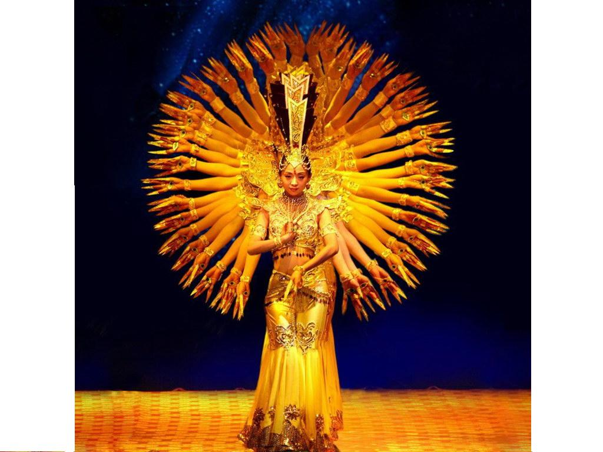

# ＜摇光＞从知道的少的快乐到知道得多的快乐，是要付出时间和代价的

**知道的少有知道的少的快乐。**

**知道得多有知道得多的快乐。**

**微博的流行使得我们不再有第一种简单的快乐。**

**信息的爆发必然带动那些遮掩了许久的丑恶。**

 

#  从知道的少的快乐到知道得多的快乐，

# 是要付出时间和代价的

## 文/ moonick（武汉大学）

传说中韩寒有这么一篇文章叫做《我的祖国》里面有这么一段：

“2004年左右是中国人的集体幸福年代，那时物价尚低，人民收入稳中有升，食堂半勺肉菜1块2毛5，93汽油3块2毛3，伊利芦荟味酸奶也曾经1块5毛，北京三环以内房价才万元不到，个税起征点调到2000元。”

也有这么一段

“傻逼脑残超级不反应中国社会现状的《一起去看流星雨》没有被**，反而是打动感动每个80后，反应房价居高不下的《蜗居》准备开始**了。说什么，剧中言语不符合社会主义精神文明建设！我就不明白了，大家都是成年人，又不是释迦摩尼，谁没看过A.片，谁没有过圈圈叉叉，谁心里没想过这个那个。要知道孔夫子也是有儿有女的。说明什么？说明孔子也是被激情燃烧过的…

亲爱的广电总局，把好片子好电影禁播后，留下一群毫无内涵的文化垃圾，污染已经被严重污染的祖国花朵…山西黑砖窑，陕西华南虎，云南躲猫猫，贵州俯卧撑，湖北捞尸船，湖南小白宫，重庆**，杭州欺实马，北京圈地运动，上海钓鱼执法，广州飞车抢劫，纵观中国天下，社会已经浑成了这样，广电总局还管什么“马上回去给你吃棒棒糖。”吃怎么了，草莓口味，香草口味的又怎么了！都当婊子好多年了，还立什么精神文明大牌坊。 ”

我想说，这快乐的时光是比较短暂的，在2004年那个手机都没有很普及的年代，更不用谈什么微博播报新闻了。那时候连Blog都还是刚刚起步，国内第一家大型blog提供商新浪居然在2005年才开始提供blog服务：**[http://tech.sina.com.cn/focus/sina_Blog/index.shtml](http://tech.sina.com.cn/focus/sina_Blog/index.shtml)**也就是各大意见领袖们还没有一个自己统一发表意见的平台。

2004年，在天涯发帖还没有成为曝光这些事情的救命稻草。那时候新闻还不怎么开放，那时候非典的消息还是比较官方的传播的，那时候人们没有现在这么恐慌，也没有现在这么麻木。

那时候骂国家骂症腐既不流行也还是不能当饭吃的。

2009年有次看一本英语辅导书，作者写道，感谢俞敏洪，他让我们这些除了英语什么都不会的人有了饭碗。

感谢Blog，感谢论坛，让这些除了骂国家和骂症腐什么都不会的，和除了为国家为症腐说话什么也不会的都能领到五毛，五美分，还有闲钱可以买个便当。

手机短信的普及到博客，再到拍客再到微博。信息越来越简短越来越劲爆越来越廉价，易获取和再分发。然而真相似乎没有离我们更近一点。

2004年12月中国网民0.94亿，2010年12月4亿多；这个国家仍然还有三分之二的人没有上网，也从来不在网上发表意见和看法。那么4亿人里，除开那些玩游戏的90后，上网炒股麻将看片的大叔大妈，剩下的对骂的人们，能代表多大一个群体的意见呢？

2004年以前，连造谣都不算很流行，因为没有流行的方法。那时候wiki还是畅通无阻的，GFW还不知是何物。绿坝娘还未出生，EVA这种暴力血腥的东西还在电视台儿童频道播出。

很可惜轮子们找到了新的战场，而领导们却并不想辩论个明白而只是封堵了事。大约他们没有料到互联网的水这么深葫芦这么多，千手观音浑身功夫也是无法全部按下去的。

知道的少有知道的少的快乐。

知道得多有知道得多的快乐。

微博的流行使得我们不再有第一种简单的快乐。

信息的爆发必然带动那些遮掩了许久的丑恶。

至于如何消灭这些丑恶。如何享受信息的极大丰盛与免费的自由获取并从中获取通晓一切的快乐？

亲，慢一点，亲，需要时间的亲，需要代价的亲~

信息的无序度和廉价导致了真相的散佚和昂贵。至少看起来我们要付出更多的时间从垃圾信息和谣言里去寻找他。

垃圾站，资源收集器，发帖机，等等都太容易淹没那些原创的只言片语了。然而喷子们除了争端，并不真正产生什么价值。

幸而在于，互联网又开始像有序度螺旋式发展了。

从到处一首一首歌下载文件名各异甚至乱码的时代，到现在iTunes Store或者酷我音乐盒这种分类明晰歌词健全有序的媒体库。都代表了过度无序开放的网络，将要渐渐回到一个新的有序的环境。

在微博上面对谣言无所适从的各位，请稍稍的，再多那么一点耐心吧。

** **

**转载自[流年的平面设计](http://moonick.net/)**

**本文链接地址: [从知道的少的快乐到知道得多的快乐，是要付出时间和代价的](http://moonick.net/2011/07/the-happiness-of-knowing-nothing-and-everything/)**

 

（采编：陈锴；责编：陈锴）
