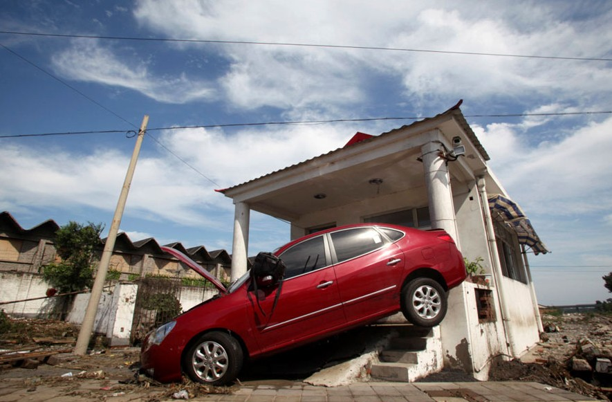

# ＜摇光＞他们总是在故作温和

**这类文章总是故作温和和客观，其实旨在混淆视听。他们先是虚情假意地口头承认政府有一定责任，然后就想尽办法转移责任或是把责任一笔带过，接下来就去攻击知识分子的衷肠。他们总是强调要就事论事，要谈实际问题，不要扯意识形态或者泛政治化！我其实怀疑这些人就知道这么几个词，不然不会每次都用上，以显示自己用词的专业性。然而，这些人通篇都在扯意识形态和政治，他们把这个扯进来，旨在教育你不要拿这个说事。** 

# 他们总是在故作温和

## 鲁舒天（黄淮学院）

 

每次社会上出一些可能会影响到政府声誉的事，都会有一批人替政府撰写澄清文章。

无论是地震，动车，还是这次京师的水灾，事件过后，你单看他们的那类文章，还会以为地震水灾泥石流之类的跟奥运会世博会差不多，都属于执政者积德行善的范畴，更有甚者还会真的陶醉于那些感人肺腑的剪切镜头或是精心装点的中国奇迹。 

这类文章总是故作温和和客观，其实旨在混淆视听。他们先是虚情假意地口头承认政府有一定责任，然后就想尽办法转移责任或是把责任一笔带过，接下来就去攻击知识分子的衷肠。

他们总是强调要就事论事，要谈实际问题，不要扯意识形态或者泛政治化！我其实怀疑这些人就知道这么几个词，不然不会每次都用上，以显示自己用词的专业性。然而，这些人通篇都在扯意识形态和政治，他们把这个扯进来，旨在教育你不要拿这个说事。

但是，他们却又没有提供任何解决问题的办法，自言是在提醒你少说多做，他们却是说得最多的，做得最差的。

这类文章也会提外国，但他们的意思往往是外国也有这样那样的乱七八糟，所以国内发生这些乱七八糟的事是正常的，也是合理的，甚至是必要的。

就像是我丢了电动车去警察局报案，负责我们学校的警察说，你们学校同时还丢了好多台电脑，你那个案子就放一放吧。

警察是在提醒我，受苦受难的又不是你一个，所以，他们的逻辑是，只要有人陪你一起疼，你的疼不但不是疼，而且会滋生出舒服的味道。

这些文章无非就是告诉我们，外国佬也在这个问题上疼过，且疼的更厉害，所以你别抱怨了，回家偷着乐吧。

这类文章的最后一招是让你知足，提醒你，你现在都能批评政府了，你好能耐。你还有什么不满意的？

好比你丢了东西去警察局，警察不给你解决，然后说，你看，你现在丢东西之后都能来警察局报案了，说明我们的社会运行的没有问题，如果我们办案没效率你甚至可以催一催，你都快骑到我们头上了，你还不满意吗，你还有什么话说。

这是一种从始至终都忘不了跪下谢恩的观念，但这种观念同样解决不了任何问题。

如果你错了，你不思改过，只是让别人骂骂你，然后马上就抓这个不放，去斥责骂你的人的不宽容，然后就没有然后了，仿佛骂了你事情就真的告一段落。

这类文章也经常把一句话挂在嘴边，那就是“骂有用吗”。对呀，骂没有用，所以，你提醒人们人手有一件“没有用”的权利，还指望人们拥有这个权利后继而对犯错的人感恩戴德吗？ 

眼下，解决问题是关键，而这种故作温和似是而非的文章只会堵塞言路，为真正的解决问题制造障碍，这如果是无意识的行为，叫做愚蠢；如果是因为表现自己的冷静，叫做至国计民生于不顾；如果是有意为之，实为误国。

向政府献计献策，针砭时弊的知识分子永远不是书生误国的主体，真正的书生误国其实是指的这种人。当然，前提是他们真的可以被称为书生的话。

而那些把这类文字视为爱国文章的孩子，只能说你们肤浅的不可救药。

真正的爱国者被他们视为汉奸，而伪爱国者，爱国贼，爱国小愤青却被他们看做英雄。究其缘由，是这些人平时看书太少，接触的社会又多限于学校，家庭，酒吧，游乐场所，风月场所，对于真正的现实问题几乎看不到，才会一而再再而三地相信这种反面典型的教诲。

所以请那些平时把时间都用在泡妞，耍哥们义气，看时髦电影，更新电子产品，整日花天酒地，游戏人生的年轻人要注意，你们既然压根没有读过几本书，又干嘛学别人一样去谈什么政治，你们真的不知道你们自以为拥有的一份“参政议政”的成熟与自信正是这个时代可耻的笑柄一桩吗？ 

 

(采编：黄理罡 责编：黄理罡)

 
