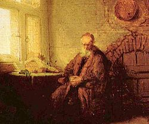

# ＜摇光＞他死了，并且死不足惜

**即便趋向现实，那也要知道，对现实的一切干预都应当始于对现实行为之理由的把握。承认世界是多元的，除我之外每一个人都是独立的个体，他们有他们自己的思维方式、道德理念、判断标准是其一；仔细考察他们思维和行动的方式，并且作出自己的判断是其二；体验和追问自身行事和判断的方式，然后，承担着所有你所作出的选择的前提、后果，以及意义，才可以问心无愧地活下去。**  

# 他死了，并且死不足惜

## 文/姜振宇（浙江大学）

 

他死了，死不足惜。

人对自我生存意义的叩问和回答，是从人内部定义个体的方式。自我提问有多深入，那么从人格意义上讲，个体就能够达到多少高度。一跳而殁的这个少年，假设现在流传的这篇文章（[http://blog.renren.com/share/287798745/14844880149?from=0101010202&ref=hotnewsfeed&sfet=102&fin=4&fid=20534750412&ff_id=287798745](http://blog.renren.com/share/287798745/14844880149?from=0101010202&ref=hotnewsfeed&sfet=102&fin=4&fid=20534750412&ff_id=287798745)）确乎是他写的，那么只能说，恰与他对生存的看法一样，这样的死亡毫无意义。这是我对这个人以及这件事作出的判断，我对这个判断及其所带来的后果负责。

在我所知道的所有对生存的“意义”这个问题的回答当中，史铁生的是最具有操作性的：既然活着，那么就是一个无可争辩的事实，问题只在于怎么继续活下去。这就回避了对于意义本身叩问，每一个脚踏实地者都可以这么去做，并且定义自己的目标、幸福和意义。

换句话说，意义是被人赋予的。这一判断隐含的事实前提是：我们身处于一个冰冷的、非人的物理世界。你活着或者你死了，1+1始终是等于2的，三角形三内角和始终是等于180度的，加速的物体所经历的绝对时间始终是短于匀速直线运动的物体的。但是了解这些有什么用呢？“有什么用”，恰好也类似于“意义”本身，这个问题上，那个少年得出结论的模式多少有点靠谱。如果用他的AB模型的话，即是：当我们说A有用的时候，实际上是在说A对实现目的B有所贡献。问题在于，“目的”和“意义”一样，都是人类自身所给出的定义，比如我们很难给文学审美这个A找到一个目的B，我们可以说，那是因为，文学本身即是目的。

叩问的目的，在语义上不具有正当性，而因此以为生无可恋纵身一跳，那就只能以为是，所谓“读书太少，想得太多”。前文提及每个“人”都碰到过这样的问题，大多数可以被定义为“人”的个体都没有给出完满的答案，但在追寻意义的过程当中，便也已然从事实上获得了“意义”。中国现代最牛逼的思想者鲁迅给出的答案也是最接近真相的：

**绝望之为虚妄，正与希望相同。**

尽管这话是引自匈牙利人裴多菲的，然则信息的传递应当结合思考着的个人所行的事迹，鲁迅二十来岁的时候本来是提倡科学至上论的，尽管他没有参与后来的“科玄之争”，也没有对科学能否解决人生的问题给出回答，但从今天来看，科学完全不能对上面这句断言给出解释，所以他转向人类的精神领域。

今天我们可以考察科学作为一种世界观的正当性，也就是说，前文提及的“1+1”、“三角形三内角和”是否真的就是真理了。如果如我一样接触过一丁点的科学哲学，我们会知道的是，上述这些问题的答案都是有前提的，特别是三角形三内角和的问题，非欧几何当中所给出的答案极不相同。至于1+1仅在什么情况下才等于2，这个问题需要知识积累作为前提，暂时绕开。

几个我以为是“真实”的判断：物理学所有的公式基本上都是凑出来的；数学建立在无法证明的前提之上；达尔文的演化论即便经过修正也完全不能解释寒武纪的生物大爆发和免疫系统的产生，等等。

以为从科学的、纯粹物质的角度可以解释——哪怕是含糊不清地解释——一切问题，这本身就是唯心论的极端表现。唯心论是否是自我欺骗？这所涉及的问题是如何来定义“真实”，而真实，天啊，是哪个傻逼给了你自信让你觉得自己能够把握或者已经把握住了世界的真相？！

哪怕是稍微读一点点唯心论相关的著作，就会知道所谓“任何学科、任何学说都必须符合客观事实”的说法不过是科学主义所造就的朦胧陷阱。什么叫“学说”？什么叫“符合”？什么叫“客观”？什么叫“事实”？我们知道美国的“科学真理教”是邪教，但何以是邪教？不考察这样的问题，仅仅接受高考之前十几年时间里用考试的强制手段灌输下去的“科学的”世界观，并且就这么死了，那么，这样的死亡也不过是一个发生了的事实而已。

宅男康德作为西方最后一个试图构建一整套能够解释一切思想体系的学者，他最初是以一个科学家的身份为人所知——他所提出的“星云”假说第一次尝试着否定或解决神的“第一推动”的问题——他墓碑上的铭文广为人所知：

**“有两种东西，我对它们的思考越是深沉和持久，它们就越在我心灵中唤起的惊奇和敬畏，这就是我头上的星空和心中的道德律令。”**

星空是自在的真实，人的心灵赋予真实以意义。或者说，人的意义和价值是由自己来定义的，如果你信仰神明，那么神明会代替你这个个体给出意义。康德给自己定立的法则——或者意义的判断标准——是将道德律令置于最高地位，个体的行为如果是和道德的，那么就是最幸福的，美和善在这个地方达到了统一。

脱离人的心灵来讨论意义是不具有正当性的。就像这个少年得出的结果，他甚至在科学的视角下混淆了“与意义无关”与“意义等于零”二者之间的区别，他所说的“没有意义”实指“意义等于零”，然而这实在并非科学体系所能得出的结论。

前述不过旨在证明，少年所秉持的世界观其基础是不稳固的，由是，其价值体系也不具有正当性。那么，既然在追寻世界真相的途中，这个少年在他自己的世界观之下选择了死亡，哪怕仅仅是站在他的世界观上，又应当怎么来进行评价呢？

如果他在考虑到这一跳所牵涉的其它后果——比如父母二十来年的辛劳苦楚、中年丧子的痛苦，老师们由于没有觉察到他的心理动向而在他们自己内心道德的驱动下所产生的愧疚，在目击者心中所产生的影响，哪怕之后的人为了处理他的尸体所消耗的劳力——并且，他仍然以为这些跟纵身一跳比起来，都是可以承担的，那么我甚至要为他鼓鼓掌：他实现了自身人格的圆满，死得其所，因而既不需要怜惜，也不需要遗憾。但是从他的字里行间看看，显然，他拒绝承认在他的世界观念之外存在其它的对世界和意义的解释方式，他甚至不去面对自己情绪的悲苦、欢乐，肉体的痛苦、愉悦这些生理层面的直截反应：他对意义本身误判只能得出“其他人的生活/情绪/思想也是没有意义的”这一结论，那么，我们对他的怜惜与哀悼对于他来说，也是没有意义的，不论这对于我们自己会产生什么样的影响——这也仅是一个发生了的事实而已。

多读点书吧。每一个你想过的，以为是你自己独自思考到的，尤其是源于内心、关于内心，并且最后面对内心的问题，都已经被人完善地讨论过了，自以为的深刻，仅仅是因为你的无知。因而保持谦逊是我所能想到的最可靠的态度：保持谦逊，然后攀登那些曾经很牛逼并且留下了名字的尸体所堆成的高峰；即便不是天才——至少我确实不是——或者中道而止，那么至少你也会知道你把脚下的一千具尸体踩在了脚下。一叶障目，然后自己摸遍全身，就以为自己已然获得了世界的真相，这仅仅是愚蠢。

LZ而今负笈京城，学的是最不切实用的学科，要说过去的日子有所收获，仅仅在于读书。对于一个可以被称为人文学者/求学者的人而言，不过是在读书的时候，每时每刻都在体验和感受别人所感受的，思考别人所思考的，然后一遍一遍地推翻、更新、重建自己的世界观和价值观。与其说不会为了或者会为了某一种思想去死，那不过都是因为，已然把“自己”消灭过无数次。

即便趋向现实，那也要知道，对现实的一切干预都应当始于对现实行为之理由的把握。承认世界是多元的，除我之外每一个人都是独立的个体，他们有他们自己的思维方式、道德理念、判断标准是其一；仔细考察他们思维和行动的方式，并且作出自己的判断是其二；体验和追问自身行事和判断的方式，然后，承担着所有你所作出的选择的前提、后果，以及意义，才可以问心无愧地活下去。

 

（采编：佛冉，责编：佛冉）

 
