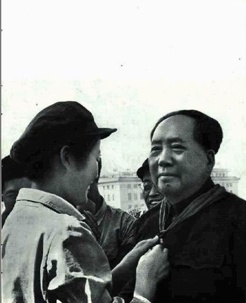

# ＜摇光＞以有趣对抗极权——如何成为一个有趣的人

**“在一个无趣的时代，无趣的社会，做个有趣的人，不容易。有时我常常想，有趣的人就是想让你从电脑里书本里把他拽出来，与他聊天喝酒，也是件很有趣的事。 ”**  

# 以有趣对抗极权——如何成为一个有趣的人

## 文 / 黄薄码（南京师范大学）

 我豆瓣和Twitter上的自我介绍都只有一句：一个有趣的人。这是我一直的目标。在这个无趣的时代，有趣的人是稀缺资源，与有趣的人搞在一起，互嫖互乐，生活就会有意思起来。所谓有趣，就是有思想、判断和激情，跟这样的人在一起交谈，能得到新的想法和角度。当然比找到有趣的人更为重要的是你要成为这样的人。小波一直是我认为有趣的人的典范，他对于有趣的定义，是“有道理而且新奇”。可见波波是一个重独行的人。有趣就正如他蓬乱的头发，永远交错杂乱，但是自由生长。 

 文革的隐秘遗产带给了我们中国人骨头深处太过顽固的极端特质，它使我们总不能平心静气看待一种现象亦或谈论某些问题。凡是“敌人”都要和他拼个你死我活，英特耐特并没带来英特耐雄耐尔，每一条新浪体育新闻下面都充满谩骂，每个人头脑里都只有马克主义唯物主义辩证法，却往往以因果关系为由，试图把所有的事情搞得一清二楚。而都忘记了有趣是感觉这个世界美好的前提，这种美好之中，也就糅合着冷静严谨的思索和奔涌而出的热情，而这才是辩论的题中之义。 有趣是一个高阶阶段，我觉得一般的人成长过程会从把狭义的国家主义情绪提高到宗教狂的阶段，再到另一个极端为了反对而反对的阶段，最后会进入一个有趣的阶段。这三个阶段不是每个人都能走到最后的，很多人停留在了第一阶段也有不少人到了第二阶段不断聒噪，第二阶段的危害貌似更大，他让民主自由这两个词成为了被嘲弄的对象，而第三阶段有的人终其一生也达不到。 极权主义最大的敌人就是有趣，近三十年的高速发展却没能改变时代的沉闷。一个拒绝有趣的社会，将是极其虚伪的社会，也是极其脆弱的社会。在这个貌似空前强大的政权即将分崩离析的时候，极权敞开怀抱一手拥抱冷漠一手拥抱暴民的，它想使这个国度的子民相信他们个体的无力，让他们相信这个世界会悲观的结束，他们通过一贯的教育和长久的宣传让民众脱离了趣味，走向乏味，无趣，冷漠和暴躁。如果不想成为极权的殉葬品，我们就必须有一颗欢乐的心，面对生活无边的无奈与无聊，将自身价值维系在对希望的执著之中。每个有趣的人都会把一切庄重和崇高拉下台来，戏语一番，讽刺而不怒骂、谈笑而不猖狂，将种种丑陋剥了个精光，我们才能如此真切地发现华服之下的事实真相。如若每个人内心都无比强大都有趣起来，理想主义就不会出现在极权主义开出的阵亡名单上，是的，从来没一个专制政权战胜过有趣。 

 有趣的人必然是热爱生活的人，是疲惫生活的英雄梦想。就像有钱人会送999朵玫瑰，有趣的人只会送一朵自己栽种浇水呵护大的玫瑰。有趣的高阶是你能一个人还能有趣得起来。做一个有趣而非随大流的人，总有一天要被孤立，因为大家都是在抱团其乐融融。所以有趣的人必须面对孤独，而且还要在孤独的时候还要自娱自乐，还能吸引围观群众。世界的真相就是如此，是人们寻求光，而不是光寻找人。这世上只有少量的光，而周围的黑地里总是有太多的人。这样的人哪怕是低着头玩手指头，抬头也会发现周围聚满了人。 在一个无趣的时代，无趣的社会，做个有趣的人，不容易。有时我常常想，有趣的人就是想让你从电脑里书本里把他拽出来，与他聊天喝酒，也是件很有趣的事。 

