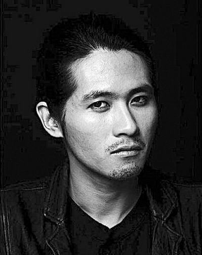

# ＜摇光＞以自由的名义

**我的脑中出现这样一个场景，若干年后，一个腐败的政权终于崩塌，一个自由的国度建立起来。一天，我在蹲厕时偷偷拿出马克思的作品消遣，一群骑着羊驼的自由主义者夺门抢走了我的书，将我拖出去，在广场上的人们面前，用那本书使劲敲打我的脑袋。为什么不让我先穿起裤子？**

** **

** **

# 以自由的名义

## 文/苏丹(社会大学)

韩寒是个好司机。也许是出于保护未成年儿童的原因，韩寒写了《黄艺博是个好干部》，文中表达出不赞同大家冷嘲热讽黄艺博和他爹妈，同时认为孩子长大后自然会醒悟。却在文末酸溜溜的说“衷心的祝福黄艺博在共青团可以大有作为”，实在令人费解。韩寒应该记得，若干年前，他也是不走寻常路，被当作反面例子，受千夫所指，像今天黄艺博一样被大伙批，一定是当年哪位宽厚的长者“衷心祝福”了他，以至于他如今也要“衷心祝福”下晚辈。 

黄艺博做了他觉得有意义的事情，并且没有害人。所有说他肯定打过小报告害人的，是在没有证据的无端揣测。我们许多好友对这个贸然闯入成人肮脏世界的孩子疼爱有加，单独建个相册，极尽恶搞之能事，把他P成僵尸，把他P成林妙可的男人，把他P成金主席，我猜这些人心理上必定很痛快。 并且他们认定，自己从小就是被“别人家的孩子”压迫的，这会终于出现了这个“别人家的孩子”，有一条很充分的理由就是：一定要压迫回来。并且他们认定，既然一个孩子有看新闻联播的自由，那么他们就应该有欺负一个孩子的自由，有围观的自由，他们觉得这是一种自由。并且他们认定，如果不给他们恶搞一个爱看新闻联播的孩子的自由，那么就是没有言论自由。 

韩寒07年时对现代诗和现代诗诗人很不屑，说“现代诗和诗人根本没有存在的必要”，说“从上学开始我看见图书馆里的现代诗集就是这观点，永远不会变了”。几番乱战后，韩寒威名响彻网络，一时风头无两。2010年，韩寒的观点变了，他懂得了文学的“多样性”，学会了“包容”，向现代诗诗人道歉。我们许多朋友还停留在韩寒的07年，容不下一个两岁起看新闻联播的孩子，将他们对污浊官场的厌恶、将丑陋教育的恨，丢向一个初一孩子，并给他配了一个叫林妙可的老婆。 我的脑中出现这样一个场景，若干年后，一个腐败的政权终于崩塌，一个自由的国度建立起来。一天，我在蹲厕时偷偷拿出马克思的作品消遣，一群骑着羊驼的自由主义者夺门抢走了我的书，将我拖出去，在广场上的人们面前，用那本书使劲敲打我的脑袋。为什么不让我先穿起裤子？ 他们，以自由的名义。 

### 

### 

原文地址[http://blog.renren.com/blog/319256062/725273162](http://blog.renren.com/blog/319256062/725273162)

(采编:陈轩 责编:陈轩)
