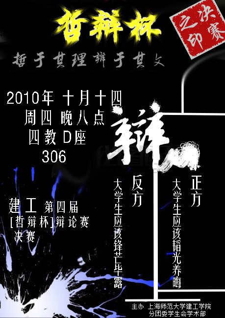
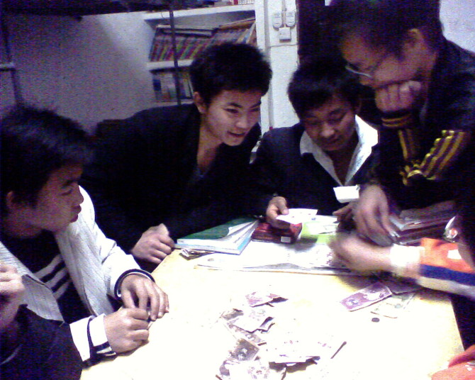

# ＜摇光＞传统下的独白——上师大的辩论风暴

**中国的教育，从初中始，到博士终，始终都把听话作为一个最高的标准。缺乏了独立自主精神，而一味追求中庸之道的大学生，他们还能够为这个国家担当起些什么？所以，这个国家没有法治。高铁会追尾，地铁会追尾，道德感缺失。全面进入了一个“人性冷漠”的社会。没有多少利益纠葛的大学生群体，尚且如此，其余的各类组织，可以想象。**  

# 传统下的独白——上师大的辩论风暴

## 文/姜骏怡（同济大学）

 

明眼人一看就知道，本期的题目出自于台湾李敖大师的杂文集。传统下的独白，独身者的传说。

最近，一个有关于上海师范大学的音频在网络上突然间红了起来。人人网上也是转载者甚众。笔者是10月1日的下午第一次听到了音频中的内容。听完这长达约15分钟的音频过后，总是琢磨着写点什么。在写这篇评论之前，我又把这个音频听了一遍。一来考证一下细节，二来看看是否能听出什么新的东西。上师大的辩论风暴，好像一个潘多拉的魔盒。校团委主席又好像阿克琉斯的脚踝。整个大学的各种各样的组织，却又好像一出彻头彻尾的希腊神话剧。往往是只有白纸黑字，而一个没有活生生的，大写的人。

整个事件因辩论而起，那我就谈谈我所知道的辩论。

手头有一本复旦大学出版社出版的书，名字叫做《狮城舌战》。记录的是1993年在新加坡举行的“首届国际大专辩论会”的故事。那一年，复旦大学拿了冠军，而这本书，也成为了所有爱好辩论者的“圣经”。封底上印着这样一段话“康德说过：唯有两样东西能让我们的心灵感到深深的震撼：一是我们头顶上灿烂的星空，二是我们内心崇高的道德法则。编辑人说，如果还有第三种，那就是为辨明真理而慷慨陈词！”。如此激荡人心的话语，今日读来，依然有着直达灵魂的力量。正如周恩来在留学法国期间所说：真理越辩越明。

相信每一个男孩子的心目中都有一个关于辩论的理想。古有苏秦张仪连横合纵，远有诸葛孔明舌战群儒，近有顾维钧在巴黎和会上的既慨而慷。这些雄辩家们，雄辩的是什么？是顾炎武先生的“天下兴亡，匹夫有责。”雄辩的是自己心中的政治理想，雄辩的是黑暗中的一丝烛光。即使在1993年的狮城，复旦大学与台湾大学的决赛辩论题目是“人性本善还是人性本恶。”回归到人性的大辩题，回归到哲学的起源。这才是辩论。

看看如今的那些辩论的题目。我都不好意思写出来，以免落得个哗众取宠的不好名声。没有信仰，没有自由，没有真理，没有所求。有的只是辩手的拿腔拿调，有的只是辩手的不知所云，有的只是无关痛痒的点评，但是，这些却都指向一个目标，那就是谁胜谁负。输赢在辩论的天平上占据了太重要的砝码，每一个参加辩论赛的人，都只关注输赢。信仰与真理遭受到了挑战，他们曾经被摆在峰巅，如今却被人遗落在谷底。辩论，不在乎输赢，也不需要输赢，需要的是为真理的慷慨陈词。无关乎你参赛时西装知否挺括，无关乎辩手中是否有美女的存在。关乎的仅仅是辩论的本身。如果，太在乎输赢了，那就什么都不对了。

性、足球、体育、音乐和战争是世界的五大通用语言。不分国界，没有肤色。在倡导和平的今天，除了部份地域性的战争之外，世界范围内的战争已经离我们有66年的历史了。但是，战争的延续却没有消失，反而愈演愈烈。各个国家之间的贸易谈判，领土争端，都是另一种形式的战争。或者称之为没有硝烟的战争。为了0.1%的关税，为了一个小小的钓鱼岛，国与国之间的实力呈现除了一种隐形的战争状态。俄罗斯强人普京说过：“领土问题不是在谈判桌上谈判得来的，而是在战场上打仗得来的。”从某种意义上，辩论是战争的笔尖，也是战争的序曲。青年人热爱辩论，参与辩论，不是为了出头，也不是为了能够领导学生群众，而是应该怀着一种奔赴战场的勇气，去参加一场不流血的战争。羡慕别人的结果，那就同样要羡慕别人的过程。多说一句，这一支复旦辩论队的教练里有王沪宁，现任中国中央书记处书记，中央政策研究室主任，中共中央委员。胡锦涛的三大智囊之一。

回到这长约15分钟的录音之中。录音之中的一个女生一直在质问一个问题，用秋菊的话来说，就是要一个说法。而团学联这里，从头到尾，都是用四个字来搪塞“规章制度”。甚至到了最后，说出了这样的话：“因为我是你的上级部门，所以我不需要给你解释。”这样的话，从一个20岁出头的年轻学生口中说出，对于笔者的心灵就好像刺了一刀。我仿佛又听到了“我爸是李刚”，“让领导干部先走”这样的话语。珠玉在前，焉能不效之？我情愿相信这样的一句话是他的无心之过，而不是他的心声。这就好比什么呢？一个月经初潮都没有来过的少女，却得了性病。如果真的发生这样的事，那就没有理由相信还有什么值得我们相信的了。

团学联数次以官方的口吻放话，甚至其中有些话语还带有威胁的性质。这让我不得不开始怀疑，这是团学联，还是黑社会。反正，在大学的两年时间里，我发现了这两者之间太多的相似之处。甚至团学联还没有黑社会讲究义气与道义。招新的时候有黑幕，换届的时候有黑手，开会的时候有黑（暗）箱操作。招新时热热闹闹，换届时风雨飘飘，活动时零零落落，总结时哭哭笑笑。这就是如今大学生的团学联。一种以中国官僚式机构运作方式运行的组织。甚至，我想到了机关这个词。处处机关，处处陷阱。许多参加过团学联，学生会的人告诉我说，那只不过是弱冠之年的幼稚游戏。学生热衷于此，我远远看到了未来的中国，《1984》中的描述。

听组织的，有规章制度。但是，又拿不出规章制度。这就好比是什么？我要抓你，可是你又说不出我为什么要抓你，反正我就是要抓你。逻辑上的混乱暂且不论。这样的组织历史上存在着三个，汉娜·阿伦特在《极权主义的起源》这本书中说过其中的两个。一个是纳粹德国，一个是前苏联斯大林时期。我再加上一个，中国的城管。我怀疑的是，是不是在大学里当上什么部长，什么主席的人都怀有一种心理，或者说一种思维，那就是“城管思维”。今天，我要招新，看你长的好看，我就要你了。无论能力，无论才干。主席，部长们喜欢一意孤行，为的是彰显自己的权威。在20岁出头的年纪，正是一个人最喜欢显摆的年龄。而为了显摆，可以不提礼义廉耻，不提礼义廉耻的结果，那就是各种“黑”。中国人喜欢整人，秦始皇焚书坑儒，毛主席发动文化大革命。整人与被人整，是每一个年代的中国人都必须经历的事情。如同男孩子的遗精，女孩子的初潮。但是，如果在得风气之先的大学，也是整人与被人整的话，社会究竟到了哪般田地，各位看客自己决定吧。我突然想起来了，中国的大学历来是整人的发源地。清华的蒯大富们早就给后辈树立起了一座丰碑。只不过，三十年后的今天，无数的唾沫，泪水甚至于鲜血的教训，也没有能够把这面墙推倒。为什么？中国人的奴性，学生的弱点。

不要把部长、主席挂在嘴边。我想到了我所在学院的一位系主任。他喜欢说这样一句话：“我在这一行已经干了18年了。”10年的时候，是十八年，11年的时候，也是18年。其实我想提醒他，你可以说“我在这一行已经干了19年了。”今天，你能当上部长，不是因为你的能力有多么出色，你的才华有多么出众。一个更重要的原因是，一大批比你更优秀的人，不屑于去做你口中的班长与主席。他们是庄子，你只是一个小小的惠施。不必用一个小小的梁国来压人。以理服人，以德服人，而不是你自己手中的权力，更不是你自己头顶上的乌纱帽。所以，可能的话，笔者希望，大学的主席可以直选，每个人一人一票选主席。虽然，这只不过是一个遥不可及的梦想。

音频中，团学联的人是如此的世故。规章制度是他们的挡箭牌。姜瑜也说过：“法律不是挡箭牌。”不懂法的人犯小法，懂法的人犯大法。中国的教育，从初中始，到博士终，始终都把听话作为一个最高的标准。缺乏了独立自主精神，而一味追求中庸之道的大学生，他们还能够为这个国家担当起些什么？所以，这个国家没有法治。高铁会追尾，地铁会追尾，道德感缺失。全面进入了一个“人性冷漠”的社会。没有多少利益纠葛的大学生群体，尚且如此，其余的各类组织，可以想象。

录音中08级的辩论队顾问。同样也不是一个带着光环的人。只不过，他自身的利益受到了侵害。久走夜路必撞鬼啊！都是这样上来的，我不相信你的手就比别人的干净。他的话语说的依然是这样决绝，甚至出现了抱大腿的情况。“话语辩论网的副总编辑是我的好朋友。”这句话吓不到人，其实最怕的永远是自己。年轻人，学会给自己留一条后路。

说了那么多，这个音频给我最大的失望就是国家情愿大学生去打DOTA，去KF，去消耗时间在无限制的内斗之中，去听组织的话，也不希望大学生了解这个国家，关心这个国家的民族和未来。

“华北之大，竟然放不下一张平静的书桌。”1935年，中国的大学生的前辈们，在一个兵荒马乱的时代，尚且还有这样的感悟与家国抱负。轰轰烈烈的“一·二九”由此载入了中国的史册。

今天的大学生呢？

“我是你的上级”。

 

（采编自投稿邮箱；责编：麦静）

 
