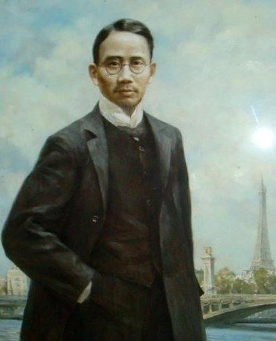
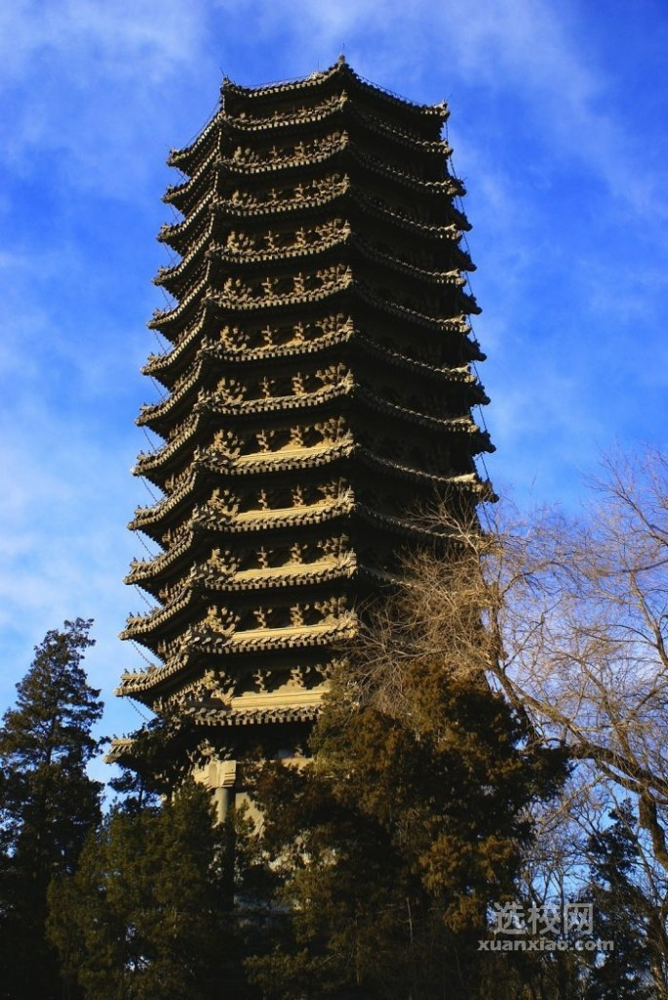
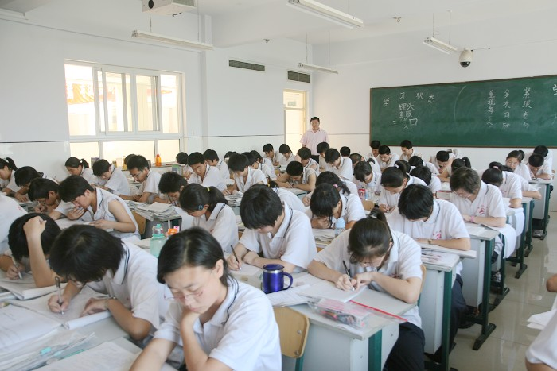
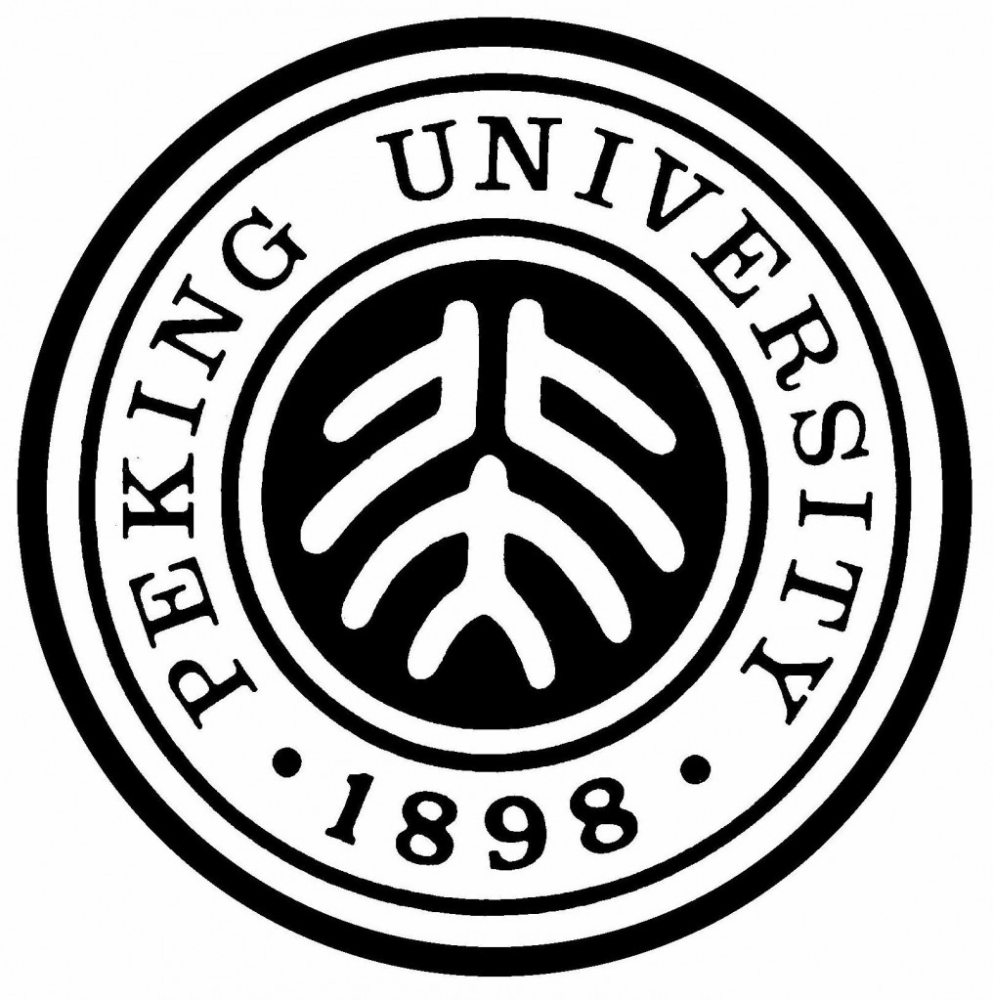

# ＜摇光＞你以为你考上北大，蔡元培就灵魂附体了么？

**我们中绝大多数的人之所以成为北大学生，是因为且仅仅因为在那次高考中得到了比自己身边的人更高一些的成绩。然而这样说还不够准确，实际上除去很少部分的因运气成分在高考中发挥超常的人，今天北大学生的唯一选择标准，就是高考制度的优胜者。**

### ** **

### 

** **

# 你以为你考上北大，蔡元培就灵魂附体了么？

### 

## **文/张舒迟（北京大学）**

### 

### 

我曾经就是这么以为的。

什么是北大精神？独立人格、自由思想、兼容并包、追求真理、不怕牺牲、常为新的改进运动的先锋、特立独行、个性张扬、指点江山、心怀天下、携来百侣曾游、眼底未名水胸中黄河月……等等等等，“她是中华的脊梁，她是民族的精魂”，总之就是伟大光荣正确，就是博古通今融贯中西所有人类中最精华的价值理念道德品行完美的结晶体，就是但凡尚有一丝高尚追求之人即使身不能至，提起来也必须立即肃然起敬的分水岭试金石，就是无量先贤用青春鲜血皓首穷经树立起来的供后人瞻仰和攀登的巨大丰碑，还有很多。

这些都很好，只是事到如今，全都变成了挂在胸前的勋章，正如入学时每人发一枚的那个校徽，特意注明“一旦遗失不予补发”。

《兄弟连》里有一集开头，在酒吧里，老兵不掩饰鄙视地盯着新兵崭新的制服上的一枚勋章问那是什么意思，新兵答道那代表了101空降师在诺曼底战役中立下的功勋，老兵问，你丫在诺曼底干了他妈什么？

我们没参加过戊戌变法，只知道地铁有一站叫“菜市口”；没参加过新文化运动，顶多为认得几个繁体字背几篇古文被别人称赞心里小暗爽一下；没参加过五四运动，大概也没几个人知道校庆其实不是这一天；没组建过共产党，甚至连学生社团都没成立过；没参加过一二九运动，十二月寒冬也不敢尝试洗一下冷水浴；没参加过西南联大；没站在炮弹坑里听过冯友兰先生讲课，至多一边上课一边在BBS上挖坑填坑；没参加过八十年代的任何一次学潮以及那连名字也不能提的运动，或者根本不知道有这些事。我们没写过诗，不会弹吉他，啤酒倒能喝上几瓶，一有外校的同学来游玩，就带他们逛未名湖博雅塔，里面最好还有留学生，顺便秀一下口语，哎你知道吗，王维是在这湖里自杀的，著名诗人啊，还写过《人间词话》，嗯。再谈谈目前的这主义那派别，点上根烟，感觉自己简直是诗人学者民主战士了。每年别忘了去给蔡先生献一支花，一脸肃穆地再次确认自己就是北大精神的正统合法继承人。

蔡先生或许也想问一句：你丫在北大干了他妈什么？

### 

### 

到底有没有北大精神呢？有。至少曾经有吧。可是，任何一种精神，一旦可以被挂在墙上、门口或胸前，它自己也就挂了。对于今天的大多北大学生，北大精神的实质已经变成了对北大精神本身确实存在、一直存在、不仅现在存在、将来也永远存在、而且就存在于我们的身上的标榜和捍卫。

一种有别于他人的特质，或者更准确地说，标签，它的实质内涵就是确认自身的存在和特别。请问，你联想到了什么？

我联想到了世袭贵族制、“上帝的选民”、某种神秘宗教的祭司信徒集团、种族主义三K党，还有八旗子弟。

在很大程度上，北大精神已经变为当今北大学生的精神胜利法。

奇怪吗？其实未必。一种特质的自我保存和延续，与它本身内容的关系，远不如与它保存和延续的方式的关系更大。只要看看我们是怎样带上了这一枚诺曼底勋章，很多问题就不言自明了。

我们中绝大多数的人之所以成为北大学生，是因为且仅仅因为在那次高考中得到了比自己身边的人更高一些的成绩。然而这样说还不够准确，实际上除去很少部分的因运气成分在高考中发挥超常的人，今天北大学生的唯一选择标准，就是高考制度的优胜者。

高考制度是我们太熟悉的东西，大家全都亲身经历过，不用展开说了。高考制度的优胜者，我们也都很熟悉，就算朋友圈子里没有这样的人，总也还或多或少地接触过一两个，所以也不展开说了。并不是说这样的制度选拔出来的这些人有多糟糕，其中有不少天资不错的家伙，有不少勤奋的家伙，有不少个性鲜明的家伙，有不少有志追求真理的家伙，有不少热爱自由的家伙，等等，然而很遗憾，这些都不是我们成为北大学生的原因，原因在于我们是高考制度的优胜者，而与成为高考制度优胜者直接相关度最高的因素包括了对现行秩序的服从、获得现行秩序认可的意志，以及所要求的能力。通俗一点说，就是听话、要强、会考试。

### 

### 

今天北大选择的学生，就是听话、要强、会考试的学生。

我不是说我们只会这三个，我是说这是北大之所以录取我们的原因。

因为要强，我们多少有一点希望出类拔萃与众不同的意愿，因为听话，这样的意愿实现必须是在现行秩序认可的范围之内，原来在高考制度下，二者因会考试这一因素极为顺利地实现，形成一个完美的三位一体，超稳定的等边三角形。而到大学，会考试这一条腿变得短了，不足以完全吻合前两个因素的要求，必须寻求更多的方法和资源予以弥补。在众多候补者之中，与北大学生的身份联系紧密，含义模糊实践成本又低，获得起来似乎就像戴上校徽般轻而易举，又足够伟大光荣正确来充分体现自己的价值所在，北大精神因而当仁不让地脱颖而出，成为满足既听话又要强的北大学生自我界定、标榜和证明需要的理想材料。

### 

### 

当一种精神与一种身份等同之时，它就无可挽回地僵死了，尤其是在身份的取得与精神本身的意涵毫无关联的情况下。

这枚校徽已被太多前人摩挲得光亮有加，足以般配我们崭新的制服。我们有很多漂亮的衣服，今后还会有更多。

惨烈壮丽的战役化作勋章之后，谁还愿意重温金光闪闪背后的硝烟、血肉横飞和粉身碎骨呢？更何况，我们也从没参加过那些战役。戴好勋章就行了，记得微笑。

### 

### 

（采编：黄理罡 责编:黄理罡）

### 

### 
