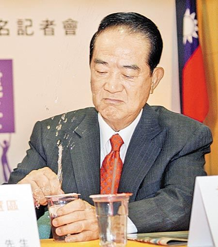
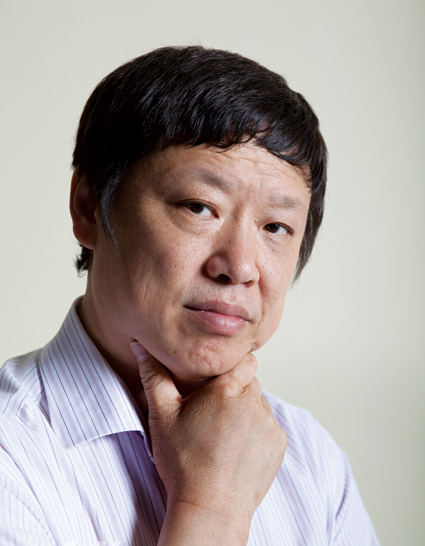
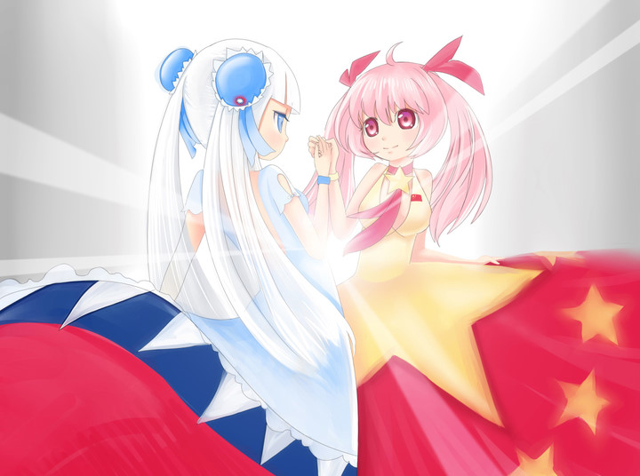

# ＜摇光＞你以为是纪念1911，其实人家只是梦回1949

**辛亥革命一百年了，民国一百年了，别羡慕，嫉妒，也别恨，庆典是人家的，有尊严的生活也是人家的，猪圈还是猪圈，你瞎激动什么？也太不把自己当外人了。** ******你以为孙中山的大幅画像往那一立，纪念大会在会堂里热烈一鼓掌，辛亥革命就真成了你们自家事儿了？**  

# 你以为是纪念1911，其实人家只是梦回1949

## 文/常遠（北斗撰稿人）

 

看了马英九的竞选广告《爱情签证》，又接着看了段所谓朝鲜首部科幻电影《平壤怪兽》，突然挺沮丧厌世的。或许这是最接近某个宗教召唤的状态吧。

人生来死后都是不可能平等的。连机会平等都无可能。人人平等只是自古以来哲学家、政治家们用来安慰、哄骗普通人的迷幻剂，是柏拉图的“型相”，纯粹的平等在世间无迹可寻。

因为如果你不骗骗那些生来可怜注定可怜的普通人这世间还有点值得追求的美好价值的话，人家还怎么有勇气活下去。

政治无论怎样都是肮脏的，丑陋的。试想，如果仅仅因为一场战争、一段历史、甚至只是一个王八蛋政治家某个拍脑袋的决定，你恰好生在金氏父子主政的朝鲜，你可能这辈子都不知道乔布斯是谁，也没有用过iphone手机，你永远不知道可以上网发微博，看视频网站，电影可以像《阿凡达》这么拍。你永远不知道人类文明史上有璀璨的诗歌、绘画、建筑、文学，你可以尽情沉浸其中，成为一个更有知识的人。你永远不知道如果金家干得很烂你可以把他赶走、换掉，甚至像美国占领华尔街的年轻人一样站在平壤金日成广场上拉着横幅散着步喊：金正日，操你大爷。

你永远不知道一个人可以拿着124个国家的免签护照去全世界旅行。

你永远不知道如果自己从出生到死自由的活着，可以走多远，成为什么样的人，看到怎样的世界。

然后你就死了。你也来这世间走了一遭，也曾真真切切的存在过。跟每个人一样。

你并不觉得痛苦。因为你不知道。

如果你有幸出生在中国这样的猪圈，你或长或短的生命中会出现无数傻逼，他们眼神暗淡目光呆滞，像植物大战僵尸的怪物们一样有着整齐划一的动作和频率，有时候你恍惚以为他们都是同一个人。他们拉你，拽你，扒你的裤子，挖开你的脑袋，想让你成为跟他们一样的人。

如果你稍微对猪圈有些不满，他们甚至比奴隶主还生气，因为你指出了他们生活在猪圈这一难以接受的真相，他们一直把自己当人，自认活得很有尊严。

他们总是劝你，嘲笑你神经病，说别骂了、别不满了、别愤青了，你看，我们是全世界最好的国家，所有人都羡慕我们的幸福。

可是，你知道，不是这样的，目光所及，这里没有一个有尊严活着的人类，尽管他们都认为自己是奴隶主最亲密的战友。

很想心平气和地问问，如果你们伟大的国家这么牛逼，为什么要用五六百人去看管一个盲人啊？感觉不是太自信哦。

很想用冷静到零度以下的语气问问，如果你们伟大的国家这么受尊重，到处都是老朋友，为什么几乎没有重要国家愿意给你免签国待遇，去哪里都不方便呢？感觉人缘不是太好呢。

很想坦诚而温柔地问问，如果你们伟大的国家总是象征着正义的力量，为什么对叙利亚暴政制裁的联合国决议被他和俄罗斯携手做掉了呢？哦对了，亲密战友老俄子再次玩了你们亲爱的国家，很快发声明反水，还准备邀请叙利亚反对派的领袖访问把酒言欢呢。矮油，怎么个情况？怎么感觉众皆恶之、倍受孤立啊。

你能回答我吗？

辛亥革命一百年了，民国一百年了，别羡慕，嫉妒，也别恨，庆典是人家的，有尊严的生活也是人家的，猪圈还是猪圈，你瞎激动什么？也太不把自己当外人了。

你以为孙中山的大幅画像往那一立，纪念大会在会堂里热烈一鼓掌，辛亥革命就真成了你们自家事儿了？

你以为亲爱的党真在纪念辛亥革命啊？追溯个合法性，偏房在历史上寻求个扶正嘛。不信你把辛亥革命的精神和诉求拿出来感怀一下，对照一下，你看人家跟你急不急。

你以为是纪念1911，其实人家只是梦回1949。

  （采编：佛冉 责编：黄理罡）  
