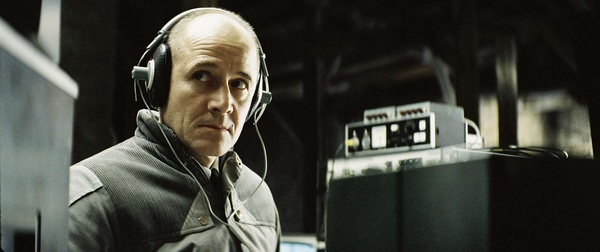
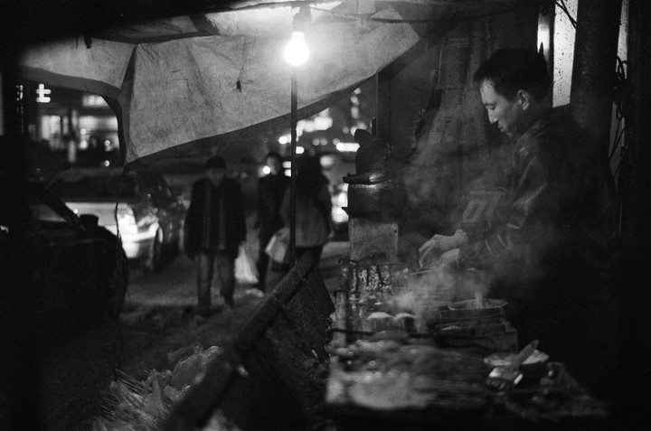
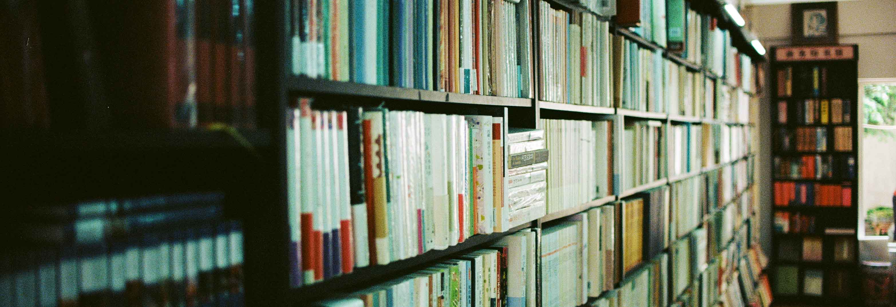

# ＜摇光＞你总能找到一种力量抵抗这个世界

因为没有摆正理想与现实的位置，我们别扭了一辈子。无力抵抗这世界安置给我们一切不想要的人与物，情与理，不堪与丑恶。从来没有一个人能真正透彻的了解和掌握自己的命运，只不过以各自不同的方式和不可知的命运较量罢了。或逆来顺受或奋起拼搏，其动力不是来自于无知，而是来自于幻想。

# 你总能找到一种力量抵抗这个世界

## 文/张希（首都师范大学）

 

当电影界的老板坐下来和詹宏志商谈侯孝贤的电影时这样讲：你要劝劝侯孝贤节奏要快一点，动作要快一点，不要那么慢，也不要用那些演员，为什么不选择刘德华叶子媚？詹宏志理解这是好意，可是在如侯孝贤和詹宏志一般气质的人看来这每一句话都是消灭侯孝贤的方法，而不是帮助他。于是，这里便出现了个人力量与资本主义体系的抗衡与制约矛盾。

龙应台先生的长辈作为大陆转移至台湾的战争牺牲品天然就生长在压抑的政治牢笼里。那个时代，他们总能看见或听闻身边的朋友“消失”，所以他们在惶恐不安中能做的就是把自己年轻时的书、年轻时的照片与年轻时与日伪文化有关的一切物件全部销毁，成为一个所谓“干净”但实质上却丢失抛弃销毁自己历史的人，成为一个没有历史的人没有生活痕迹的人。诚如政治高压下人心理的变形，在斯大林时代，苏联人讲一个笑话时需要双方置身于一间厕所并把水龙头全部开大以掩盖两人讲话的声音，即便笑也不敢将笑声扩大，要手紧压住喉部转而压低笑声。我爷爷有两个梨木做的匣子盛放的都是一些民间的手抄本史传书籍，那字迹如右军手书一般飞鸿脱俗。文革时的焚书运动使其全部付之一炬，火光徒然后尽成灰烬。于是，这里便又出现了个人意志与政治扭曲高压控制的抵制与委身。

北一门口白日黑夜的有许多贩浆走卒，卖廉价的水果廉价的煎饼果子买廉价的灌饼的个体商户。那日，我出门买了四根香蕉。水果大婶递过找还给我的零钱时我们的手相接触了，当时平直的感受即是心被狠狠割痛了一般，因为大婶的手是这样风霜粗糙，骨节粗大而皮肤是那种难以言说的紫中掺红，或许还有些褐黄，秋季的干燥让她的手龟裂破皮。我无力为她去做什么，只是呆站在原地以片刻的大脑空白状态定定看着她，大婶只是笑了笑后憨憨地相互摩搓自己的双手。这不得不让人联想到那幅黄土大地上的那个手捧破牙儿的碗喝水的父亲的油画，不堪而哽咽的事实残酷地周旋在你我身边。我也曾在饭厅等饭时碰见过径直走进这里的乞讨者，一个头部深度凹陷的中年男人。头盖骨作为人最坚硬的头部保护受到了损伤，可想他内部的脑组织受到了如何的侵害。以致他蹒跚行走难以辨识方向，余生只能乞讨。到此最可悲的概念出现，个人命运与社会原则游戏规则的抑制与被抑制。心比天高而命比纸薄，常言可畏啊。

我有时去逛书店时看着一摞摞码放在地上的旧书就联想到小时父母卖旧物时的场景。作家用心血写成的旧书大部分可能被当做废纸一样卖掉，毫无价值，仿佛废旧报纸一样也仿佛你我的贱命。书不是论文章的品质论价钱，而是以纸张的斤两一捆捆的装上秤，拨动那个砝码。其实在拨动那个砝码那一刻起，文字与写作就早已失去意义了。作家文人书生，何用？延伸出去，人文社科的工作者有何意义？稍脆弱些的人会崩毁吧会心碎吧会痛心吧？在热情与委身两种行为中选择，不可屈伸的人都会委身而减损热情。海辛，作为香港的中生代文学的极大贡献者，自家的电视坏了却付不起维修费只好交出自己写的一本书。于此，知识无用论书本无用论甚嚣尘上，极让人无奈。我是师范院校的学生，虽然不是师范专业，可我身处的环境的师范氛围如此浓厚，以至于不得不让我在此感慨发问：当我们几年后果真作为一名教师走上讲台手执教鞭，我们向学生展现的不过是一种可能性，思考或一种梦想。换言之，不能将理想变为现实，只是空头支票罢了。

可是詹宏志说：别人说不可能时，你也不要去信，你总能找到一种前进的力量。所以，让我讲即是：在面对人生的这两种态度：热情还是委身？果断取前者，人都是一团火，再孤僻再冷漠再不食人气的外形都难以阻挡火焰燃烧。

如果你翻翻旧书就会看到这旧书里夹杂着邮票、书签、相片、剪报甚至书信以及购物单，旧书的主人离世了可留下了这般生活的气息，活过的痕迹。“无常”后有陌生人珍重你在世上的痕迹，还遗憾么？其实，如果作一无情而诗意的比喻：人生不过一场渡轮，只给我们五六分钟的时间停留在梦想理想甚至是幻想上。让我们乘坐渡轮，离开大陆像是离开一种很实在的地方，在海中在梦想中在幻想中上下沉浮。可是很快又要催我们上岸，于是这五六分钟又极为珍贵。这种难以言说的感觉让我们贪恋，以至于让这五六分钟主宰我们现实的一生。我们忘了，理想不切实际。因为没有摆正理想与现实的位置，我们别扭了一辈子。无力抵抗这世界安置给我们一切不想要的人与物，情与理，不堪与丑恶。从来没有一个人能真正透彻的了解和掌握自己的命运，只不过以各自不同的方式和不可知的命运较量罢了。或逆来顺受或奋起拼搏，其动力不是来自于无知，而是来自于幻想。

有时候我想疯掉的那些人正是太清楚了，才疯掉的吧。其实，生命本身也是一种抵抗世界的力量，当经历太多荣辱沉浮看淡世事才体味，活着就是一种力量。

这世界上有三种类型的人。一是“孙子型”即是前生今世都在为他人付出；二是“你爹是谁型”即是我爸是李刚富二代红二代专二代；三是“本爷从不求人型”即是相信个人奋斗个人打拼开拓道路。三者都各执利器，怎样斩荆行路都有自己与生俱来的那种力量支撑。可是，可是走多远呢？我们都不知道；可以走得率性顺利吗？我们也不知道。所以，这才有趣才有意味才吸引人。

最近如果没有妹子一整天都不会和人有交谈，不讲话着实促进了我脑部高速的转动思考。忽然就念及鲁迅先生的在1926年的《故事新编》里的一句话：一个人住在厦门的石屋里，对着大海，翻着古书，四近无生人气，心里空空洞洞。不和人讲话交流，真让我心情低落。沉默也是一种抵抗这世界的力量，可是我宁愿作个失心又失口的疯子癫子，因为什么都比不过快乐，即便你在奋力抵抗世界奋力抵抗命运。

（采编自投稿邮箱；责编：麦静）
