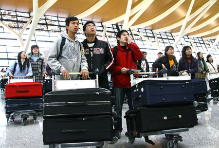

# ＜摇光＞你我何时才能真正用手投票

**但这一切不是要等到木已成舟再“用脚投票”，而是在大船出海之前就应开始用手投票，若果每个人都等到自己的权利受到侵害以后再去表达，那所有人的权益都已受到侵害，如果每个人都等侯一个能代表自己利益的人，那这世上永远只会有“被代表”，毫无疑问的是，我们需要重建一种信仰，而信仰的根本是笃信自身的力量，战场上一个子弹能要了指挥官的命，在现实社会，一张选票能决定的或许是你永远不敢预设的东西。**  

# 你我何时才能真正用手投票

## 文/孙习涵（北京体育大学）

 

10月17号，适逢海淀区人大代表选举第三阶段工作会议的前日，学校教学楼大厅张红榜贴出全校10000多名在校生的名录，这四年的唯一一次，只是给他们赋予了同一个身份：选民。在事先未获知消息的情况下上班似乎颇有些“意外的荣耀”，但随后便被告知学生需要为一个早已预备好的校候选者拉票，即是说这一万余众皆成了人海策略中的一枚棋子。

但事实证明，我们依然有机会摆脱这样的逻辑，几天之后班委来各宿舍发放换届民主选举的选票，同时带过来上述该校候选者的资料，统计选举他的人数。资料中写满了其学术成就，但显然这无法构成“代表”我们的因素，这感觉就如一个不明就里的人一下子被推到一个陌生人面前喊他作亲人。这样的比喻固然有些失策，因为似乎没有多少人对这样“被代表”有强烈的情绪，都是一副早已洞悉世事，风月不经的姿态，没有人意识到一张选票的分量在哪里。颇具黑色幽默意味的是一男生疑虑之问“不给他投票会不会对毕业造成影响？”这一问倒是问出了这些年来你我现实生活的姿态：妄动政治。我们可以妄说，妄论，却无法妄动，我们逐渐养成了隔着他人玻璃观看的习惯，而对于知情权尤其是选举权来说，不至万不得已，我们几乎会选择性遗忘地自己还有这样的权利。

很多时候，我们会疑惑这样的中国靠怎样的力量和结构粘合力支撑下去，你不会看到中国的政坛风云四起，选票翻飞，甚至政客打架的景象，也不会见到华尔街民众振臂，举旗，帐篷驻满街道的盛况，一个以民主为核心政体的国家与“剥削、阶级对立”的资本主义国家却在实际中颠倒了过来，这一切，归于何处？这样的疑问被追索了十几年，直至人们皆安之若素，那么多少人此时能站起来说你我应寻求改变？

辛亥革命过去了100年，百年的纪念早已远离了当时的炮火，当时的心情，你无法想象的一群群青年学生会甘愿将自己年青的生命抛入信仰的洪流之中，在时代与时代的临界点，独立之思想，自由之精神曾经一度干柴烈火般熊熊燃于无解的大陆，你我并非是要崇尚其中偏激的内容，但以今日视之，在处处讲民主，处处谈体制的年代，我们还是否有曾今的这样一群人？我们何来与生命等高齐首的信仰？我们会笃信群体的力量，我们会躲藏在群体的怀抱中痛陈是非，但与此同时，我们却始终在抹杀个体的力量，我们不相信自己能改变什么。

龙应台说“大时代中，一滴水珠又何以辨清洪流的方向”那样动荡的年代是如此，每个人在各自的阵营守护着各自的真理和忠贞，为了这两个名词而刀锋相向。而在那样的时刻，他们不会意识到正是自己在书写着历史，决定着洪流的去向，但历史却不会给他们留下任何名分。即便如此却足以证明个体的威力。今年上半年，网络上出现了草根参选人大代表，这其中有知识分子，有理想人士甚至有当代的大学生，其中有一个人大的学生在BBS上发表了“我为什么要参选人大代表”，他谈到公民意识的觉醒，和平演进运动的推行乃是中国民主社会构建的必由之路，而他所说的“和平演进”似乎已经成了多数当代知识分子的共识，暴力起源于压迫，历数中国大小朝代，无非是得势集团的相互替换，打着为民举义的革命军建立的王朝最终皆会走上背离人民的道路。历史证明，没有民主思想的核心价值观念博爱、宽容、平等植根于内心的革命策动者非但无法为民之表率甚至于酿成灾祸，不然又怎有“张献忠屠城”，“扬州十日”。一度同样在断头台前麻木冷血围观的西方民众在文艺复兴和革命的双重洗礼下步入了公民社会，而于中国社会，时至今日，依然有“洛阳性奴案”、“小悦悦事件”，我们可以人肉郭美美，红十字会，却在现实中对奄奄将息的个体麻木不仁，我们可以痛斥种种制度与腐败，又轻而易举地践踏自己投票的权利。百姓与既得利益集团之间的断带脱节和暗中角力让我们从来没有缺少潜在的革命冲动，但却缺少以真嗓为民疾呼，以真身介入公共事务的拳拳之心。在频繁拆解真相的当下，很多时候，你我已能隐约捕捉到历史大江大河之奔流所向，我们完全有理由相信，中国的未来正是每一个我们，每一个公民在今日所作的一件微小之事的堆积之物。我们早就应该做些什么。

柏林墙抵挡不住东德人民奔逃的脚步，管辖政策无法改变劳动力由乡村涌进城市，黄土地日渐空虚的现状，这一切都是人民在“用脚投票”，故而有专家言之凿凿“用脚投票才是真正的投票”，好像发现了一块新大陆般激动，攥在手中死活不放，而这似乎就在暗示两种存在的合理性：我们被唆使投票，我们不会投票。对于中国这样有根源故土情怀，善于隐忍的民族而言，用脚投票实际上已经是一种临近底线的失望，权力，资源，人脉从一个地方源源不断向另一个地方倾覆，从乡村到城市，从底层到权力阶层，处在挖掘机包围中的人们已无从选择。但这一切不是要等到木已成舟再“用脚投票”，而是在大船出海之前就应开始用手投票，若果每个人都等到自己的权利受到侵害以后再去表达，那所有人的权益都已受到侵害，如果每个人都等侯一个能代表自己利益的人，那这世上永远只会有“被代表”，毫无疑问的是，我们需要重建一种信仰，而信仰的根本是笃信自身的力量，战场上一个子弹能要了指挥官的命，在现实社会，一张选票能决定的或许是你永远不敢预设的东西。

遥想过去，小学里选少先队员，选班委的时候，每个小孩会很自觉地给自己投票，那是属于童年的“狡黠”，但我们目睹了过多真相，我们是否就该丧失属于童年的纯真的情怀？

 

（采编自投稿邮箱；责编：麦静）

 
