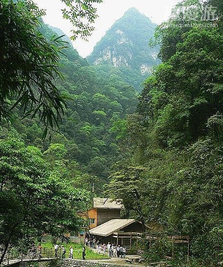

# ＜摇光＞你的美丽岛 我的美丽盆地

**四川和台湾，都几乎在明末的白纸上重新开拓，却成为这个民族文化的最后接续者。历史作出了选择，让这两个新生的移民省，承担起她们原本从未想过要承担的文化价值和精神力量。这也是我们与台湾人，休戚与共的坚忍情感。** 

# 你的美丽岛 我的美丽盆地

## 文/元淦恭（中国人民大学）

 

《美丽岛》，是台湾人喜欢的歌。而我第一次听《美丽岛》的时候，却有一种感同身受的震撼。

“骄傲的祖先正视着，正视着我们的脚步。他们一再重复地叮咛，不要忘记，不要忘记。 他们一再重复地叮咛，筚路蓝缕以启山林……我们这里有勇敢的人民，筚路蓝缕以启山林； 我们这里有无穷的生命，水牛、稻米、香蕉、玉兰花。”

这描述的是闽南人，或是客家人从数百年前渡海来台垦殖的过往，也描绘着台湾人对于自己土地的热爱与梦想。

前台湾省长宋楚瑜先生在今年宴请四川省长蒋巨峰的时候，说：“四川人用鲜血换来台湾光复”，我的故乡四川，在冥冥之中，确实和台湾有着一种隐秘的联系。

宋楚瑜讲这句话的时候，用的是四川话。四川话，几乎是台湾外省人中最多人会的一种方言，它简单易学，与国语比较接近。1949年，大江大海裹挟到台湾的川人众多，眷村里便有了四川的味道。

大陆《人民日报》海外版上登过一篇文章，是讲台湾的牛肉面。

作者引述一位台湾作家描写的场景：1950年的台湾某镇，一名随军迁台的主妇手托用香蕉叶垫着的牛肉走过，引来巷子里众人的注目和惊讶。因为当年台湾许多当地人是不吃牛肉的。

我去过厦门，大概闽南人确实是不怎么吃牛肉的。在曾厝垵的烧烤摊，猪肉串是0.5元，价格最可人也最受欢迎，倒是吃牛羊肉串的人很少，应该算是个旁证。

流传最广的说法，讲的是1949年到台湾的四川兵，艰难求生时想起家乡的小吃小碗红汤牛肉，不过在汤里煮上面条的似乎不多见。老兵灵机一动，就在台湾做起了牛肉面。此后，其他的老兵也纷纷结合自己家乡的口味支上面摊，不同风味的牛肉面由此成为各地迁台人家的吃食，还慢慢地被不吃牛肉的当地人接受和喜爱。到今天，就成了台湾美食之一。

《亚洲周刊》的邱立本于是在《那碗台湾四川牛肉面》中说：

“八十年代，一些台商首赴四川，发现巴蜀之地竟没有台湾这样的牛肉面，才惊觉台湾的四川牛肉面是MIT（Made in Taiwan，台湾制造）。”

这是台湾的签名。它的灵感来自那些漂泊的灵魂，在对故园的乡愁中，寻找两岸的感情链接，在台湾落地生根，创造了在大陆所没有的美食。

雨霏到台湾，遇到荣民之家里的81岁的双流县民李元彩，他19岁的时候，从重庆搭飞机到了高雄，生命从此被改变。

如他一样的四川人，在这个美丽岛上生息繁衍。

当初来台湾的时候，他们有很多是政治人物，有很多是军人。譬如蒋介石的第一高参，我成都东区的同乡张群；又譬如在成都主政期间修建了至今仍雄踞中国最热闹步行街之列的春熙路的杨森，后来在台湾做奥委会理事长，八十岁高龄的时候还登上过玉山；还有成都石室中学毕业的孙元良，在抗战期间经历坎坷，曾经逃遁又在晚年指证日军在南京的暴行。

这其实是一个四年前还处在日本统治下的岛。这其实是一个曾经被日本统治过五十年的岛。

但是，这又确实是三百万川军出川抗战才换回来的中华民国最后的“复兴基地”。

四川籍的外省人，后来做政治的人越来越少，倒是出了很多演艺界的人士。

孙元良的儿子秦汉，成了琼瑶戏里最红的男星。一个成都人的孙女林依晨，活跃在21世纪的偶像剧荧屏。还有一个叫侯德健的巫山人，唱过许多著名的歌，譬如《龙的传人》，又譬如《漂亮的中国人》。

最近刚刚结婚的Selina任家萱，也是四川籍。她在大陆拍戏受伤，全台湾都关注也祝福，她在成亲之前录了一首单曲，叫《谢谢你们，爱我的每个人》。这个年纪不大的女孩子，经历这场阵痛的表现，与两年前四川的同胞，也颇有相像的地方。

到台湾的四川人，做起牛肉面，或是演戏唱歌，他们的文化基因，融入到另一个更为年轻也更有活力的新移民省，成为新台湾文化的一部分。

琼瑶，其实是在成都出生的。严格地说，她现在是台湾的外省人。过去，她是四川的外省人。华人世界里，外省人最多的两个省，便是台湾和四川了。

1937年的烽火，让四川接纳了大量的下江人。中共建政之后的“三线建设”，也让许多外省人在四川深深扎根。也是历史上一次又一次如这样的移民，让四川成为中国大陆最大的移民省，湖广人和其他族群移民后所形成的现代四川人、移民台湾、东南亚的福建人以及在整个中国大陆南方和台湾广泛分布的客家人，也并列为近数百年间中国最大的三个移民族群。

在漫长的时间里，逃避战祸的中原人，来到南方，来到赣闽粤的崇山峻岭之间，生息繁衍，他们的名字叫客家人。他们说着隔一座山头就不大能通话的方言，建起土楼就聚族而居。

他们有着传统中国的特质，一路播迁到各地。四川和台湾，恰好是客家人在赣闽粤之外最大的两个聚居省。虽然远隔千里，虽然跨越海峡，客家人在四川和在台湾，都恰是第二大的族群。至今，客家文化对四川和台湾而言，都是重要的符号。这个族群在川、台两地的命运，正折射出这个族群的生命力量，和川、台两地的多元共生。

自明季以来，“到台湾去”和“到四川去”，是整个中国南方最强烈的两种移民声音，却有些许的不同。清朝政府把开垦四川当做大事，以“湖广填四川”的方式，既有诱导也有半强制的成分移民实川。但清廷却以“海禁令”限制出海，直到清末才认识到台湾的特殊战略地位。

所以，到台湾的闽南人和客家人，从某种程度上来说，比到四川的移民更勇敢，更向往自由。他们跨过海峡，来到阳光照耀的国境之南，开垦、耕耘、收获。

而到四川的湖广人和客家人，从某种程度上来说，又比到台湾的移民更坚忍，更经历磨难。如果说跨海是一次风险巨大的投资，那么跨越巫山，经过夔门的跋涉，则是一次更加艰辛的挑战。

移民到四川的人们，有的看到了都江堰自流灌溉的成都平原。移民到台湾的人们，有的登陆了嘉南平原，等待收割时是一派幸福的颜色。我们筚路蓝缕的先民，找到了属于他们的应许之地。

康熙初年，全川只有8万人口，而到乾隆初年，不到一百年中，四川已无荒地可开垦。川人之勤劳，可见一斑。

在四川，几乎没有汉族的原住民。

四川的汉人，基本上来自湖广人、客家人和外省人三大族群，结构和台湾很相似，只是台湾的闽南人换成湖广人。四川话的基础，是最多川人的祖籍地湖广的方言，即湖北、湘西、北等地的方言，正如现在台湾最多的人仍是操着闽南话。

所以四川实际上是个古老而年轻的省份。她虽然拥有中国历史最长、水平也最高、极为独特灿烂的古蜀文明，根据考古探测的文明史逾4000年，但四川人，也是个近两三百年来才形成的新族群。而以成都为中心的四川盆地西部，因为过往的战乱，几乎没有清朝以前的历史遗存。

所以，四川不像苏杭和徽州，四川虽然有古镇，但建筑绝没有那么老的。像歙县的许国石坊，绩溪的奕世尚书坊，在整个徽州是很常见的，但在四川却不容易找到。去过西递和宏村，再回看四川的古镇，积淀和风韵，大多还是差很远。

成都的武侯祠、杜甫草堂等，所在地址或许很多是在明以前的旧址，但建筑大多是康熙年间以后重建的。号称2150余年没有迁址过的文翁石室，现在一百年前的只砖片瓦都很难找到。

客家人，是构成四川人的重要部分。但四川人和客家人却有很大的差异。

客家人，无论走到哪里都按照自己的生活方式建构起一片属于自己的土地。四川星罗棋布的客家方言岛，便展示出这个民系的团结。他们，族群的身份比生活的土地更具有符号意义。

而四川人，则更多地是被四川这片土地建构着。

在《汉书》《华阳国志》，乃至于苏辙《蜀论》中对四川人的描述，有许多都在今天的四川人身上找得到。四川这片土地，是一个大熔炉，把所有的移民，都熔化成刚柔相济的模样。于是，在四川，没有人区分族群，我们根本不会分湖广、外省或是客家。四川人，已经和四川这片土地深刻连结，只要你生在四川长在四川，你便融进了四川。

这正像今天在四川最流行的火锅和川菜，融汇了川内外精华的食材。假若没有辣椒在数百年前的传入，我们不能想象，今天的四川和四川人会是怎样。

我们或许会诧异，四川为何会有这样神奇的力量？

有人说，四川几乎从来不出圣人。四川出的都是天才、奇才和鬼才。近两千年前的《华阳国志》说川人“君子精敏，小人鬼黠”，时至今日仍很适用。

四面环山的四川与中原之间，形成了一种有效的若即若离的距离。四川吸纳着外来的文化，迎接着全国各地的诗人，荟萃了海内外地丰饶物产，却保有一份外面所没有的自由、恬淡、安适和与世无争。林语堂说，中国人得意的时候都是儒家，失意的时候都是道家。但到了四川便不那么管用，青城山下、青羊宫旁的四川人，向来都是有一种仙风道骨的，这种仙风道骨，甚至浸透到街边打麻将的老头老太的灵魂里，成为一种抹不掉的川人特质。

所以，作为川人的我，对于《美丽岛》有一种特殊的感情，那是一种对先人的讴歌，对自由的信仰。

这种信仰，是移民族群中世代不竭的精神力量。不论四川人、客家人还是台湾人。

移民的国家，是最富有希望的国家。移民的省份，是最善于包容的省份。移民的城市，是最具有活力的城市。而移民的精神，是最值得敬重的精神。

“爱四川”，不等于不出川。早就有老话说，四川人一出夔门便是条龙。从李白，到三苏，再到二十世纪川人出国留学，出川抗战，的确如此。四川是中国最大的移民省，也是中国最大的居民外流省。在如今的京津冀、长三角、珠三角，处处是努力打拼的四川人。

我们有着最多元的血液，却有最单纯的集体认同。这个族群从古至今对外来者一直是接纳的，被奉为“川主”的李冰，是秦地人；以兴学化蜀的文翁，是安徽人，这些被川人世代尊崇的外省人，事实上成了四川多元文化的最好注脚。既然每个四川人都是外省人，也就再没有人在意我们是否供奉着外省人。

中央研究院建院七十周年的时候，有人说，中央研究院历史上最辉煌的六年，是在宜宾李庄的六年。这个三百年前经历过生灵涂炭甚至虎狼出没的省，却延续下战乱中这个国家的珍宝和文脉。

一路辗转颠簸的故宫文物，都曾在四川落脚。

四川和台湾，都几乎在明末的白纸上重新开拓，却成为这个民族文化的最后接续者。历史作出了选择，让这两个新生的移民省，承担起她们原本从未想过要承担的文化价值和精神力量。

这也是我们与台湾人，休戚与共的坚忍情感。

今日的台湾，闽南人、客家人和外省人已经大量交汇并将继续融合。台湾人，最终将会和四川人一样，变成不分族群，不分彼此的家人。基于同一价值观、同一生活方式的认同，毕竟是一个族群最大的公约数。筚路蓝缕以启山林，正是台湾人精神最集中也最突出的展现。

我不知道我是湖广人还是客家人。但我清楚地了解，我的先辈曾经经历过的那些欢喜悲伤，那些苦痛与刚强。如果他们没有足够的体力和智力，他们不可能跋涉到这一片对于他们而言从来未知的土地。“我们这里有无穷的生命”，不只是为台湾人唱起的一首赞歌，也是华人世界对移民最诚恳的致敬。

同为移民的后裔，你们有一个美丽的岛屿。我们有一个美丽的盆地。

（附原文视频《胡德夫-美麗島MV》链接：[http://www.tudou.com/programs/view/0igy0QY5LSY/](http://www.tudou.com/programs/view/0igy0QY5LSY/)）  

（采编：麦静；责编：麦静）

 
