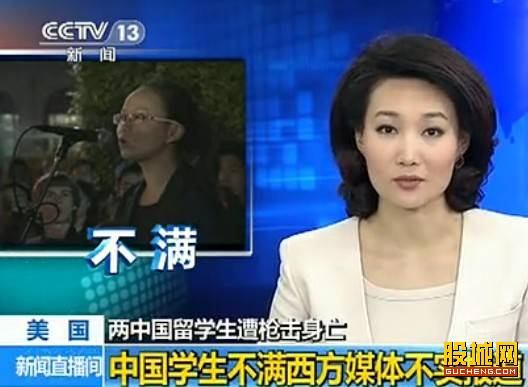
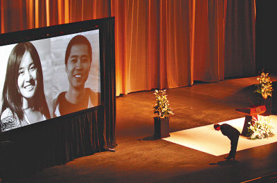

# ＜摇光＞你看到的网络，不是整个世界

**世界这么大，总有从上到下各层阶级的存在。许多人到死都只在跟自己同级的圈子里交流，对于上层和下层都有盲目的误解和指责。抱怨社会不公的喷子从不认识那些艰苦奋斗的二代们，自以为生活寒酸的留学生也不会在自己的圈子里发现农民的孩子。如果你也是这样的人，就不要怪别人不了解你。尝试与各种各样的人交往吧，那么不管是否能够成为朋友，或许都会帮助你成为一个更加理性的人。**  

# 你看到的网络，不是整个世界

## 文/徐英夕(南京大学)

 

前几天看到报道说USC两名中国留学生被杀，觉得挺惨的，但是并不认识那两名学生，似乎也没有同学在USC，所以没太多想，就是希望死者安息，也希望所有留学生朋友们都平平安安的，不要再有这种事情发生了。

结果这两天发现人人、微博都被刷屏了，一大批留学生奋起痛批国内无良媒体和网络暴民歪曲事实、仇富心态作祟、没有良知、简直不是人……

当然，也有理性一些的在陈述那两位遇害者是勤奋上进的好学生，平时生活节俭，那位男生买的二手宝马3系车仅价值人民币7万元左右。

至此，我才知道事件中涉及到“宝马”，然后才推测出惹怒留学生的究竟是什么。

但是我真的一条幸灾乐祸的帖子也没看到。

侵略和反击，就不在一个战场上。

网民说，你们富二代在国外夜夜笙歌，花的钱不干不净，给中国人丢脸，该死。

留学生说，你们仇富，你们没有人性，鲁迅笔下的劣根性仍然深植国人心中，悲哀。

可是据我所知，大部分留学生都勤奋努力，大部分生活在国内的人们也都为两位遇害的年轻人感到难过。

似乎大洋彼岸的双方都视对方为一个同质的阵营，而忽略了对方阵营中的巨大差别。一些网民不知道留学生中有些人生活糜烂，有些人努力学习同时还要打工。而一些留学生也忽略了所谓的“暴民”只是少数人，大多数善良的人们都躺着中枪。理直气壮地声讨“仇富”的人，对穷人的看法也未见得客观。

有人不知道宝马3系车是什么价位，也不知道USC是什么样的大学。这很正常。有些东西我们觉得是常识，可却离他们太远，以至于他们根本不认为有去了解的必要。

也许我们对他们也同样无知。

上高中的时候，一个室友说她的运动裤要800元一条，是我裤子价格的10倍。可是她为班级活动奉献的热情和对自己的要求也多过我。

一个同学说她妈妈的年终奖有二十多万，比我妈妈一年挣的还多。可是她的才艺真的很出众，别人一定无法想象她背后常年苦练的工夫。

许许多多家境良好的人，同时也是勤奋、正直、谦和的人。

上大学的时候，一个室友问我是否担忧过家里会突然有一天没有收入，我一怔，才了解到做小生意有时候是不太稳定的行业，说不定过几天就会没钱赚。

有个同学走路的时候总是走在马路上，我劝她走人行道，但她说她习惯了。后来我去了她的家乡，才发现那里没多少汽车，人和自行车摩托车一起走在马路上，没人觉得不对头。

开始面对这些差异时，确实不适应。但是慢慢发现贫富不是大问题，生活习惯也可以慢慢磨合，只剩下刻板印象难以改变。

对面宿舍的一个女生曾经跟一个陌生的男生聊了几句，然后回头告诉我这个男生家里不太有钱，我很惊讶地问她如何得知，她说那个男生的手机不是很好。我觉得很好笑，原来她认为所有的有钱人都是喜欢炫耀财富的。

对我而言，除去那些“北京人是不是400分就能上清华北大”以及“北京女生是不是都私生活特别开放”这种问题以外，最痛苦的莫过于那些总是羡慕我能随时回家或者羡慕我在北京有住处的话。其实每个人在自己的家乡都有住处，你家的房子说不定比我家的还大。没那么多值得羡慕的，真羡慕也不用每周都说一遍。

还好我现在在南京，和其他人一样每年回家两次。

但差别依然存在。

一个室友说她小时候生病，家人请“大仙儿”来看，说是中邪了，吃了“大仙儿”的药才好。我以为这种事儿在还珠格格里才会有。

比我大一届的师姐告诉我，她本科学校食堂的菜只要几毛钱，一顿饭可能两块钱都不到。附近餐馆招打工的，一天十几块钱也好多人抢着干。我以为那种物价水平已经过去几十年了。 我的一位同门，在课程不忙的时候请假回家收麦子。

还有许多人跟我说过他们小时候偶尔吃一次麦当劳都跟过节一样，或者家长给的零用钱很少，为了买课外书只好饿肚子。

我觉得这些差别都不重要的，我和室友、师姐她们都相处得很愉快。他们或许不了解留学生的生活，但是他们同样会为生命的逝去感到心痛。

但也曾有一天，一个人跟我说，你们名牌大学的人都如何如何……

那架势，和现在网上骂留学生为富二代的人是一样的。

我想说的是，背景有差异的人可能成为朋友，也可能话不投机半句多。隔阂本身没那么可怕，跟你聊天的理发店小哥也不曾用手中的剪子结果你的性命。可怕的是你不分敌友筑起的高墙。

想对那些“惊觉自己在国内暴民眼中成为X二代”的留学生们说，你们在祖国生活了这么多年，为何出国后才惊讶地发觉一些事情？在你们出国以前，难道中国就是个大家互相理解、没有矛盾的共同体了？贫富分化难道是你们留学这几年才出现的事情吗？社会就在那里，你们不去了解它，却指望它能了解你，现实吗？

在你考SAT、托福、GRE的时候，你就应该明白今后的处境。你打算努力奋斗，你有更高的追求，你雄心勃勃地想把大部分“国人”甩在身后，却又责怪他们跟不上你的高素质。你睁开眼睛看了世界，却从未老老实实地了解过你的家乡。如果你尚有回国的打算，你就应该明白你将面对的是一个怎样的国家，它一直都在那里，它并没有在你出国后才变得那么不堪。

有时候看看电脑，又看看窗外，总觉得那不是同一个世界。不认识我的小摊贩会让我赊十块钱买水果，卖煎饼的大姐会问我怎么放假了还不回家，拖地的清洁工阿姨会提醒我多穿点儿别冻着，杭州的大爷大妈会热心地告诉我怎么玩西湖最划算。

这真是你们口口声声痛斥的那个“冷漠、对立、麻木不仁、泯灭人性”的社会么？

世界这么大，总有从上到下各层阶级的存在。许多人到死都只在跟自己同级的圈子里交流，对于上层和下层都有盲目的误解和指责。抱怨社会不公的喷子从不认识那些艰苦奋斗的二代们，自以为生活寒酸的留学生也不会在自己的圈子里发现农民的孩子。如果你也是这样的人，就不要怪别人不了解你。尝试与各种各样的人交往吧，那么不管是否能够成为朋友，或许都会帮助你成为一个更加理性的人。

我想起大一去农村支教的时候，队伍里有个日本女孩。村民们说，他们原来以为日本人都是凶神恶煞的，没想到日本人也可以是她那样美丽温婉的。

所以，如果想改变什么的话，不必再写鲁迅式的文章，回国接触更多的人，与他们交谈，让他们明白很多群体不是他们想象的那样。而你也会发现，你看到的网络，不是整个世界。

最后愿逝者安息，凶手受到惩罚，在外的朋友们都平安无事。

 

（采编：何凌昊；责编：尹桑）

 
