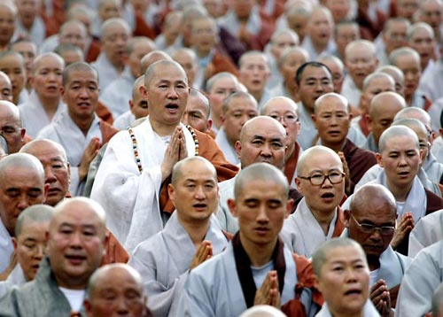
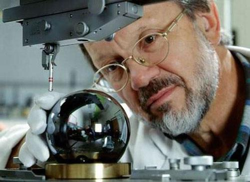

# ＜摇光＞信仰分级制度

**任何人都摆脱不了主体对于世界“信仰”或“相信”的成分，但我认为这种“相信”带来的恰恰是一种不确定性。预设的东西越多，理论就越不完备，因为支持预设的信仰只存在于主体之中，不同主体有不同的信仰方式，而真理的特性之一恰恰在于它的普遍。**  

# 信仰分级制度

## 文/井越（ 华中科技大学）

 

“你是谁？你从哪里来？你到哪里去？”这些终极问题的发问者当然不只限于大门保安。出于或多或少的好奇心，人们都这么问过自己。至于发问的时间地点更是多种多样：笛卡尔蜷缩在壁炉旁，康德漫步在柯尼斯堡的小路上。至于我的话，估计大多是在淋浴时吧。浴室、公交、寝室、自习室、考场，我的智商在以上五个场所呈现明显递减趋势。

终极问题重要吗？估计有两种极端的回答。通常人们都不会花太多时间来探寻终极问题的答案，更别说终其一生来追求了。亚里士多德曾经总结过哲学思想的两个产生条件：闲暇和诧异。可惜我们的传统教育一直以来便在为抹杀这两个条件做着不懈努力，从而导致了忙碌的大众唯独坐在马桶上才会偶然冥想起来：“老子死掉会不会有灵魂啊？我若能亲自参加自己的葬礼那可就美妙不过了，也许本屌丝只有在那时才能摆脱跑龙套的标签。若没有灵魂，老子活着是跑龙套的，死了也最多是个死跑龙套的…..”可起身冲厕时，便会亲自将刚才那一抹好奇连同排泄物一同冲掉，然后华丽地投入这衣食住行的世俗世界。

但这些问题依然被我们无数次发问，设想有一个神明能回答你任何问题，你会问什么呢？大多数人还是选择问些终极问题吧，如灵魂，死亡，宇宙等等（如果你真的碰到此事，记住可千万别傻到问自己未来命运，因为即使你能控制住自己，并在知道真相时不去干扰未来，未来也很可能会在你知晓它的瞬间崩塌，不知道祖母佯谬也看过机器猫吧）。 此思想实验至少说明我们对终极问题还是相当关切的。（在下文我会不幸地告诉你问此类问题也是不明智的选择。）

好吧现在的问题是，在没有解决这些玄奥的终极问题时我们怎么办。当然大多数人都会回答不怎么办：“老子即使不知道自己死掉后会怎么样不还是稳稳活了大半辈子！？”但我想告诉你的是，其实所有人都已经“怎么办了”，通过.....信仰。对，就是这个装逼的词。每个人都是有信仰的，或是说总是相信什么的。先撇开终极问题不谈，我们的日常生活也全部都建立信仰之上，比如我们都相信自己没生活在梦中。正是基于这个预设，我出门才没有像玩侠盗飞车那样胡作非为。不过仔细想想，貌似我们也完全找不到自己生活在所谓的现实中的根据。

关于终极问题，或形而上的问题也都一样，每个人其实都还是在无意识中给出了答案的。基督徒认为基督教解释了一切，佛教拿出了佛祖观音罗汉等来建立他的信仰，而无神论也一样，相信上帝不存在，但也仅限于“相信”而已，并没有谁能给出证明上帝不存在的有力理由。更何况，证明一物不存在要比证明一物存在难得多，在逻辑上则几乎没有可能性，后文也许会再次提到这个原则。

以上这些东西其实都是常识和废话，稍有姿势水平的人都不会觉得新鲜。下面转入正题，我想做的就是试图 “在信仰层面给人分个三六九等”，或是 “将人在信仰层面分个三六九等”，后者貌似听起来稍微舒服一点。

大体分为五等吧，从低到高依次叙述下（自认为以下五类已能包括所有人，括号里的是此等人中将信仰发挥到极致所获得的头衔）

### No.5 初等宗教信仰者

这类人其实还分好几种，第一种的特点是有什么信什么，见什么拜什么，经常把关公，菩萨，罗汉，基督一勺烩似的全拜了。极大地促进了具有中国特色的“上车睡觉，下车尿尿，景点看庙”的旅游文化。偶尔去欧洲旅个游，进教堂之后第一件事儿就是想找跪垫儿，准备给耶稣先磕几个头再说。

以上那类人基本不用评价，下面说的是真正意义是上的“初等宗教信仰者”。拿国内的基督教为例，虽然上层社会里也有很多基督教徒，但国内最广泛的基督教地区仍是县城及农村。由于很大一部分基督徒本身科学知识水平欠佳，便很容易被传教士们说服。他们将宗教作为了自然知识的替代品，来为自己的终极问题找到解答。上帝这个集真善美于一体的终极实体除了能满足他们对自然世界的惊异之外，更能给予他们一种精神上的归宿。不过由于缺乏良好教育和正规途径，庞大复杂的基督教体系在他们脑中完全未能建构出来。比如对于“三位一体”这个教义，他们是根本无力解释的。 或是当被提问道：“如果上帝是万能的，那么他能否创造出一块连自己也举不动的石头？”这类经典二律背反时，他们是拿不出合理解释的。然而重点是，即使面对自己也解决不了的责难，他们仍对自己的信仰确信不疑，因为这类初等宗教信仰人完全是用感性来接受自己眼中的终极存在的。

这类人经常被所谓的神迹而吸引，再进一步说，因为他们的理性思维及其匮乏，以致经常分辨不出基本的因果论证。经常由最简单的，经验的，归纳的方法来做出重大判定。演绎论证在此阶层的人的信仰体系中基本不存在。在这个层面上讲，那些极端喜欢研究星座的人也属于此类信仰者。 以上只是用基督教为例，其他宗教也都被这类信仰者改装后投入介乎于宗教和迷信之间的范畴，正因为这类信仰者在国内的大量存在，才导致了很多国人对宗教的误解。

### No.4 技术信仰者（初等无神论者）

据我观察了解，此类信仰者的范围最广且人数最多，起码是在我国。

首先，这类人最大的特点在于：分不清科学与技术的界限。他们脑袋里简单的论证是：技术都是由科学支撑的，科学是为了更好地发展技术的，所以技术是科学的实体化，信技术便是信科学。

能提出以上论证的人首先肯定受到过不同程度上的教育。因为教育往往是偏见的根源之一，这话对于国内教育体系更是如此。长期以来教育中的哲学思想便被各类意识形态学说所代替，以至于大多数人在青少年，这个培养世界观的阶段，并没有形成一种“形而上”的思维体系，再加上无休止的，类似于诡辩论的变种辩证法对学生的洗涤，使得我们的真理观完全落于狭隘的功利主义之中。

不过技术信仰者对于上一种“初级宗教信仰者”来说，还是有质的飞跃，这个飞跃便是其理性的诞生。由于这类初步理性的诞生，使得技术信仰者成为最反感宗教，且鄙夷教徒的一类人。常用污蔑的口吻说宗教人士的不可理喻，殊不知自己早已在多年的意识形态传播中也站在了偏见的一方。

他们看到科技飞速发展，人类生活水平不断提高，便认为人类是否掌握终极真理已是时间问题。他们会毫不吝啬地接受任何学科的主流理论。比如当被问道生命起源时，他们会毫不犹豫地想到进化论及大爆炸这两个名词，对这两种理论，他们的认识也只停留在了字面意思之上，并未细究。因为，身边经验到的，耳濡目染的技术领域的飞速发展已使得他们确定科学的真理性，他们以不必知道进化论或大爆炸这两种理论的深层构架，便已对他们盲目地信服到底，觉得自己所有的终极问题均可由此得以解答。

另一方面，技术信仰者还是极端保守的。尤其是在物理学领域，他们最认可的便是经典物理学，因为说实话，现在最尖端的技术—比如宇宙探测技术—的力学理论，绝大部分也都未能逃脱牛顿的手掌。所以，对于相对论，量子力学，弦理论，大统一之类的前沿范式，他们全仅仅当作是课本上，或考卷上的习题对待。即使他们接受这些知识，在技术信仰者眼中，经典力学和相对论也是完全可以并存的。这两种全然不同的理论只是分别在不同层面（低速与高速）做出了不同的指引而已。殊不知低速高速之间则根本没有确定界限，而真理的特性便是其独立唯一性。对于量子论，他们更是当故事听，什么平行宇宙，多维空间还有薛定谔家那只该死的猫，都没有实实在在的技术更有说服力，何况这些破玩意儿反而会导致宗教理论的复兴，真是反动啊反动！

### No.3 高等宗教信仰者（神学家）

如果说前两种信仰者之间的本质区别在于理性在技术信仰中的产生的话，那么从技术信仰到现在所说的高等宗教信仰间的本质区别则在于后者在真理探索层面上，对感觉经验世界的抛弃。高等宗教信仰者不会因为身旁技术的产生而对自己的宗教产生怀疑，因为他们知道经验层面与理性层面的区分。在理性层面，他们有一套完整的，系统的神学体系来指称着真理的可能性。这一套神学体系又能反过来给予这些信仰者心灵上的慰藉。仍拿基督教来说，十七世纪以前，西方的整个知识领域只有两类，一类是基督教神学，另一类是自然科学。而社会学，政治学等现在的人文学科也都被划分在自然科学里。很多重要任务都身兼多职，且各领域互相影响（比如托马斯霍布斯的社会学和政治学理论实则扎根在他对人体构造和天体运行的理解中，而洛克在早期则是一名出色的外科医生）。这是因为人文科学以及现在所说的自然科学（包括物理，化学，生物等）都是从经验现象入手，并综合演绎思维，来得出结论的。而神学，作为于此平行的范畴，则从理性层面入手解决人类的问题。

整个西方中世纪的哲学，即经院哲学，都围绕着基督教展开，近千年的时间里，人们发展出及其庞杂的哲学体系。其中包括对针对圣经的各种责难的解答。中世纪哲学家安瑟伦和阿奎那更是在证明上帝存在上做出了卓越贡献。我自己曾一度觉得圣经里的叙述荒谬不堪，先不论创世纪与进化论的矛盾，举个大家都知道的细节：神在第一天创造了光，却在第四天创造了光源（太阳）！？ （对于这个问题的解答大家可参考柏拉图洞寓里的“火光”）

不过此类种种问题都已被神学家们进行了阐述，且不同流派，不同教义又有不同的解释。比较有说服力的解释是圣经的隐喻说，即认为圣经里的所有故事都不是表面含义，而是大量隐喻。你可千万别把这个解释当作是神学家们委曲求全，自寻出路的结果。

那时神学家们已经意识到语言的局限性。语言，探寻真理时，在很大程度上给我们的恰恰是障碍。人类的思维被语言所局限，使我们盲目，并创造出无限谬误（语言带给人类认知的麻烦在维特根斯坦哲学里被详细论证说明，这里便不再累述）。但由于人类的局限性，我们暂且只能用语言来通达知识，所以代表着真理的圣经也只能以文字的形式展开。

然而，虽然神学在解释整个世界与回答终极问题时表现的都不赖，但他依然没有拓展和加强我们把握真理的重要工具，即理性。整个理性神学系统仅仅是建立在此基础上而已。

### NO.2 科学信仰者（数学家，理论物理学家）

若是说说技术信仰者最瞧不起初等的宗教信仰者，那么据我观察，科学信仰者最轻视的也就是那些技术信仰者了。看过《生活大爆炸》第五季21集（就是霍金客串的那集）的同学都知道，当Howard委屈地问Sheldon为什么总觉得自己的技术工作做的不好时，Sheldon直言不讳道：“我不是说你的工作做的不好，而是说你的工作根本不值得做。”此言一出，一个理科生对一个工科生的蔑视尽显无疑。不过正是这种蔑视，导致了西方科学技术整体且全面的突飞猛进，而一向只重技术的中国传统方法论则使科学成果停滞不前。

科学家和物理学家在信仰理性的同时将理性本身发挥到极致，从而也大大拓展了我们对这些先验成分的理解。先用数学举例，这也许是离经验世界最远的学科了，先不说高等数学里的知识，仅仅是“无理数”这个概念，便已经脱离经验实体而抽象地存在着了。整个数学体系脱胎于我们的基本逻辑理性思维，它要求思维满足同一律、矛盾律、排中律和理由充足律，以及后来的欧几里德公理（非欧几何在后文会提到）。这种脱离经验事物的思维一贯性，以及由少数公理推出的庞大系统确实能带给人们无限惊异，早在希腊时期，毕达哥拉斯学派便将数学当作宗教来看待，他们认为数是世界的本源，由此对终极问题做出了圆满解答，从而获得了心灵的慰藉。至于理论物理学带给人类的巨大惊喜，则从近代才开始，由伽利略牛顿，到爱因斯坦，薛定谔，波尔以至于当代的霍金，都不断将我们对于世界的常识认知所彻底颠覆。此外，对于时空和维度的探讨，更将传统数学和逻辑所扩展到了极致。向量，非欧几何，矩阵的提出便针对了曲面和多维空间。所以，数学家和理论物理学家暂且被我称作真正科学的奠基人，他们研究的领域不仅脱离了经验感性层面，且对理性做出了很大程度的拓展。他们尽自己最大的努力减少了我们的感性的信仰成分，或是说预设成分，以此来试图推导出一套最为精确的真理体系，从而解决终极问题。而且我们可以说，至今为止，他们确实已经做出了非凡的成果。

### No.1 怀疑论者（哲学家）

我们先来回顾下以上四个层次的划分依据：由初等宗教信仰者到技术信仰者是感性到理性的飞跃；由技术信仰者到高等宗教信仰者是理性巨大发展的过程，从而得以从经验层面的理性飞跃到形而上层面的理性；而高等宗教信仰者与科学信仰者的最大不同则是后者对于理性本身的巨大拓展。那么我接下来介绍的怀疑论者，便试图从根本上打破一切预设，从而质疑人类经验和理性自身的可能性。

虽然我们把担当此重任的人称之为哲学家，但这些哲学家大多也肩负数学家，物理学家等身份。因为理性的发展和质疑这两方面通常是共存的，且是互相促进的。我们可以说，在现代科学中的领军人物，通常都兼具我所提出的最后三种信仰层次，即高级宗教信仰，科学信仰，以及怀疑论。牛顿，笛卡尔，康德，爱因斯坦都是这方面的典型。 那么哲学家们在何种程度上质疑经验或理性的真是存在呢？对于这个问题我估计老子写一篇毕业论文都未必能阐述清楚，我在下文中便挑几个很典型的人来做个简单阐述吧。

第一个便是我们熟悉的苏格拉底——的伟大学生柏拉图了，他对我们的经验世界及知识本身做出了质疑。在《理想国》里他用一个比喻来很好的解释了自己的理论：“想象很多奴隶从出生时便被绳子束缚在一个洞中，他们面对着洞穴里的墙壁，甚至无法转头向洞口看。这时另一些人在洞口举着各种物品，物品后又有人打着火把。这就是说，洞里的人终其一生都只能看到这些物品的影子而非实体，这样一来，所有洞里的奴隶都会认为那些关于影像的知识才是真理。”就像《黑客帝国》里的Neo，他的上半辈子都是在一个叫做matrix的程序中度过的，自己却毫不知情。那么，暂不谈技术，就算我们的数学，物理等自然科学再发达又在何种程度上通达了真理呢？

给大家介绍的第二个人物是笛卡尔，这个奠定了西方近代哲学基础的人物一直在找一个关于人类知识的“阿基米德点”，他怀疑一切经验事物的真是存在，如果我们的一辈子都只是一场骗局怎么办？或许大家都是《楚门的世界》里的楚门，《苏菲的世界》里的苏菲。不过在最后，笛卡尔仍找到了那个所谓的基点：“有一个怀疑者自身”这件事时不能怀疑的。自此，他提出了那个耳熟能详的定理：“我思故我在”。

第三个出场的是苏格兰史上最有名的胖子—大卫休谟。他对于因果关系的质疑与对因然判断与实然判断的质疑合成“休谟问题”，此问题对整个知识论和伦理学都起到了颠覆性的作用。事实上，我们可以说现代量子力学中的“测不准定理”正一步步瓦解那个使科学得以可能的“因果律”，从而也对休谟理论提供了很好的理论证明。

第四个人是维特根斯坦，这厮觉得前几千年的形而上学都是“语言的谬误”，比如两人在对“究竟上帝是否存在”在这个问题争执的不可开交时，也许他俩根本没对“上帝”这个概念进行统一的定义，而“对一个未被证明存在的事物进行定义”在逻辑上又是个接近不可能的事。此外，在近代物理学中，对于“时间”“空间”“微粒”“场”的探讨也存在大量的语义问题。 （看到维特根斯坦的理论后，再看看此文的第三段，知道为什么向神明提问终极问题不是个明智选择了吧，因为你很难避免不陷入语言的谬误，使得你的问题成为伪问题。）

等到最后，这些怀疑论者发现知识的大厦若是抽去了预设便会轰然崩塌，一切知识，包括数学都成为了“发明”而非“发现”。但这并不能说他们的工作是破坏而非创造，因为正是破坏的勇气才能使范式得以交替产生，使得科学理论不断在否定自己中达到跟高的阶梯。更何况，创造这些理论的人恰恰就是这些破坏者——那些将人类理性发挥到极致的大师们。

可能看到这里大家会发现，我划分信仰者层次的依据恰恰是按照“信仰”在主体真理观中占据的比例而定的。比例越低则越能达到更高层次。任何人都摆脱不了主体对于世界“信仰”或“相信”的成分，但我认为这种“相信”带来的恰恰是一种不确定性。预设的东西越多，理论就越不完备，因为支持预设的信仰只存在于主体之中，不同主体有不同的信仰方式，而真理的特性之一恰恰在于它的普遍。

 

（采编：安镜轩；责编：陈锴）

 
