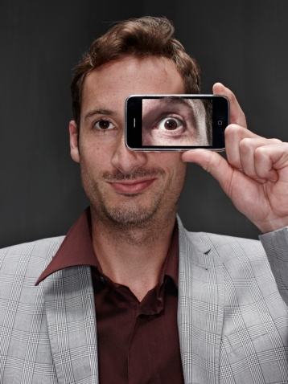

# ＜摇光＞信息、理性与心灵——从信息量角度出发浅谈影响个人思想观念的因素

**我们说到一个人聪颖博学或是愚昧无知，这里隐含着我们对于一个人思想的两个评判方向。前者在于其理性思考分析能力，即聪明或是愚昧；后者则在于其掌握的信息量，或至少是掌握的获取信息途径的多少，即博学或是无知。**  

# 信息、理性与心灵——

# 从信息量角度出发浅谈影响个人思想观念的因素

## 文/ 雷英迪（中国人民大学）

 

信息不是一个很容易给出定义的概念，它可以从包括通信、哲学在内的多个领域加以描述。笔者在这里指的信息，是狭义上对于新闻、消息、知识等事物的总和。信息的意义无疑是永恒的，而网络使信息找到了最快捷有效的传播媒介，也使其意义在这个时代体现得更加深刻。信息在某种程度上可以被视为未经加工的知识，是思考的对象和素材。因而信息量在相当大程度上影响着一个人的观念和行为。信息量的真正扩大，也必然伴随着获取信息的渠道的拓宽。信息量以及信息的获取渠道，正是影响个人思想观念形成和改变的一个重要决定因素。

通常我们说到一个人聪颖博学或是愚昧无知，这里隐含着我们对于一个人思想的两个评判方向。前者在于其理性思考分析能力，即聪明或是愚昧；后者则在于其掌握的信息量，或至少是掌握的获取信息途径的多少，即博学或是无知。这两个方面相比较而言，理性思维能力的差异更在于个人素质，无论这种素质源于先天还是后天；而获得的信息量则更多受到个人生活环境的限制，连主观获取信息的意愿，事实上也受环境因素的左右。

于是，如果说我们面对的问题是群体中普遍存在的某种愚昧和无知，那么在这两个方面中最有可能先被改变的无疑是后者——后者取决于个人主观深层的成分较之前者要小得多，且信息量的扩大往往能进一步促成理性的成熟，这种因果关系更为通畅。信息量的扩大和获取渠道的拓宽，能为人们提供的是更多的选择和改变的可能，这种可能性的增多其意义不言而喻。思想成熟度的提升，某种程度上也正是建立在信息量及其获取渠道扩大的基础上，人能够看到的可能性的增加。从这个意义上说，如果真的存在思想上真正的导师和启蒙者，他们也不是去直接改变你，而是给你提供改变的可能。

更多的可能性往往能够引向更多的自由。信息的自由不受限正是思考自由和表达自由的先决条件。当然，信息量的扩大从不等于我们相应地就会立刻改变看法。人们大可以不轻信很多消息，但是很多时候却有必要了解和承认它们的存在。更多的信息、特别是更多不同来源的信息，与其说是有混淆视听的危险，不如说是有更多兼听则明的效应。特别是在民众普遍开始对官方话语表现出不信任的时候，他们对更多可能的信息获取渠道的呼唤会不断增强。这时信息对于个人思想观念变化的意义将更为凸显。

信息量和获取渠道的扩大毫无疑问往往都会促进理性思考的发展。但另一方面，信息量匮乏的人却也未必缺乏理性。安东尼·唐思在《民主的经济理论》就指出：“寻求政治的博识是非理性的，因为这些信息所能提供的低廉回报简直不能补偿他们在时间及其他资源方面付出的成本。”除了这种“理性无知”，布莱恩·卡普兰的《理性选民的神话》又描述了一种“理性胡闹”的状态：“步骤一：在你能力范围内找出真相；步骤二：权衡拒绝真相的心理收益与物质成本；步骤三：如果心理收益大于物质成本，将真相从脑海里驱除，拥抱错误。”诚然，缺乏理性使人愚蠢，缺乏信息则让人无知。比起愚昧无知的不可救药，我们或许更要希望很多人不要只是因为无知看起来好像没有损失，而理性地选择无知。何况，这种有限信息下的理性绝非无损无害。单纯的唯理性论、理性至上主义已经被证明很可能会引向可怕的恶果。而像某些人在信息量匮乏下所喜欢进行的阴谋论推测，虽然是在思考和推理，但已经完全偏离了正常轨道。

信息量背后更深层次的一点原因或许更加重要，那便是人们对于美好事物的认知和热爱。这种心灵上的感染和基调的确立往往是最为本源的。这种认知很大程度上来自于人们对于艺术、宗教等高于生活的价值的追求，它们都以其自有的方式彰显着自由、多元与爱。文艺、宗教等事物的感染力如此强大，以至于专制极权社会势必对其严加控制、施以改造。而热爱的事物受限乃至被封杀，也成为了如今许多人关注现实的动因。就文艺来说，热爱文艺的人本身信息量一般就很可能多于常人，而有了进一步了解研究的动因以后，信息量更容易扩大，这会使得他们看到和思考更多的问题。文艺青年向思想青年的进阶发展正是这样。我们可以发现，很多爱文艺的人如果有政治立场的话，则多为偏自由派，这种现象与这种发展路径不无关系。而因为文艺的感染熏陶发生思想心灵变化的故事，在HGW XX/7（《窃听风暴》主人公）那里更是有着最好的注脚。

卡尔维诺有句名言：“我们是谁？不就是我们获取过的经验、得到过的信息、阅读过的书、做过的梦的复合体吗？” 卡老的说法有着其一如既往的神秘和睿智，但也直接指明了信息对于一个独立的个体之意义，甚至可以成为其人的组成部分。当然,信息绝非充分条件，但作为个人甚至整个社会改变的一个切入点，却也可谓恰到其处。

 

（采编自投稿邮箱 责编；责编：尹桑）

 
