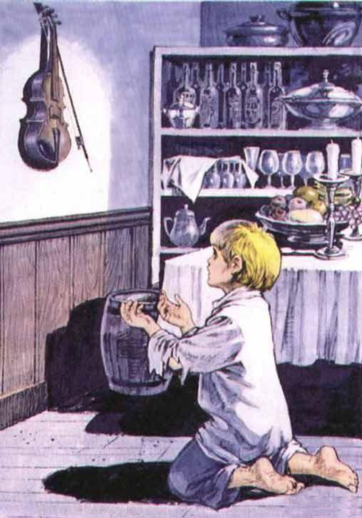
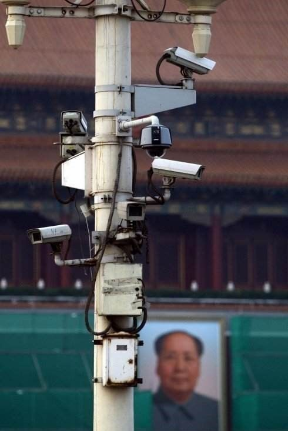
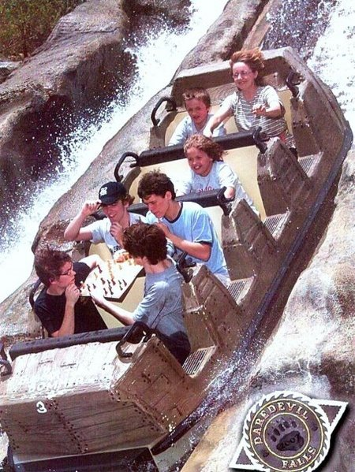

# ＜摇光＞关照好自己的灵魂——写给一个高一女孩（二）

**我并没有像你们的教科书那样，直接给你答案，我所做的，只是要你学会用自己的大脑想问题，用自己的眼睛看世界，我只是轻轻地提醒了一句，很多东西不是看起来的这样。一切的选择都是你做，一切的责任都是你担。我没有告诉你要相信什么，我只是告诉你，要学会质疑很多看起来理所当然的事情；我只是告诉你，人生其实还可以按照很多其它的方式展开。**

 

# 关照好自己的灵魂

# ——写给一个高一女孩

## 刘桂新（武汉大学）

 

（承接[前文](/?p=15771)）

#### 五

也并不是说，课本上所有的一切都是假的，但有一点是可以确定的，那就是如果他们只给出一个“绝对正确”的答案，那么这里面肯定是有问题的。

因此，我们要开始学会怀疑我们的课本给我们灌输的东西。我们的脑子里已经装进了很多这些我们不假思索地接受下来的东西，如果说在你这个年纪之前简单地接受别人的馈赠尚属于年少无知，那么到了你现在这个年纪，就该是对别人给你的东西进行筛选和鉴别的时候了。不要傻傻地让别人给你什么你都接受下来，要知道，天底下没有免费的午餐，那些强行摊派下来的真理不一定是真理，有可能是一个系统编织的谎言。人要想活在真实中是需要付出很大很大的努力的，真理只有通过我们自己艰难的努力才能发现。

特别是在当下中国的现实状况下，要想生活在真实中就需要付出更大的努力。首先我们的教育本身，既然它的目的就是为了让你接受一种真理，它就不会培养你的这种怀疑能力；相反，这种教育的目的就是为了消灭每个人的独立思考能力。我们的教科书为什么只给我们提供一种答案？目的就是不让我们自己独立思考。

不单是我们的教科书只提供了一种“绝对正确”的答案，我们整个的体制也杜绝了你在教科书之外寻找其它答案的可能。

首先用沉重的课业负担占据你们大部分的时间，而你们平时所可能接收到的信息都是经过了政府过滤的信息。你们在电视上所看到的新闻都是经过了政府严格审查的新闻，不会让你们看到那些“不和谐”的新闻报导，或者电视上被大量的商业广告和没有营养的电视剧所占据；你们平时所能阅读到的报刊杂志也是经过了政府部门事先审查的，那些不和谐的内容，那些跟你们课本上有根本上不一致的内容都不可能见诸报章；书籍也一样，也是要经过严格的审查制度才能得以出版；还有你或许认为很自由的网络，其实也是在政府的严格监管下。

这是一个无处不在的信息控制体系，各个方面配合得天衣无缝。这就是我上面所说的我们的党和政府为你们所编织的成长陷阱。你逐渐就会意识到这样一个可怕的事实。

生在这样一个国度是不幸的，但生活还是要继续。并且如果你对人生的意义有某种执着，你想按照自己的真实想法来选择自己的生活方式，那么你首先要做的就是让自己生活在真实中，你要努力挣脱那些别有用心者为我们编织的这个谎言之网，我们要做的就是一起逃离这个成长的陷阱。

#### 六

我自认为我好歹是逃离出来了的，虽然时间有点晚。而我身边的很多人，却一直没能逃出来，并且随着一个人年岁的增大，这种逃离会变得越来越困难，因为他已经习惯了在里面生活，习惯了享受这个谎言给他带来的利益，继而，他们很多人也参与进来，共同编织这样一个谎言，从而使不幸并不会因为一代人的消失而消失。

我们生在这样一个国度是悲哀的，有很少的一部分人，侥幸挣脱了这个谎言之网，但他们会有更强烈的冲动要让更多的人从这个网里面逃出来，因为并不是只要你逃离了出来，你就获得了拯救，这还只是你实现自我拯救的第一步，只有等到这个谎言之网破灭的那一天，每一个人才算真正得到了拯救。如果永远都只是少数人逃脱出来，那这个谎言之网永远不会破灭，那我们的下一代，我们这个国家的国民将继续笼罩在这个谎言之网下面，这个民族将永远得不到拯救。只有当更多的人逃离出来，达到一个临界点，这个谎言之网才会破灭，这是一项需要共同努力的事业。只有让更多的人认同和分享这些价值与理念，这些价值与理念才会真正在这片土地上落地生根。

这也是我要在这里跟你大费唇舌的原因之一，但不是唯一的也不是最重要的原因。我真正想看到的还是，你有一颗属于你自己的灵魂，你可以用你自己的大脑思考，你可以根据自己的想法来选择自己的人生。你不一定要关心这个社会，但一定要关照好自己的灵魂。

这个逃离或许会是一个艰难的旅程，甚至是一个痛苦的涅槃的过程。独立思考是一件痛苦的事情，对于那些已经习惯了不用自己的大脑思考的人更是如此。我们的脑子里已经被灌输了一套思维方式，我们要去改变这种思维方式，需要经历一种思维转型的阵痛。人都是有思维惰性的，人们都习惯于按照头脑中已经获得的信息和观念去思考、去生活。

当然，你也可以选择跟身边大多数人一样，把课本上的标准答案背得滚瓜烂熟，然后考上一个不错的大学，找一个不错的工作，最后在这个社会上说不定更能出人头地，受人尊敬，幸福快乐地过一辈子。

但**你有没有想过，在这茫茫宇宙中，这样一个独一无二的人生你或许只有一次，你是否应该好好想一想，它应该怎样度过？我们不去谈什么人生的意义，我们只谈，这个人生是属于你的，那它至少应该是按照你自己的深思熟虑的想法来安排的吧。注意，是你自己的，而不是别人加给你的那些想法。**

或许我们还忽略了最重要的一个问题，那就是，我上面一直跟你说我们的目标是，成为一个自由的、有独立思考能力的、有健全人格的人。但是你或许会叛逆地来一句，我为什么要成为这样的人？成为这样的人能给我带来什么好处？

孟子去见梁惠王，梁惠王说，你不远千里来到我国，会给我们国家带来什么样的利益呢？孟子回答，何必说利益呢，说仁义就够了。我好像也只是在跟你说一些大仁大义的大道理。

当然，我也相信，如果你真的听懂了我在这里所说的，你不会安安心心地坐在教室背书上的那些你越来越产生怀疑的标准答案的，你会慢慢开始思考一些东西，你会渐渐觉得，人生除了物质性欲望的满足，还有很多其它值得追寻的东西。

你或许现在还不知道你自己想成为一个什么样的人，但你肯定知道，有些人是你所不想成为的，比如，不想成为别人想让你成为的人。这是对的，生命的展开必须向无限的可能开放，生命正是因为充满了无限可能才绚彩纷呈。

成为你自己，这本身就是一个人的人生展开的前提，如果你不是你自己，那么你的所谓的人生的意义和价值都无从谈起。你首先需要获得人的主体性和独立性，你才能够开始谈你的人生价值和意义。

所以我这里不是要告诉你人生应该怎样度过，怎样度过一生是有意义的、有价值的。这同样是一种灌输，同样是对你的主体性和尊严的践踏。

我这里只是要告诉你，首先成为一个独立的人，成为一个有独立思考能力的人，然后才是按照自己独立思考的结果来安排自己的人生，只有按照自己的想法来寻找到的人生价值才真正算得上人生价值。至于你们的教科书上写的，人生的真正价值在于对社会的贡献，那都是bullshit。

#### 七

我在跟你说这些的时候没有考虑到这会对你现在的生活造成什么影响，更没有考虑到从长远来看，这对你有什么好处。但这些只是我的一些建议，你这么大了，应该学会自己去分辨哪些话是有道理的，哪些话没有道理。

而且，我并没有像你们的教科书那样，直接给你答案，我所做的，只是要你学会用自己的大脑想问题，用自己的眼睛看世界，我只是轻轻地提醒了一句，很多东西不是看起来的这样。一切的选择都是你做，一切的责任都是你担。我没有告诉你要相信什么，我只是告诉你，要学会质疑很多看起来理所当然的事情；我只是告诉你，人生其实还可以按照很多其它的方式展开。

不知道当你爸看到我跟你说这些会是一个什么样的反应，我想他大概不是一个开明到能接受我所有这些观点的人。他会觉得，如果按照我的观点，你会成长为一个离经叛道、不务正业的人，并且为自己的成绩下滑和不专心学业找到了很好的理由。他会告诉你，这样下去你会考不上大学，最终为这个社会所淘汰。你父亲的考虑是不无道理的。

在我们这个社会，能进行独立思考的人是少数。这一类少数人不会认同这个社会不合理的制度和做法，但我们这个社会就是按照这样一套不合理的规则体系在运作的，比如说我们的教育制度、高考制度。那么在这个社会上，只有按照这么一个不合理的规则体系来，你才能够获得这个社会的认可，获得这个社会上的成功。这样一套规则体系是不支持独立思考的，因此谁胆敢进行独立思考谁就会被这一套社会体制所淘汰。这是一种强大的逆向淘汰机制，那些跟这个社会不合拍的人，不愿意跟这个社会合作的人，不愿意按照这个社会的各种明规则和潜规则往上爬的人就会被这个社会淘汰。在这个社会，最能获得成功的人是那些深谙这个社会的一整套规则体系并且善于最大限度地利用这套规则体系的机会主义者。

在一个大家都不用自己的大脑思考的社会，用自己的大脑思考是一件危险的事情，所以很多人宁愿用自己的灵魂跟撒旦做交易，换来物质上的成功，换来在这个畸形的社会的成功。而在这个过程中，他们自己也异化了，畸形了。

用自己的大脑思考就意味着你要做这个社会上的少数派，这听起来很酷吧，与众不同实在是值得追求的东西。但也不要因此感到在这个社会上形单影只，知音难觅，因为“德不孤，必有邻”。而且事情并不是非此即彼地那么绝对，做一个有独立思考能力的人在我们这个社会绝对是高人一等的品质，是值得骄傲的资本。

#### 八

因此，我这里并不是教导你要撕毁那些写满谎言的课本，逃离课堂。说实话，你无处可逃。既然我们生在这个国家，并且又没有条件选择换一个国家生活，我们就只能在现有的条件下进行抗争。

我们不能拒绝高考。在我们这个社会，你要想有所成就，获得一个大学文凭是唯一的前提，除非你有韩寒那样的才情。就大多数普通的中国孩子而言，他们自身都没有能力去对抗这个教育体制。是的，这个体制是不合理，但我们暂时还没有能力去改变它，那么我们首先也需要利用这个体制，通过成为这个体制的成功者，获得一张大学入场券，我们才有可能积聚我们的能力来改变这个体制。

因此，不要试图用自己的行动来拒绝和对抗这个体制，这是一种幼稚。相反，**我们既要认识到这个体制对我们的奴役，又要在这个奴役我们的体制里脱颖而出。**你必须争取考试考高分，在试卷上写上课本里的标准答案，越标准越好，即使你越来越觉得这些标准答案是值得商榷的，即使你越来越认识到你们政治课本上、历史课本上的很多东西其实都是跟事实不符的，即使把自己恶心到呕吐也在所不惜。

为了拿到一张大学入场券和为了自由这两项工作可以同时进行，虽然二者之间确实存在一些张力，并且这种张力会时时折磨和考验我们的心智，但这是一个为自我而奋斗的过程，这个过程本身也是有意义的。

如果我们放弃争取自由的工作而只是简单地接受一些书本上的东西也许会很简单，不会对我们的精神造成很大的折磨，也许这样做我们还能更集中精力去适应这个教育体制，在这个体制下获得更大的成功。这当然是摆在你面前的一种选择，并且你完全有权利这样选择。

但是我要告诉你，你其实完全足够强大到同时胜任这两项工作。我们需要做的只不过是有意识地扩展自己的生命罢了。

我绝不希望让你为了追求我所强调的独立和自由而毁掉了自己的前程。因为我们的前程跟我们所争取的独立和自由是结合在一起的，没有这个前程，独立和自由也无从谈起，因此我们既要前程，也要独立和自由。并且，只要努力，这两者是可以兼得的。

（未完待续） 编者注：本文主标题为编者所拟。  

（荐稿：廖汉斯；责编：黄理罡）

 
