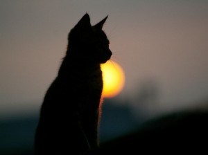
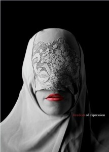

# ＜摇光＞养猫和养娃

**如果我对我儿子肉肉说“我这都是为你好。”我到底是为他好，还是为我脑子里想要的那个他好？这么反省起来，我真觉得没有比这更无耻的话语了。我从没有对中国的教育方式像今天一样感到如此愤怒和绝望，因为它在幼儿园的教育中，就已经因为剥夺了人无限的可能性而崩坏。与其说一个人的所有痛苦都来源于比较，不如说一个人所有的痛苦都来源于自由的剥夺，因为这种剥夺他们永远难以意识到自己还有成为更自己的可能性。**

### 

### 

# 养猫和养娃

### 

## 文/ 米粲（武汉大学）

### 

### 

之前叶茜说养猫就尽量让它在家里圈养，放养对猫不太好，容易弄脏弄伤或是得病什么的。我虽然视她为资深顾问，但还是觉得这对宠物的自由未免是一种剥夺，还是打算让它爱在家就在家，爱出门就出门。恨不能在门上挖一个猫洞任其来去无影踪。 我甚至都克制自己不要强行抱它，也不喜欢故意拿吃的引诱它做出些很萌的样子来，有时候跳到笔记本键盘上卧着也懒得管。它放屁不说它臭，它拉屎不笑它后腿角度奇怪。猫这种自尊心很强的动物，万一听懂我说的话之后用小女人一般的心情记恨我怎么办。那天还看到老罗一个呼吁主人不要给宠物做结扎手术而是更人性化地为宠物性爱提供伴侣、安全和关怀的状态，说的深得我心。我当真觉得爱宠物不应该像是爱玩具那样爱，要求它们方便照顾又恰好戳中自己的萌点，而是应该像爱一个独立的人那样爱，或是考虑到其脑小的客观事实而像爱小孩那样爱，容许它过想过的生活，拥有最大程度的自由。 

 说到这我不由得又想起幼儿园的日子，生活单调的我快把那些感触说烂了。那驯兽式的教育方式当真给我留下了终身阴影。不禁想到原来那么小的时候我的童年，至少童年的一部分就只能做老师喜欢的事，而不能做自己喜欢的事了，这当真让我极为感伤。而且那种服从的习惯，还是在美食、表扬等种种诱惑中建立起来的深刻条件反射，漫长的岁月之后，待我终能视实现自由和自我的需要远高于这些廉价的浮云，我才能在深呼吸一口后感叹道“记得当初年纪小，不敢说来不敢笑。更喜浮云遮望眼，只视理所当然中。”（麻痹我下次再尝试改编古诗自己砸自己的脚我就去吃石头。） 到底要养宠物养成自己喜欢的样子还是它自己舒服的样子，到底要把小孩养成自己期望的样子还他自己选择的样子。说出来的时候我们都有着“他好我就好”这样最冠冕堂皇的回答。但事实上做起来真tm难啊，在我看来，两边因为交流不畅信息不对称而造成的巨大代沟根本就无法填补。在种属上、智商上和经历上的优越感，很容易让人把宠物和小孩都视为自己的附属品。宠物上桌子要挨训，小孩子不乖乖坐好要挨训。而它们发出的喵喵抗议和喃喃不乐意都被我们用“这都是为你好”的黑洞而吸走。 过剩的雌性激素害我成天为如何教育下一代而思考。如果我对我儿子肉肉说“我这都是为你好。”我到底是为他好，还是为我脑子里想要的那个他好？这么反省起来，我真觉得没有比这更无耻的话语了。我从没有对中国的教育方式像今天一样感到如此愤怒和绝望，因为它在幼儿园的教育中，就已经因为剥夺了人无限的可能性而崩坏。与其说一个人的所有痛苦都来源于比较，不如说一个人所有的痛苦都来源于自由的剥夺，因为这种剥夺他们永远难以意识到自己还有成为更自己的可能性。当我的母亲以“听话学习好”为衡量一个小孩好坏的所有标准时，甚至当我的父亲觉得如果我将来只成为一个高中政治老师是一种羞辱时，我都能感觉到我们在追求权力和成功的道路上已经异化。明明成为一个自由的人、理性的人、一个自由人联合体中的一部分才是一个“大写的人”啊。我怎么能允许我的儿子——无疑他也是一个“人”——被别人或是我的狭隘束缚住？自由不应该是一个实践不了的大词，一个空洞而美好的泡沫，它应该是反省心灵时的一条捷径，接受自我时的一种坦然，面对选择时的一种理性，面对不平时一句尼玛，拉屎放屁般的一种需要。 

 当几年后我的儿子从我的大脑经由我的子宫和阴道出世的时候，我要给他安全的保护和探索的自由，我要时时反思是不是让他领略到了最大的可能性，看到了最想成为的自己，有自己真正的理想，而不是我的期盼和力量的延伸。就像养猫一样，它爱不爱我不要紧，它快不快乐我很在乎。也许自由教育是一种冒险，更像是一种赌博，但值得一试。在这种教育中，最大程度的安全保护是必须的，最大程度的信息开放是必须的，最大程度的尊重和交流也是必须的。我也没把握自己会养出一个什么样的儿子来。但我还是觉得，它要比要求孩子们“排排坐才能吃果果”要好的多。为了达到真正的自由，教育必须以自身为目的，为教育而教育。如果它是达到其它目的的手段，如道德、政治或其它方面，那么教育只达到了一种奴隶性的因而也是较低级的阶段。而只有自由的教育，才能教育出自由的人。我的肉肉我的米靠，我永远乐意做你的窝和窗，但我永远耻于做你的功夫网。 

### 

### 

（采编：陈锴 责编：陈锴）

### 

### 
