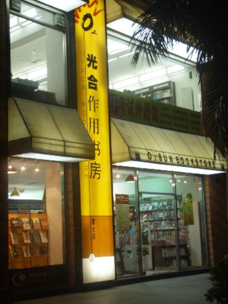

# ＜摇光＞再见，光合作用

**一面是巨型B2C网站之间为了谋求上市圈钱神仙打架一样地互相竞争，争相拉底图书价格，一方面是来自网络免费内容的逐步蚕食导致的图书市场的整体缩水。夹在中间最可怜的，就是光合作用这样的实体书店。**

 

# 再见，光合作用

## 文/张韧刚（洛阳大学）

 

光合作用可能彻底完蛋了。

无限唏嘘。

前几天在微博上看到光合作用高管集体辞职的消息的时候，我把新闻转发给一个在厦门做旅游纪念品，和光合作用有合作的朋友，告诉他光合作用可能面临严重问题，让他催收货款。没想到仅仅几天之后，光合作用厦大周围的几个门店就全部关门了。北京和厦门一些地方的光合作用门店居然被愤怒的供货商哄抢一空。

近十年打造的书店品牌，一朝之间灰飞烟灭。

其实光合作用书店的问题并不是这次才有的。早在几个月前，我朋友在厦门做一些小纪念品的时候，就和光合作用有合作，当时光合作用和他的合作方式是代销，也就是货放在这里，然后卖掉之后结清货款，这在一些资金较为紧张的零售业是行业惯例，朋友也没有多在意，就在厦门光合作用开始铺货。其实当时的光合作用的很大一部分收入就是来自和书籍相关的产品，比如礼物、文具、纪念品之类。后来他发现光合作用结款非常不及时，一直拖欠货款。当时大家也没有想太多，只是觉得图书行业利润比较薄。以光合作用的品牌不至于搞到太严重的地步。

然而我们没有想到的是，光合作用并不是仅仅拖欠了我们一家的欠款，因为光合作用的品牌效应，除了我们之外，还有一些其他的商家和光合作用合作时，他们也拖欠了一些货款。今年10月25号，厦门文博会开幕，大量书商来厦门参展时正好去光合作用追债，光合作用资金紧张，总部就从原先的人才中心搬到了湖里区阳光工业大厦，结果大批追债的供货商见光合作用人去楼空，就开始电话联系光合作用高管。

后来部分高管辞职，因为“之前有一些民营供应商来砸过办公室，也锁过我们的大门，威胁到了员工的人身安全，所以我就让他们辞职回家。”于是事件在微博上发酵之后，就有了光合作用书店高层集体辞职 门店随时可能关闭的新闻。

于是事件一发不可收拾，多家供货商继续追债，最后愤怒的供货商砸了光合作用的门店，哄抢图书。

至此，光合作用很多门店都已经关门歇业，背负着沉重债务负担的光合作用，如果不能得到外来投资或者其他方面的援助，很可能及再也不会开下去了，近十年创造的品牌，就这样灰飞烟灭。

其实实体书店的经营的困境早在几年前就已经开始。

这些年京东，当当，卓越，苏宁，北发等一大批网络图书销售商开始崛起，其中当当在之前成功上市，京东奋起直追，京东在商业模式上一直采取赔本赚吆喝的方式，长期融资烧钱，低价位打价格战，让京东在一定程度上占领了很大的市场份额，然而，在京东还没上市，苏宁就开始进入图书零售行业，目标也很简单——上市。

而近几年的图书市场并没有大家想的那么大，2010年最畅销的三本书如下：

1《小时代2.0虚铜时代》258578

2《独唱团(第1辑)》229370

3《杜拉拉升职记》151692

这些书和以前余华的《兄弟》一本书买几百万册相比实在是个小数目。

更不容乐观的是，WEB2.0兴起之后，提供给大家阅读内容的已经不在限于原先的书籍，报纸，杂志，网站了。随着博客，微博，SNS，以及各种RSS实现的订阅的兴起，市场的阅读时间越来越多的被这些内容所占据。

一面是巨型B2C网站之间为了谋求上市圈钱神仙打架一样地互相竞争，争相拉底图书价格，一方面是来自网络免费内容的逐步蚕食导致的图书市场的整体缩水。夹在中间最可怜的，就是光合作用这样的实体书店。

面对一本正版书打3折还包邮的竞争对手，实体书店变得越来越无力，有些时候一些正版书打折之后的价格与盗版书相差无几，与其说是盗版猖獗摧毁了光合作用，倒不如说是互联网上大家携巨量投资互相打价格战顺手摧毁了光合作用。

其实中国很大一部分读书阶层并不是那种会在地摊上买盗版图书的读者，很多人还是很愿意在书籍上花费一些的。这在豆瓣网上有非常明确的体现，但是这个客户群规模并不算大，整个豆瓣网注册用户仅仅5千万人。其中很大一部分还是主要以音乐和电影为主要消费群体的用户。

虽然光合作用一直致力于给读者提供一个比较良好的阅读环境，通过发挥网络书店所不具备的人文环境优势来试图改变目前的颓势，但是这种尝试长时间以来光合作用的主要客户群体依然是学生，这种策略一直没有能够真正改变光合作用的现状，最后光合作用只能靠卖精品文具和纪念品来支撑。

另一方面，光合作用的店面都设在相对比较繁华的城市中心区和大学周边，物业成本高昂，由于实体书店销量少，却需要很多人工来进行维持，导致实体书店的成本难以下降。而互联网B2C行业争相谋求上市基本上是打算从股民手上而不是客户手上赚钱，大量B2C企业谋求上市，简直把投资变成了另一种消费，充满了各种不理性，资本市场上庞氏骗局肆虐，大家一遍一遍的在玩击鼓传花的游戏，最后伤及的还是实体经济。

光合作用走到今天，很多人都无比痛心，即便那位给光合作用供货的朋友，在欠款之后依然对光合作用的情况感到惋惜。我想光合作用走到今天，和其他所有文化产业一样都有着它内在的问题，随着资本泡沫的逐步泛滥，我们可以看到现在的所谓文化市场一面是书画艺术品市场已经成为投机商的乐园，而最基础图书市场上大家喊打喊杀的拼市场份额，追求IPO。而作家，书店这样的重要的文化载体却只能在整个资本的狂欢之中分到一点残羹。

再见，光合作用。愿你能等到一个美好的时代。

 

（采编：麦静；责编：麦静）

 
