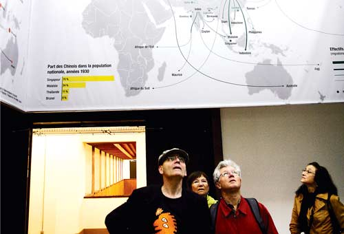
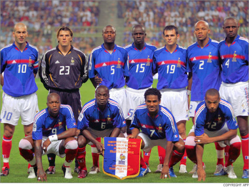

# ＜摇光＞再谈法国移民问题

 **这支多种族的法国足球队在摧毁着法国人对这项在当今最能激起民族向心力的运动的信心同时，更在深深地拷打着法国人对外籍移民的信任，你们这些人根本不把自己当法国人，如此败坏着法国足球队的名声，还能把球踢好么。**

# ** **

# 再谈法国移民问题

## 文/榕晨 （Rouen Business School）

对法国的知识界略有接触，其实会发现法国的知识分子对他们国家未来的担忧丝毫不比中国的知识分子来的少，区别在于在法国仅仅只有那些知识分子在忧虑，普通民众则漠然不关心，而中国是从上到下绝大部分人心里都知道自己所处的社会有多操蛋。引用法国前教育部长Claude Allègre在《世界的冲突》一书中描述当代的法国人的三个形容词：高傲(l’arrogance)，无知(l’igrorance)，消沉(le découragement)，可以概括当前法国知识界对共和国的担忧。但若要说到当下法国社会最严重也或许是最根本的问题，那必定是这个国家民众的国家认同感正在随着时间一点一点地流失殆尽， 如果说经济停滞，失业，环境污染，皆是一时的肌肤之痛，那么一整代人对民族认同感的漠视或许才是一个国家的心腹之患。 

当远东的中国人在一个多世纪以来饱受极端民族主义肆虐之苦时，法国人却在二战之后的几十年间为越来越难以无法唤起民众的爱国热情而感到忧虑。这确实是事实，原因主要有三个方面，一是源于经济增长的迟滞，大国地位的丧失深深地挫伤了法国人原本极为强烈的民族自信心；二是由于法国政府长期以来忽略对国家认同方面的教育；第三，无疑是越来越多外籍移民的涌入，日积月累地冲淡着法国民众对国家概念的认同，移民与民族融合问题，在今天俨然成为法兰西身上最深的伤口。

根据我几天之前刚刚看到的移民局所公布的数据，法国现有居民中外籍人口占到11.6%，请注意，这里仅仅指的是呆在法国但没有法国国籍像我这样的外国人，而其他持有法国国籍的非法国本土裔法国人至少也还要有一个11.6%。但是习惯上，人们还是都会理所当然地把这类人当成“外国人”，包括他们自己在内。我和不少拿着法国国籍的阿拉伯裔非洲裔聊朋友聊过天，这些人从来开口都是“他们法国人”，并不把自己当法国人，至于纯种法国人自然就更不可能真正把那些有色人种当成自己人。也就是说，在今日法国的土地上超过五分之一为非法国人。这种情况在巴黎与地中海沿岸的各城尤甚，诸如蒙彼利埃、土伦的外籍移民总数甚至已经超过了纯种法国人。 当然，移民人口或许并非是问题，问题更在于移民融合之难。法国虽然号称自由平等博爱之国，在反歧视问题上向来当仁不让，国内各项政策规章之中也确实处处有意凸显其平等之信条。但实际的情况是，正如我在以前的文章中也多次提到过的，这些看似包容平等的制度设计，往往越能凸显法国人高傲的一面。法国人的深层逻辑是：正因为我们高你们一等，所以我们要展示出比你们更包容平等的制度，所以我们鄙夷歧视。所以，大多数看上去很美的制度设计只能停留于纸上，意淫作用远大于实际效果，法国人的高傲依旧是举世出名的，事实如此。 诸如，在法国递交应聘简历时，理论上是不允许写明种族，甚至不允许张贴照片，以防止雇主根据肤色选人，但其实到了面试环节，这些还不都是一目了然；法国政府在进行各种社会统计，诸如失业率、收入水平调查之时向来不统计受访者的种族一项，但实际上这非但无济于事，反而削弱了之后利用数据的效率；法国的某些公共职位是规定必须要有一定比例的移民人口担当，这往往又成了逆向歧视，加剧民族之间的间隙。 法国的法律在反对种族歧视方面有着十分严酷的规定，不当的种族言论是要因言获罪的，上个月法国内政部长仅仅就因为一句“穆斯林人数的增加是一个问题”就被人以“煽动种族仇恨”告上法庭，但是日常生活中的种族言论依然屡见不鲜，在我们学校有一次考试中，就有过法国监考老师当着所有人的面说：“你们中国人就是爱作弊。”当然这句话在法国已经是违法了，但是又有谁会为此较真把其告上法庭？事实上，日常生活中纯种法国人对外籍人口的歧视委实太普遍太普遍，小到学校老师对待有色学生冷漠的态度，大到商场店员为盘查一个外国顾客竟然把条形码偷塞到其口袋，故使其在离开商场时被警报发觉，是的，这些事情都发生在我身边，例子俯拾即是。成见就是可怕的东西，一旦发生，便很难改变，一次被歧视的经历远远不是一次被善待的经历可以弥补。我问过身边许许多多和我一样的留学生，对法国人的评价确实负面远大于正面。 另一方面，问题自然也出在移民本身。大量的“无证”移民涌入（在政治正确高于一切的法国，媒体一律只能以“无证”移民指称非法移民）严重地冲击着法国社会的基本秩序。以我们福清人为例，在巴黎的数量不下一个万，有合法身份的不过几百，真是的无证移民数量是不可能统计出来的。过量的移民无可避免地在很大程度上 挤占着法国本土人口的就业空间，并且严重恶化法国社会治安。在巴黎的几个特定街区，夜晚是出不了门的，市郊圣丹尼区的华人商场几乎没有一家没有被抢过，最后到了连天底下最能忍的中国人都忍无可忍上街游行抗议社会治安之乱。近几年来，法国最严重的两次移民问题大爆发是零五年的巴黎骚乱以及去年格勒诺布尔的骚乱，到最后皆是闹到法国政府不得不动用催泪瓦斯橡皮子弹才能收场的地步。诸如此类事件发生，不论谁对谁错，何为导火索，后果无疑是进一步加深法国人对移民的厌恶与恐惧，加大解决移民融合问题的难度。 

而对于那些在法国社会一定程度上获得成功的移民，他们的表现往往也让人颇为失望。一个很典型例子便是法国的足球队，由于先天体质的因素，黑人在体育上向来表现的比较优秀，法国足球队向来留有非洲裔球员的半壁江山。但是令人十分遗憾的是，法国队在近几年的国际大赛中不仅表现令人失望，并且一再丢球又丢人。开场不唱国歌，典型就是齐达内；罢训，马卢达带头；对主教练口出恶语，阿内尔卡干的…这支多种族的法国足球队在摧毁着法国人对这项在当今最能激起民族向心力的运动的信心同时，更在深深地拷打着法国人对外籍移民的信任，你们这些人根本不把自己当法国人，如此败坏着法国足球队的名声，还能把球踢好么。 事实上，法国政府在解决移民问题上是可谓煞费苦心，但是收效甚微。萨尔科齐在零七年上台之后便着手建立了一个新的国家部门，叫做“移民、融入、国民身份认同和共同发展部”，名称长的令人蛋疼。零九年，萨尔科齐和总理菲永亲自牵头，在法国举国上下开展一场以“什么是法国人”为主题的大讨论，主要涉及法法国民族精神，价值观，移民的社会融入与整合，伊斯兰教法国化等等问题。这样举国体制的大讨论，在西方国家也实为难得一见。萨尔科齐政府的对待移民的政策虽然一直偏向强硬，但总体而言不失理性，也一直可以得到大多数法国民众的支持。 现在的问题是，这些移民政策并未能达到效果，或者见效太慢，而法国民众已经开始失去耐心。以玛丽勒庞为首的极右翼国民阵线打着反移民的旗帜在今日法国，已近能够占到将近百分之二十的稳定选票，甚至在多次民意调查中战胜萨尔科齐，这绝对是十几年前的法国人想到不敢想的情形。当然了，极右翼若真的能够在明年的大选中上台，那绝对不是一次法兰西民族认同感的胜利，只会进一步加深民族之间的裂痕。因为，移民问题永远不可能靠树立矛盾并企图减少移民数量的方法来解决， 在全球化一步步深化的今天，法国的移民是根本减少不了的，只会增加，问题只是增加的幅度大小而已。 一百年前，比利时首相儒勒·德斯特里曾在写给国王阿尔贝一世的一封信里说：“请允许我告诉您一个事实，一个巨大的、可怕的事实，那就是，比利时人根本不存在。”一百年之后，他们的邻居法国人虽然不必怀疑民族的存留问题，他们毕竟有着光辉四射的历史，但却不得不担忧民族的未来，法兰西作为一个整体的概念何以延续，如何能够重新树立法国公民的国家认同感，如何能妥善改善移民融合问题，都将成为决定这个民族走向的关键所在。令人遗憾的是，时至如今，无论左翼和右翼，在主张上不停地争吵，但他们从来都未曾改善过这个问题。 最后附上一张我在巴黎地铁上抓拍到的一幕温馨的场景，这大概才是法国民族问题的希望。法国老太太在给身边的黑人小朋友讲解杂志上的内容。但是依然可以看到，这位黑人小朋友的眼中，依旧充满着些许紧张和惶恐。 

（采编自投稿邮箱；责编：项栋梁）
