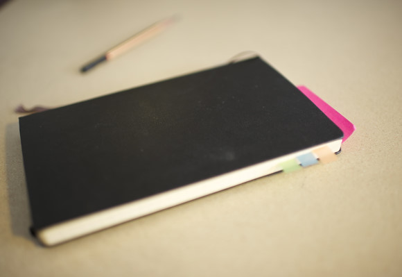
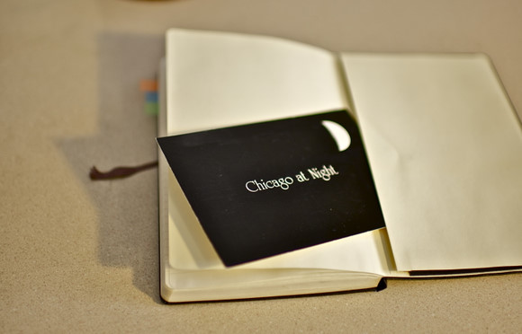

# ＜摇光＞写下你的梦想 实践你的梦想

**作者按：你列下了梦想清单，但从未真正去实践。有时候这是因为你没有在时间管理上做好计划，以及不断的进行梦想的修正和实践。** **我写下我的梦想清单以及一年来持久而专注的不断为之加上一片片羽毛和一枝枝麦穗，很大程度上是“实践10000小时”的时间管理法的帮助。现在，我很乐意和你分享这个时间管理的方法，希望你也能实现你的梦想。** ** **

# 写下你的梦想 实践你的梦想

## 文/彭萦（University of Michigan Ann Arbor）

有一个短片，名为《苍蝇一分钟的生命》，One Minute Fly。 一只仅有一分钟的生命的大眼睛绿头苍蝇刚刚来到这个世界上就收到了一张清单，Things to Do Before I Die，我死前要完成的事情。它要叮一只浣熊，它要把自己灌醉，它要和蜗牛搞个party，它要谈场恋爱，它有很多很多其它的事情要做。有的是它自己卯足了劲才实现的，有的是巧合之下它意外撞上的。它卖命地飞速完成一件件清单上的梦想，把它们一个个画上勾。但是，最后几秒内，它发现还有两个梦想是怎么都不可能完成的了，一个是看星星，另一个是成名。可是它只有一分钟的生命，怎么可能等到星光璀璨呢，又该如何流芳百世呢？它万分沮丧，在最后一秒前眼中含满泪水。可是，上天就在不经意间暗中助它实现了最后两个梦想，让人感动万分。最后让人会心一笑的是，制作这个短片的人也借此完成了自己的一个梦想。 短片请看[这里](http://v.youku.com/v_show/id_XMTkwNzg4NDA4.html)。 Outliers《异类》这本书提到，一个人如果想要在一个领域成为最出色的人或者大师级的人物，必须至少投入10000个小时才行。无论是爱因斯坦，还是比尔盖茨；无论是小提琴家，还是运动员。就是说，要达到这10000个小时，如果每天能为那一个目标花费3小时的话，必须坚持十年。我伤心的想，过去这二十多年来，自己从来没有为任何一个目标那么执着那么专注。但是我依然梦想成为某一个领域的专家，或者仅仅是把一件事做到完美，把自己的一个潜能发挥到极致。于是，我在23岁生日的这一天给自己买了一本Moleskine黑皮笔记本，列下自己的梦想清单。 Moleskine笔记本带有硬质感的表皮，红黒蓝等奶油色的封面，翻开时能够平铺开来，里面或网格或线条或空白。用途很随意，或书写或涂鸦。它来自意大利的米兰，早在19世纪就在欧洲大陆风靡，是毕加索和梵高等人情有独钟的笔记本。作为一本笔记本来说，它的价格不菲，但是能够长期保存和翻阅。 

**第一步：梦想的畅想** 我在笔记本的第一页写下了自己想要实现的所有大大小小或宏伟或琐碎的梦想： 

  * 学会弗拉门戈舞蹈
  * 拥有一栋海边可以看日出的木屋
  * 实现7+2（七座世界高峰和两极）
  * 写一本小说
  * 拿到MBTI资格证
  * 成为专栏作家

…… 写下梦想清单的时候不要从细节上去考虑具体该如何实现它，不要去评估它是否需要花很多的金钱或者技能，不要去在意它是否能称得上是一个理想还是仅仅是一个享受。只要你想实现的，都可以写下来。想一想你儿时的梦想——我特意考证，从我家长那得到的答案是我小时候最想拥有的是一个能放下所有零食的超大冰箱——你的朋友或者只是一面之缘的人是否曾经夸奖你在某一个技巧上特别出色，你想搜集什么特别的玩物，你想去哪里领略生活在别处的感觉，你一直渴望学习什么方面的知识，等等。不要着急一天就把所有的梦想清单都写完，可以留几页，日后一条条补充。 这就是你死前希望能完成的梦想的清单。 

**第二步：给梦想分类** 当我写完我的梦想之后，我看着一条条的大小梦想，发现有很多梦想都能归类到一个主题或者一条线里面去。于是我拿来彩色的小贴条，在给清单留下两三页的空余，每隔八到十页就贴一个彩色的小贴条。每当发现一个新的大主题的时候，就再贴上一条。然后把那些最重要的、最想实现的梦想归到一个大主题里去。 我意识到，虽然列了许多死前想完成的事情，但我最想实现的三个梦想主题是：写作，MBTI，以及登山探险。 一个很大且长远的梦想是不可能一步实现的。出色的长跑运动员总是会把一次艰巨的长跑行程划为很多个小行程，达到了一颗树之后再往下一个建筑物跑去，这样就轻松得多了。实现梦想也是如此。 拿MBTI这个主题来说，我在带彩色小贴条的那一页写上MBTI Step by Step，列下MBTI的实现步骤： 

  * 读更多和MBTI以及心理学相关的书籍
  * 为更多的朋友提供MBTI性格的分析，为他们学习生活提供建议，同时也多认识一些SJ、SP这些我并不是特别熟知的性格类型的人
  * 与MBTI美国和中国的官方机构取得更多的联系
  * 去mountain view CPP总部考取MBTI certificate
  * 在褪墨上写MBTI系列文章
…… 也许你在实践梦想的途中会发现自己有些小步骤写得太不切实际，以至于它根本不可能实现而被你束之高阁。这时候你要重新定位自己，试图修改一下步骤，舍弃一些，同时新添一些。同时，你是否尝试过梦想的替代品呢。比如你想成为一个作家，那你是否可以先把自己博客写得更好，是否可以先为一个时尚杂志投稿，甚至是为一家网站做一个内容编辑呢？这并不是在发现现实和梦想的差距之后的妥协，这是为梦想的实现垫下的一个又一个的踏脚石。 随着你已经实现了这个梦想主题的很多小步之后，你会发现会有更多的机会和更广阔的平台在你面前展开，这个主题可以横向发展也可以纵向发展。每个小步骤可能可以再细分为更小的步骤，同时可以和其它步骤作为同等可能机会并列。最开始列下的一个很简单的线条可能会成为一幅纵横交织的宽广图景。 

 **第三步： 记录你的每一个投入** 在为梦想的Step by Step留下一两页之后，就该记录你为你的那个梦想付出的具体而细致的投入了。 我的写作记录表： 

  * 读了《1q84 2，3》 09/21/10
  * 读了《影响力》 09/22/10
  * 读了《麦田里的守望者》 10/05/10
  * 读了《tipping point》 10/13/10
  * 读了《1001 ways to market your books》 10/15/10
…… 
  * 和编辑沟通出版事宜 12/03/10
  * 读了《buzz》 12/07/10
  * 和编辑讨论《香格里拉天空下的经济学漫想》封面和版式 12/14/10
  * 写了《美国人都很异常》 01/05/11
  * 与××和×××讨论开专栏的可能 02/09/11
  * 给书评人发邮件 02/14/11
  * 为褪墨写实现梦想的文章 03/02/11
…… 记录投入的时候可以把所有一切和这个梦想相关的事件都记录在上面，左边是事件，右边是日期。就拿我的梦想写作来说，可以把读书、写博客，看博客、和朋友讨论开专栏、出版书前的联系和出版之后的市场宣传等等全部都记入在记录表中。如果梦想是成为一名出色的吉他手，可以把练习弹奏、听演奏会、学习吉他教程、在youtube上看吉他视频都写上。只要和梦想相关的，和梦想擦边的，都能计入投入的时间里。 

**第四步：梦想倒计时** 《异类》中说，要把一件事做到极致，或者成为一个领域的专家，天赋当然是不可或缺的，但同时，他也需要耗费10000个小时。成功没有捷径。 所以我在每一个梦想那十页的最后两页上写上倒计时和10000这个数字。每当我为这个梦想付出了一点什么的时候，我会如第三步说的做具体的事件记录，同时把旧的数字划去，扣除花费的时间，写上新的倒计时。到目前为止，我的写作这个梦想的倒计时为8740。看着数字不断的缩小，你不仅能够看到那一个个被划去的数字，那是你为梦想付出的一滴滴汗水；同时你还可以看到剩下的那个新的倒计时数字，那是你为了实现梦想还要耕耘的田地。 你也许会质疑10000小时这个时间刻度的准确性和科学性，但是这个倒计时的最大意义不在于这个数字。当你划去旧的数字，写上新的数字的时候，你也是在为自己打点气，给自己一个提醒。当你看着不断消减和更新的数字的时候，成就感和满足感油然而生。只有这样，你才不会让自己的梦想被日常生活所淹没。 或许，你并不想成为一个领域的爱因斯坦或者比尔盖茨，你觉得做到优秀就够了。那你可以把起始的10000个小时改称8000或者5000个小时。不要以为5000是个小数字，你每天花1.5个小时都需要坚持十年。而你的时间总是被繁重的工作以及琐碎细小的家常事务压得满满当当，每天投入1.5个小时都是那么的不易。 

Moleskine笔记本的背面还有一个口袋，你可以将那些和你梦想相关的物件放在那里，不时拿出来看一看。它可以是一封信，是一张地图，是一个邀请卡，是一张收据，是任何你值得骄傲和难以忘记的东西。 当我们把梦想这个词和其它词相连时，线的那一端不该只是虚幻和期冀，而应该是计划和付出。别轻易将你的梦想尘封，别让它和你一起慢慢变老变虚弱。你没法预计未来，但你可以造就自己的未来。也许像那只绿头苍蝇一样，上天也会暗中帮助你，让你不经意的就实现了那些看起来根本不可能完成的梦想，让你在生命的最后一刻也流下满足和欣喜的泪水。 今天，是你剩下的那短短几十年生命的第一天。请别忘了像那只苍蝇一样，抬头看看头顶的倒计时器，和手中握着的那长长的梦想清单。 作者注： 本文特意为[褪墨](http://www.mifengtd.cn/)所写。“褪墨是一个关于时间管理，个人提升和演讲技巧的博客。我们的目标是：把事情做到更好。” 本文转自[我的博客 ](http://blog.sina.com.cn/yingpeng332)。 编者注： 本文作者彭萦为北斗网著名撰稿人，著有《香格里拉天空下的经济学漫想》一书，由中国人民大学出版社出版。 相关链接： 豆瓣：[http://book.douban.com/subject/5501816/](http://book.douban.com/subject/5501816/) 当当：[http://product.dangdang.com/product.aspx?product_id=21022067](http://product.dangdang.com/product.aspx?product_id=21022067)

(采编：黄理罡；责编：黄理罡)
