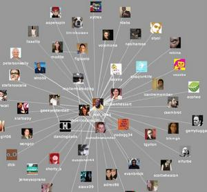
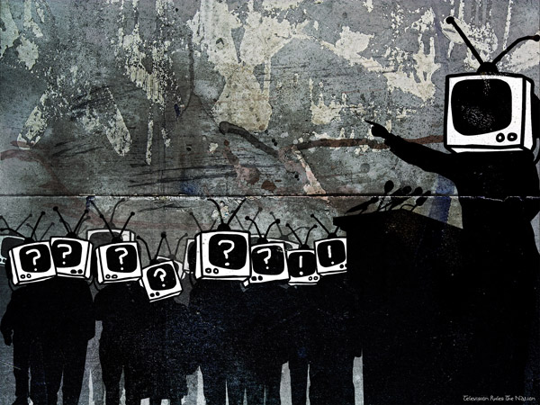

# ＜摇光＞写在"微博人生"边上

**在全民娱乐，全民微博的今天，如果你用一句话，一个词儿，而这句话稍加有些露骨和犀利的特征，或许还能代表一种鲜明的态度，就足以挑起人们敏感的神经，就会受到追捧。如果，像我一样，把完整的文章咀嚼碎了，吐出来，喂食于他们，他们就全没了抗拒的能力，会不加犹豫地接受。**

### 

### 

# 写在"微博人生"边上

### 

## 文/ Lee小姐

### 

### 

那天Hooker找我去搜狐开微博，开通了两周，收获20015名粉丝。这让我联想到一些有趣的东西。 比如，“群众是不能做决策的，这是永远的真理”这句话； 比如，7.23动车追尾事故后微博浪潮和那样些弱小的民主声音； 比如，希特勒的言论“不需要青年人有判断力和批判力。只要给他们汽车，摩托车，美丽的明星，刺激的音乐，流行的服饰，以及对同伴的竞争意识就行了。” 我发微博的方式很简单，把平时写的博客或稿件拆分成一小段，几句话甚至一个句子，一个词组来发布，效果却是惊人的，我每天发数条，然后每天收获粉丝近两千人。而且还发现，我把文章切得越碎，句子越短效果越好。想起主编落落常说的，记得把文章嚼碎了喂读者吃。那就是，我们的读者，我指的是诸位，是一群思维懒惰的人，一群思维幼稚的人，一群饥不择食的人。 

 现在，我们重新来看传播学之父施拉姆的“子弹论”： “传播被视为魔弹，它可以毫无阻拦地传递观念、情感、知识和欲望。” 我们眼前呈现的是一大群呈原子结构的、沙粒般的、分散的、无防护的个人，这些个人在大众传媒有计划、有组织的传播活动面前是被动的、缺乏抵抗力的。虽然“子弹论”后来受到很多批判的声音，但到今天，在网络不断向前发展的今天，我又不断地想起施拉姆早先的研究，在互联网给予个人更多自主和互动的今天，为何“子弹论”却越发地真实起来了？ 一个声音，一个符号就能够像细菌一样疯狂地蔓延，如果这个声音的传播者是一个强有力的组织，以强大的力量去形成舆论和信念，就可以改变人们的生活习惯并指导人们的行为。 那么大众接受的就是控制者的意志。 我的微博仅关注了六位对象，除了张朝阳和一位旅居欧洲的fashionlover，其余都是新闻媒体单位。而我的粉丝里面超乎我想象的不仅仅是女士，更有一大批男士，年龄阶段也是中、青、少都有。我发布的内容只是时装时尚女性方面的，是合女人口味的东西，但理智的男人们也对我这个二十出头小姑娘的言论关注起来，而我的目的性很明确，集中吸收女人和时尚分子，这样的目的性不该不被理性的男人们注意的？而我任何一种观点和态度马上就受到追捧，不明白的是，一位你并不了解的人如何能改变你的观念和态度呢？ 或许又因为不了解、不相识，他们就把你当作意见领袖，我今天说，我喜欢白色蕾丝，他们或许就认为这就是当下的潮流，明天吼一句“每个女人都该有条铅笔裙”，然后我再集中发布这样的信息，那接受到信息的人就当真会想是该有条铅笔裙才是。在三言两语里我就成功地传递了假流行的信息，并轻易改变了她们的态度，那下次购物时，她们的脑海里会不由得转出白色蕾丝和铅笔裙的信息。你以为没有记住，其实你的态度已经被改变了。 而，这些，只是我的个人喜好，潮不潮流不一定，因为我选东西从来不关心流不流行这个问题。 我不去过多地关注其他人，因为，我会有自己的思考，谁谁的想法、态度、观点又干我何事？当然对于真正有思考力和学识的人，我怀着内在的谦卑悉心听教，而你会越来越明白，给予你评价的绝大多数者只是粗浅鄙薄的，那就更不值得多在意了。叔本华关于幸福感，提出幸福只是个人的事，首先是身体的健康，其次是独立自主的丰衣足食，而无关于外界的评价，如果你把幸福寄于他人的评价，那你就幸福不起来，还可能让自己陷于可悲的处境。 为何斯拉姆的“子弹论”在今天，在当今的中国凸显出来？可以看看，我们这一代人是如何在被喂养的信息下长大成人的。 我不知你们每天花多少时间在广播电视上，花多少时间在网络上，又花多少时间在报刊杂志上，然后还花多少时间在书籍上。 前天我去奇艺应聘娱乐编辑，主管一来就问我平时看英美剧么？我一愣，说不看，好几年都不看电视了，从来不看综艺娱乐节目。只见她接连一个地摇头，最后评价是我反应慢，时尚敏感度不够。那我以后就因该要去改变自己的方式和态度，去爱上看电视看综艺娱乐？我想不会，如果是工作需要，上班时我会尽可能地去掌握最新的综艺娱乐资讯，但我永远不会爱上电视节目，回家、平时，也根本不看。我会始终与此保持距离，以很冷静的态度采编信息，即使我做时尚编辑时，也是与时尚很好地保持着距离。洪晃说她的编辑们都入不敷出的，因为职业习惯往往让她们陷入购买欲望里头，但我并不喜欢太接近某样东西。 距离是好东西。 麦克卢汉提出，“媒介即信息”。我们接触到的媒介直接影响了我们的思维方式。现代人的懒惰思维很大程度上是媒介培养的。 首先，接收广播电视信息不需要你有多高的知识水平，甚至，用不着你会读书写字，你就可以无障碍的接触了。所以，我们的央视在很长一段时间里，永远是老大哥，因为中国有一大批知识水平不高的民众，这也是一个极易被左右的庞大群体。当我们接收广播电视信息时，速度是极快的，我们很少有停下来思考的空隙，久而久之，在不经意间人们的思维被广播电视牵着走，也放弃主动思维的能力了。当然，为了满足一大批观众的审美趣味儿，栏目内容越俗越好，所以，各式样的海选、相亲、娱乐节目大受追捧。 也许，我们的先辈好容易才冲破集权主义的知识囚笼，但胜利果实轻易就被商业电视广告窃取了，欢迎来到娱乐世界，都管他的，全民娱乐吧！ 

 以前的年轻人或许还会捧着尼采叔本华装深沉，以前还会被嘲笑幼稚浅薄，而现在，反倒理直气壮地嘲笑深刻，拒绝思想。为何年轻人更加不宽容了？ 而，报刊杂志的受众首先需要识字，其次，可以有大篇幅的详尽报道、深度报道。而且读者在阅读时可以停下来思考，而不像广播电视那样，永远是被动地接受信息，如果划分层次的化，显然阅读报刊的人群知识水平高于广播电视的受众。但报刊杂志最主要地市提供资讯和一种主流的态度和观点。养成了现代人对于咨询吞吐量的焦虑，其实，很多充斥我们脑子里的信息是无用的，反而有可能让我们迟钝起来。殊不知，只有特立独行多一些，我们时代的勇气、天分以及才气才能够多些。 书籍，是真正美好的东西，当然我指的是经历住时间考验的好书。书是一位思考者的沉淀，里面是人生的睿智、豁达和真知灼见，而你在阅读一本书时，需要你调动更多的注意力和知识储备，并且你需要不停地思考以跟进写作者的思想，以此能与之对话，阅读速度也不自觉地缓慢下来，这样，你的思维就不能够闲懒下来，你的思维就需要活动活动了。昨天，一位朋友跟我说，旅行和读书是没有区别的，都是获取知识的方式。但读书毕竟读的是别人的思考，而非自己的，所以，书读多了，若没有自己的思维，反倒无益。但旅行的方式考验着你的眼光，你要懂得发现，懂得欣赏，懂得获取，这就是区别。 久而久之，读书的人跟看电视的人的思维方式和频率就有所不同了。获取信息和知识的方式的确会影响到你的思维和趣味。一位真正热爱瓦格纳的音乐、热爱雷诺阿的画作、热爱高迪建筑的人，真的会很难对电视剧着迷，这里没有任何做作的成分。接受到的信息以及获取方式已经影响了你的取舍和审美，时而复返，你更加主动地接近感兴趣的内容。反之，亦然。 在全民娱乐，全民微博的今天，如果你用一句话，一个词儿，而这句话稍加有些露骨和犀利的特征，或许还能代表一种鲜明的态度，就足以挑起人们敏感的神经，就会受到追捧。如果，像我一样，把完整的文章咀嚼碎了，吐出来，喂食于他们，他们就全没了抗拒的能力，会不加犹豫地接受。 

 Coco小姐早先说过这样句话“看电视让人变蠢”。她可是先知先觉的人。 后记： 以上观点，可能由于本人自身知识的局限、认识的不完整性，而不够客观。何况年轻人的诸多毛病我通通有之。这只是只言片语，在杂志停刊后无聊之际，上网打发时间时的一点后知后觉，一点看法，一点发现，但不妨当作多一种声音，也是可以的。 

### 

### 

（采编：陈锴 责编：陈锴）

### 

### 
