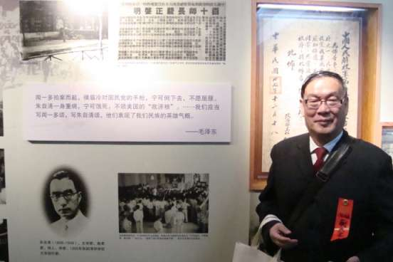
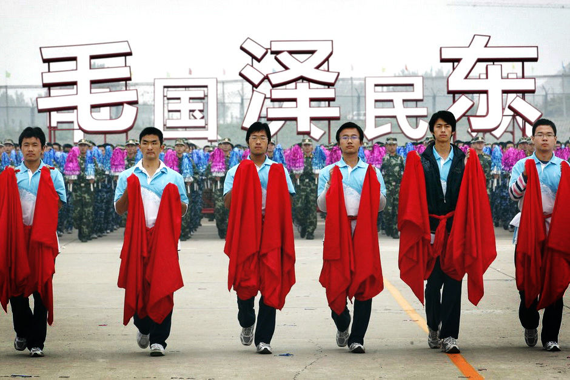

# ＜摇光＞写在清华将要一流之际

**与此同时，我开始读很多英文的新闻旧事。我就像那个偷偷将蓝胡子的密室打开一条缝往里偷看的人，看过铁幕背后的真相之后，我的生活愈发像一出荒诞戏了。2006年，水木被关，据说是要“整顿网络言论”。我终于彻底失望，沦为一枚愤青，拒绝继续在这场荒诞戏中演出。我的清华梦也彻底的醒过来：这个清华，跟陈寅恪梁启超赵元任王国维没有什么关系；若梅贻琦还健在，他对辅导员制度会有什么说法？对XXX思想XXX理论被列为必修课会有什么说法？对反日事件时学校高层风声鹤唳不断要求学生不许上街，又会有什么说法？**  

# 写在清华将要一流之际

## 文 / 陶媛媛（清华大学）

  毕业以后找工作不顺利，每次跟唐老师讲电话，必然被训“你当初留在国内多好啊，你们清华毕业的在国内不知道有多吃香，你去了那边鬼才认识你”云云。唐老师的话我是不敢大声驳斥的，只能在心里暗想，你怎么知道我就想吃香？ 当初进清华，除了对历史上西南联大、国学大师、原子能大师的仰慕，我倒真是抱着“以后要吃香”的低级趣味去的。报到的那天，我站在主干道的北端，眼前是白墙红顶的紫荆公寓，背后是遮天蔽日的加杨。烈日当空，一碧万里，我吹着北京八月的风，只觉得自己牛逼的不行，愣是从千军万马里杀出重围来到了这里。我倒不是不知道这地方集结了各种牛人，也许我在这只是个凤尾而已；只是想着清华二字在这园子之外的人眼里是如何闪闪发光，底气便又充足起来。 

 不过这样的YY状态没有持续多久。很快便开学了，还没等我开始适应这个完全陌生的地方，各种基础课便铺天盖地地砸过来。从周一到周五不停地流窜于各教之间，一门课的作业还没开始写下一门的作业又布置下来了。周六周日基本上也都在自习教室度过，就连洗衣服洗澡吃饭这些事也要争分夺秒，只怕拖了某门课的作业。即便是这样，期中考下来线性代数和微积分还是只能险险及格。像别的很多在自己的地盘当惯了牛人的清华新人一样，我的自尊心被严重打击了：原来牛的是清华，不是我。那个时侯才开始意识到，其实“清华”这个金光闪闪的名字，跟我并没有什么关系。我之前看见听说的那些被打上清华标记的牛人牛事，背后其实有一堆自考上清华以后就再也没有发过光的人。 我深深地恐惧于“再也不能发光”，于是更加地努力。经常是自习到半夜，早上六点半又从床上跳起来；然而成绩却没什么起色。倒是上了大二大三，渐渐适应了清华的节奏之后，即使翘课拖作业，还是能拿到不错的分数。于此同时，一些与分数无关的东西开始进入我的视野。一次在马哲课上，老师播了一段多年前用于教学的视频，内容是在美帝的统治下民不聊生，到处是荒废的土地、成堆的垃圾。老师说，当初拍那个摄制组跑了很多地方才找到一个垃圾成山的荒郊野外，于是如获至宝，拍下了这一段。一个一直在我心里却没有仔细想过的问题忽然浮出来：他们以前可以这样做，现在又何尝不可呢？那时MAZE还很火，我下到那段著名的“too simple, sometimes naive”，深受震撼。而生活之中，所谓的“支部生活”两周一次，各个D员、积极分子轮番发言，阐述“深入学习”、“先进性”之类的东西，整个气氛与真实的世界格格不入。我第一次深切地感受到iron curtain（注：铁幕）这东西的存在，于是眼前的一切变得很荒诞很不真切。蒋方舟的《给清华大学的一封信》非常真切地描述了我的感受：“他们真的相信这些，真可怕。过了一会儿，又打了个寒战：他们其实并不相信这些，那就更可怕了。” 与此同时，我开始读很多英文的新闻旧事。我就像那个偷偷将蓝胡子的密室打开一条缝往里偷看的人，看过铁幕背后的真相之后，我的生活愈发像一出荒诞戏了。2006年，水木被关，据说是要“整顿网络言论”。我终于彻底失望，沦为一枚愤青，拒绝继续在这场荒诞戏中演出。我的清华梦也彻底的醒过来：这个清华，跟陈寅恪梁启超赵元任王国维没有什么关系；若梅贻琦还健在，他对辅导员制度会有什么说法？对XXX思想XXX理论被列为必修课会有什么说法？对反日事件时学校高层风声鹤唳不断要求学生不许上街，又会有什么说法？ 

 很长一段时间，我对周围的一切都抱着厌恶的态度。好在课程足够繁重，让我没有多少时间去发牢骚。有闲的时候，我喜欢在校园里四处走。在水木清华北面的小道旁我发现一块横卧的黑色石碑，上面刻着在抗日战争中阵亡的清华人的名字。我一向对纪念碑很反感，觉得那些笨拙巨大的石块已经沦为D的宣传工具，一面对人们宣称“看，你们有今天都是我们的功劳”，一面又暗示若D要你为他们赴死，你应当视为理所当然，且要觉得光荣。可是那块藏在灌木丛边上的石碑却让我感到突如其来的震撼。这些人都曾经在这个安静的园子里生活过，却都选择了战场。我一直觉得虚假恶心的“以身许国”的口号，这时才变得真实起来：原来他们的那个国，并不是我们的这个国。如此想来，清华的前世今生，就都能说得通了。可是这样想来，也很悲凉：他们为之赴死的那个国，竟变成了我们这个国。 08年夏天，我像我的许多前辈一样离开清华，来到了美国。回头看让我曾经仰慕、挣扎、失望的清华，还是看见了一些我以为清华已经失去了的东西。清华人并不都像当年的我一样，只想着“以后要吃香”，只想着要成为牛人。有人屡删屡贴，像打不死的小强一样一直发出批评时弊的声音；也有人为山区小学奔走筹募，给每个小学生发一本新华字典。相比之下，远远地躲到地球这边的我只能自感惭愧。 再过几天清华就要满一百岁了，据说到时候我们就是世界一流了。看到校内上有人发日志，因握了胡的手无比激动无比傲娇，我只能说我们离世界一流恐怕还有一点距离。只要D妈妈还是像今天一样无处不在，只要必修课里面还有马哲思修邓论，只要还有辅导员这种让全世界大学都匪夷所思的存在，清华就只能仰望真正的一流大学。毕竟，“大学”这个概念自诞生起，就是与“自由”共存的。  

（采自投稿邮箱 责编：管思聪）

 
