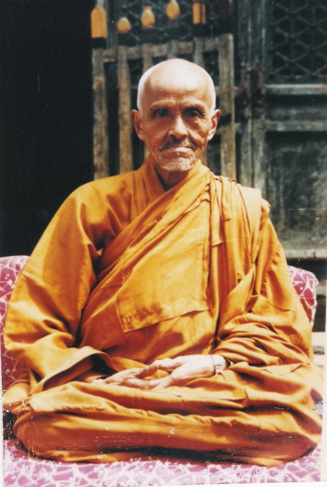

# ＜摇光＞凤凰岭有小和尚

**凤凰岭高，故攀爬阶梯甚陡峭。后世有修建天梯者，仅容一人通过，攀附铁链而上，直入云端。山峰巅峰处南望帝都风貌，昏云压城，黄沙弥漫，天光浓浓，黄蓝交汇之际惊心动魄，所谓摩天大楼之地标，也混为白色砖瓦群落而已。北望燕山诸峰，阳台、妙峰近如咫尺，无奈山山对望，正如小尼姑望小和尚，唱歌唱得好听还可以，真要走进牵上手，十里山路是小意思，走到跟前也是脉脉不得语。**

 

# 凤凰岭有小和尚

## 文/王钟的（中国人民大学）

 

北大有个“数学天才”柳智宇，看破红尘想当和尚。出家的寺庙叫做龙泉寺。龙泉寺在京西凤凰岭山脚。凤凰岭巍峨入云，是个城郊登高的好去处。

头次来到凤凰岭正值六根不净，稀里糊涂地在龙泉寺住了一宿。佛门的森严是体会到了，不过我终究也没能追随柳智宇，来到这所据说僧人平均学历足以傲视天下的寺院剃度出家。一来可能是因为我本科肄业的学历可能要拖师傅们的后腿，二来六根不净之人，只有打扰了佛门纪律了。

说到六根不净的罪孽，不得不提凤凰岭山深处，有一废寺叫上方寺。始建于辽代，于清代废弃，如今爬了几个时辰接近山顶，还要在林深鸟鸣处细细发掘，才能找到寺庙的遗址。山风吹冷，秋虫哀鸣，木叶萧萧，残碑断木，横亘于野，自然是游人罕至之处了。上方寺遗址环堵萧然，只有石头砌成的墙基，依稀可辨昔年辉煌。石头墙基占地甚广，大概在一般寺庙金刚殿的前面，两株松柏早已环抱。可想当年香客之鼎盛，游人之向往，高僧大德之云集了。

上方寺固然有遗址佐证岁月沧桑，殊不知古来还有一座下方寺。下方寺并不是男和尚修行的寺庙，而是一所尼姑庵而已。有尼姑庵，就有不谙世事的小尼姑，或许也是稀里糊涂地出了家，或许也因为前世孽缘，总而言之小尼姑帮小和尚洗衣服，洗着洗着就洗出了爱情，巴掌一拍，私定终身。这只是传说的喜剧部分，正如罗密欧最终不得朱丽叶，故事的悲剧部分就不足道了。要听潸然泪下悲剧者，自己查询也罢。

凤凰岭高，故攀爬阶梯甚陡峭。后世有修建天梯者，仅容一人通过，攀附铁链而上，直入云端。山峰巅峰处南望帝都风貌，昏云压城，黄沙弥漫，天光浓浓，黄蓝交汇之际惊心动魄，所谓摩天大楼之地标，也混为白色砖瓦群落而已。北望燕山诸峰，阳台、妙峰近如咫尺，无奈山山对望，正如小尼姑望小和尚，唱歌唱得好听还可以，真要走进牵上手，十里山路是小意思，走到跟前也是脉脉不得语。

我生性不喜平坦之道，故爱登高。登高未必望远，登高未必咏志，登高未必饮酒，登高也写不好名诗流传后世。我登高只为不喜平地淡淡，即便是今人修建之安全石阶，也觉得苦涩无味。从野路上半山，唯有一人，巨岩突兀，废土松软，荆棘丛生。每攀一巨岩，希冀上面平坦些了，无奈一岩又一岩，高者半人多高，真是要连踹带踢撑扶而上。既爬野路，不可抱怨刺草划手，见血数寸；不可抱怨灰土沾身，足履浸尘；不可抱怨饮水之不及，撒尿也只有就地解决，天底无私了。攀凤凰岭半山，两侧悬崖山沟，后退则高低岩壁，不如前行，屡屡入绝地之境。幸而手机信号大多充足，天色尚好，伺果真入叫天天不应，叫地地不灵之时，尚可报警求援。好在如此上攀近百米，穿越草丛，沿悬崖峭壁慢行数十米，找到了游客登山之道。如此即便是登山石阶，也感觉如履平地，因为之前徒手攀登山岩之费力，相比之下平整台阶就轻松多了。

登山乃知人生境界之狭隘，登山入险境，更知人生苦难之蘧然可笑。造化弄人，也教化人也。先前谈到凤凰岭上小和尚与小尼姑的故事，人道人间有味是清欢，清欢也不是平坦直路一般。不如想想山间有两寺，一座是男寺，一座是女庵，两寺鸡鸣狗应，儿女私情生，奈何你是个长老也只觉得荒诞有趣了。

 

（采编：黄理罡；责编：黄理罡）

 
