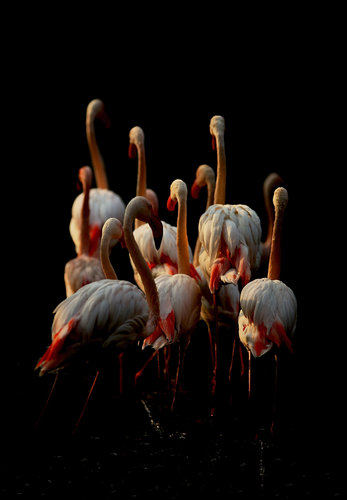
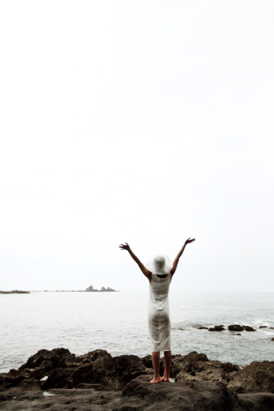

# ＜摇光＞别再被骗了，听从你内心的声音

**人的本质是向往自由的，可我们从来没有思考过到底什么是自由。自由不是可以做这个做那个，而是一种感觉，是我们体会智慧，力量，洞察力和平静时的感觉。当我们双脚镇定的站在地上观察周围人时候，我们能不带丝毫畏惧，我们会感觉到自由；当我们发现我们的工作不再满足精神层次目标的时候，我们能够辞掉工作而不带有任何担心，我们会感觉到自由；自由让我们辨别出我们的根来自于内心成长出来的信念的，而不是别墅外的白色篱笆深入院子的深度。**  

# 别再被骗了，听从你内心的声音

## 文/杨硕（北京邮电大学）

 

又是一年结束，在回国的飞机上，希望用不多的时间写下一些想法。这一年，我毕业了，工作了，游历了，学习了。感慨生活变化之快，1年之前，我没有想到会如愿的在纽约华尔街找到很好的工作并和女朋友团聚。3年之前，我没有想到我会如愿申请到想要去的学校，5年之前，我甚至不知道我的专业工业设计东西究竟是干什么的。这就是生活，充满了不确定性。

这一年很多人问我：“现在你和你女朋友都在华尔街工作，生活也稳定了，是不是打算定居了？” 这却把我问到了。好像照着这条路走下去，生活就会幸福了，说实话，我并不这么觉得。我很爱我女朋友，可我不喜欢定居。很多人不理解，可能觉得在美国有份稳定而且收入不错的工作，有份美好的爱情，那么你就会幸福了。爱情当然可以让人感觉到幸福，可以稳定的工作并不一定会让人幸福。如果一直这样工作，那么可以清清楚楚的看到3年之后，5年之后，甚至10年20年之后的自己。从初级到高级再到管理，职业道路似乎很清晰。可这让我觉得可怕，生活永远不是按照设定好的路线走的，我不愿意用另一个20年去实现别人承诺的美国梦，忙着还各种贷款，养一个家庭，然后做任何别人看起来是“成功者”的做的事，我只相信只要追寻自己的内心，每一步都会有精彩。

我们从小就被灌输一种思想，说你要好好学习，考上好的中学，好的大学，这样你就会过上幸福的生活。到了大学后，我们觉得找一个好工作，或者考一个好的研究生，或者申请一个美国名校，就能过上幸福生活。工作之后，我们以为结了婚，就会过上幸福生活。结婚后以为买了房子买了车子就会幸福。买房子之后，生两三个孩子就会幸福。生两三个孩子之后，让我们的孩子好好学习，我们就能幸福 其实你错了，谁知道到头来我们一直在不断的追求所谓的幸福生活，只是一个无限叠加的列表。我们给自己定了一长串列表，上面有我们认为可以给我们幸福的事情，似乎一项一项满足了，就能获得幸福。实际上，这个列表不停的增加， 每当你满足一个需求，你就陷入了另一个需求的陷阱。 当我们有了钱之后，会想要更多的钱。当我们有更多钱了之后，又会想要成名。

Outside In 拔去心中的野草，专注内心

幸福来自于自由追求内心的声音，而不是外界给我们定义的所谓成功和快乐。想想我刚才说的那些事情，几乎没有一个是自己内心希望做的东西，每一个都是外界从我们出生就给我们灌输的思想，以至于当我们被问到什么是幸福快乐的时候，我们会马上脱口而出车、房、财产。我并不否认这些财富对幸福感的重要性，但是金钱并不直接带给我们幸福，金钱可以让我们有更多的时间去追求幸福。金钱只是通往幸福的一步而已。

如果你的目的是幸福，那么首先就要搞清楚什么是幸福？因为我们都被洗脑的太严重了，你被灌输的思想认为去了哈佛，拿绿卡，去发达国家移民，买大房子，结婚，达成这些了，那就幸福。你错了。

然后我们会说，有更多的钱，更成功的事业，更加成名能给我们幸福，你还是错了。

要知道幸福，首先要从外到内的回归自我。每天我们接触到上万的广告和媒体中，每一个都是我们灌输思想的工具，相当于洗脑。这些给我们洗脑的除了媒体，还有我们的父母，前辈，政府，老师和朋友。我们把我们的幸福全都压在了这些人给我们的空口承诺中，从小我们就被告知，当个乖的学生，就是好的，然后初中被告知入团是光荣的，大学被告知入D是先进的。可是我们从来不知道也没想过这些东西都是干什么的，只是按照别人给我们规划的路子走。

可是世界变了，新的浪潮过来了，冲走了上一个世纪，所有人都站在新的起点，赤裸的看着周围的人。所以我们必须重新思考，重新锻炼我们的身体上的每一块肌肉，身体上，情感上，智力上，以及精神上。你必须找到新的的工具去点燃创造力，抵抗你的畏惧。不要盲目跟随别人的脚步，因为你所的接触到的别人，永远是有限的。应该做的是找到属于自己的道路，只有你足够了解自己才能了解一切。而当你试图了解世界的时候，你不会了解任何事，就像日本禅者铃木俊隆在其书《禅者的初心》中说

“我们每一个人都必须开拓出属于自己的真正的道路，一旦做到了这一点，我们开拓出来的道路，就会使一条遍通一切的道路。

这话听起来似乎很玄，但是的确当你把一件事情弄明白之后，你就会了解一切，但如果你一开始就试图了解一切，这样反而什么都不会了解。所以最好的方法就是线了解你自己，了解自己之后，你就会了解一切。

所以，当你努力开拓自己的道路时，就能够帮助他人，也会得到他人的帮助。开拓出自己的道路之前，你帮不上任何人的忙，也没有任何人可以帮得上你的忙。

想要获得这种真正的独立，我们必须忘掉一切既有的想法，一刻接着一刻的去发现那些新颖而且不同的东西。这是我们活在世间应有的方式，所以我们说，真正的了解来自空性（Emptiness）

那怎么做才能回归自我呢?

第一，提醒自己，我们的每一天都在被洗脑。就像我们小时候相信圣诞老人一样。现在长大了，我们被教育的相信了更加危险的东西。提醒自己，你需要质疑任何事情是第一命令，包括我在这里所说的。

你有没有这种感觉，当看你以前的老照片的时候，会觉得很尴尬？这真的是我吗？我以前真的会穿成那样吗？是的，我们不知道当时的自己为什么会看起来那么蠢。这就是时尚的本质，时尚是不可见，就像地球的转动对我们来说也是不可见的。让我担心的不是穿着有时尚，精神也有时尚，他更加可怕。违背了穿着的时尚，你可能会被人笑话，但是违背了精神时尚，你可能会被开除，被排斥，被囚禁甚至被陷害。伽利略在欧洲十七世纪说地球是转的，就给他带来了大的麻烦。

这种现象在历史过程中是很常见的：在每个历史阶段，人们所相信的很多东西看起来简直是荒谬的，而人们对其深信不疑到你说一句相反的观点就会让你遭殃的地步。我们的时代是个特例吗？我们的时代难道是第一个把所有事情都作的对的吗？当然不是。有趣的是，我们现在所相信的东西，在未来人看来同样会是荒谬的可笑的。就跟我们现在看当时的我们一样，也像我们看现在的朝鲜，想会到当时的中国一样。

那么为什么每个时代人们的一些信仰都变得很荒谬呢？如果你所相信任何东西都恰恰是你应该相信的，这难道是一个巧合吗？不是的，可能是你只下意识的信别人告诉你的。你被洗脑了。

第二，谁洗脑了你？父母，朋友，老师，政府，媒体，广告，和教育系统，金融系统。这并不是他们的错，他们也被洗脑了，每个人只是试图过自己所知道的最好的生活罢了。他们的时代决定了他们的意识，可是一切都在变，而且变化的越来越快，最近10年的巨大变化将要改变整个世界。我需要以新的方式思考，新的方式呼吸。

第三，该怎么办？把以前我们所深信不疑的东西拿出来，一个个重新反过来思考。试着去想你为什么相信？是谁告诉你这是对的？如果别人告诉你相反的方式是对的，那你会不会被犹豫？我们的目的不是让你去相信与以前相反的东西，而是在那些从我们出生就开始灌输给我们的想法当中找到原本的自我。

让我们剥开束缚我们的标签。我们给自己加上标签因为我们想要成为某些事情或人中的一员，认为这些事情或者人比自己要好。由于不能实现自己的个体力量，只能靠加入这些群体来实现力量。人们想要成为“有房者”，“有车者”，“名校毕业”，“年薪百万”。但当检验这些标签的时候，你可以暂时抛开他们。也许这些都是好的标签，但是换一个角度看它们也没什么错。最近的10年，房产泡沫，金融危机，让我们了解了大企业中神话般的稳定的工作也只是一个神话，我的一个同事，之前在GE干了30年的，结果被不带任何补贴的裁员。来我们公司不久又被裁员。留下的除了积攒的一些积蓄外什么都没有。所谓的美国梦其实就是让你陷入沉重的债务中，教育贷款，住房贷款。把人绑定在一个地方，为了确保能按时还贷，你需要担惊受怕，保住工作。我并不是想说除了自己谁都靠不住，而是说必须学会独立，对自己诚实。

需要倒过来看问题，颠覆那些所有人都认为不可能动摇的行业。任何话题，比如说教育，想想在新的时代人可以通过什么方式接受教育？孩子去学校上学是不是就等于接受教育？在工业社会中，学校的官方目的是为了教育孩子，事实上学校的主要目的是把孩子们集中锁在一个地方呆一整天，这样大人们才能去把他们的工作做完。我不介意把孩子关在一起，但是担心的是学的东西跟社会上需要的完全不一样。尝试改变教育的人很多，KhanAcademy是一个很好的尝试。但他是唯一能做这种事情的人吗？当然不是，广告也是一个，出版业也是一个。他们都将要被改变。房地产又是一个，Airbnb只是一个开始，Zillow也只是一个开始。还将有上万种方法改变这个领域。乔布斯再一个遗失掉的采访中说，看看你周围的世界，都是被一些并不比你好多少的人创造的，你认为这是人们最好的生活方式吗，如果不是，你为什么不自己改变它？ 所以你可以放心的大声说“这件事情现在这样做的简直就是一坨狗屎” 然后去想“为什么？”然后想“怎么办？” 你并不需要解锁世界上所有的问题，这只是一个锻炼你创造性思维的方法和一个你追求幸福过程中的发现的那点意义。

第四，幸福是最终的目标。我们也许不一定要知道什么是幸福。但是我们都知道，我们不愿意悲伤或者害怕，我们不愿意担心，我们不愿意做违背自己良心的事。想想，当我们说我们想要更多钱的时候，我们到底在说什么？你也许是想说，我需要钱才能够有更多机会去的旅行。这又是在说什么呢？也许是因为我要走遍世界，这样我就能够积攒阅历去出一本书，这又是什么? 也许是因为那样我就会幸福。所以为什么不一开始就直接说幸福呢？金钱当然可以买到幸福，但是不要让他挡住你的最终目的。

第五，幸福的反面是病痛, 懒惰，犹豫，粗心，停滞不前，被骗，和倒退。而通向幸福的，是尽可能的保持健康，身体上，情感上，智力上和精神上。关于如果做到这几点可以去看James Altucher的书《I Was Blind But Now I See》。

总之，身体上，情感上，智力上和精神上的健康才是最重要的。铃木俊隆说，“Which is more important; to attain enlightenment, or to attain enlightenment before you attain enlightenment; to make a million dollars, or to enjoy your life in your effort, little by little, even though it is impossible to make that million; to be successful, or to find some meaning in your effort to be successful? If you do not know the answer, you will not even be able to practice zazen; if you do know, you will have found the true treasure of life.” 是要挣100万美金，还是在你一点点努力的过程中享受生活？是要成功，还是在追求成功的过程中找到的意义。如果你有答案了，那么你就会找到生活中真正的宝藏。

Be a Human 做一个人

很喜欢电影“死亡诗社”里提到的《瓦尔登湖》里德诗句：

I went to the woods

because I wished to live deliberately,

to front only the essential facts of life,

and see if I could not learn what it had to teach,

and not, when I came to die

discover that I had not lived.

我到林中去，因为我希望谨慎的活，只面对生活的本质，看看我是否能学到生活要教育我的东西，免得到了临死的时候，才发现我根本没有生活过。

推动人类前进的东西其实就是生活的本质，他们是由最简单的东西组成，那就是梦想，激情，求知，爱情，浪漫。

人的本质是向我自由的，刻我们从来没有思考过到底什么是自由。自由不是可以做这个做那个，而是一种感觉，是我们体会智慧，力量，洞察力和平静时的感觉。当我们双脚镇定的站在地上观察周围人时候，我们能不带丝毫畏惧，我们会感觉到自由；当我们发现我们的工作不再满足精神层次目标的时候，我们能够辞掉工作而不带有任何担心，我们会感觉到自由；自由让我们辨别出我们的根来自于内心成长出来的信念的，而不是别墅外的白色篱笆深入院子的深度。

“Two roads diverged in a yellow wood, and I took the less traveled by, and that has made all the difference.”

对于年轻人，这是最坏的时代，我们要面对难以承担的生活压力和社会压力。这也是最好的时代，技术的发展正在一步步变革世界，它将颠覆所有传统的行业，我们会是这场变革的主导者。现在是你开始自己旅程的时候，去观察世界，辨别世界，去找到你真正想要的，寻找属于你的财富，自由和幸福，去过你自己一直想要过的生活。

最后，乔布斯的话被引用了无数遍，但是它是这里最好的结尾 “Your time is limited, so don’t waste it living someone else’s life. Don’t be trapped by dogma––which is living with the results of other people’s thinking. Don’t let the noise of others’ opinions drown out your own inner voice. And most important, have the courage to follow your heart and intuition. They somehow already know what you truly want to become. Everything else is secondary.”

 

(采编：何凌昊； 责编：尹桑)

 
