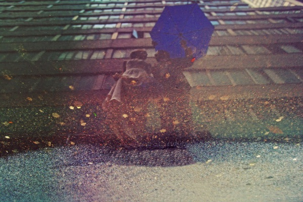
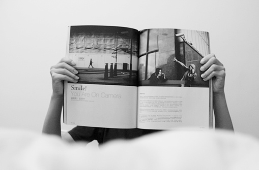
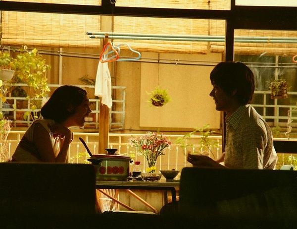

# ＜摇光＞到哪里寻找属于一个政治控的幸福

**很多人崇尚民主，那就从生活中做起，摒弃自己身上的独断专权之风；另一些人崇尚威权，那就从工作中做起，发挥自己的先进性做好榜样。可惜，意识到这些的人已经属于凤毛麟角，以此践行的人就更稀少，值得与之同行？**

# 

# 到哪里寻找属于一个政治控的幸福

## 文/赵觉成（杭州二中应届毕业生）

这一星期以来重温了几部最爱的美剧和影片。我试着让自己开心，但是我“干不了”。Word文档时刻开在旁边以便收藏偶遇的好文章，不断的训练已经使得Ctrl+N、Ctrl+S成为下意识的惯性动作，然而我却始终没有心情继续写书，哪怕是仅仅在文档里改一字一句。我的理性一遍又一遍地提醒自己时间的紧迫，而惰性与其合谋一起将我日夜折磨。现在的快乐从手腕滴下，焦虑与无力仿佛流沙般将我吞没。 天马行空的理想主义可以使人时刻保持亢奋，却也可能盲目，无法察觉到前途的艰难；愤世嫉俗的犬儒主义可以使人轻易融入社会，却也可能迷失，无法回忆起曾经的梦想。所谓凡事讲究“度”的把握，脚踏实地仰望星空的现实理想主义兼合两者的优点，热情细水长流，日拱一卒改变世界，却也并非完美。现实的理想主义者时刻生活在理想与现实的反差中，生活在自我与社会的冲突中，时刻忍受着反差带来的无力和现状鞭策的伤痛摧残。 

 仅仅是几天之前，我还在向别人意气风发地抒发着自己的理想。那个我坚信更美好的未来，想象着以后回首奋斗历程时的成就感和幸福，深深地沉浸在伟大的使命感中。近日来情感的转变并不是因为幻想的破灭，它们在我了解现实的过程中早已湮灭殆尽。更不是因为某些以伤理想青年感情为目标的“专家”的言语，因为空谈的论调对我来说太过软弱无力。事实上，没有什么身边事物的改变，或者说该改变的都早已改变过，我的心情却从一端跳跃到另一端。或是没有什么特定的原因，亦或是感受到人失去归属的孤独。那时苦闷离我是那么遥远，现在却掐着我的脖子让我难以呼吸。我向苦闷望去，在它背后，命运正从墙角探出头来呲牙哂笑着我的无力。每个人都有一个崩溃点，到达便无可挽回，这时对我来说已经触手可及。 拜申请失策所赐，如今的我仍然在为下一轮的申请做准备，于是便仿佛生活在《超市夜未眠》的世界中。时间在孤岛上过得理所当然得漫长，一秒硬是延展开来扩充成一个小时，一天膨胀成一年，并且继续扩张出去。日光灯照射掩盖了日夜更迭，熬夜使我失去了对时间把握，反倒让我感觉自己生活在交替的永恒当中。这种永恒感冲淡了时间、模糊了房间的边界角落，使得我的生活空间显得无限的广阔。自然，在我空旷的生活中也没有了其他阻碍。在这儿没有什么可以阻挡，我对自由的向往，对表达自由的向往，对灵魂自由的向往。唯一可以阻挡的是卢梭的那副自由的枷锁。对着网络屏幕即便是呐喊也未必有人听得见，好比在荒漠中向着空气挥拳，当你的衣服开始变得冰凉，汗水在背心上留下白色的盐渍，这时才发现身边的事物都还依照着原先的轨道进行着。即便知道自己扇动的翅膀在若干年后可以引起一阵风暴，现在的我仍然看起来那样地无力、无礼、甚至无理取闹。 亚里士多德曾说过：“人是政治的动物。”这句话原意强调人的社会性，然而放在政治控身上无论如何解释都完美切合。没有了生活琐事和人际压力的限制，我的每一分、每一秒都被用于忧国忧民；生活中的每一点、每一滴都用来针砭时政。生活中有许多清新，但是我不再关心，我只关心革命还是改良，煽动还是启蒙。 政治成为了我这段生命中的全部，使我将每一件发生在这片土地上的事件与我的生命紧紧相连。每一声哀嚎都撕扯着我的良知，每一声叹息都呼唤着我的同情，每一声沉默都刺痛着我的心灵。当生活中还有他人时，这种与祖国相连的痛苦似乎让人感觉可以掌控。但随着生活变得纯粹，这种痛苦便随之不断放大，直至吞噬了生活的所有。那个乐观向上的我黯然转身，隐身于幕后，代替的是那个忧伤却无济于事的我。 当然，情感的转变与最近的经历并非毫无关联。在这生命中那个我第一次全心全意爱的那个人早已离我而去、无可挽回。最近刚毕业，和我同住的铁哥们儿也得搬走，我也不得不早日撤出充满回忆的地方。曲终、人散。前些天搬回了家中，被家和城市的距离逐渐隔绝开来，我与社会的一丝一缕联系逐渐脱离。终于，与好友的分隔已经让沙漏中最后的一粒沙尘埃落定，唯有网络仍倔强地将我和整个世界联系在一起，成为与氧气一般无法脱离的必需。对于远离一切的我来说，没有考试、没有作业、没有室友、没有妹子，生活简约到了极致，也充满了孤独的自由。 

 政治控的孤独是悲哀的，因为在这个操蛋的世界里作为对现有体制表示不满的“一小撮”会被现实功利的主流社会视作愤青和另类，逐渐被异化成一个孤立无援的群体，在喃喃自语中一个个经受不住孤独而被迫向现实妥协，或是在桃花源中生活许久后走出来发现已经无法适应社会。这种令人窒息的凶手并不是这个政权，至少不是直接凶手，而是普通冷漠、无辜却又时刻担惊受怕的大众。政治的孤独是精神的、甚至是空想的，也是不被大众所理解的。“我为什么要关心政治？”“政治与我何关？”“我做好自己不就行了，还管别人干啥？”终有一天当他们考上公务员、成为公司老总、或是遇到强拆，他们才明白在中国政治好比空气和水，生活在这个环境中，风和波浪发生的可能性无处不在而又无处寻觅，然后才意识到当风波无法预知防备，必须从根本上改变环境才可能杜绝。他们还在考试、还在打拼、还在维持生计，为何要理解我们？为何能理解我们？ 然而若是将责任推给大众，虽是一个令人自我感觉良好的解释，却无益于对现实的理解与理想的实现。实际上，很多时候正是我们自己将自己孤立起来，或者是在言行不一中失去他人的信任。我看到一些人在激愤中忘记了自己言论的尺度，我也看到一些人到处自称精英、拼命与普通人割席划界，我还看到一些人无视社会最迫切的需要而去设计空中楼阁的图纸。如果我们的言辞让人厌恶，他们凭什么要对我们尊重？如果我们极力坚持自我的优越，他们凭什么心甘情愿地低人一等？如果我们忽视人们的现实需求，他们凭什么为我们承担风险付出牺牲？如果我们所做的一切都仅仅是空谈，他们凭什么相信我们能建立起一个更好的中国？很多人崇尚民主，那就从生活中做起，摒弃自己身上的独断专权之风；另一些人崇尚威权，那就从工作中做起，发挥自己的先进性做好榜样。可惜，意识到这些的人已经属于凤毛麟角，以此践行的人就更稀少，值得与之同行？ 无论是什么原因，作为一个政治控，我感到孤独。 孤独的政治控则愈加悲哀，因为虽然没有社会的指手画脚却保持孤身一人。缺乏心灵上的支持而去为一个几近遥不可及又模糊不清的信仰奋斗。无论目标是独善其身还是兼济天下，无论梦中的理想国是怎样的形状，无论通向彼岸的方法具体如何，这条道路必然是充满牺牲和痛苦的。理想越是伟大，现实就越发显得惨不忍睹。如同许多传媒界、法律界的先辈所选择的一般，如此的生活就近乎于一生的苦行，选择了这条路便可能选择了一生的艰辛和奋斗。在这个人人为己的年代，知道其他的道路通往的可能是财富、权力与享受，究竟会有谁愿意这样度过自己的余生？这样的人们注定了是极少数，同伴难觅，一生的知己更屈指可数。在这条道路上，我们注定孤独前行。 在社会稀缺的理想主义者群体之中，左右的意识形态之争又将我们划分成两群人。于是，我们的团队不仅渺小，而且还陷入无休止的斗争之中不可自拔。现实是圈内文革遗风尚存，理性的声音就这样被喊杀声、隆隆的炮声淹没，使圈内的大多数人在战争迷雾中不断验证自己的正确、忽视自身的错误，不断批评与自己相左的意见（无论是通过低级的谩骂还是高级的“辟谣”），宣扬自身理念的正确。在这种氛围中，党同伐异压倒了寻找共识，理念纷争取代了实践检验。在嘈杂纷扰中寻找理性的同伴，更是难上加难。 即使已经极为幸运结识了几位挚友、两三知己，若是缺少伴侣的陪伴和支持，人仍然很脆弱。知己与挚友可能随着工作等各种因素逐渐疏离，也许偶尔可以联系通话，但是他们并不可能像伴侣一般始终陪同在身边，无论贫穷还是富裕，无论困苦还是幸福。有时候能得到的安慰早在长途传达和网络介质中失去了温暖，让人找不到亲切的感觉。和友人永远只可能是两个距离很近的个体，毕竟没有血缘和婚姻的承诺，兄弟情谊代替不了相依为命。诚然我希望并坚信某一天当我需要帮助的时候会有兄弟的援手，我也希望有一个伴侣能在我身边，在我最脆弱的时候给我以安抚和关照。 时代已然不同，这个社会的理想和底线已然被洗劫一空，却仍然不断被权贵继续践踏，理想和思想已经变得“不合时宜”。对大多数人苟活已经不易，何谈理想？然而社会的主流意见便倾向于让女性远离政治、远离国家大事。在男默女泪的年代，女生谈政治总会听到“小心你以后嫁不出去”的警告。如今中国政治的确是男人的天下，看似女性不参政不从政符合社会现状，然而许多人忽略了一点：我辈之学习实践，应以未来为目标，绝非因一时一地的限制而将自身限于思想枷锁之中？可惜眼光长远的毕竟是少数，经受得住压力的女生就更为少见，造成了政治圈奇缺妹子的奇景。在男女比例严重失调的圈内要找到一个妹子可能说是难于登天，要碰上一个始终支持无悔的杨开慧已经是幻想。究竟我能否坚持到遇见那个人的一天，这点我可能永远不会得到答案？ 

 对于一个纯粹的政治控来说，孤独不仅是一个形容词，更是一个动词。一旦选择了政治，她便清楚自己会更加孤独。更别说可能的牢狱之灾、分离之苦，这便是我孤独了她。在我的祖国，我甚至无法得知明日此时我身处何方，也许一去就是近百天的分离，甚至也许一次短暂的回头就可能成为永别。这种转瞬即逝的爱情留下的会是伤痕还是美好的记忆，在这个不再“革命”的年代。 我的生命太沉重，背负的是先辈的重担，等待的却可能是血腥而非清新，直到也许有一天我决定放弃，但这也失去了我人生的意义。当我全身心地投入到为了未来而做的准备中去时，可能我做不到那个浪漫主义的爱人，却只能横眉冷对千夫指，硬是将心中的情感压抑下去，用厚重的外壳和面具时刻准备着来自外界的干涉。慢慢地，也许那个能够放开束缚、无可救药地陷入爱河的我就会被时间的沙尘掩埋。缠绕在思绪之中，我在状态中寂寞地写下：“致未来的妹子：此身许国，再难许君。” 

（采编：黄理罡 责编：黄理罡）
