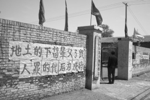

# ＜摇光＞制度不能改变中国——回答一种“制度崇拜”

**分权制衡其实不是制度设计的结果，恰恰相反，分权制衡的制度设计本身才是一个结果。相互制衡的并不是纸面上的不同权力，而是社会中实际存在的不同群体，你可以叫阶级，可以叫阶层，可以叫利益集团，反正都差不多。**

# 制度不能改变中国——回答一种“制度崇拜”

## 文/ 丁栩翔（北京大学）

很偶然的在北斗网上看到这样一篇文章《**[制度才能改变中国](/?p=12668)**》，此文的中心思想这里就不阐述了，有兴趣的诸君可以自己去看。总之，这篇文章体现了当今一种很流行的思想：制度崇拜。也就是说，把当代中国的一切问题都归结为制度问题，把制度放在了一个至高无上的地位。进而，就有一些人四处兜售他们抄来的制度，仿佛中国只需要把美国宪法转换成word文档，ctrl+f把“美”字替换成“中”字，便海晏河清，天下太平。

这种思想不由得使人想到了古希腊斯巴达人的故事。虽然后世史家推崇民主雅典而刻意把斯巴达贬低到莽夫的地位，但实际上，当时的希腊人对斯巴达制度的评价相当之高，因为斯巴达城邦内部和谐稳定，对外战无不胜。斯巴达人自己也搞不明白为什么自己的制度就那么给力，于是虚构出了一个值得迷恋的传说哥——莱库古，认为自己的制度都是因为莱库古灵光一现的创造。

现在，我们一些人要的，就是这样一个莱库古，仿佛只要中国的莱库古生出来，写出一部法典，就可以解决中国的一切问题。当然，还有更多的人，总觉得自己就是这样一个莱库古式的人物，这里也不展开来了。这些人和斯巴达人都犯了一个共同的错误，那就是把制度当做是原因而非结果，倒果为因。

实际上，只要翻开中国的宪法看一看，就可以发现，其民主化、自由化程度并不亚于什么西方民主国家，再查阅一下所谓的“中国特色社会主义法律体系”，也可以发现，关于方方面面的具体立法，同样是不太落后的。既然莱库古已经定出了制度，为什么在执行的过程中会完全走样呢？比如说宪法规定的各项民主权利上哪儿了呢？于是有些人又开出了另一个药方：民主的本质在于分权，在于制衡。对于这个观点，其实不用太多的反驳，只要翻开宪法就能看到，中国在制度设计上其实是有分权制衡的：检察院、法院都是独立于行政机关之外的；行政、司法官员是不能在立法机关的常务委员会任职的。但在执行中，这些制度设计却很容易就被规避了：法官、检察官都是党员，于是在行事上无干涉，在人身上有依附，分权制衡自然无从谈起。

这里就牵扯到一个更本质的问题：分权制衡其实不是制度设计的结果，恰恰相反，分权制衡的制度设计本身才是一个结果。相互制衡的并不是纸面上的不同权力，而是社会中实际存在的不同群体，你可以叫阶级，可以叫阶层，可以叫利益集团（中国有些人挺有趣的，你说“中国有阶级”，他们就横眉竖眼骂你文革余孽；你要说“中国没有利益集团”，他们又会怒目圆睁骂你五毛党），反正都差不多。

比如说作为民主宪政的源头的英国1215大宪章，划定了国王和贵族的权力界限。而这一大宪章本身绝不是某个立法家天才的成果，而是反映了国王与贵族这两个阶级之间的力量对比：英国膨胀的王权触碰到贵族的底线，于是贵族愤然逼宫，以大宪章的形式把双方的边界固化下来。

英国的大宪章让一些人很是痴迷，比如说作为一个方面代表人物的贺卫方几乎言必称大宪章，有些人甚至认为，中国的问题就在于没有一部“大宪章”。于是，有一个后来拿了诺奖的反动分子，煽动了几百个文人学者写了一个宪章，结果抛开用词等不论，内容实质上居然和现行的宪法大同小异：你要的宪章，不是早就有了吗？

其实在欧洲历史上，颁布类似于英国大宪章的文件划定国王与贵族的权力边界并不是英国的专利。比如说神圣罗马帝国皇帝在14世纪颁布过“黄金诏书”，这不是造成，而是承认了神圣罗马帝国的分裂局面，因为皇帝的势力已经不能使境内的封臣完全臣服了。

更为典型的是，沙皇俄国罗曼诺夫王朝的开创者米哈伊尔沙皇被缙绅会议选立时，也颁布过类似的诏书，对沙皇的君权做出了约束。但正如前文所述，制衡只是结果而不是原因，罗曼诺夫家族的米哈伊尔在需要贵族拥立的时候颁布了诏书，等到他的子孙坐稳了江山，虽然有些沙皇上位时仍然会在形式上颁布类似的诏书（例如女沙皇安娜•伊凡诺夫娜继位时颁布的诏书对权力限制极大），但很快这些限制便名存实亡了。更有甚者，叶卡捷琳娜大帝在位时，作为伏尔泰的忠实粉丝，她组织法学专家编撰了《圣谕》，核心观念便是“人人平等”，但在现实面前，叶卡捷琳娜写出了《圣谕》却根本不敢下发，只能在高级官僚中间传阅，进行纯粹政治哲学层面的讨论。可见，社会基础没有准备好，不用说出了莱库古，即便是出了蒋经国又有何用？

当然，制度并非全然无用的。作为一种斗争的结果，制度所能够代表的只不过是制度制订时的力量对比，当各方面的力量发生变化，制度自然就变得对新兴的集团大不利，而对衰落的集团很有利。这就产生了一种以制度为导火索的矛盾：新势力变激进，旧势力变保守。矛盾的演化会带来不同的结果：

一种情况是掌握政权的旧势力基于对形势的正确判断，愿意坐下来接受谈判，并根据新的力量对比，做出一些让步，这样，一方面虽然让出了部分权利，但相对于力量对比，看似不利，实则有利；而另一方面不战而胜，善莫大焉。比如说英国的光荣革命以来，英国国王的势力不断衰落，以至于在力量对比上，英国人民要弄死那个号称女王的老太婆比捏死一只蚂蚁还容易，但国王拒绝抵抗保留了虚位，现在还能混吃等死；而英国各阶级也避免了流血牺牲，保持了社会的稳定，其实也是有利的，甚至于等到人家的国王都被杀光了，他们还能把王室当稀有的吉祥物供起来，其实算下来，比中国养一群大熊猫性价比还是要高的。

另一种情况，旧势力在错误的形势判断下，拒绝谈判或者谈判了却拒绝做出适当的让步，结果新势力看到了自己的力量，愤然反抗，笔杆子签不了的字就用枪杆子来签，话筒说不清楚的事情就让炮筒去说，这就是革命了。这种情况在中国近代史上是反复出现的，清末全国要变法，要立宪，满清贵族错判形势，先杀维新派，也就是体制内的改革派，后搞“皇族内阁”，也就是太子党当权了，结果很明显，武昌一声枪响新的国家便出现了。

以上两种情况分别是旧的自认虚弱和自命强大，当然还有其他一些情况，比如说旧势力错判形势，明明还很强大，却妄自菲薄了；新势力错判形势，明明已经变强，同样妄自菲薄了，这两种情况暂时能够避免冲突，但日后随着意识觉醒，矛盾终不免日益尖锐的，最后的结果还是回到上面两种情况中去。

以上的政治几种情况在民主国家和专制国家里有不同的表现形式（尽管民主本身也是政治斗争的结果）。在民主国家中，各个政治势力的力量对比是比较清晰的，信息的不对称性相对较小，各个群体的政治参与程度也相对较大，也就是说提供了更多的谈判机会，有助于达成妥协。对民主国家最大的威胁也许在于现代传媒的发展使得民主制度下的利益表达失真，也就是说，表现出来的各势力力量对比也许只是对媒体的控制力的力量对比，而不是总的政治力量对比。失真就会造成误判，误判就会带来冲突，一个《太阳报》的读者一定想不到那些墙角里的小孩比温莎堡里的王子更有力量吧。

而在专制国家中，各种政治势力的力量对比是不清晰的，在政治资源的分配上也往往表现为“赢者全得”，制度的设计权操于某一个集团之手，它只能通过不断的政治试探来模拟民主国家中的政治谈判，进而在自身利益可承受的范围之内对制度不断做出修补，以符合力量的对比，这就是执政党一直在喊的“与时俱进”。

但是这一制度设计中最大的问题就在于，正因为“赢者全得”的存在，控制政权的一方所采取的最为有利的策略显然就是保持对其他势力真实力量的了解，同时却要想方设法让其他势力做出误判，使其他势力高估执政一方的实力，以维持政局稳定。而在长期执政的条件下，由于矫枉过正，更有可能发生的结果却是，由于执政方总是通过控制媒体、检阅军队等一系列手段炫耀实力，结果使其他势力不是高估，而是低估了执政方的力量：故作强大可不就是虚弱的表现么？

于是，在狗血的国度总能产生一些小概率的狗血的情况。比如说在一个历史时期，在国际大气候作用下，某国的旧势力先是妄自菲薄了，对新势力做出一些让步和妥协，但新势力同样误判了形势，妄自尊大了，要求更多的权利。最后旧势力忍无可忍了，放狗咬人了，结果却发现看似气势汹汹不可一世的家伙们放狗一咬，喊的最响的跑的比狗还快，很傻很天真的被咬的血肉模糊，剩下的一看苗头不对，果断扔骨头买命。而放狗的一看狗力无边，从此认清了力量对比，原有的让步也就被收回了。

这样的事情过去发生过，现在也正在发生。 

（采编：薄然；责编：陈锴）
