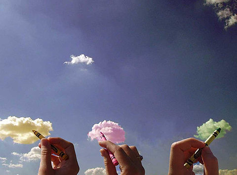

# ＜摇光＞割裂的世界

**少数人说大牌是好的（能买得起大牌的永远是少数），设计感很好，大牌便成了时尚；少数人说要追求品质（有品质的永远是少数），做一个生活家，品质也便成了时尚；少数人说我们要追随自己的心（能追随自己的心的永远是少数），做自己喜欢做的，心也便成了时尚。**

**而在时代的“底层”，是自始至终都在沉默的大多数。**

**所以我一直有一句大逆不道的话：相比于诸如勇气，决心，意志这一类的品质，决定一个人能不能实现甚至追求梦想的因素，最重要的是其客观条件。**

# 割裂的世界

## 文/董泽宇（中国传媒大学）

我们生活在一个看似完整如一快速交融的时代。

“看似”的意思是：这时代也许是割裂隔阂阻滞扭曲的。

1.

我的校内好友可以大概分为几个圈子。

有的圈子，关键词是：paper，gap year，IB，NGO；

有的圈子，关键词是：民主，自由，权利，权力；

有点圈子，关键词是：修图，扫街，麻豆，德味。

……

最大的一个圈子，则是默默注视着其他圈子。

如果说，以往所谓的全球化，只是让我们穿上耐克的球鞋，用上佳能的相机，那无疑，WEB 2.0已经将这一切背后的主导因素——人——暴露在了煌煌目光之下。

这是校内非常让我感兴趣的一个地方，当你的好友慢慢多起来以后，你会发现一个页面就是一个世界，变得非常好玩：一篇批判金家王朝日志的新鲜事的下面，是海外学子新鲜出炉的高盛面经；而其上面，是某个你快记不清长相据说后来没怎么念书的初中同学分享的男默女泪。

而在这些表层现象的后面，是一个个活生生存在的人。他们所分享所上传所发布的每一篇日志每一张照片每一段视频，都是他们这个复杂函数的片面映射。持续观察，你会发现，有些人（可能，或者说是看起来）对人生的操纵感相当强，ta可以很主动地去把握些什么，诸如让自己打扮得像杂志上的模特，或者与某位你在财经杂志上见过的人物会面；而有的人，似乎一直停留在被周遭世界驱赶的状态中，考试来了，ta着急这下要挂了，淘宝活动结束了，ta抱怨自己怎么没抢到五折的特价衣服。

唔，这就是人，这都是人，活生生的人。

我承认，这感觉颇有点儿像老大哥，仿佛我正站在一个硕大的分屏监视器前，注视着不同人的不同生活——当然，同时我也在被他人注视着——它让我有一种观察的乐趣,并不断想起那句著名的宣言：

为看清生命，你得去看穷人的脸和骄傲的人的手势，为看清一个男人的工作，你应该去看这个男人所爱的女人，仔细观察，在观察中得到乐趣。

——美国《LIFE》杂志的创始人Henry Robinson Luce

2.

有一次，一位朋友问我：那些非主流为什么要把头发烫得像蓬蓬裙一样，不会觉得很丑么？

我当时回了一句事后想来可能有些过于直接的话：如果你去中国的县城看看，会发现那才是主流，都市里的所谓时尚潮人才是非主流。

而我一直没说出口的一句话是：那些不断被“主流”嘲笑的所谓“非主流”，只是生错地方罢了。往东生一千公里，他就是视觉系。

我之所以没说出口，是因为我知道这话一旦说出口，又要引起没完没了的争论，诸如“视觉系是XXXX，非主流是YYYYY，根本不是一回事儿”之类的，就好像我说爱马仕和LV在我眼里是一回事儿——反正我都买不起——肯定会有人跳出来喋喋不休地证明爱马仕就是比LV好一样。

说到“时尚”，我对其的理解是：“时代崇尚”。

由此往下推论，便会得出另外一个结论：我们的时代，一直是被少数人主宰的。

少数人说大牌是好的（能买得起大牌的永远是少数），设计感很好，大牌便成了时尚；少数人说要追求品质（有品质的永远是少数），做一个生活家，品质也便成了时尚；少数人说我们要追随自己的心（能追随自己的心的永远是少数），做自己喜欢做的，心也便成了时尚。

而在时代的“底层”，是自始至终都在沉默的大多数。

所以我一直有一句大逆不道的话：相比于诸如勇气，决心，意志这一类的品质，决定一个人能不能实现甚至追求梦想的因素，最重要的是其客观条件。

那些听上去很爽的人生，诸如环游世界啦，创业啦，当艺术家啦，真的只能是少数人的选择，类似于人生存在的可能性中的大牌，或奢侈品。大多数人，只能在自身约束框架下的有限可能性中进行选择，如果存在选择的话。

因此，看太多励志的文字是不健康的，因为“志”这个东西，大部分人是无法实现的。要不怎么“志得意满”会成为那么一个让人向往的词呢？“励”志的东西看多了，会让你觉得一切困难都是成功的前奏，从而产生一种自我麻痹般的勇气。当你沉湎于幻想中的可能性世界时，真实世界正在慢慢远离你，最后剩下来的，没有希望，只有幻相及其破灭后的失落。

这么说来似乎太过残酷，好像有点儿穷人就不能有梦想的感觉。不，我的意思只是，在这么一个纷乱庞杂而又快速变幻的时代，我们更应该停下来好好审视一下自己的各种愿望或欲望，当你可以接受它的破灭却仍愿意去追逐它并以其为意义时，它才是你自己的追求。又或者，所有的目标都不是目标本身，其意义在于目标之后与其相连接的某种东西，而获得那东西的途径，远远不止一条。执着有时候是一种让人感动的优点，有时候只是许多烦恼的来源。

3.

贾樟柯曾在一次访谈中提及电影《任逍遥》的灵感来源，他说那是在报纸上看到的一则新闻：说有两个东北的穷孩子要去抢银行，其中一个孩子想留封信给妈妈，但又想不到写什么，就把任贤齐《任逍遥》的歌词抄了一遍。

让我对也好

让我错也好

随风飘飘天地任逍遥

英雄不怕出身太淡薄

有志气高哪儿天也骄傲

——任贤齐《任逍遥》

用嘲笑的心态来看，这可以算是一个屌丝的故事，一个连信都写不好的屌丝的故事。

可我每念及此，心中却总有挥之不去的伤感。

我们总说互联网推动了世界的扁平化，说这是一个去中心化的时代，说微博可以推动中国的民主化……

可在我看来，互联网带给许多人的，更多的是深深的失落。

设想我是一个乡镇青年（亦即一些人口中的“屌丝”）。在从前，我的周围无非也是这么些和我一样的乡镇青年，镇上偶有几个靠着面目不清来历不明的渠道发了家的暴发户，他那宝贝儿子也无非是穿着亮眼的山寨皮衣，骑着摩托带着镇上最好看的妞儿在颠簸不堪年久失修的马路上招摇，让我们在背后多了一个嘲讽的对象罢了。

而现在，互联网出现了，普及了，一夜之间，我发现原来有人拿着我在镇上上一年班也买不起的包，发现原来大城市的青年人生活得这么多姿多彩（我不知道大城市的青年里，活得“多姿多彩”的也是少数），发现原来我就是他们说的“屌丝”……

于是我注册了校内，却发现没有人愿意加我——我能提供什么？美女自拍照？国际形势分析？或者一个更基本的问题，早就不念书的我，哪里去找校友？和我一样后来辍学的初中同学么？——我又注册了微博，却发现其上除了娱乐圈没完没了的八卦与自爆外，就只有喋喋不休的意见领袖在不断用带血的针刺挑破这个国家触目惊心的脓包；而我，正是在这脓包之中成长起来的。

是的，世界变成了一个村子，可我永远无法透过显示器去触碰别的村民——信息时代，触手可及的意思其实是遥不可及——我只能沉默地注视着他们，像外村村民注视着华西村的中心村一样。

所以，你看出来了，这是一个统一至上的国度，却有两个不断割裂的世界。一个世界的丰富，无法传递给另一个世界，而只会让其显得更加贫瘠。身处其间的青年人是如此相像，同样苦闷，忧郁而又难以释怀，一边是精神的匮乏（出于贪婪的原因，也存在着物质的“匮乏”），一边是精神与物质的双重匮乏。其间的跨度，远过万水千山。

所以才会有人将任贤齐的歌词抄一遍，便去做《无因的反抗》。

无因的反抗，只能是无结果的反抗，其唯一的结果，只能是把自己给结果了。

4.

梁漱溟临死前不断追问：这个世界会好吗？

世界会不会好我不知道，我只知道，这世界若有可能变得更好，人与人之间的了解与理解至关重要。我们生活在一个看似熔炉般交汇融通的世界，却选择用不同的方式，将自己禁锢在不愿出去的蚕茧之中。人们相互依赖，却又不关心对方生活的现状。只有顽强地走出这一个个舒适安逸到让人视力下降的蚕茧，我们才能认识到一个更加广阔的世界，一个可以让我们自由飞翔的世界，当然其过程注定充满各种困难乃至危险，因为割裂世界的裂缝不是那么轻易就可以被填补的。

但仍值得一试。

（采编：楼杭丹；责编：麦静）

