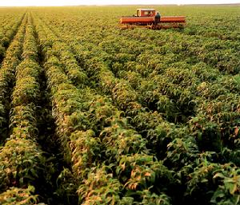
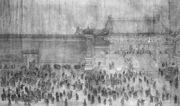

# ＜摇光＞北方与南方

**其实，凡事皆有两面，北方人环境造就的性格让他们作战能力比较强，南方人小情小性比较适合搞点文化产业。最早就是西晋那伙人，五胡乱华，战乱，打不过（那个时侯也还没到直接把你同化了的地步），那赶紧跑路吧。王羲之就跟着一家人从山东跑到浙江，人生地不熟，没得地种，总不能饿死吧，那怎么办？做学问吧，考个功名什么的，当然最厉害的就是把书法练好，就跟现在的领导似得，到哪大笔一挥瞎写——哦不是，是泼墨——几个字，啥问题都解决了，包吃包住包玩，有朋友有地位有面子。**

### 

### 

# 北方与南方

### 

## 文/董泽宇（中国传媒大学）

### 

### 

中国历史上，大多数时候都是北方的政权一路往南打统一全国，大王朝中，汉和明是两个例外。不过，汉时中国的版图还很小，南方工业没有得到充分开发，因此所谓南北之分其实并不显著。至于明，朱元璋建都南京后，死了没几年就又被他儿子朱棣从北向南又打了一场内战，最后迁都北京。 朱棣之所以迁都北京，最大的原因是为了有效控制关外的游牧民族（蒙古残留政权）。因为一旦长城被攻破，游牧民族的骑兵一路向南几乎可以畅通无阻，至于所谓的天堑长江，看看人民解放军怎么用木船全线突破就知道，其防守上的战略意义远不如长城。时至今日，北京西北的张家口和东北的锦州仍是非常重要军的事重镇，守住这两个地方，北京以北就不太会出现什么大的危机（明末残留的元政权有几次是从山西绕过长城攻击北京）。 当然了，这些都是地理上太过明显的原因，而我想谈的是南北方人的性格差异。 和南方相比，北方（尤其在科技并不发达的古代）的自然环境实在是太过恶劣，苦寒之地对人性格的塑造是十分强烈的。 我们都知道比较原汁原味的东北二人转都带有大量的荤段子，其实这很大程度上是因为东北的环境太过艰苦。就算在今天，一个南方农民到东北，也会惊诧于东北农田的广阔。在这里，很少会见到南方那种一家一块地精耕细作的状况，取而代之的，是大片大片的黑土地，大到根本难以想象完全用人力去耕种。这也是为什么国家的战略粮食供应基地很多都在东北的原因——方便大规模机械化耕种。 

 在过去，东北的人口远没有现在这么多（其实现在也不是很多，和中原乃至南方比的话）既没有电视这样的娱乐设施，也没有发达的交通，村落之间的距离非常远，冬天是非常难熬的。这种难熬一方面体现在寒冷的天气上，另一方面体现在漫长寒冬带给人的孤独（难怪北欧那帮人一般享受着全世界最好的福利一边想自杀）——东北不像南方可以一年种两季甚至三季作物，往往在短暂的几个月农忙后，是漫长的等待，等待土地解冻，温度上升。 冰天雪地，夫妻两无事可做，就算躺在炕上也不想干……些什么（还记得鲁迅用寒冷压抑性欲的故事么？），就好像你开着车堵在国贸一样，前面还是一公交车，挡着你交通灯——希望——都看不到，能不闹心么。 有好事者寂寞难捱，一家几口人跑去村里隔壁人家串门，唠唠嗑表演点节目——主要是秧歌什么的，反正大家都是从关内出来混的嘛。演着演着自己也觉得没啥劲儿，那干点啥呢，干……点啥呢，太冷了，没兴致啊。 得，那就开点小黄腔调节调节气氛吧，你一句我一句说上几回合，说的心里那小虫儿又出来拱了，这下有点意思了……见好就收带着老婆回家干……些什么吧。这表演节目的前脚刚走，后脚那窝在炕上的一对儿也早憋得不行了，赶紧干……些什么。 所以你看，这些都是进化的产物，同样是为了给干些什么助个兴，在东北是二人转，到江南就变成给小姐写诗了，而且一定要表明自己只是钦慕对方的气质才学而不是别的什么。听着什么李师师弹琴唱歌，自己也特得意，真觉得自己是一浪迹青楼的情种，其实让李师师老师整点二人转，丫立马湿湿。 说到底，岂止是性，就算是别的方面，南方人的仪式讲究也远远多于北方人，你在东北按照上海人做菜的量去吃，那不是找饥寒交迫的么。至于什么老北京的种种传统，其实人满族根本就没那么多规矩，都是跟那帮汉人一点点学会了，满汉全席哪儿来的？最早就是江南的官场菜：甭管您能吃多少，一道菜能不能吃上一筷子，反正样子得做足，满族的汉族的菜全都给我走一遍再说。人满清入关前都是极简主义，一般宴会，露天铺上兽皮，大家围在一起席地而餐。一直到康熙晚年三次举办千叟宴，都是满汉分开（不过可以看出来这时候皇族已经很受汉人文化影响了，过生日请一堆老头子吃饭这种事儿努尔哈赤肯定想不到）。 

 我以为，这是汉族最厉害的地方：虽然哥经常打不过你，但能把你变成和哥一样的人。最开始那么能打仗的八旗子弟，硬在北京泡了两百多年，最后庚子国变时成了找老百姓吃霸王餐美其名曰护国餐的正宗北京混子（要是扔在南方，估计变得更快）。 其实，凡是休闲文化比较发达的地方，都是相对缺少战斗血性的，典型的休闲文化就是美食，花大心思吃喝玩乐的民族一般都不太能打仗。看看欧洲，最喜欢吃的民族算是法兰西了，法国就是比较不能打仗的民族——别提拿破仑，那是奇葩，况且拿破仑最强的时候还被更北方一年到头被冻的够呛的俄国人给收拾了——德国一个闪击战，法国就没了。 就说说最近的一次全国性战争，解放战争吧。林彪的四野一路从东北打到海南岛，所向披靡，到后来国民党的军队已经进化出了看帽子决定战术的技能：看到皮帽子——东北太冷，解放军都得戴那个，国军戴的是美式人造帽子——就赶紧跑吧。乐得四野战士也不用打仗了，大摇大摆解放不少地方，一直走到天津，实在热得不行，只好把皮帽子往枪口上一支，继续吓唬视力不好的国军。 还有那个什么，按照王朔的说法啊（不爽找王朔算账去），广东人为什么爱吃那么多奇异的东西，就是因为宋朝的时候一堆难民从中原一股脑儿逃到这片荒山野岭，虽然崖山跳海死了十万人，还是剩下不少，这一片儿又是山又是海的（广东到今天也不是农业大省），没辙儿了，逮到什么就吃什么吧，管他什么老鼠狸猫，草蛇狐狸的，一股脑儿全都吃了再说。 我就一直怀疑什么叫汉族，按理说，五胡乱华后早就反不清谁是谁了，又或者南宋灭亡（“崖山之后，再无中国”），法统都没了（我是真不想承认明朝，虽然他的确是个汉人政权）。据说时至今日，正宗的汉人只剩下客家人，什么叫汉语？能听懂客家话不？又据说，小脚趾头指甲是两瓣的就是正宗汉人，我没忍住看了一下……我还真不是，那我算什么？胡人（其实胡人这个概念也很大）？蒙古人？反正搞不清，我估计没几个中国人能搞清的，大概体态魁梧，面带异域风情的，就是血液里北方民族的成分多一点，反之则比较偏向南方人。 

 其实，凡事皆有两面，北方人环境造就的性格让他们作战能力比较强，南方人小情小性比较适合搞点文化产业。最早就是西晋那伙人，五胡乱华，战乱，打不过（那个时侯也还没到直接把你同化了的地步），那赶紧跑路吧。王羲之就跟着一家人从山东跑到浙江，人生地不熟，没得地种，总不能饿死吧，那怎么办？做学问吧，考个功名什么的，当然最厉害的就是把书法练好，就跟现在的领导似得，到哪大笔一挥瞎写——哦不是，是泼墨——几个字，啥问题都解决了，包吃包住包玩，有朋友有地位有面子。 这事儿后来不断发生，49年一伙人见形势要变，赶紧坐飞机逃到宝岛要不就是香港，也搞起了文化产业，初来乍到，惹不起本地人，那我关起门写小说还不行么，于是乎，什么金庸爷爷，琼瑶奶奶，层出不穷，反过来深刻影响了海峡对岸，倒是很有意思。 今日科技发展，交通便利，通讯发达，南北之差越来越少，大家同文（秦始皇这事儿做得好）同种，保家卫国，发扬文化，都是好事，以上种种，皆为笑谈罢了。 

### 

### 

（采编：安镜轩 责编：刘一舟）

### 

### 
