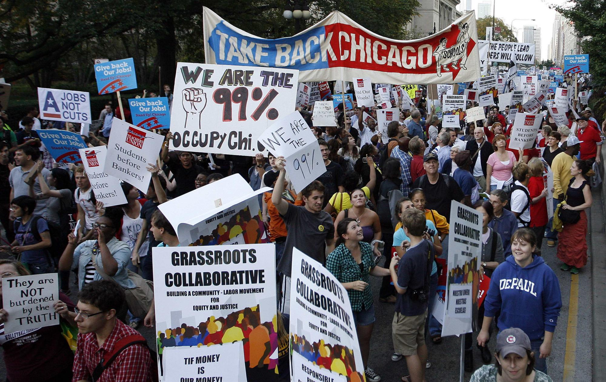
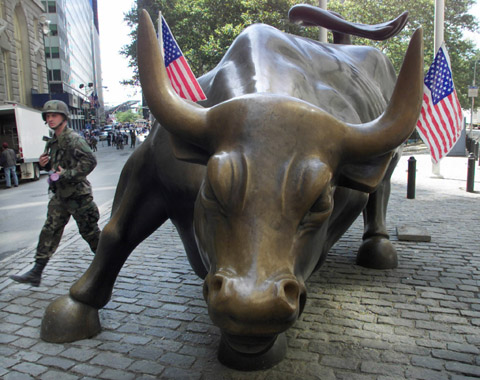
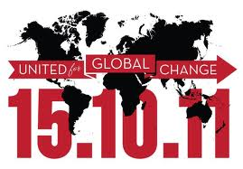

# ＜摇光＞华尔街的黎明

**他们就像以色列山岗上随处可见的卫兵，白天举着枪在山林里四处巡查，晚上在书桌前编写政治册子、学习军事理论。他们在睡梦里都能继续操练继续演习，而到了节日大家聚集在热烈的篝火堆前，人人都能拉漂亮的小提琴泡漂亮的姑娘。可想而知任何姑娘对他们来说都易如反掌，因为就连这事他们都只用脑不用心。**  

# 华尔街的黎明

## 文/沈诞琦（Princeton University）

 

谁都没有看见他们带着什么样的表情踏入横平竖直的纽约街道，谁都没有看见他们做出什么样的姿势钻入冗长肮脏的地下管道。他们以怎么样的眼神凝视着地铁轨道上有恃无恐的硕鼠，凝视着它们的长尾巴拖过积年累月的污水，直到一辆呼啸而来的地铁震动了他们的耳膜，吹散了他们的额发。那总是凌晨五点的光景，连街道清扫员和垃圾车驾驶员都没有醒来。谁都没有看见他们，除了醉鬼、疯子、露阴癖者。这些头发蓬乱浑身刺青的家伙总忍不住对条纹保守的衬衫和笔挺的西裤评头论足：“真他妈穿得像拉皮条的！”“小妞，你胸口的扣子快崩坏啦！”这般那般疯人的呓语，换了时间换了地点，或许能让听者大彻大悟，明白福柯倾其一生所要告诉世人的所有真义。可在凌晨五点，那些强行被咖啡因灌醒的光鲜躯体，顶多对疯子们回报一个同样疏离而涣散的白眼。

他们被轰隆而至的地铁车厢吞没了，又在几站之后被排泄了出来，他们的步伐越来越稳健，他们的表情越来越自然，好像刚历经了一场磨难方能长舒一口气。早上六点，华尔街醒了，同时醒来的还有西街200号、派克道277号、麦迪逊道383号、麦迪逊道11号、第六大道1285号、第七大道745号、百老汇1585号、格林威治街388号……十几人同时哑然无声地挤入一部电梯，几十层销售交易部的大门同时发出刷卡机的滴滴声，上万双手同时按下了Ctrl+Alt+Enter，上万只拇指同时在Bloomberg机器端口读取指纹。Bloomberg软件登录需要半分钟，这半分钟里，拇指的主人们可以发一下呆，东张西望，对近旁的同事说一声早上好。我想象他们道早安的声音一定很轻很轻，带着倦意，而试想一下：此时此刻有上万人同时互道着早安，在每一幢大楼的另一个楼面，在曼哈顿十几处顶级办公楼，在这座永不疲倦的世界金融中心。上万人的和音将必定是如此坚定如此整齐，就像一只巨大而恪尽职守的金鸡，在华尔街的上空准时啼鸣。伴随着这第一声啼鸣，华尔街的太阳升起来了。这只太阳与《楚门的世界》里的太阳同源，无论冬夏，无论晴雨，它总是在早上六点从华尔街的地平线上升起，总是在晚上六点落下，它的前面永远不会挡着乌云，它降下后也不会迎来过于阴柔的月亮和星辰。华尔街上人人都信，这只经过精确计算的太阳要比真正的太阳更耀眼更强大。在Bloomberg登录上载的半分钟里，华尔街上万个交易员就欣赏着臆想中的日出，直到第一个客户电话，直到第一个价位波动，直到他们习惯性地骂出第一个“操你妈”。

在这不再可能有世界大战的年代，只有交易员还广泛体验着战士的生活。每个交易员身后有几个销售，几个数学建模师，几个风险分析师，几个律师，几个财务，就好象二战时每一个美国大兵身后都有二十多个后勤支持。这些后勤提供各种便利服务，全为了战士扣动扳机，去夺取敌方的阵地。战士盯着眼前的世界，当下的一秒，世界正发生着这些事：BP石油总裁正在为热带风暴阿历克斯焦头烂额；德国总理默克尔飞去了南非看世界杯；麦肯锡研究员称明年中国经济增长有可能放缓；花旗银行股票因为操作失误暂停交易；一个三岁的小男孩打电话给警察说他妈妈死了。战士一步都不离开自己的阵地，他的水壶里灌着足够一天的水，他的面前摆着潦草的午餐。战士盯着这个杂乱无章的世界，掂量着枪管中剩余的子弹数量，他的耳边炮声震耳欲聋，而他必须集中精神，用那所剩无几的理智判断美元或者黄金的走势……

这个夏天，我听到了一句聪明话：所有社会主义者都没有心，所有资本主义者都没有脑。（All socialists have no heart, all capitalists have no brains.）如此说来，社会主义的大旗已经插遍了华尔街所有银行，华尔街上所有交易员正在进化成这样一种新物种：他们对客观事物富于激情，而对主观世界漠不关心。他们能惊叫道：“啊，意大利的信用评级又变了！”也能在别人问起家事时很随便地说：“前几天刚刚和人分了手。”他们就像以色列山岗上随处可见的卫兵，白天举着枪在山林里四处巡查，晚上在书桌前编写政治册子、学习军事理论。他们在睡梦里都能继续操练继续演习，而到了节日大家聚集在热烈的篝火堆前，人人都能拉漂亮的小提琴泡漂亮的姑娘。可想而知任何姑娘对他们来说都易如反掌，因为就连这事他们都只用脑不用心。

今年夏天，我在一家银行的一个交易小组实习。某一天闭市后，我身边的一位老资格交易员突然说要和我讲讲他多年的交易经验。我们找了间没人的办公室，他花了一刻钟讲了些我早已明白的基本知识。然后，他话锋一转，神秘兮兮地说：“我做交易员快二十年了，换了几家银行，做了几种产品，我们这一行到底是怎么赚钱的，我总结了这么三条经验：

“一，大数乘以小数等于大数。（Big number times small number equals big number.）

“二，没有风险的钱要比有风险的钱好。(Riskless money is better than risky money.)

“三，所有人都说谎。（Everyone lies.）”

对于如此聪明的洞见，我无言以对，而他像是故意要使我震惊，继续说道：“到你做完这个实习，你就会明白，前两条都是假的，只有第三条才是永恒的真理。”

我便问他：“如果每个人都说谎，你怎么保证你才是最好的骗子？”他笑着说：“关于这点，我要给你讲一个故事。你记得在新加坡工作的那个波尔吗？每周四我们都和他打电话开会。十多年前，他二十出头，是美国为数了了的社会主义者的头。他大学毕业，只身到伦敦，一心想学习如何组织工会搞起义，梦想把美国变成中国那样。他到伦敦第一天，去酒吧喝酒，遇到我们的老板，第二天就来我们组上班啦。”

 我说我一点都不明白这个故事和说谎有什么关系，他说再几年我就明白了。自然，假以时日我什么道理都能明白。不但明白这个说谎者扑克的全部规则，也能明白经过精确计算的太阳如何比天然的太阳更美，能明白疯子们的诳语而不对自己产生丝毫同情。到我明白这些道理的那天，我只愿我的额角还是如此光滑小腹还是如此平坦。我只愿在那天醒来，我的门前站着这些年来失落的所有朋友（而现在他们都在世界各地为明白同样的道理卖命）。我只愿那天晚上，太阳下山，天空能升起阴柔的月亮和星星。我和挚爱的情人在月下幽会，他对我念诗，我只愿自己能忍着不去查黑莓手机的工作短信，能忍着不脱口而出“操你妈”。  

（采编：尹桑；责编：尹桑）

 
