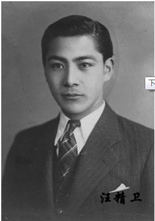
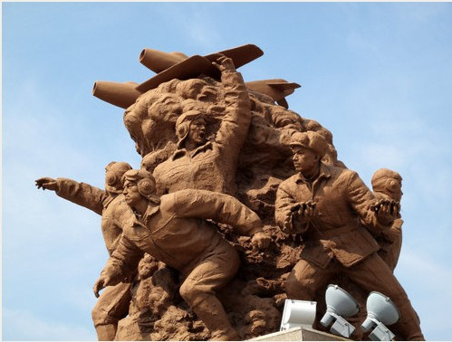

# ＜摇光＞卿本佳人，奈何于此

**何为爱国？何为卖国？我们首先需要搞清的是国家的概念。何为国家？这个概念大且空泛。极容易绑架人的道德感。人们骂汪精卫卖国求荣，可他到底得了什么好处？又究竟卖了哪片国土？和比战难，战败仍不失为民族英雄，和成则是万古罪人。故主和实在更需要有政治的定见与道德的毅力。**

# 卿本佳人，奈何于此

## 文/胡越（广东外语外贸大学）

 

法国人罗兰曾经说过一句很妙的话，“我对不太可能发生的事，以及历史的本质始终迷惑不解。”历史学，并不专恃于记忆，它本身是一种思维方式。我们对于蒋介石、毛泽东与邓小平的看法亦无非出自个人爱憎。

那么我想讲的这个人对大多数人来说都是熟悉的陌生人，我自己在了解他之前也只是知道他是中国的头号汉奸，无他。没错，我要讲的就是汪兆铭先生，也就是大家熟知的汪精卫。汪先生的一生可以一分为二来看，刺杀载沣，建伪政权。

林云思：“中国经常有这样一种怪现象，提到某个人的名字是妇孺皆知，但问起该人的生平和事迹时，却又是鲜为人知。汪精卫就是这样一个特殊的人 物，在中国可以说是家喻户晓的大汉奸，可是大家对汪精卫的“卖国事迹”却是一问三不知。这也是中国历史教育的一大特色，好在中国学生头脑比较简单，不喜欢刨根究底，所以历史老师还不至遇到太大的麻烦。”

感谢我们的历史教科书将汪先生在辛亥革命和国民党史中完全抹杀，省去了不少需要记忆的内容，而抗日战争中实在不得不提，这是一件多么尴尬的事情啊，让我们感觉日本人真傻逼，怎么随便就来一个不知名的跳梁小丑来建立个伪政权。我无力为先生翻案，只是梳理我所能看到的客观资料，为大家呈现一个尽可能真实、丰满的人，好了，废话不多说。

“慷慨歌燕市,从容做楚囚，引刀成一快，不负少年头。”

1908 年，辛亥革命进入最困难的时刻。六次武装起义相继失败，革命领袖被批评为“远距离革命家”。这时，汪先生主动站出来，决定进京刺杀摄政王载沣，用鲜血证明同盟会领袖绝不是贪生怕死之徒。后虽行刺未成，先生被判终身监禁，捡回一条命，然其精神不可谓不壮烈，其行动不可谓不勇敢。先生在《致南洋同志书》中的一 段话在当时传为佳话∶“此行无论事之成败，皆无生还之望。即流血于菜市街头，犹张目以望革命军之入都门也。”

时间拨转三百年，1630年8月那天，袁崇焕拖着叮当作响的铁镣，缓步走向刑台，周围民众围观，骂声不绝。他最后一次看着这个他曾为之奉献一切的国家，以及那些他用生命护卫，却谩骂指责他的平民。我常常在想多年后先生在病榻之上遥望着故土会想些什么。遗憾？悔恨？我无从得知。

我不由想到那首“周公恐惧流言日，王莽谦恭未篡时。向使当初身便死，一生真伪复谁知？”也许，先生当年身死就义，那么，所有人都会记得那位面容俊秀，眉带侠气的义士吧。但是，历史不容假设。

时间再次被拨到1931年9月18日，那个准备了太久，蓄势待发的帝国终于动手了。虽然高层并未部署，但是关东军下犯上的优良传统，加速这场战争的到来。当然，他们自己都没有底，因为张公子的手上硬货不少，但是就像当年干掉北洋水师，干掉波罗的舰队，已经糊了两把，你让他怎么怎么下桌，但这把牌打到几点就停，没人知道，这注定了日本会在这场巨赌中输掉所有筹码。见好就收，实在是不二法则。

出乎意料的顺利，实在是振奋人心，日本国内都在高喊天皇万岁，帝国必胜，全民都跟打了鸡血一样，所谓愤青误国大致如此。这台战争机器已经全速开动了。

打仗不是比二，所谓的亮剑精神用来打个架，斗个狠可能还行，战争拼的是国力，是工业，是钢铁！是石油！那么，成建制的团灭也就不足为奇了。在这种情况下如 果是一个老百姓，可以说‘抗战到底’。但老百姓并不承担抗击侵略者的义务，所谓‘天下兴亡，匹夫有责’，我看不对，匹夫将自己的本职工作做好，生活过好，这就是‘责’。‘守土’不是匹夫的责任，是军人的任务。国军打不赢，大量撤退，引起南京大屠杀，留在沦陷区的老百姓怎么办？我们自己设想一下，如果日本鬼子来了，就像电影里面所描写的那样凶残，我们最希望的是什么？最希望有一个中国人的政权。你我都知道这是一条什么样的路，何况先生。

汪精卫说：“以前人们批评政府不抵抗而丢失了领土，现在我们进行了抵抗，结果却丢失了更多的领土。中国是一个弱国，这就决定了这场被侵略的国难绝不是偶然发生的。以现在中国的国力，无论进行怎样的抵抗，都没有取得胜利的可能，这是我们最初就明白的。既然没有取胜的希望，我们为什么还要抵抗呢？这就是爱国心的缘故，她让我们明知不能取胜，还要准备抗战到最后一兵一将。现在很多人当中有两种错误的想法，一种是过分软弱，认为中国绝对不能对日本进行抵抗，如果和日本交战，将和过去义和团的下场一样；另一种是过分强硬，就象一个人在旷野中发泄一样，“杀尽倭奴”、“打到东京”，什么狂言都敢说，还能得到人们的拍手喝采。以上两种看法都是错误的。政府和日本和平交涉，有一个最低的限度。只要停战条约在我们可以忍耐的最低限度以上，政府就决心签署停战条约，即使受到国民一时的唾骂，也要坚决进行负责任的签字。但如果停战条约在我们可以忍耐的最低限度以下，政府就决不签字。这次政府和日本签署局部地区的停战条约，是为了让疲惫的军队、穷困的人民得到一时的休息，其是非利害将得到历史的评判。”

这就好比一个弱女子遇到一个壮汉行不轨之事，是拿出刀还是拿套？我们的文化中气节是很重要的，所以我们很容易就被道德所裹挟，所以当美国的战俘回国受到英雄般的欢呼时，我们的那些被俘的战士只能在社会的角落默默老去，死去。

何为爱国？何为卖国？我们首先需要搞清的是国家的概念。何为国家？这个概念大且空泛。极容易绑架人的道德感。人们骂汪精卫卖国求荣，可他到底得了什么好处？又究竟卖了哪片国土？和比战难，战败仍不失为民族英雄，和成则是万古罪人。故主和实在更需要有政治的定见与道德的毅力。（周作人）

蒙古人和满族人都先后入主中原，中国文化非但没有灭亡，入主者反而被同化了。因此，所谓亡国论，通常是把王朝和国家混为一谈的蒙昧。由此定罪汉奸，更是源自枭雄们角逐天下的需要。

关于民族的问题大家有兴趣可以看看安德森的《想象的共同体》。

政治军事领域内的张学良、蒋介石、毛泽东、汪精卫……文化领域里的鲁迅、周作人、胡适、胡兰成……都不是可以一言以蔽之的人物。以一般的观点评价历史人物， 特别是对历史发展有着举足轻重之作用的历史人物时，常过于简单。我们看历史，无论人或事，都不可头脑简单、妄下结论。偶有所得，也应反复思忖。我们对待历史，如同我们对待天地万物，皆当怀有敬畏之心理。

长廊贯穿春秋

大门口的陌生人

正砸响门环

我仿佛真的听到，有一群熟悉的陌生人正站在门外，他们已经被这个曾经无比热爱过的国家唾弃、遗忘。

此刻，他们穿越百年风尘，身着青衫，面无表情 ，正砸响门环。

 

（采编：麦静；责编：麦静）

 
