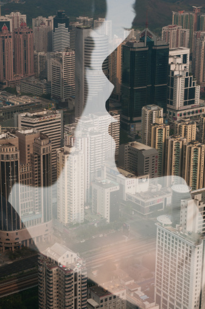
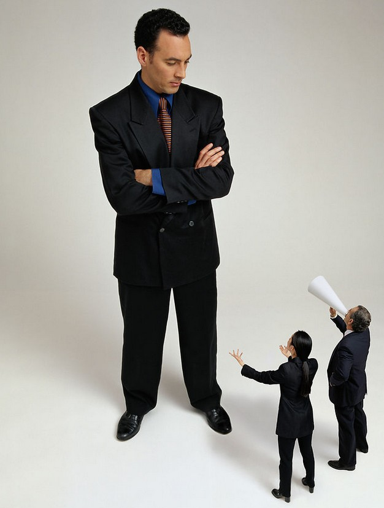

# ＜摇光＞反思说话之道

**每当我们试图独立思考，试图直接表达自己的意见时，总有“好心人”会跳出来告诉你，不要那么正直，对你没有好处。我记得以前看过一段话大概是这样说的：这个国家最让我心悸的，不是国家机器任意妄为地作恶，而是占据主流力量的普通人纷纷告诉你：这个国家就是这样的，你改变不了的，习惯了就行。他们可能是你的同学，同事，朋友，亲人，爱人。只要自己不被伤害，他们可以容忍任何人被伤害。**  

# 反思说话之道

## 文/陈思宇（厦门大学嘉庚学院）

 

那天走过房间，我妈叫住我，说要和我商量一件要事。我很好奇，便听她讲。结果她告诉我，中午我在家庭聚会上说的那句“这酒很难喝”很没有礼貌，叫我今后不要这样说话。我很诧异，只好回答她我说的是实话，那酒确实很难喝。她告诉我，不能这样说话，要说“这酒不合我的胃口”。我感觉哭笑不得，又觉百口莫辩。

说话是门艺术，这句话或许没有错。蔡康永写的说话之道大卖看来并非毫无道理，虽然，我并不喜欢这样的所谓畅销书。但是我妈这样的话语，包括各式各样的所谓的说话之道，依然持怀疑态度。在许多我无法回忆起来的时间里，我想我的父母大概给我灌输了各种各样的说话之道。而这些说话之道的共同之处概况起来很简单——拐弯抹角。

拐弯抹角地说话、拐弯抹角地办事、拐弯抹角地做人，是全体中国人默许的一种生存之道。说是默许，是因为很少有人会直接鼓励别人拐弯抹角，而是用其它的方式暗示。这种拐弯抹角有时很让人头痛，就如同在环山公路上开车，处处是弯道。我们的许多时间和生命也许就耗费在了拐弯抹角之上。

这种生存之道源于什么地方，已经很难考证了。我近来重读儒家的四书，倒是发现这些早期的大儒，譬如孔孟，其实都不是那么地拐弯抹角。比如曾有人问孔子“以德报怨”这种行为怎么样，孔子却回答“以德报怨，何以报德？以直报怨，以德报德！”。这句话长期被人断章取义，认为孔子教人凡事退让，以德报怨。殊不知，真正讲究以德报怨的是《圣经》。

孟子则更不必说，他虽然口口声声反对墨子，可是身上那种直爽的侠气，却与墨子最为相近。孟子最有名的那些话，大多都是一些豪气十足的宣言，“自反而缩，虽千万人，吾往矣”，就是其中的代表。而再如孟子见梁惠王，说话也是直来直去的。

当然你可以说这两人皆是“知其不可而为之”之士，甚至近乎迂腐。然而有趣的是，在“儒家思想”几乎被等同于“中国传统思想”的情况下，这两个原本言语上透露出一股股正气的大儒，却几乎被认为是中国这种拐弯抹角文化的源泉。尤其是《中庸》这一篇，更为后人所诟病。有许多人时常开口便大批“中庸”思想。可是，又有几个真正读过《中庸》这一篇？

在稍微看了一些现代新儒家的言论后，我大概明白了一个道理：所谓新儒家，并不认为儒学为几千年来的大害，而是认为正因为正宗的儒学并未得到真正的贯彻，才导致了中国之衰败。我的阅读范围有限，但我猜想这句话在某些事实部分是正确的，那就是儒学并未真正控制了国人的意识形态。这只是我的一点猜测，还需要更多时间和阅读去验证。

之所以做这样的论证，我是想为这种拐弯抹角的文化寻找一下根源。“谁掌握了历史，谁就掌握了现在”，现在，在说话“尽可能地正直”这件事情上，我们确实要将尺度扩大。和谈论许多的事情一样，我依旧认为，这是一个“尽可能”的问题，而并非绝对的问题。而这会引申出关于“言论自由的边界”的问题，但这不是我要讨论的事情。

我要说的，还是一个字，直。

两点之间线段最短，但是划线段需要一把很直的尺子。我们想要做到直的成本是很高的，因为不得不面对开罪他人的局面。这不好办，甚至会影响与人交往。弄不好，“不会做人”这顶帽子就要扣到你头上了。但是，现在的问题是，我们有时候实在是太弯了。

这不是一句无聊的性暗示。回到开头的那个例子，假如我因为说某种酒太难喝就会使我的母亲生气，那这种情况就很难让人接受。当然，她说她并没有生气，只是提醒我。我丝毫不怀疑她的善意，我怀疑的是，她这种善意背后所象征的意义。

每逢家庭聚会，我最常遭到批判的就是“不够老成”、“不会转弯”。我相信也有很多的人和我一样，被这样指责过。可是我从来没有觉得自己是那种有一身“浩然正气”的“正人君子”。我怀疑，是他们对于真话的接受能力实在太低了。或者说，已经习惯于生活在谎言之中。

假如今天我骂任何一个年轻人“阿谀奉承赔笑脸，拍马溜须跟屁虫”，他一定会气得暴跳如雷，他的家长也一定会气得半死。但是，他们教育孩子的方式，却正是在把他们培养成这样的一个人。

每当我们试图独立思考，试图直接表达自己的意见时，总有“好心人”会跳出来告诉你，不要那么正直，对你没有好处。我记得以前看过一段话大概是这样说的：这个国家最让我心悸的，不是国家机器任意妄为地作恶，而是占据主流力量的普通人纷纷告诉你：这个国家就是这样的，你改变不了的，习惯了就行。他们可能是你的同学，同事，朋友，亲人，爱人。只要自己不被伤害，他们可以容忍任何人被伤害。

也许真是这样。但这个问题的本质在于，即便正直是不可能的，但教育仍然不能放弃它。这就好比数学对于许多人都“没有用”，可是难道我们的学校就真的不要教数学了吗？

讲到这里，我还需要再提醒自己一下，我已经比前些年“弯曲”了许多。当我的肩膀上承担的重量越重时，我的脊梁也就被压得越弯，以致于很多时候习惯性地低下头仰望他人。这是病，医院治不了。治病的方法我倒是知道，可是却学不来。所以我想到的一个聪明的办法，就是逃避。当你不去和那些“大人物”接触时，你也就不需要点头哈腰。

我为我的“聪明”感到悲哀，也许会让我自己“聪明反被聪明误”。但是我也没有办法，这个不如人那个不如人，心高气傲有时却远胜他人。

这是我的毛病。而谈及此，又会有人说，正直当然是对的，可是当这个社会的风气、当其他的人都不正直时，某一个人大谈正直，不是吃亏了吗？

我的想法是，和解决所有复杂的社会问题一样，我们需要一点点拓宽这个尺度。其实我的想法并不复杂，不过是希望能够保持独立思考，然后在多数时候能够直接地表达自己的观点。但这又何其地困难。近来我愈发不知道我要在社交网站上说些什么，有时甚至会感到无论我说什么在别人看来都是不对的。这种自我的误区我需要调整，但是在社交网络上，我们说话的空间，其实确实受到了一种无形的挤压。虽然并非我们想说什么就真的能够说什么，但我期待的是，能够拓宽我们说话的空间。

这不是我一个人事，是所有人的事，而背后的问题是缺乏尊重。很多人都很自然而然地认为自己有批评他人自由，却不认为他人有批评自己的自由。我不知道卡耐基在《人性的弱点》里面有没有写过这一条，如果没有，那版权归我。

我并非在进行什么批判，因为我自己就不够正直。所以与其说这是批判，不如说这是一种反思。我应当问问自己，当自己见到大官僚、大富豪时，内心是否会不由自主地流露出那种卑躬屈膝的感觉，我和他们说的话，是不是已经超出起码的尊敬的范畴而掉进一种奴性的范畴去了？

有的时候，我的确会有这样的想法。这使我想起了吴思先生提出的“淘汰清官定律”，也想起了柏杨先生所谓的“酱缸文化”。这些看似泛泛而谈的“定律”，却又条条正中红心。文臣死谏，谏臣死文，自古如是，代价有时太高了。

你我非圣人，力所不及时有所退让，并非什么可耻地事。有时候我们需要一个台阶给自己下去。可悲的是，许多的人已经养成习惯，无论什么情况，开口就低三下四，自甘为奴。

还好，大多数人并不需要面对所谓的“死谏”的局面，所以我所说的让自己更加直一点，其实并非什么难事。我听过很多人骂某某人虚伪，可是我们又拿什么来面对自己的虚伪？我想，还是尽最大的可能地挺直了好。多数时候，不需要你付出生命的代价，只需要你多说几句真话。

最后，我要为鸵鸟做个辩护。总有人喜欢说鸵鸟会把头埋进沙子来逃避危险，但是有科学家考证，鸵鸟并不会这样做，相反，当鸵鸟遇到攻击的时候，会毫不犹豫地直接进行反击。我们误解鸵鸟太久了。

 

(采编：何凌昊 责编：尹桑)

 
