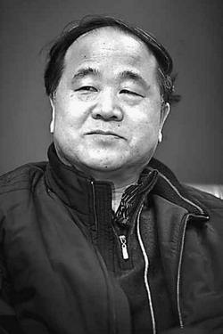
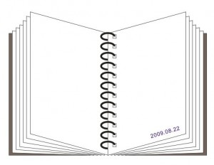

# ＜摇光＞变数莫言

**好的小说，未必能带来好的回报。对于名不见经传的作者，其作品的市场预判很难。“营销选择时，一般会选名作者、看热门题材、国外引进热门版权书。”雅昌集团图书策划人林东林说：“时代的大风气不会逆转，即使是诺奖，没有谁的一臂之力可以挽狂澜于既倒。”**  

# **变数莫言(作者版)**

## ****文/谢梦遥（中国政法大学）****

 

在莫言获得诺贝尔文学奖那天，精典博维的董事长陈黎明输了一个赌。

精典博维在今年5月签下了莫言所有作品的全版权合约。自从国际博彩公司把莫言列入诺奖人选的头筹后，公司上下就迫不及待地盼着结果了。随着揭晓时刻的接近，气氛越来越紧张，很多同事留守在公司加班，有人不停地刷新着微博，然而也觅不到任何有效的线索。大概是为了缓和一下气氛，陈黎明说了一句：“不会中的，你们不要抱那么大希望了，希望越大失望越大。”

见没人理他，他又说：“那就打个赌吧，赌1000块好不好？”红雪是莫言文稿的责编，她马上数出1000元，拍在了桌上。“赌就赌。”

一个小时后，陈黎明输掉了赌局，但这并不重要，因为在另一个一年才开盘一次的赌局中，他押中了宝。

 **签大牌，不仅仅是递名片**

陈黎明显然并不愿意用“押中宝”来形容与莫言的签约：“我们很早就和他接触了，去年就已经达成了签约意向，那时候根本就不知道他会获得诺贝尔奖。”

但有一点是无可争议的，对于出版商来说，莫言早已是块香饽饽，追逐者众。“文学圈里已经传过很多年，大陆作家中最有可能获得诺奖的人就是莫言。”作家刘醒龙说。

“一线作家意味着他有强大的粉丝群，他们数量不多，争夺是非常激烈的，大家都想会跟他们签。”红雪认为这和别的行业抢稀缺资源没有差别。

她此前在作家出版社当过7年的编辑，那时候，她也会尝试联系知名作家，寻求合作。。研讨会往往是结识作家的好机会。“有一次会议，我刚好跟阿来坐得很近，我认识他，他不认识我，我就没话找话递上名片，但没有下文了。”不是想和作家做朋友，就可以做成朋友的。

红雪再见到阿来，是她去年转到精典博维工作之后了，那时公司已经和阿来、阎连科、麦家等几位大牌有合作。但阿来对于之前的见面完全没有印象。“给他递名片的人太多了。” 要争取到大牌作家签约，要做的比递名片更多。

执行总裁史翔还记得，2009年的上海书展上，麦家有个签售会，他一直等到了最后。“他签完了，我就厚着脸皮把他拉出来跟他谈。他对暮气沉沉的出版业，也有点厌倦，我们作为年轻人，非常有冲力。”作为公司主要负责人，史翔和陈黎明都在35岁上下。

合作并非一蹴而就的，史翔认为精典博维相较同行的优势有三方面： 第一，是你的真诚，你对他作品的理解，怎样装帧设计，用什么方式来呈现；第二，是你对他作品的商业化运作，怎样提高他作品销量；第三，你的版税不是有竞争力？

上海文艺出版社副总编辑曹元勇认为，有些民营体制的出版商可以利用其雄厚资本，促成签约：“我们给10%的版税，或许他们会给20%，这对作者是好事，但从行业经营的角度，这就是不公平的竞争。”

在对作家的投入上，精典博维确实不惜重金。媒体最戏剧性的描述莫过于此：为争夺麦家新作《风语》首版权，陈黎明去给麦家拜年，直接带上500万元签约现金。最终，麦家成了精典博维第一位签下的大牌作家。

对于和莫言的签约，陈黎明认为：“其实就是和他交朋友嘛。我们认识好几年了。”

在签约前的大半年里，陈黎明、史翔、红雪三人多次拜访莫言，一起喝茶，天南地北地聊，也不怎么聊文学。“提过诺奖的事儿，他哈哈一笑，避而不谈。”在同事眼中，陈黎明是一个很注重细节的人。“他会记住莫言的女儿来了，安排车子去接。莫言去哪里，他也会派车，很热心。”

这些朋友间的来往，是传统出版社很难去实现的。

虽然争抢莫言者众多，但愿意以文集签约的，并不多。读者购买一本书的机率，要远远大于一套文集。“一般出版商都是更愿意签最挣钱的一两本。而文集可能是这几本赚了，那几本赔了。算细账，它不是一个划算的买卖。一个小说家的小说销量一定是最大的，其他如散文就没有那么大。”史翔认为操作文集，需要商业运作能力和勇气。

但现在看来，全部作品的签约，给精典博维带来了莫大的好处。他们像分蛋糕一样，把作品的不同部分分给三家出版社出版，新世界出版社在10月将发布最新的剧作《我们的荆轲》，而全集的平装版和精装版分别交由给作家出版社和北京联合出版社。

 **把作家当成明星去代理**

眼下，莫言已经成为了中国最炙手可热的人，按照百度新闻指数，最近一个月媒体关注度提升了约3100%。他比明星更红。

这正符合陈黎明想做的，把作家当成明星去对待，帮他们宣传，维护他们的一切。他更愿意把自己的公司定义作家经纪公司，竞争力在于提升名家的综合价值。

类似作家经纪这种操作模式，对于青春文学领域来说，已经有了另一种样本。郭敬明 “最世文化”的旗下近百位作家、漫画家，每人都有自己专职对应的编辑，负责安排作者们在公司内部的杂志上接受采访、发表作品；还帮他们处理公司外部的约稿、商业合作以及宣传相关事宜。签约者本人则被要求不得插手。据报道，郭敬明还有意把他们往感性、精致的气质上打造。

但对于传统出版行业来说，这是一个开始。精典博维有法务部，对于报纸未经允许擅自转载，已经为莫言打赢过几场维权官司了，追讨到的钱倒不多，几千到几万元不等。“他不用再分神了，打官司是律师的事情，我们有律师。他可以更用心的创作。”最近，公司则开始调查其他出版商对莫言版权是否到期。

早在三四年前，陈黎明就已经着力将公司往作家经纪的方向去打造。契机发生在去年，公司通过投标，接手了北京旅游委下属的杂志《北京旅游》。精典博维需要宣传作家或图书时，现在可借助自己的媒体平台。同时广告部门也顺利成章地搭建起来，可以为作家去寻找广告、代言机会。

但实际操作上，对于严肃文学的创作者来说，代言并不容易争取。“主要是因为操作难度比较大，作家做什么代言啊，不如明星，市场不认同。作家也低调得多，很多不愿抛头露面。作家也不宜过度曝光，否则大家会觉得他不安分。”

精典博维与莫言的合约中，除了图书的出版权，同时包括作品的衍生权，比如影视、戏剧改编权。公司专门有一个影视部，负责向外部推荐，《泣血关东》一书即被慈文传媒购买了改编权。“以前我们只想卖掉改编权，现在我们想跟影视公司分析作品的内容与价值，提供一整套方案，从咨询角度提供服务。”陈黎明不愿意只担当销售者的角色。

对于传统出版社来说，这一步迈得大了些。上海文艺出版社就仅以书的签约为主。曹元勇认为出版业和影视业作为两个不同行当，有些脱节，导致好的文学作品缺少输送入屏幕中的渠道。“这就是为什么现在的电影很难有让我们很兴奋的作品。”

史翔承认，一般而言，主流文学推荐给影视公司改编，非常困难。“他们更喜欢改《失恋三十三天》那种类型的，或者穿越题材的。”

“文学性强的作品反倒不一定适合影视改编。线性故事、行为表现是影视所需求的。”《士兵突击》的制片人张谦说。作家李海鹏则认为，电影艺术的短板在于不具备呈现内容的能力。“比如说《百年孤独》，没有办法拍成电影。”

但莫言获奖后，已有多家影视公司表达了改编意向，主要集中在《丰乳肥臀》和《生死疲劳》两部小说。精典博维对于作品进入荧屏，信心满满。

 **严肃文学也可以是畅销书**

民营出版业里的龙头公司当属磨铁文化，以做畅销书为主打。其实大部分民营公司的选择都是如此，在精典博维成立最初的几年，主要做迎合市场的书，青春文学、玄幻文学做了不少，但没什么出名的书。

现在，莫言的获奖，也坚定了公司要做严肃文学的路。“我们整体实力上升，就有能力把目光回归传统，回到文学本质的东西。”史翔说。其实这未必是赔本买卖。“一般类似于莫言、陈忠实这样的作者，首印可以有三五万吧。”雅昌集团图书策划人林东林说。

从一般规律来看，一本书，如果卖到1万册就能持平了，以后所有的版权输出都是利润。5万册以上的书被业界称为畅销书。

获得出版机会，也需要机遇。“来稿量特别大，我需要在静心的时候看，看到让我眼前一亮的，就跟作者联系，听听他的想法，也聊聊作品，再磨合。”红雪坦言，在赶任务时，根本不可能去考虑那些没来头的稿件。

这些书即使出版了，畅销也难。根据北京开卷信息技术有限公司制作的《上半年图书零售市场的分析报告》，上半年畅销的新书，要么是某个系列故事的延续，要么是知名作者或者知名电视栏目的新作出版，换句话说，这些畅销书大多并不属于新的话题。

史翔也表示原来的出版选择不会放弃，两种方式并进。除了追逐名家，公司也会挖掘尚未成名的青年作家。“陈河即是一例，他旅居海外，在中国没有出过书，由麦家推荐给精典博维，作品出版后，获得了郁达夫文学奖。”

体制内的文学奖可极大程度提升作家的商业价值。2000年，阿来成为中国文坛最年轻的茅盾文学奖得主，由此，阿来从一名默默无闻的杂志编辑跻身国内文坛成为重量级作家。

“诺奖宣布后，我这几天不吃不睡都在往前赶稿子。我们出版是有周期的，但现在我们要提前赶出来。”红雪说。

对于陈黎明来说，莫言获奖后的日子里，他的手机从来没有被这么高频率使用过。记者们都想采访他。纷纷打来电话的，还有各大出版社。“跟我们合作出版社有十几家，好多都打来，说怎么不把机会给我们，简直要闹翻了。”

 **购买力爆发**

莫言效应已经充分在出版业中显现。

人民的购买力如山洪一样爆发，各大网上书店无一例外皆打出“莫言牌”，据媒体统计，莫言图书价格涨幅近两成，亚马逊的莫言图书涨价比例是37%，当当网为32%，京东更是高达79%。即便如此，仍一书难求，缺货通告接连出现。在诺奖宣布后的一个星期里，当当网每天有接近一万册的莫言作品被预售出去。很多的实体书店中，莫言的书均出现售罄。

精典博维将推出的莫言剧作《我们的荆轲》首印量10万，是诺奖之前计划的3倍。

人们的目光不仅仅在新书上。在孔夫子旧书网，莫言的签名本由原来一两百元，现在卖到上千块，更高的出价在一万元以上。10月15日，在孔夫子旧书网关于莫言的商家有3705项，其中80％已经脱销。

莫言与上海文艺签订的合约仍在有效期，曹元勇最近正在安排加紧印刷莫言的全集书册，书册上会注明其诺奖获得者的身份。办公室主任张静影介绍，印量已达20万套，上回单批次出现这么大规模印量，还是出版易中天的《品三国》之时。很多小的电商、书店也打电话过来，请求供货。

这就像回到了多年之前的状况。“那时候我们一下就会印20万，之后一年也不会有加印计划，但那种印法不够理性。现在书店会告诉我们，想要多少本，我们再去送。书店并不希望那么多书放在仓库。”曹元勇说，即使如莫言这样作家，按照常规印量，单次也不过一两万本，根据情况，隔10天到一个月再加印。

出版的新趋势是，印刷周期缩短了，而每次的印量也减少了。对于一部分作家来说，他们的书印了5000本以后，可能就成为绝版。这种情况在美国也一样，没有名气的作家，一本书销量达到也就五六千，已算理想状态。

诺贝尔文学奖的授予，会使得奖者的作品销售量上升。以耶利内克的《钢琴教师》为例，在2004年获诺贝尔文学奖前，该作品在十月文艺出版社搁置5年，迟迟未能出版。但获奖后，这部作品在短时间内6次重印，印数达到11万册。但是这个数字，放到中国显然不值一提。

 **莫言拯救严肃文学？**

莫言引发的购买狂潮，未必能波及到近年来遭到冷遇的严肃文学。

“在‘下海潮’之后，整个社会的重心，转向了经济，文学被迅速被边缘化。在我看来，文学几乎不被人所看。取而代之的是网络小说、段子、手机小说。”莫言曾经合作过的编辑叶开说。

精典博维在考虑出版时，作品的市场前景依然是最重要的因素。公司也只设立一个文学部，类型文学归入其中，并不对文学进一步划分。对于热卖的书籍，利润中会分出相当可观的一部分，用于编辑奖励，在这种机制下，内容好但不适合市场的作品很容易淘汰出局。“诗歌我们很少出，因为受众太少了。”陈黎明说。

据曹元勇介绍，上海文艺出版社这些年出了很多诗集，他并没有详述相关的扶植政策，但他强调这种扶植在世界各国都有，“美国就有很多文化基金。”

红雪还记得，当她还在作家出版社时，就有领导就在开会说过，对于诗歌，只要不赔钱，账面能够打平，就可以出版，前提是内容一定要好。“因为诗歌是文学的一个品类，但现在没有什么诗歌的市场了，为了保存品类，社里才会这样规定。如果这本书赔钱了，不会算到编辑个人头上。而其他类别的作品，不赚钱肯定不做。”

但作家出版社，也同样并没有划分出严肃文学这样一种类别，去区别对待。“你非让我分，我会很痛苦。好的小说，你会看他的文笔，看时会否感动，我认为这是好小说的共性。”

好的小说，未必能带来好的回报。对于名不见经传的作者，其作品的市场预判很难。多年前，同事推荐给红雪一本样稿，说非常好，她一个晚上就读完了。“稿子绝对是好稿子，否则你不可能在不睡觉的情况下看完。尤其是你经常看文字的情况下。”负责的编辑也很兴奋，就把书出版了，叫做《遥远的救世主》。但这本书市场反应并不好，印了一万册后，后来竟被经销商退回了8千本。“负帐了3年，每年都会扣编辑的钱。”

突然有一天，大家发现库里的书全没了，原来是卖空了，而且还要加印，一加就加了三万册。“因为拍了电视剧。电视剧把这本书和这个作者给救了。”

拍成电视剧的小说，毕竟是少数。对于出版商而言，扩大销量，更多依赖于常规的营销手法。和所有的出版社操作方法一样，精典博维的营销部会把新书打包推荐给长期合作的网站，发布信息。只有极少数的书，会投入更多成本集中做营销。

“营销需要成本，不是每本都营销的。有些书不做营销卖5000本，做了卖6000本，就没有营销的必要。”曹元勇介绍。营销哪些书，会由上海文艺出版社统一决定。

姜涛在人民文学出版社负责营销事务，每年会做五六十场活动，包括新书发布会、作品研讨会、读者沙龙、签售等，但社里每年会出三四百本书。

“营销选择时，一般会选名作者、看热门题材、国外引进热门版权书。”雅昌集团图书策划人林东林说：“时代的大风气不会逆转，即使是诺奖，没有谁的一臂之力可以挽狂澜于既倒。”

如果把目光投射到中国之外，其实严肃文学的内涵也在发生改变。比如在日本，网络文学与严肃文学界线已经在模糊化，作家把严肃文学的“内核”赋予通俗文学，手机阅读让作品在年轻人中流行起来之后，进行纸质出版。

在作家曹寇看来，中国的审美是被官方引导的，现在人们渐渐放弃了被官方引导文学阅读，可能真正的文学开始了。

史翔抱乐观态度，他认为莫言获得诺奖，对于严肃文学市场或是转折：“之前几年严肃文学市场比较低迷，除了个别的还能卖，整体非常差。但现在为什么几个出版传媒都涨停了，未必是他们有莫言的版权，而是大家似乎觉得这个事件的发生，会使浮躁的心态有所收敛，使得人们能够重新关注文学的价值。”

 

（采编：孙梦予；责编：徐海星）

 
