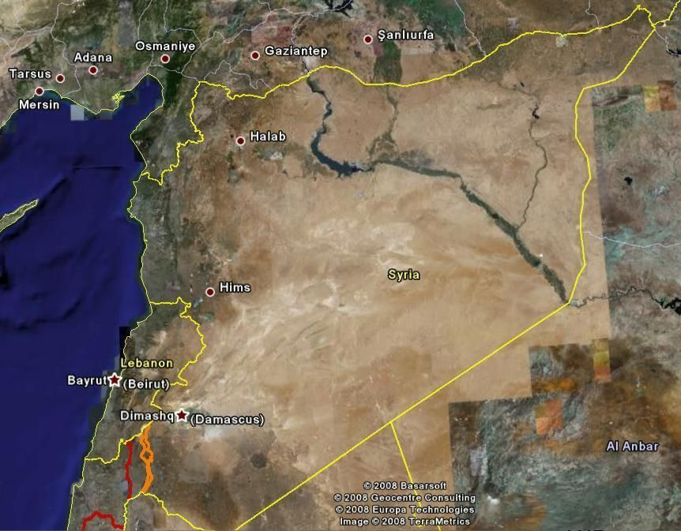
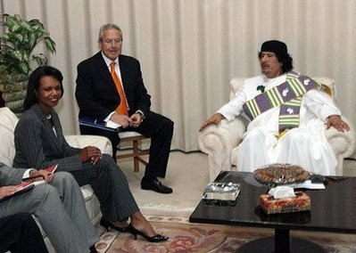
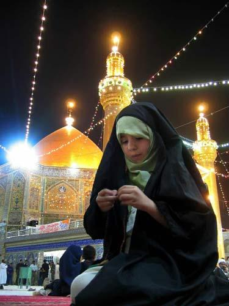
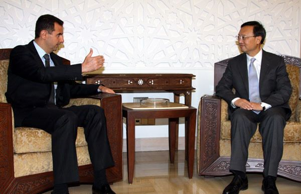
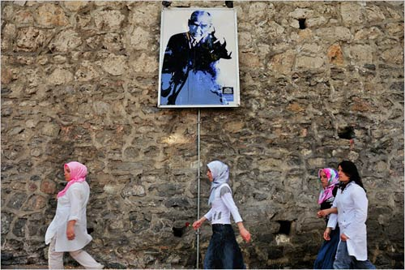

# ＜摇光＞叙利亚观战指南

**阿拉伯国家分为两种，一种是有油的，一种没油的，前者富得流油，后者穷得掉渣就好了。叙利亚很苦逼，属于没油的那种，所以很穷。当然，也有好处，那就是苦逼国家的人民群众深明大义，普遍信奉“命苦不能怨政府”，不会像一些国家里面的傻逼一样，问一句同样是德国人，为啥东部比西部穷啊？进而得出结论：体制问题。** 

# 叙利亚观战指南

## 文/丁栩翔（北京大学）

 

利比亚现在转成警匪片了，看点就只有卡扎菲何时落网，本来反对派内斗也挺好看的，无奈西方媒体对此不感兴趣，国内媒体自然没有东西可以翻译，所以大家还是换台看叙利亚好了。

先说叙利亚的经济状况。这是很简单的，只要记住一点：阿拉伯国家分为两种，一种是有油的，一种没油的，前者富得流油，后者穷得掉渣就好了。叙利亚很苦逼，属于没油的那种，所以很穷。当然，也有好处，那就是苦逼国家的人民群众深明大义，普遍信奉“命苦不能怨政府”，不会像一些国家里面的傻逼一样，问一句同样是德国人，为啥东部比西部穷啊？进而得出结论：体制问题。

再说叙利亚的政治体制。本来这是有很多话可以说的，但是对于中国的观众朋友，要说的就很少了。唯一可说的就是执政党，名叫“阿拉伯复兴社会党”，很熟悉吧，这个党巅峰期的时候在两个国家执政，一个是叙利亚，另一个就是伊拉克，后者的党魁名叫萨达姆，已经挂了。制度上和TG基本一致，唯一的区别在于他们实行的是父死子继的家族政治，原来的领导人叫哈菲兹·阿萨德，现在的领导人叫巴沙尔·阿萨德，是前者的二儿子。

说两个阿萨德之前接着说社会构成。现在叙利亚的形势闹的不可开交，和它的社会构成是密不可分的。主流民族是阿拉伯人，信伊斯兰教这些都是不用说的，关键在于信的教派不同。主流教派是逊尼派，非主流教派是什叶派，人数大致上是85：15，逊尼派占压倒优势。总人口是2400万左右，是利比亚的四倍。

逊尼和什叶的区别这里就不讲了，牵扯到宗教的东西说多了风险很大的，总之就是逊尼派在现今伊斯兰世界里面是主流，又叫正统派，我国的穆斯林基本都是逊尼派；什叶派只有在伊朗、伊拉克等少数国家占多数。但是，一般来说，信奉什叶派的人数比人口普查出来的数字要多那么一点点，因为什叶长期以来在伊斯兰世界属于弱势群体，为了自保，有一个很著名的“他欺也”原则，顾名思义，就是“忽悠他”的意思（“他欺也”貌似音译过来的，个人感觉这个音译相当传神，比如说苏轼写的“古之人不余欺也”意思是说，古人没有忽悠我，同理，“他欺也”翻译成现代汉语的意思就是“忽悠他”，音译和意译完全一致啊），也就是在逊尼派中间混的什叶派出于自我保护，对外就说自己是逊尼，把信仰长埋于心底就是了。

在叙利亚，他们占少数的什叶派基本上又是弱势群体中的弱势群体，阿拉维派。这属于最不受待见的一个流派，逊尼派长期以来把他们看成是贱民，甚至有逊尼长老公然说灭了这拨人真主会很高兴的，于是阿拉维派在叙利亚的处境可想而知。在法兰西统治叙利亚的漫长岁月中，阿拉维派只能从事一些“贱役”，比如说干个苦力，当个仆人等等，特别是，逊尼派长期本着“好铁不打钉，好男不当兵”的原则，但凡法国佬来叙利亚抓壮丁，便纷纷把阿拉维派的送去凑数。结果，战后叙利亚独立建国，军队里面一眼望去，几乎是清一色的阿拉维派，然后逊尼派的悲剧也就注定，之后的各种政变基本上就是阿拉维派的事情了。

然后再回过头来说两个阿萨德。老阿萨德，也就是哈菲兹，是个阿拉维派，他小时候的理想是当一名医生，前面说过，阿拉维派在叙利亚独立前属于“贱民”，只能干“贱役”，所以我认为哈菲兹大叔年纪轻轻就树立了当医生的理想是很了不起的。但是后来，平地起惊雷，阿拉伯复兴党（就是复兴社会党的前身，复兴党后来和社会党合并就改名复兴社会党，后来又和社会党分裂，但名字一直没再改）成立了，顾名思义，该党就是要追求阿拉伯民族的伟大复兴，第一步就是要统一阿拉伯世界。当时还是小盆油的哈菲兹童鞋热血沸腾，果断入党，并且为了表示与旧世界决裂，把自己的姓“瓦赫什”（阿拉伯语意思是“野兽”，果然歧视阿拉维派啊）改成了“阿萨德”（阿拉伯语意思是“狮子”）。然后放弃了当医生的人生梦想，考军校，当上一名飞行员，然后又干出了惊天地泣鬼神的壮举，驾驶战斗机击落英国轰炸机一架，成了叙利亚的民族英雄（窃以为开战斗机打下轰炸机不算英雄），于是获得出国留学的机会，到埃及的一个学习班受训。这不是亮点，亮点在于那个学习班上还有一个埃及人，名叫穆巴拉克。然后学成回国，政变，夺权，这些都是阿拉伯世界的老戏码了，也就不多说了。

再看现在风口浪尖的小阿萨德，媒体一般称之为“巴沙尔”。让我们再回到上一段，我说了，哈菲兹大叔小时候的梦想是当医生，结果因为一时冲动放弃了。和一些家长一样，哈菲兹也有一种让孩子替自己实现梦想的情结，和另外一些家长一样，哈菲兹同样有一种让孩子子承父业的情结，很多只有独生子女的中国家长就被这两种情结折磨的辗转反侧，好在叙利亚不搞计划生育，哈菲兹有好几个儿子，于是分工如下：大儿子巴西勒子承父业，作为下一任复兴社会党总书记培养；二儿子巴沙尔实现父亲的梦想，学医。结果天有不测风云，大儿子巴西勒因为替老爹开展禁毒运动，被毒贩子盯上，出了离奇车祸挂掉。老阿萨德痛不欲生，只好让医学硕士、眼外科医生二儿子巴沙尔弃医从军，大概老阿萨德觉得反正横竖都是拿刀的干活。然后，天又有不测风云，当34岁的巴沙尔好不容易混到中校，老阿萨德挂了。根据宪法，总统至少要40岁。再然后，叙利亚人表现出很实在的一面，不像朝鲜一样搞神马守孝啊神马的，果断改宪法，把年限改成34岁，有零有整（你改个30整岁多好，我觉得巴沙尔的孩子还小......)，然后继位上台。两个阿萨德就是这么一个状况。

最后看叙利亚的国际关系，这也是观战的重点。叙利亚有两大世仇：一是以色列，二是土耳其。

先说以色列。叙利亚之所以是阿拉伯复兴社会党的发祥地，之所以是阿拉伯各种极端势力的根据地，和以色列是分不开的，翻开地图就知道，叙利亚和以色列直接接壤，附近的邻国黎巴嫩又是以色列和叙利亚长期分区占领相互对峙之地，叙利亚自然就成为阿拉伯世界反以的急先锋。更重要的是，根据“大叙利亚”的概念，巴勒斯坦实际上是“南叙利亚”，和约旦、黎巴嫩一样，都应该是叙利亚的一部分，以色列今天拆个巴勒斯坦定居点，明天炮击黎巴嫩，后天轰炸约旦，在这种环境下，叙利亚想不反以色列都难。在这种大环境下，叙利亚在建国后和以色列交战多次，概括起来就是“屡战屡败，屡败屡战”。

平心而论，在阿拉伯国家中，叙利亚属于比较能打的，但毕竟是阿拉伯国家，拉开来打大战他们都很菜的。但叙利亚的真正让以色列头痛之处在于，他养了很多真正给力的恐怖组织。因为CCTV的长期报道（当然我觉得主要是他们确实打的好），说出来个个如雷贯耳：真主党、哈马斯、杰哈德。所以，目前来看，尽管叙利亚政局动荡不安，美国、欧洲都欲除阿萨德家族而后快，唯有与阿萨德家族世仇的以色列迟迟不肯表态，直到巴沙尔杀了个痛快，以色列的所有干爹都异口同声之后，以色列才终于支支吾吾的说了声：巴沙尔必须下台。

原因很简单，反以的恐怖组织的大本营就是在叙利亚，另外，叙利亚不产石油，但还是有值钱的特产的：毒品。社会动荡产毒品，恐怖组织最欢迎。想想看吧，反以情绪高涨，恐怖组织扎堆，还他妈特产毒品，这种国家要是政局再一动荡，人民群众陷入水深火热，以色列还要不要活了？阿萨德政权虽然反以是一贯的，但打仗纯粹外行，再者阿拉维派在叙利亚混全靠军队撑腰，叙利亚军队的职责必定是攘外不如安内，反倒是现在被美欧支持的逊尼反对派上台，人家再怎么亲美亲欧都不可能亲以，要是再搞个民主制，以色列更不用混了。所以，现在的形势下，最不希望阿萨德倒台的国家就是以色列。

再看土耳其。目前来看，叙利亚政局不稳，冲在最前面的国家就是这个土耳其。原因在于，这两个国家也是死敌，教派矛盾不说了，土耳其信逊尼的，但这不是关键。关键在于，历史上奥斯曼土耳其几乎占了阿拉伯全境，自然包括叙利亚。一战后，奥斯曼帝国崩溃，有一个省，名叫哈塔伊省，人口148万，当时是划给了叙利亚，后来通过民族自决划归土耳其，从此埋下祸根。叙利亚建国后咬定哈塔伊是自己领土，土耳其自然不放，相互看不爽以后，土耳其在幼发拉底河上修个水坝都能闹出两国纠纷（想象成两个村子就好了，争水源是农村械斗的一大主因啊）。但是，论打仗，叙利亚知道肯定是拍不过土耳其的，所以只能忍着，一直没有打起来。

这里插一句，很多观众朋友心目中，说到战斗力，土耳其总是给人一种印度三哥的感觉，我认为，这种观念是不对的。土耳其好歹当年和我朝相提并论，人称“西亚病夫”，至于阿三哥，人家连病夫的级别都还没够上。之所以土耳其给人一种过了巅峰期就很脆的感觉，是因为人家打仗喜欢选hard模式：这几百年来，土耳其参与的主要战争如下：第一次俄土战争、第二次俄土战争......第十次俄土战争、第十一次俄土战争（又称第一次世界大战），总比分是11战7负4胜，因为输多赢少，赢的要么是早年俄国还没有进化，要么就是克里米亚战争有英法打头阵，都不那么光彩，所以给人的感觉就是这货很不能打。比如说，一战的时候有个英国佬也这么觉得，于是搞了一次很牛的事情，把军队海运到土耳其登陆，结果撞上了一个牛逼闪闪的土耳其人凯末尔，于是被灭，凯末尔从此飞黄腾达，那个英国佬却悲剧了很久，这个思路甚广的英国佬就是丘吉尔。

接着回正题。叙利亚知道打不过土耳其，于是就祭出大杀器，又支持一个反土耳其的恐怖组织，库尔德工人党。这其实是个很玩火的事情，库尔德人总共有三四千万，分布广泛，他们一直谋求成立一个独立的“库尔德斯坦”，但问题在于他们分布太广泛，所以要独立建国，需要开战的国家包括此前中东地区的四大强国：土耳其、伊朗、伊拉克、叙利亚，所以他们注定是搞不成的，只有在伊拉克因为美帝本着敌人的敌人也是朋友的原则，帮他们划了一个自治区。总之，这么一来，叙利亚和土耳其就势如水火。另外，土耳其既定国策就是脱亚入欧，看球多年的观众心目中由于加拉塔萨雷、贝西克塔斯、费内巴切等等球队常年踢欧冠、欧联，早已把土耳其看成是一个欧洲国家了。现在他们的想法就是加入欧盟，所以一听欧盟反叙利亚，反巴沙尔，自然有地借地，有兵出兵，不在话下，所以最希望阿萨德倒台的国家就是土耳其。

再说两个和叙利亚关系比较好的国家。一是伊朗，这不用说了，世界上什叶派掌权的国家就两个，伊朗和叙利亚（伊拉克成为第三个只是时间问题了），抱团是必须的，但在叙利亚问题上，伊朗能做的有限，只能看内贾德打打嘴炮。另一个叙利亚的老朋友才是叙利亚真正的干爹：俄罗斯。毕竟叙利亚处在风口浪尖，形势险恶远非安逸的北非产油沙漠可比，阿萨德父子虽然打仗是外行，搞政治的水平和卡扎菲有本质区别。老阿萨德早年就是跟着苏联混的，叙利亚军队的装备全是苏制，后来苏联解体那会儿美帝打萨达姆，叙利亚跟着踩了两脚（萨达姆是逊尼的，两家虽然都是复兴社会党，但一直不对付），于是美帝龙心大悦，给了点好处，后来因为叙利亚反以本色不改，又回到老状态。到了现在，美欧挑头要制裁叙利亚，俄罗斯依然表明一种力挺的态度，因为叙利亚是俄罗斯在中东的唯一战略支撑点，甚至表示要顶风军售，公然声称：你们不让我往利比亚卖东西，我要多卖点给叙利亚补上。这种态度摆在那里，美欧想通过联合国进攻叙利亚是万万不能的。甚至于直接武装进攻的可能性都不大，这年头有干爹的国家公认的不好打。

回到叙利亚国内。就各个方面的力量来说，巴沙尔政权的凝聚力远大于卡扎菲。原因在于，利比亚是玩部落的，卡扎菲是部落联盟头领，他执政是利比亚各个部落力量平衡的产物，利比亚军队里面各个部落的人都有，一旦闹翻自然各为其主开片，这就是利比亚现在的局面。而叙利亚形势比利比亚凶险的多，巴沙尔政权代表的是占人口少数的阿拉维派的根本利益，被奴役多年的阿拉维派翻身做主人所赖的唯有手中枪，所以叙利亚现在主力军队里面至今清一色的阿拉维，出现反骨贼的概率比利比亚、埃及都要小得多：他们的军队出卖卡扎菲、穆巴拉克，军官还能在新政权里混个一席之地，叙利亚的阿拉维军官要是倒戈，逊尼派那边肯定不会鸟，回老家想做人更难，基本上只能跟着巴沙尔一条道上走到黑。

当然，反对派来看，战斗力也比利比亚的带路党要强得多。一是不要命，叙利亚盛产极端组织，正在埃及兴风作浪的穆斯林兄弟会信的是逊尼，和阿萨德家族有血仇，当年被坑过上万人，可谓不共戴天；二是不要脸，逊尼派的人占人口多数，常年却被阿拉维压着，早就憋了一肚子气，在逊尼派眼里站在台上颐指气使那帮人还都是“贱民”，谁受得了？可是偏偏自己连当兵的机会都没，敌强我弱，敌寡我众，脸是坚决不能要的，带起路来只会比利比亚的带路党更加卖力更加彻底，卖国求荣在所不惜。

最后，反对派和基地组织是一伙的。原因一是基地组织信逊尼的，痛恨阿拉维；二是基地组织是阿拉伯世界最坚定的民主主义者，只要谁站出来反政府，不管是反亲美的巴林，还是反反美的利比亚，他们统统支持。

总之，叙利亚的大戏一旦开演，比利比亚好看的多，这才是真正的大手笔大制作，远非拉赖斯凑戏份的利比亚制片方可比。

 

（采编：应鹏华；责编：麦静）

 
