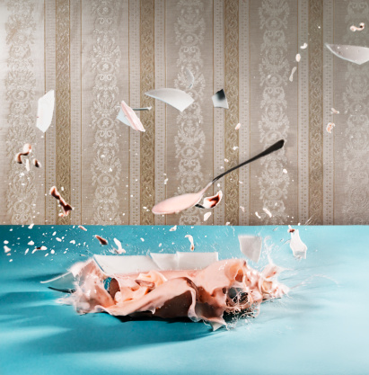

# ＜摇光＞只有美食不说谎

**美食不会骗你。你给它多少盐，它就还你多少咸。你熬得几个钟头，便有几成香。** **没精打采的时候，来碗面汤，包你愁肠都开解。矫情发作的时候，来盆米饭，你便知生活的况味一如美食之踏实，本来如此简单。**  

# 只有美食不说谎

## 文/王小面（武汉理工大学）

 

写下这个题目以后葫芦娃说我未免把人际看得太诡诈险恶了，我说没有，我只是觉得，世界上再没有什么比美食对人的冲击来得更真切，更踏实。

今天的晚饭是自己熬的红薯杂粮粥，煮了整整一个小时方得到香气扑鼻，不过稀不过稠，纯天然无添加的一碗粥。用勺子在红薯上划一下，红薯懒洋洋地被刮下一层，糯糯的茸茸的，颜色也由浅橘红变成金黄，我便知道它熟了。放两分钟以防烫着，然后舀浅浅的一勺尝，黑米的醇、糯米的糯、燕麦的Q、薏仁的香、红薯的甜，就这样一下子都流到嘴里。

我爱美食这样的真实。

**（一）什么是美食？**

人人都会说“食不在精”。我在周围问了一圈儿什么是美食，得到的答案有“好吃的”“我妈做的菜”“饿的时候什么都好吃”等等。在我看来，美食就是给你满足、使你念想的食物。

大一的时候，和梅姐、曾棉花一度发了疯一样，总在晚上十点想吃炒饭。于是就一起衣冠不整地跑下楼，对着有职业性笑容的炒饭阿姨说要一碗鸡蛋炒饭或是腌菜炒饭，加一把辣椒。夏天有过，冬天也有过，看到一颗颗饭粒在油锅里跳跃、翻滚、旋转，然后香味伴着辣味冲上来一直冲到百会穴，顿时觉得无比满足。

作为“蓝鲸人”，我爱吃鸭。我一直觉得鸭子是极难做的，不像鸡怎么烧煮烤炸都很难失败。在外面吃到的鸭子除了北京烤鸭，多半是没去掉鸭骚味的怪异的味道，要么就是肉质粗糙不得要领。刚来武汉的时候，便常常把对家的想念化作了对盐水鸭的渴望。听说南农大的教授在检测中发现盐水鸭有99种香料风味；我眼中的盐水鸭，是肥瘦适中，肉嫩汁足，是咸中带鲜，鲜中有香，香中有回味。每学期快放假的时候只要想一想盐水鸭清秀的模样，馥郁的香气，就觉得幸福不远矣。

有时候我对于美食追求也可以“上升到哲学”。我一直信奉“参差多态乃是幸福的本源”，对美食的期盼也是如此。金子在一个相声里曾经打趣到，如果拍“舌尖上的美国”就只有三集，披萨一集，汉堡一集，薯条一集。当然这是夸张和玩笑。但我煌煌饮食上国，确有骄傲的资本。且不说八大菜系，五品食材，十几种烹调方法，单就小吃和早点就已够来几桌全席。饮食的搭配自然还是有粗有精，荤素搭配，重口味加小清新最好。在武汉这样会吃的城市里上学也的确幸福，虽然还是没有爱上热干面，但豆皮、蛋酒、鸭脖子都回味无穷，而且价廉物美。什么时候咱再户部巷走起？

火锅自然是美食。不知道方便面算不算？从健康的角度来说当然不是，以我刚刚说的“满足”的标准来看它也有几分矛盾。前段时间一个段子说方便面就是闻起来很香，喝一口汤就想全部吃掉，吃完又觉得反胃又恶心的怪玩意儿。我觉着一点不假。上初中的时候一度很迷方便面，恨不得把各个牌子各种口味都尝一遍，也不懂健康之道，差不多每个周末来一两次。什么精炖牛肉、香菇炖鸡、鲜虾鱼板、老坛酸菜的，也顾不得食物和图片的差距，只觉得那股香是莫名的勾人和魅惑。

大一时也吃泡面。宿舍里只要有一个人泡上泡面，必然遭到众人口诛笔伐，继而被哀求之哄抢之。如今已经对健康非常重视，基本不去碰这各种配料疯狂超标的人间美食，只偶尔像怀念年少轻狂岁月一般怀念一下那悠远神秘的香味。听说一碗泡面的毒素积聚在胃里要花32天化解，如果你偶尔忍不住或者不得已的话，像我一样下一顿喝点解毒的红薯杂粮粥吧。

**（二）美食很美**

高中的时候语文课要以金陵为题办一份小报，彼时尚未成为吃货的我觉得食物的图片和文字往往令人心驰神往，就跟小组做了一期“金陵美食”的专题，里面写的是与秦淮八艳齐名的美食——秦淮八绝。后来这期小报得了三等奖，语文老师问我，你知道缺陷在哪儿么，我说不知道，老师只说了五个字：选题和立意。当时我没有多想。自从上了大学，经历了最早的空虚、陌生和迷茫，到后来的探索、自给自足，吃在我心里的地位已不可同日而语。

有人说唯有美食与爱不可辜负，我想说，也许是因为原始，普天之下，唯有美食美得真真切切明明白白，从不说谎。

美食很美。“鲜鲫食丝脍,香芹碧涧羹”，“秋夜渐长饥作祟，一杯山药进琼糜”，“长江绕郭知鱼美，好竹连山觉笋香”这样的句子读起来便已齿颊留香。如果想象力丰富的话，那画面应该是会绽放的明亮。

美食很美。你给它的是火候和耐心，它还你的是能量和窝心。如果你吃得太饱，不够苗条，或者吃完了觉得困，那都不是美食的错。美食 doesn't that work，就像Penny说 alcohol doesn't that work一样。

美食很美。你尊敬它的方式可以有很多，就着温茶细嚼慢咽一道小菜，或是一如梁山好汉，邀三五亲朋，席间伴酒划拳，一同风卷残云一般倒入肠胃都可以，那是别人不懂的妙和享受。中华美食从劳动中来，大体上还是喧哗热闹的烟火人间的味道。反正我是宁愿跟曹小强一起吃炒肝也不愿意跟徐若云一起吃鹅肝的。

**（三）饥与饱**

美食是一种饱足。饱不仅仅是把胃这个器官填满，更是给你百分之百的的踏实、快慰、幸福感。吃饱了不想家，吃饱了有力气干活。

又死在武大的那天晚上走了一个多小时回来，已经什么都不想吃，转念一想既然身体不好还是撑死算了，总比饿死强，于是去食堂买了炒饭。刷完卡站在炒饭那家前面，被呛鼻的油烟味熏着，看一点包菜，一点胡萝卜，一点鸡丁，一点香菇，在铁板上那么翻着。要知道，每一粒米饭在高温下挣扎、煎熬，都不是为了让你最终去浪费的。食材的最佳归宿还是胃和心。不管是为了论文到半夜，还是失恋流泪到天明，其实一碗炒饭都是可以让你满血复活的。

一度我很迷恋饱的感觉。麻辣烫总要吃八九块，自选菜来个一满碗。大约半年前看了柏邦妮写的《饥饿是很好的锻炼》，也很赞成对“饥饿”的培养的态度。

适当的饥饿会使人疼痛、清醒、一身轻。饿狠了的结果不是崩溃就是疯狂，但微饿时你的意识也有一种难得的清朗，做事效率很高，条理分明，也不再那么挑剔。饥饿能带给人的或许是更多的宽容、理解、清醒和节制。

饥一顿饱一顿是不健康的。但还是可以从健康的角度出发，自己去平衡心理和机体需要的饥与饱。维持适当的满足感，偶尔体会饥饿，珍惜真诚的感官，磨淬出发的欲望，我们都会更懂得食物的美好。

**（四）关于做美食**

寝室里一直非法藏匿着一口锅，特廉价功能特单一的那种，但它至今已炮制出不下十五种完全不同的飨食。

“下厨房”软件的首页一直写着万能青年旅店的一句歌词：是谁来自山海，却囿于昼夜、厨房与爱。我没听过这歌，却觉得歌词特美。

微博上有一个南京的爱心妈妈给儿子做365天每天不重样的早餐，每次看她做的菜我都膜拜不已。原以为这必定是有闲有钱又有逸致的全职太太了，后来发现原来也是一个上班族妈妈。

俺们寝室是我和梅姐轮流掌勺，时至今日都觉得做菜的感觉真好。听见朋友“大厨”“大厨”地叫，虚荣心瞬间得到满足，仿佛一道菜就足以令自己上得厅堂入得厨房。一番大大展宏图、“添油加醋”之后，坐下来歇歇擦擦汗，解下围裙，看着食客们大快朵颐，或是仅仅听着那碗筷交错的叮当声，就觉得比自己吃了还快活。这种快活一直延续到洗完碗都还不会消逝。

常言又道，君子远庖厨。记得第一次买一整只鸡回来的时候觉得自己简直是疯了。给光鸡洗澡的时候心里在想，反正将来早晚也要这样做给我儿子吃，就先练着吧。后来看着它颜色一点点变深，逐渐散出妈妈做的菜的那种香气，继而最后尝到嘴里感到满意，这奇妙的感觉有几分像第一次做化学实验。你萃取了食物的美好，提炼了它的本质，于是你们就一起升华了。我相信真正地老饕最终都愿意亲手实现这一种奇迹的。

美食不会骗你。你给它多少盐，它就还你多少咸。你熬得几个钟头，便有几成香。

没精打采的时候，来碗面汤，包你愁肠都开解。矫情发作的时候，来盆米饭，你便知生活的况味一如美食之踏实，本来如此简单。

 

（来自投稿邮箱；责编：佛冉）

 
