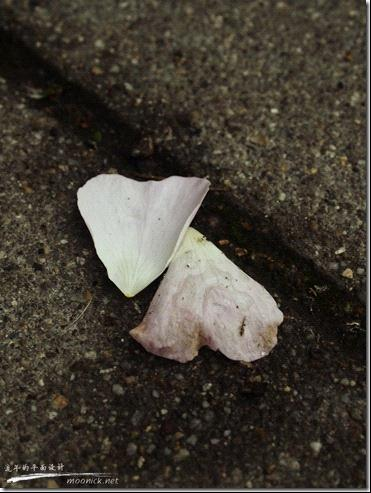
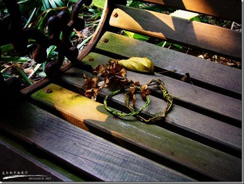

# ＜摇光＞可曾记得爱

**我们不是没有爱情故事，只是，绝少人和人的故事而已。从嫦娥奔月开始，到牵牛织女，到天仙配，到后来聊斋里的种种。文化人的丫丫已经从申到仙，最后到妖。却还是绝少给一个好的结局。也许宝莲灯，白娘子之类的传说勉强还算个团圆的结局，只是流传阶层不同，总归还是充满曲折的。地方传说里也不乏许多仙女下凡的故事，终归只是仙女而已。神仙那么多，仙女那么少，就算全动了凡心降下来，也不够各部门领导一人一个的。**

# 可曾记得爱

## 文/ moonick（武汉大学）

也许，对一个不曾有过什么爱的国家，要问一句“可曾记得爱”，就好比著名的段子“囧统，可曾记得当年大明湖畔夏雨荷”一样可笑。 在一个没有童话传统的国家，要找一些关于爱的东西，在一个普通人看来，不得不说是很困难的。 回想一下所学过的历史，书上的古文，传说里的故事。我们常常说上下五千年，可是就算不曾如鲁迅先生那样犀利的读出“吃人”两个字，要找一个“爱”字都是很困难的。而这，就是大多数普通人，对于这个奇葩的国度的历史全部的了解了。 至于爱情呢？好好想一想这其中所有跟爱情有关的故事，居然都没有一个能想到的所谓好的结局。 也许，那个时候，平民是不配谈爱情的。那么王子公主呢？对不起，我们没有。 我们不是没有爱情故事，只是，绝少人和人的故事而已。从嫦娥奔月开始，到牵牛织女，到天仙配，到后来聊斋里的种种。文化人的丫丫已经从申到仙，最后到妖。却还是绝少给一个好的结局。也许宝莲灯，白娘子之类的传说勉强还算个团圆的结局，只是流传阶层不同，总归还是充满曲折的。地方传说里也不乏许多仙女下凡的故事，终归只是仙女而已。神仙那么多，仙女那么少，就算全动了凡心降下来，也不够各部门领导一人一个的。 文化人的面子是很要命的，所以，他们只能谈些仙女的事情。至于才女们，断然连天神下凡这种事都是不能指望了。仙女可以叫下凡，而男的神仙只能私通了。地方传说里，玉帝也不例外，啧啧，多么的压抑。 非人的爱情多半是坏事的，幸福是短暂的，娃儿是可怜的，机会是丫丫的。我时常觉得古代文人的审美是病态而扭曲的，就像《病梅馆记》里写的那样。 关于人与人的爱情，或许，许多人第一反应都是梁祝或者红楼梦，再要么高级一点的孔雀东南飞，可能多少还记得杜十娘怒沉百宝箱。悲剧啊！一个又一个的悲剧！ 西厢？牡丹亭？才子佳人？非要争得死去活来，或者功成名就才配谈得上郎才女貌。或者，还是因为从书本文字里脱出，换成台上的眉目传情，雅俗共赏，多半还是要个团圆的结局不至于扫了兴致。而这其中，感情的确立往往简单，爱情的方式唯有想念(高级一点私定终身？)，大量的笔墨都在描述这些对爱情的阻挠之上。我不知道如今斗小三的主题是不是也吸取了这样一种模式。 总的来看，即使是文化人，也不怎么创造些美好爱情的故事。如今的话来说就是：再也不相信爱情了。信了爱情，也是没有好结果的。 所以，不要谈什么可曾记得爱了，他们压根不曾有过，甚至也不希望去有。 这时，终于想起古人还是讲爱的，最突出最高尚的叫爱民。什么人爱民呢？天子，父母官，这一小撮人要爱民。 而民呢？民依旧是不需要爱的，甚至他们连爱国都不需要懂，他们只要忠君(天子)，只要孝敬父母(官)就可以了。下级是不可以对上级讲爱的，没有大臣敢说爱天子吧，他们也只能忠，要不然就奸、反、内，总之不可以爱就是了。而天子呢，他有爱所有人的权利，这种爱是不对等的，多么的不对等呢？没有人可以回报他如此的博爱啊。 有些爱是不需要回报的对不对？有的爱也不可能要回报的对不对？比如高雅一点的《爱莲说》，可是天子不是佛，也做不到一个莲花的国度。倒是有天子的宠妃褒姒爱裂帛之声的，诸如此类，稍纵即逝的声音，根本就谈不上什么回报。 天子的爱民，大约也是一种超越了人和人之间的爱吧。不求回报，不需对等，备受歌颂和提倡。 这就是恒古至今，唯一广为歌颂和传唱敬仰的爱了。 高尚得多么不真实啊，p民们受得起这份爱的传统吗？配得上吗？刺死什么的爱，莫须有吧。 我想这就是，天朝上下五千年唯一仅有的爱了。 其实，在天朝这个奇葩的国度里，有许多关于爱的定义，这些定义很复杂。可是，想来想去，不单单没有爱情，甚至连爱父母也没有，更不提爱国爱民了。 我们有仁爱，敬爱，怜爱，喜爱等等等等。我们把一些叫做孝，叫做忠，叫做仁。在这许多的定义里，都只是一种依附于关系性的感情，而不曾有对“人”这种个体的简单的爱。 在天朝这个人永远太多的土地，人本身是不重要的，关系性才是维持生存的条件，不存在利害关系的统统都是形同陌路的NPC。 一个没有爱的文化，居然就这么传承了五千年，不得不说是一个奇迹。 不要问“可曾记得爱”这么低俗的问题，这是很粗鲁，很伤文化的。 一个连什么叫做爱都没有普及的国度，谈什么尊重人呢？谈什么渴望田目出个头呢？谈什么更多的什么主什么制的。 你敢信吗？你所知道五千年的历史里居然没有什么关于爱的东西。关于爱的东西都没有好的过程，也不曾有什么好的结果。 所谓的好的结果，无非只是功成名就的附属品抱得美人归而已。 我们断然不曾歌颂过所谓美好的爱情，也不曾歌颂过简单的爱。 然后，你可以想清楚许多事情。 天朝，华夏，九州，这么许多繁复而又华丽的名字之下的炎黄子孙，华夏子民，龙的传人，你们，可曾记得爱？

**转载自[流年的平面设计](http://moonick.net/)**

**本文链接地址：[可曾记得爱](http://moonick.net/2011/05/do-you-remember-love/)**

（采编：陈锴；责编：陈锴）
