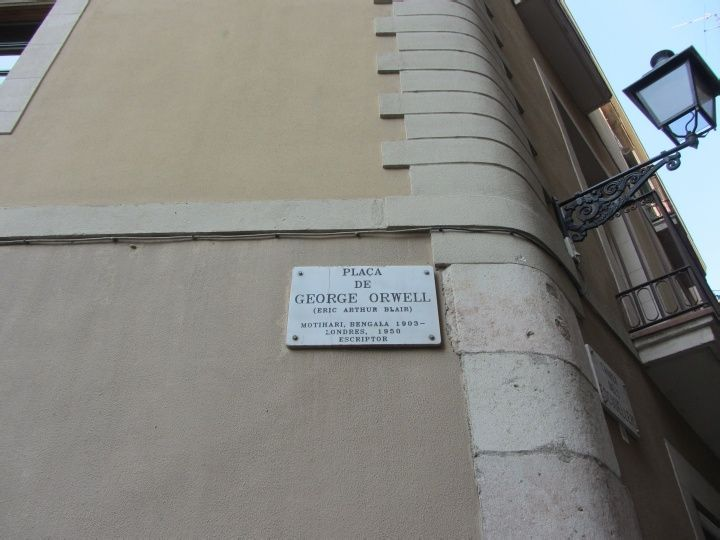
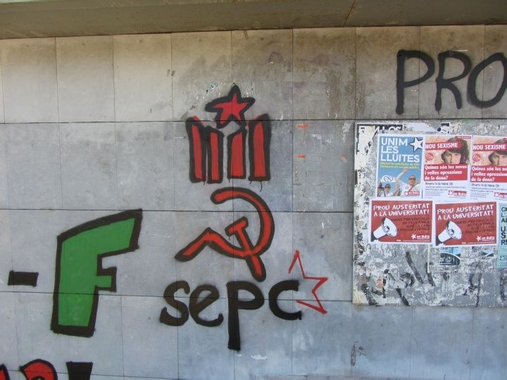
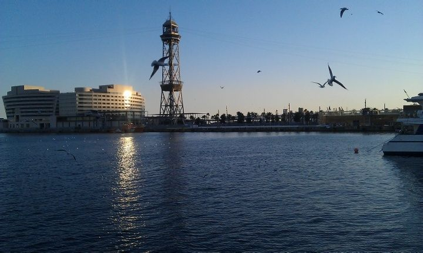
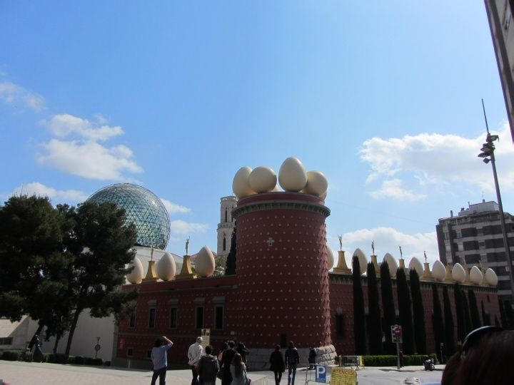
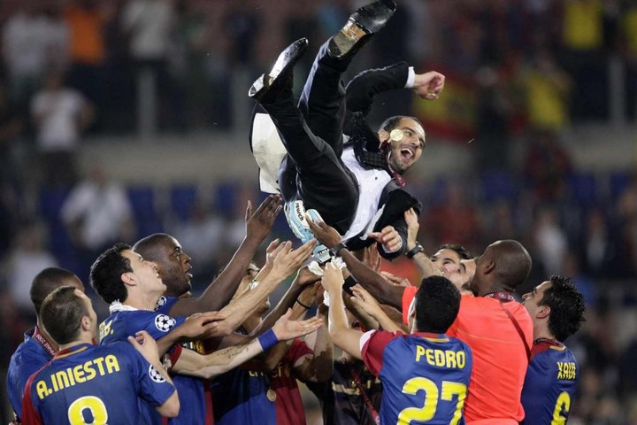

# ＜摇光＞向加泰罗尼亚致敬

**也许真的在足球这件事上，加泰罗尼亚人的性格得到了最充分的体现。华丽的球技和配合流露着无穷的生命力创造力，万众一心的欢呼呐喊更是他们不灭的团结热情之火；更加醒目的是，无论是面对西班牙的马德里、面对世界各处汇聚而来的人们，还是面对经历的所有残酷与磨难，豁达开放之外，加泰罗尼亚的尊严与骄傲从不曾被冲淡。** ** 让我也来分享这种骄傲吧！** 

# 向加泰罗尼亚致敬

## 文/雷英迪（中国人民大学）

 

我不敢说自己是循着乔治•奥威尔的足迹来到这里，如此的时过境迁也未必能让人有相似的感触。但我一定要借用他的书名，才能最好地来表达近三个月来这块土地给我的持续的激动。并且我也相信，当我最终离开这里的时候，将会像奥威尔一样获得重要的改变。

（位于巴塞罗那市中心的乔治•奥威尔广场）

**我们不是西班牙**

加泰罗尼亚自治区的独立倾向要比我来西班牙之前所预想的还要严重。他们有自己的语言、自己的文化、自己的议会、自己的国旗和国庆日，甚至有几个大使馆都专门设在巴塞罗那。我个人的立场向来是支持一切这种人们自发的独立诉求，何况加泰罗尼亚从其悠长的历史和传统来讲都确有充分的独立资格。而现在，作为人口仅占西班牙十分之一的大区，却贡献了国家总税收的五分之一，难怪这里的人们对于马德里政府有着强烈的抵触情绪。经济危机下，这种民族意识又迎来新一轮高涨。

尽管与北部巴斯克不同，这里的独立活动似乎鲜有类似于“埃塔”的暴力恐怖组织。但事实上，回溯二十世纪历史中以巴塞罗那为中心的工人阶级运动，无论是在无政府主义、民族主义还是共产主义的旗号下进行，都不可谓不波澜壮阔。加泰罗尼亚人的政治激进也是显而易见的，这从我所在的学校随处可见的独立运动标志和每月必然会有的盛大罢工中可见一斑。

这样一种从未消除的执念和激情，反映在人们身上更多的却并不是愤世嫉俗，而是强烈的民族自豪感，并且贯穿于他们生活的方方面面。

（巴塞罗那自治大学校园内醒目的加泰独立组织涂鸦）

**Fiesta & Vaga——生活的两种本质**

很多人，包括奥威尔，包括西班牙本土的哲学家加塞特，都认为西班牙是个远离现代性的国家。“我记得，我仅对一位西班牙人发过两次火，而每当忆及此事，我都认为全是自己的错。毫无疑问，他们宽宏大量，品行高尚，但这些品质都并不真正属于二十世纪。正是因为如此，人们才会指望在西班牙，即使法西斯主义也会采取一种相对宽松、能够让人接受得了的统治形式。在西班牙几乎没有什么人具备现代极权国家所需要的那种素质：可怕的高效率和高度的一致性。”奥威尔这样的描述可谓得之精髓，板鸭国的人民确实是最了解生活的真谛，而集伊比利亚的日光与地中海海滩于一身的巴塞罗那更是传说中享乐主义的天堂。在这边除了打招呼的hola,有两个词怕是外国人最容易学会的：mañana和fiesta——“明天”和“盛宴”。约会中迟到一点、做事有些拖沓似乎已经是人们约定俗成的一种习惯，而party文化在这里更是得到了最好的发扬光大。即便是目前深陷经济危机的泥潭之中，人们的生活方式却看不出受到了太大冲击。不过对于带有某种新教气质的加泰罗尼亚，人们在享受生活的同时并没有真的忘掉勤劳（这或许就是他们成为经济领头羊的原因）。

然而另一方面，正如我上面所提到的那样，加泰罗尼亚人在很多关乎自身的政策问题上绝不含糊，罢工示威就是他们最常见的意见表达。我并不住在市中心，所以很难亲身经历全民运动，但各种新闻和图片足以描绘那种激烈的场面，甚至有时以国内眼光看或许与打砸抢烧无二致。而在我所在的巴塞罗那自治大学里，占领学院、静坐示威甚至砸碎银行玻璃的事倒也是家常便饭。破坏性的举动虽不值得鼓励，但全民强烈的政治与权利意识也确实令人感叹。

Vaga（罢工）与fiesta作为他们的两个关键词，并不矛盾：人们所锱铢必较地去捍卫的，正是他们习以为常的生活享受；懂得如何真实自在地去生活的人，也就更明白如何坚定地去保守这些美好。

（巴塞罗那美丽的海港）

**不只是高迪**

建筑是城市的标签与图腾，高迪给巴塞罗那带来的这种标志性则实在是太过鲜明。在梦幻般的圣家族前，欧洲其他地方的教堂都显得那么平庸。不要忘了还有巧夺天工的古埃尔公园、离奇的米拉之家与巴特罗公寓。然而加泰罗尼亚人所引以为豪的绝不仅仅是现代建筑，无论是保存完好的哥特区，还是加泰罗尼亚国家博物馆的丰富馆藏，都体现着浓厚的人文艺术氛围。20世纪更是有三位最伟大的画家都与加泰罗尼亚有关——米罗、达利与毕加索。

青年时期的毕加索在巴塞罗那留下了他的“蓝色时期”。而相比较于过客式的毕加索，米罗才是真正属于这座城市的艺术家，位于Montjuic山的米罗基金会也是这里必去的景点之一。绝不能忘了在加泰罗尼亚偏北的地方还有一座小城Figueres，小胡子达利和他自称为“欧洲精神中心”的、无比诡异的戏剧博物馆在等着你的到来。

令人注意的是，这三位神奇的艺术家都是以不同形式的超现实主义闻名，这也在某种程度上彰显着加泰罗尼亚人的独特。也许是因为他们的现实主义已经完全能够体现在丰实灿烂的日常生活中了吧？

（老远就知道这是达利的地盘）

**¡Visca Barça!**

如果说加泰罗尼亚还有什么比高迪更为世人所知，那只能是巴塞罗那队的足球了。红蓝箭条出现在包括电视台、零食包装甚至是烤面包模具的各个角落。辉煌的历史和近年的所向披靡是加泰罗尼亚人的骄傲，也承载了他们强烈的自我认同与荣誉感。来这边之前我算不上是巴萨球迷，但身临其境便真的无法不被感染。

更可贵的是，巴萨人对足球的狂热从未使他们失去理智或者丧失尊严。写这篇文章前四月底的一周，可能是巴塞罗那队近年来经历的最惨痛的一周：先是在诺坎普输掉了国家德比，又同样在主场未能突破欧冠切尔西的阻截。两场比赛我都是在酒吧看的，然而与国内形成对比的是，这里的球迷在如此重大的失利面前竟没有一人在抱怨。尽管无论是对于运气还是裁判，似乎他们也都有充分的理由去骂上几句。他们的沉默意味着强烈的自信和不变的支持，就和输球后在诺坎普不肯离去、却高唱着嘹亮的巴萨队歌的那九万多人一样，让我肃然起敬。而今天主教练瓜迪奥拉在诺坎普的告别赛，收获大四喜的梅西与他的拥抱，以及赛后短暂而盛大的送别会，更是足球场内难得一见的煽情场面。

也许真的在足球这件事上，加泰罗尼亚人的性格得到了最充分的体现。华丽的球技和配合流露着无穷的生命力创造力，万众一心的欢呼呐喊更是他们不灭的团结热情之火；更加醒目的是，无论是面对西班牙的马德里、面对世界各处汇聚而来的人们，还是面对经历的所有残酷与磨难，豁达开放之外，加泰罗尼亚的尊严与骄傲从不曾被冲淡。

让我也来分享这种骄傲吧！

（图片来源：graciespep.cat）

编者注：

1.《向加泰罗尼亚致敬》是著名作家乔治•奥威尔的作品，堪称他的“二战亲历回忆录”。在二战中，奥威尔参加了西班牙加泰罗尼亚的民兵组织，以战争亲历者的身份描绘了战争的艰辛、民众的热情、局势的变幻、媒体的歪曲、信仰的危机等等，提供了翔实可信的战争经历。在诉说自己感受的同时，作者冷静地剖析了战争的表象与实质，传达了“向加泰罗尼亚致敬”的主题思想,就是这场战争所带来的意义，是让人们更加坚信人类的高尚品质。

2.本文作者为中国人民大学学生，目前在西班牙巴塞罗那自治大学交换；本文配图除注明来源外均为作者拍摄。

 

（采编：于灵歌 责编：黄理罡）

 
