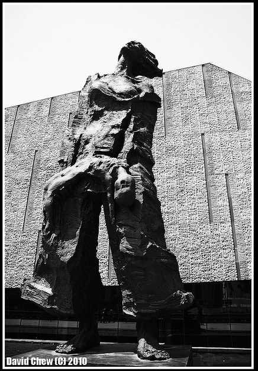

# ＜摇光＞向死而生

**《秦淮景 》：我有一段情呀, 唱拨勒诸公听/诸公各位静呀静静心呀/让我末唱一只秦淮景呀/细细哪到到末 唱拨勒诸公听呀/秦淮缓缓流呀, 盘古到如今/江南锦绣金陵风雅情呀/“瞻园”里堂阔宇深深呀/“白鹭洲” 水涟涟 世外桃源呀。**  

# 向死而生

## 文/蒹葭（四川大学）

 

一

那年路过南京时，秦淮河上灯火通明，六朝沉淀下来的胭脂水面上映照着勾栏画舫弯弯曲曲的倒影。两岸的夹竹桃不时打眼前拂过，被船檐碰落的几瓣在斑驳的水影里打着晃儿的漂荡。船娘哼着我听不懂的吴侬小调，船舱里放着秦淮八艳故事介绍的广播。

我微眯着眼睛，靠在木头船窗边，在这微凉却又迷离微醺的夜色里，水声犹耳，恍惚中仿佛又回到了晚明烟雨朦胧的季节。那时，华灯初上，轻纱幔绕的画舫里觥筹交杂、浆声回荡，灯影摇红里依稀可辨当年那些缱绻窈窕的长袖曼舞。

十里秦淮，实在是个柔软的地方。素手破橙，红袖添香，灯下品茗，月里调琴…就连那时的帝王都愿意将那高处不胜寒的孤独化在美人的浅笑中。

可是，那十里秦淮，却又是个愁绪悲凉，繁华与悲凉交替更迭的地方。人说秦淮河里浸泡了六朝的胭脂金粉，然而，那些胭脂下的清泪，也曾经一滴滴从倚楼的窗口掉落，无声无息的融化在秦淮河中。

二

还是那年，还是在南京，我在南京大屠杀纪念馆里迷了路，那里也是灯火通明，两种光，惨白的和幽暗的，晃得人看不清那些支离破碎的图片。在纪念馆的一个展厅里，有一面档案墙，密密麻麻的列了能收集到的遇难者资料，尽管有的档案里只是一个简单名字。我随手抽出一本，空荡荡的档案夹里只有一页印有两行字的纸，简单介绍了这个人的姓名，大致年龄，以及家属。最后一行写着

“XXX及全家均在南京大屠杀中罹难”

又抽了几本，大体都是这样的介绍，一页白纸几行铅字，交代了一个人的结局。曾经那些过往的生命就漂浮在这些结局上，连不甘不满都无法表露。这些白纸黑字堆叠起来，可以搭起一面纪念馆的墙壁，也可以汇总成一个历史数字。可是，寥寥几行的简介却再也勾勒不出那曾经的鲜活生命了，一路嬉笑怒骂，羁绊曲折的历程都被历史生硬的切断了。

在这样一个地方迷路，其实是情有可原。因为走到哪里都是触目，看到什么都是惊心，满耳的啧啧声也不绝如缕，是愤怒？同情？耻辱？还是一种仅仅从感官引发的叹息？周遭人们表情都差不多，抽搐着一种漠然的疼痛。能听得见的评论大抵可以总结成两种：一是遇难者太惨了，二是日本人太变态了。但每个旁观者心里是什么感受却又不得而知，有些情绪或许只是没有表现出来，又或许是不愿表现的那么肤浅，因而不思量也就不好评价。只是，在我的迷路时间超过了导游规定的参观时间，导游一脸愤懑的教训我耽误了大家去望江楼玩得时间时；只是在我看到小孩子说万人坑不够大，不如想象中的好玩时；只是在人们出纪念馆的大门，将脸上抽搐出来的悲伤换成如释重负的轻松时……心里像是被钝钝的金属划了一下，开始只是一个白印子，后来慢慢豁开，渗出血也是缓缓的，疼也是木木的。

 

三

关于南京的印象大抵就是这样，白天在一幅幅黑白照片中看到了生命的脆弱，看到不能掌控的灭亡。晚上又在十里秦淮上听水榭丝竹，吹拉弹唱里隐隐的是漂泊的辛酸。那时我在想，当年遭遇大屠杀时，这六朝繁华之地又是怎样一副光景呢？这些红翠绿艳，莺歌燕舞又是怎样在这炮火里湮灭呢。再想到大屠杀中女性所遭遇的那些非人待遇，心下黯然，那时刚看过《海上花列传》，想起序言中的那段文字，便只能是祭奠了。

“不料那花虽然枝叶扶疏，却都是没有根蒂的。花底下即是海水，被海水冲激起来，那花也只得随波逐流，听其所止。若不是遇着了蝶浪蜂狂，莺欺燕妒，就为那蚱蜢、蜣螂、虾蟆、蝼蚁之属，一味的披猖折屏，狼籍蹂躏。惟夭如桃，称如李，富贵如牡丹，犹能砥柱中流，为群芳吐气；至于菊之秀逸，梅之孤高，兰之空山自芳，莲之出水不染，那里禁得起一些委屈，早已沉沦汩没于其间。”

四

《金陵十三钗》，张艺谋的新片子。

看之前只是知道讲的是有关南京大屠杀的，有关妓女和女学生的，还有人戏称这部片子是处女保卫战。于是抱着奶茶和爆米花来看热闹。

动笔之前看了相关的影评。人说《金陵十三钗》开头无外是国产战争大片的龙套情节，可是有关生死的场面看着还是会动容。或许外国人不懂这种以命换命式的原始战争，只是认为这是一种落后的，愚笨的作战手段。想起江南在《上海堡垒》里写苏婉拉下大楼自毁操纵杆时，他说，外星驴们是不会理解这个民族在早年的抗战中背着手榴弹炸坦克的行为的。当然，这个民族有着一种很崇高的牺牲精神，从最早的曹子建就有说过“捐躯赴国难，视死忽如归”。就是这样，炮灰们排成一排，无非是先后而已。在那个碾压生命的岁月里，整个民族的命运都向死而生。李教官带领着弟兄们死在了即将出城的路上，观众们叹息，痛心，可惜。可是，出了城又能怎么样？或者脱了军服化成平民又能怎么样?整个民族的命运都绑定在了一起，就算可以苟活，也洗不掉这场战争的烙印。当年看《团长》的时候，后来孟烦了选择留在禅达，战争结束了，可是他却不能开始新的生活，他知道，他的生活已近被留在南天门上的那一千个死人占据。没有人幸存，这是一个时代的悲剧。

肉身撞坦克的动作情节过去后，老谋子的十三钗终于登场了，在一群衣衫凌乱，面容灰颓的女学生的注视下，从那扇斑斓的玻璃彩窗的破洞里，我们看到，这群风尘翩然，腰肢扭捏的女人翻过教堂大门，嬉笑着走进了接下来故事里。

就是这一瞬间，我关于南京的两个记忆的片段被连接了起来，秦淮河被这帮看似毫无愁绪的女人们搬进了避难的教堂，小小的地窖里支起了麻将桌，摆上了胭脂水粉，还断断续续的弹起了琵琶。只是不同于晚明或者前清的歌妓艺妓。这十四个女人却是除了吹拉弹唱之外，踏踏实实的操着皮肉生意的主儿。一出地窖，风尘气就开始蔓延，先是和冒牌教父的调情，后是妓女之间的吆喝调戏，嘻哈之语像是刀片一样刮着那群女学生的耳蜗和神经。只是，从女学生的眼光里，除了轻蔑，还有嫉妒。

中国传统自是如此，淑女就是淑女，婊子就是婊子，管你内心里是高洁还是低贱，入了这行就再也洗不脱关系，别说是这些烟花巷的风尘女子，就是当年周旋于文人雅官中的薛涛，至死都逃不开“妓”这个后缀名词。于是，女孩们和钓鱼巷的这些个头牌自然不能两立。只是，在即将到来的日军眼里，她们倒是一样的，都是俎上之鱼而已。

略去情节不谈，引发人们争议的无外是那个看似合乎传统道德观的交换。或许有人保佑侥幸，认为姑娘们参加日本人的庆功会是失贞的问题。换成这群久经人事的头牌去便不是什么大的问题，不过是一个道德观不同而已。可是编剧草蛇浮灰，豆蔻的惨剧是一个暗示，再者，原为殡葬师的教父给躺着的姑娘们烫头发化妆时，我就已经猜到了她们的结局了，只是，她们在死前仍雀跃着想要梳一个漂亮的女学生发型的场景，让人不免辛酸难忍。

自古烟花之地是非多，但这斗争大都不过是争风吃醋而已，妓女无情，因而更重情。十四个女人（豆蔻二人未死前）虽是嘴上不饶人，但姐妹情却看上去很是浓郁，颇有现代闺蜜嬉笑怒骂的范儿。遗憾的是，从那几个女学生身上，我没有看到她们之间的同窗情，书娟为了她的同学们才没有走成，到头来却反而遭到同窗们的责怪，可见这个情节的安排已经反映了影片的道德倾向了。到后来，女学生们准备集体跳楼时，听到玉墨等人情急下说替书娟赴会。待书娟还在犹豫时，其中一个学生忙不迭的问：“说清楚，哪个替哪个？”这一句足见那些个小姑娘并非如她们年龄般的天真，甚至可以说，她们的心机全部隐藏在了看似友谊团结的表面下了。可惜的是，那帮烟花傻蛾子还激动的一个个自告奋勇的要去替她们。

小时候看倚天屠龙记时，殷素素对小无忌说不要相信漂亮女人，她说漂亮女人多半是会骗人的，多半不是好人。但在这部电影里，这些平日里横行霸道漂亮头牌们却当真在生死这个事上求真务实了一把。她们天真的以为替了女学生，就可以洗去商女不知亡国恨的骂名，洗去这半辈子的耻辱。只是，令人难过的事，也正是她们的耻辱才让她们被默许为最佳的替罪羊人选。

半生流落烟花已是人生不幸，而结局却是因为这不幸而要更加不幸。

一种可怜生，不尽落日满烟雨。

苏小门前长短条，春风不能度，只得待秋霜。

在我看来这真的不能算是救赎，不过是悲剧里的悲剧而已，没有什么非得不可，或许在她们眼里她们代替女学生赴会是件轰轰烈烈的大事，只是在旁人眼里，这一切都成了理应如此而已。

但转念又想想，其实没有什么值不值，不过是死在哪里而已，命运这个东西很奇怪，像是有一种势不可挡的力量拉着你前行，有了开头就写好了结尾，《废都》里唐宛儿对庄之蝶说“睡在哪里不都是睡在夜里”。其实是一样的，死在哪里都不外是死在路上。若是玉墨她们坐上卡车逃出了城，也未必会能幸存，因而两辆卡车，虽然开向两个方向，但在那个命如草芥的年代，能活下去的又能有几个呢？就算是活下去了，也早已身心俱疲了。

晚明复社领袖钱谦益曾作诗追悼秦淮八艳之一的寇白门曰：

“寇家姊妹总芳菲，十八年来花信迷， 今日秦淮恐相值，防他红泪一沾衣。 丛残红粉念君恩，女侠谁知寇白门？ 黄土盖棺心未死，香丸一缕是芳魂。 ”

黄土盖棺心未死，香丸一缕是芳魂。我安慰自己，或许当那些慷慨赴死的秦淮女人们在地下与家人相见时，这一身女学生的打扮或许能让她们家人稍稍安心吧。

从秦淮八艳的爱国情怀到金陵十三钗的大义慷慨，我们辛酸的得出一个结论，这风尘女子只有沾染上了民族大义才能勉强换个好名声，只是，有没有人想过，如果没有男权社会的压迫，怎么会出现妓院这种场所呢？如果没有民族大义，没有那些个是非曲折，乱世里，她们也不过是妄求一席安身之地的可怜女人而已。就像当年柳如是所写的江城子：

“梦中本是伤心路。芙蓉泪，樱桃语。满帘花片，都受人心误。遮莫今宵风雨话，”

都是人心误，满宵风雨话，只有秦淮河记得她们，记得曾经从窗口留下的那一滴泪，记得那些向死而生的命运，向着最终的结局，从盘古流到今。

《秦淮景 》

我有一段情呀, 唱拨勒诸公听 诸公各位静呀静静心呀 让我末唱一只秦淮景呀 细细哪到到末 唱拨勒诸公听呀 秦淮缓缓流呀, 盘古到如今 江南锦绣金陵风雅情呀 “瞻园”里堂阔宇深深呀 “白鹭洲” 水涟涟 世外桃源呀

 

（采编：楼杭丹；责编：应鹏华）

 
