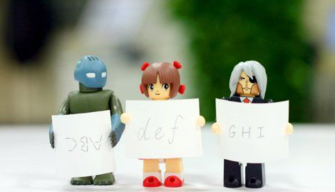

# ＜摇光＞告别傲慢与偏见

**当一个人没有条条框框做事情，脑子里没有装那么多规范框架，他会尝试任何有效的方法，不管你资深的程序员气的咬牙切齿，我的任务就是完成了，靠我的“聪明才智”。我可能由于各种原因失去了上名牌大学的机会，但我会给我自己创造出更多的机会。这样的“精神”，在一个经历本科、研究生正经培养，又去了大型软件公司工作几年的人那里，很大程度上是缺失的。因为我们不仅傲慢，而且带有偏见。**  

# 告别傲慢与偏见

## 文/ 尼莫

 

经常听到很多身边的人说，javaeye，csdn上面整天泡着的那帮饭桶，他们简直是对程序员的侮辱。也有不少人不屑于看那些没有经过正规训练的web程序员一眼，因为他们就知道拿dreamweaver拖拖拽拽，vim是啥都不知道，更别提手写一段最简单的html “Hello, world!” 文档了。我知道这不是空穴来风，我也见过这样层次的人，知道状况有多糟。

但这就是现状，必须得承认，正是这么多从技校毕业出来的人充实进了庞大的程序员大军，造成了php, javascript, css, html这些本来我们都懒得干的事情被干起来了，而且呈现出越来越流行的趋势。我们必须承认，没有一个学校会开设php的课程，可以说如果不是自学，没有一个学计算机的人毕业的时候会php，但是没有人会否认php在web开发中难以撼动的流行度。

今天有幸跟一个创业多年的朋友聊天，他曾经做到了著名外企很高的级别。他告诉我，Discus！在中国有200万的站长，他们每年开站长大会组一个几千人的会场都只能是站着挤得满满的。Discus!的老总跟他说：“夸张一点说，这些人没一个小学上完的，所以Discus!力求做到所有建站的事情都模块化，傻瓜化；但是另一方面，我深深的感受到这些人是中国最具有活力，最具有创新精神的。”

我相信他说的是肺腑之言。当一个人没有条条框框做事情，脑子里没有装那么多规范框架，他会尝试任何有效的方法，不管你资深的程序员气的咬牙切齿，我的任务就是完成了，靠我的“聪明才智”。我可能由于各种原因失去了上名牌大学的机会，但我会给我自己创造出更多的机会。这样的“精神”，在一个经历本科、研究生正经培养，又去了大型软件公司工作几年的人那里，很大程度上是缺失的。因为我们不仅傲慢，而且带有偏见。

“Arrogant”这曾经是电影《狗镇》深刻讨论的一个话题，很不幸，我发现没有人能摆脱它。傲慢和偏见会让我们的认知产生很大的偏差，对一些事物不加客观的分析而产生抵触情绪。我知道不少程序员都从后端开发转到前端开发了，这个他们之前（包括我）嗤之以鼻的工作。上大三的时候一帮认识的朋友去拉做网站的活，还找我一块干，我就非常厌烦。做网站那么没价值含量的东西，一个名校的本科生去干？说实话那时我不懂做网站。这两年互联网大热，js由于ajax这个概念的炒作及一帮先驱者的努力重新焕发了生命的活力。不少人都开始抱怨没天理了，自己在辛辛苦苦的处理很多底层进程调度的问题，大规模集群的问题，可拿的工资有可能还不如那些web前端工程师拿的工资高。现在移动又火起来了，一个普通的android工程师至少会有1w5的月薪，而他可能只是懂一点java，做过一两个android上的简单开发。算法？扯淡吧。

我想说，这就是我们用技术封闭了自己，在意淫的同时带着偏见的去看待IT世界发展的趋势。其实我觉得如果一个程序员看不惯当前国内市场的现状，认为“世无英雄，遂使竖子成名”，你可以站出来，用自己的实际行动来告诉别人其实低级的活也可以高级的干。我相信这样的人多了，这个行业也会变好。作为技术本身而言，我觉得没有什么好坏，可以探讨的是如何让它更好的为人们服务。

以前跟另外一个前公司的技术高管聊，他说他在外面打拼了三四年，这边呆了七八年，现在才从那种技术性的思维中跳出来。他告诫我，你越早跳出来，你就越早发现其实世界很广阔。

所以现在，我不拒绝前端网页设计，我不拒绝dreamwaver，我也不拒绝SEO。无论你告诉我这些事情多么恶心，多么没有技术含量，多么有损形象。

差别不是体现在做不同的事情上，而是体现在做同一件事情，谁做的更好上。

 原文链接：[告别傲慢与偏见](http://www.pengzhang.org/2011/07/%E5%91%8A%E5%88%AB%E5%82%B2%E6%85%A2%E4%B8%8E%E5%81%8F%E8%A7%81/)  

（采编：陈锴；责编：陈锴）

 
