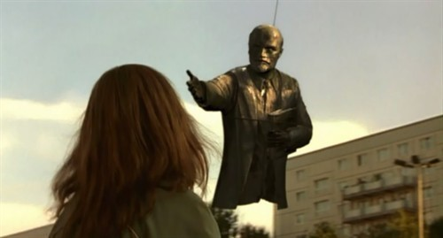
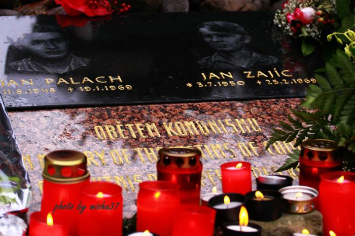

# ＜摇光＞告诉我，未来究竟是什么

**即使没有这个未来，至少，我们对自身罪责的清醒会提醒我们，有些事情，无论其结果如何，是必须做的，比如对沉默的拒绝。缺乏勇气并非不能原谅，之所以尊重英雄，正是因为并非每个人都是英雄。然而，做不到最好的水平并不是可以什么都不做的理由，也不是推卸自己义务的理由。虽然面对危险的时候会动摇，但是为了对自己忠诚，一些并不面临切近危险的事，我应该做。在这里的缺席，只能被理解为对犯罪的纵容，其恶劣程度，并不亚于犯罪本身。**  

# 告诉我，未来究竟是什么

## 文/张舸（清华大学）

 

记得大约是在半年之前，徐超君写过一篇《[不要让诅咒自我实现](/?p=10261)》。那个时候，徐超君还在人人上大活跃，关于Logistic曲线的比喻，我们是曾经讨论过的，不过直到现在，我还是对于这个模型抱着相当的怀疑。再过不到一个月，徐君就可以出关了，谨以此文，预为欢迎。

在过去的一年里，不论是乐观还是悲观，不管是正在用力推动，还是在冷眼旁观，每个人都已经看到，并且正在看着这个世界的变化。尽管，没有人能够判明这种变化的方向究竟如何，但是至少，水开始流动了。

然而，我们仍然没有办法知道，未来究竟会是个什么样子。虽然应该承认，没有什么让未来成为注定的，也没有什么阻止人们去改变未来。是不是众人的预期就一定会成为现实呢？是不是众人的努力就可以改变水的流向呢？是不是，如果我们每个人都不悲观，所谓的诅咒，就不会实现了呢？

倘使历史的逻辑如此简单，如果美好的愿望和正当的努力就能换来良好的结果，那么这个世界，实在是太甜美了。然而我们知道，共产主义是确确实实地失败了的。不管是历史，还是集体，都有一个“自身”，这种自身是如此的庞大，大到我们无法预言不管是外部还是内部的作用力，究竟会给它带来何种程度和方向的影响。

更何况，你如何又能知道，这作用力本身的方向呢？

在徐君写了那篇文章之后，我在秦晖老师的课堂上，见到了一位堪称油盐不进的伪科学社会主义者，此君在所有基本概念上的纠缠不清，几乎使人怀疑是否与他在同一个世界。直到那门课结束，那位伪科学社会主义者，还是没有任何长进。后来，两个月之前，我与奥布莱恩在沉默权的问题上稍稍论战了一番。虽然从技术上讲，这场微论战实在毫无价值，然而这个过程至少证明了，通过语言说服一个人，这种事情是根本没有办法做到的。

那么，行动又如何呢？虽然在过去的半年里，我们不断地看到事件在发生，并且不断地预期这些事件将会动摇什么东西，然而在这些事件——至少在表面上——尘埃落定之后，难道我们没有意识到，又有什么收紧了吗？当然，你可以争辩说这是垂死挣扎或者回光返照，然而，你没有证据。只有当未来真的到来了，我们才有信心去做这个总结，在这之前，你没有证据。

既然如此，积极，或消极，似乎是全然没有意义的——既然你会发现，你并没有办法影响身边的人，改变他们的想法和行为。换句话说，你不但无法预见未来前进的方向，甚至无法对它的方向产生符合预期的改变。而你在说着“日拱一卒”的时候，是否真的看见了这卒向前进了一步？

也许，这个国家太大了，这个历史太沉重了，大到、沉重到不仅仅是难以转向，甚至根本就是不能转向——有无数种合力，有无数人的手，无论是有意或是无意，都放在这艘船的舵上，而它究竟会驶向何方？我们所预期的航道又是如此狭窄，究竟是因为什么，我们竟然能够如此自信地假定，它一定就会驶向这个方向？甚至，它驶向这个方向的可能性比完全不存在高哪怕一点点？

的确，希望是存在的。这是因为，我没有办法举出任何证据，来证明未来一定就是失败。然而，这并不能让我对未来这个东西究竟是什么有哪怕一丝一毫的认知。未来究竟是什么？这个未来，究竟是否由今天的努力所影响？这是我所不知道的。

换句话说，徐君那个说法是否成立？是不是悲观的语言，或者说诅咒，就会自我实现？我不相信悲观的言语比乐观的假设更能改变人的想法，所以我也不相信，如果我们放开手，这个国家就会更快地沉没。

那么，既然这样，我在这里做什么呢？我写的这些究竟是什么呢？反正今日所为，并不能确定地影响未来，则放任自流难道比其他任何选择更坏吗？也许，这样的想法，实在是太自负了。前些日子，陆遥遥师兄对我们说，我们这些人，是一定能看到中国民主化的。对于这句话，我并不相信。就算承认中国总有一天会变好，但是这一天究竟有多远？我还没有看到曙光，也没有看到催促启明星的方法。而我们这群人，不过只剩下五十年。

可是，就算这样——

我必须承认，上面的想法并不是发生在今天。在徐君写那篇文章的当时，我就已经开始相信，这个曙光并不会映入我的眼睛。然而在那之后，我依然在看，在写，在尝试说服，在拒绝沉默，虽然我所写不被人理睬，我所说不被人信服，我发出的声音在风中飘散。

这只是因为，我的希望并不仅仅指向外界，也指向自身。对于我自己，我有作为人的义务。换言之，作为这个国家的一员，我有极力将其改善的义务，而作为个人，我需要对可能存在的、未来的评价负责。当然，这个所谓的未来的评价，并不在预期之内——更有可能的是，如果变化并没有发生，那么这个时代，将会和历史上任何一个沉默的时代一样被遗忘。然而即使有最微小的可能，我也不愿意面对这样的可能性：在一百年以后，人们说“看哪，看那些过去的青年们，在最恶劣的时代他们不说话，在罪恶进行中他们不阻止，对同胞的苦难他们视而不见——看哪，看我们的先辈，他们被威胁吓破了胆，是一群懦夫”。是的，我无法接受这样的评价。当然，我并不相信，仅仅如此程度的履行义务就足以使自己处在清白无辜的状态，既然在意未来的评价，那么必须对自己以最严苛的态度要求。所以，今日所为，并不足够使我敢于为自己辩护。

然而，如果在此刻沉默了，我们将更无法面对未来的目光。沉默的理由在这里是重要的，虽然其并不带来关键性的区别。如果沉默是因为恐惧，则这意味着，你规避了指向自身的风险而把它转移给了自己的同胞，你在同胞面临风险的时候并没有和他们站在一起。当然，你并不因为生于此地、生于这些人身边而对他们有任何额外的责任，但是在道德上，这种理由并不能压倒同样作为人类的互相之间的怜悯之心。而如果沉默是因为无力呢？如果我们确信，是否保持沉默，并不能影响未来呢？然而没有证据能够表明，今天做的事对未来的影响究竟是处在何种的程度与方向。那么，你就过于轻率地放弃了可能的希望。从而，假若事情的发展证明，在那个时候适当的行动恰是能够改变一切的，那么良心是否会陷入自我谴责呢？

即使当我们发现，我们实际上并不能阻止什么的时候，这并不足以使我们感觉到可以免除自己的责任。今日所谓的罪行，并不是某个个人对另外一个个人的罪行，而是一个群体对其构成成员以及其外的人的罪行。在这个地方，我无意展开对某政权合法性的任何讨论，然而政权既然存续，除流亡者以外，无人能够自外。既然如此，对这种罪行，每个人是应当一致地负有道义上的责任的。这应当是基础，而个人的身份和行为所导致的罪责，应该成为上面的责任的附加，虽然只有后者是可处罚的，然而这并不意味着对于前者，道义上的反省是可以略过的。

如果我们真的有一个未来，那么，对于过去的历史的自我清算，将能够成为一种力量：当面对不管何等的危急处境，我们都会记得，推卸自己对于自己的责任，将自己的幸福和安全委托于他人之手，将带来如何恶劣的后果。如此，新社会将不再面对堕落的风险，极权崩解之后将永不诞生新的极权。尽管这个未来还会面对种种挑战，至少，我们已经封闭了一条通往悬崖的道路。而如果没有这个未来呢？

即使没有这个未来，至少，我们对自身罪责的清醒会提醒我们，有些事情，无论其结果如何，是必须做的，比如对沉默的拒绝。缺乏勇气并非不能原谅，之所以尊重英雄，正是因为并非每个人都是英雄。然而，做不到最好的水平并不是可以什么都不做的理由，也不是推卸自己义务的理由。虽然面对危险的时候会动摇，但是为了对自己忠诚，一些并不面临切近危险的事，我应该做。在这里的缺席，只能被理解为对犯罪的纵容，其恶劣程度，并不亚于犯罪本身。

做到了这些之后，我也许能够坦然地面对后世的人，不管到了那个时候，世界究竟是怎样。于是，未来究竟是什么，也许没有那么重要，在今天究竟是悲观还是乐观，究竟有没有诅咒脚下的土地，也许也没有那么重要。如此，便没有人能说今天的努力全是白费，不管它是否取得了与付出相符的成果。这只是为了自己，为了一个保持内心纯洁的自己。

 

（采编：佛冉 责编：黄理罡）

 
