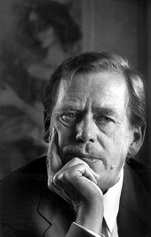
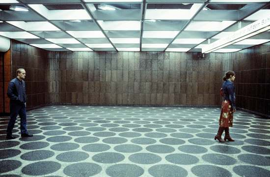

# ＜摇光＞哈维尔先生，你好

**显然，后极权的时代里，公开的奴役亦或屠杀已经褪去，它以另一种面貌出现，也更像是“功能性虚构”，你必须学会和自我欺骗相生相伴，并且以极大的热情去适应它，拥抱它，生活里不再有真实，反智主义和犬儒主义才是你的一生。**  

# 哈维尔先生，你好

## 文/达央（西北民族大学）

 

“但是，可以对你保证的是，这些显然很幼稚的话语，都是来自这个世界里一个具体的但并不总是轻松的经验，如果我可以这样说，那么我知道我在说什么。”

——瓦茨拉夫·哈维尔

瓦茨拉夫·哈维尔在漫长的牢狱生涯中，他的撰文曾经鼓舞了当时所有东欧最杰出的头脑，在萨米亚特的文论集中，有关他的引文随处可见，知识分子的良心与责任，反政治的政治，无权利者的权利。这些堆叠起来的概念，曾经是那一整代人曾经面临的问题和困惑，也是全人类的的困惑。

自从丘吉尔发表铁幕演说一直到80年代末，无论是在布拉格，还是匈牙利，在东欧，极权的毒轴已经旋至每个东欧人的内心，它无所不在，渗透于每一个生活的细胞中，苏联学者雷达里赫曾经形容这样一种生活的方式，“积极的不自由”。

显然，后极权的时代里，公开的奴役亦或屠杀已经褪去，它以另一种面貌出现，也更像是“功能性虚构”，你必须学会和自我欺骗相生相伴，并且以极大的热情去适应它，拥抱它，生活里不再有真实，反智主义和犬儒主义才是你的一生。作家塞梅契卡先生说道：“有这样一些快乐友善的人,在他们的现实里除了积聚财富外什么也不重要.他们穿名牌,开名车,在他们的现实里书本无用,黑人懒惰,丹麦人醉酒,犹太人滑头,波兰人饶舌,美国人有钱,所有的哲学家都是黑客, 我们中有谁没和这样的人攀谈过呢?”

哈维尔强调“真实”意义，强调自由意志，以及如何在谎言与失序的环境中有尊严的生活，自从马基雅维利以一种阴暗而又不可救药的人性观开启了现代政治学的大门之后，无论是哈维尔还是更具理想主义的伍德罗·威尔逊，他们无一例外的质疑马基雅维利主义的功用和范畴，强调政治的善意与美好。他们同样拒斥相对主义，因为无数的冤魂与苦难已使曾经璀璨炫目的东欧陷于近乎野兽的境地。

1989年12月29日，瓦茨拉夫·哈维尔当选捷克总统，在90年的新年致辞中这位曾经的“异议者”说道：“人民，你们的政府还给你们了。”由此开启了东欧的新浪潮。苏联，这个曾经不可一世的邪恶帝国最终解体，它的毁灭，显得荒诞而又明快。而这个近似“灰姑娘”的政治剧，则成为这一次民主化最好的一个注脚。这位具有摇滚明星气质的思想家，更像是历史的一种隐喻，当”历史火车“的理论被丢入他自己制造的垃圾桶时，个体的力量与浪漫，也许才是历史的真谛。

铁幕之下，似乎没有人确信自我的，个体的力量，当萨米亚特的文稿以一种脆弱的，不为人知的方式四处流走时，那里曾经诞生过伟大的帕斯捷尔纳克、索尔尼仁琴、曼海尔施塔姆。智力的流动与碰撞，更准确的说应该是良知的召唤，或是文学的力量，那些纤细的印刷字体，更是每一个个体的光芒，它们曾经穿透过巨大的铁的幕布，并且摧毁了铁的幕布……

 

（采编：麦静；责编：麦静）

