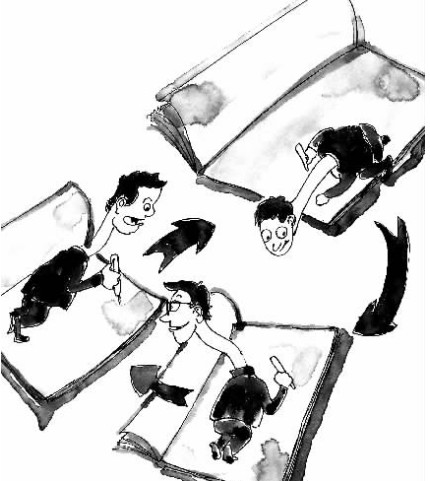

# ＜摇光＞哭笑不得——记一次论文被抄袭

**正我是彻底傻眼了，就这么一篇文章，竟然会被两拨人抄去，尽管我对我国的学术环境本来就没什么好印象，但这次这种事儿发生在自己身上，还是止不住地咂嘴，本来我写那篇论文的时候，学术态度就够不严谨的了，没想到还真有比我下限的人，为了几块钱稿费或者简历里能多几行字，不惜去传播谬误。**  

# 哭笑不得——记一次论文被抄袭

## 老阿飞（四川美院）

 

无意中发现一哭笑不得的事儿，刚才突然脑筋抽筋查青岛里院的东西，结果在百度文库里面找到一篇叫做《近代青岛的地域性建筑——里院建筑》的论文，因为显示不全只能看到中间的一页，结果我越看越觉得眼熟，我操！这不是我的大学毕业论文嘛！一个字不带差的！结果翻到最后一页，发现作者竟然是白志伦（沈阳建筑大学建筑研究所）， 彭永努（青岛胶州市城乡建设局）。

我这篇论文原本叫做《浅谈青岛里院文化的形成》，其实是个谬误百出的东西，当年身处重庆，没有时间回青岛好好查资料，于是只能是在网络上搜集各种资料，然后在青青岛论坛的城市档案栏目里面跟众多文史前辈求教，引用的资料包括王铎、鲁海等青岛文史专家的文章及访谈还有青岛档案馆和政务信息网上公开的资料，而论坛上琴屿飘灯、颂山等前辈都曾给我提供过资料，但是，因为这些资料毕竟都不是第一手的，所以归根结底其实是一篇资料整理汇编，但最终这个论文依然是当时网络上可见的仅有的一篇关于青岛里院的系统论述（数年后通过一些朋友我才知道，其实当时有研究里院的人，但是他们的研究成果要么没发表，要么是作为评职称的那种论著发表在系统内部，在大众范围内不可见）。

因为是个存在很多错误的东西，所以我除了扔在自己的博客和豆瓣的发现青岛小组里，以外的什么地方都没放，甚至给我很大帮助的青青岛论坛我都没扔。不过，因为这篇论文选题的独特性，我还是顺利地拿到了学位证。07年的时候，青岛市南政协要出一套青岛文史丛书，所以这篇文章被台东镇——李老师要去了，后来作为补充资料收录在[《里院-青岛平民生态样本》](http://book.douban.com/subject/6523349/)中。啊，想起来了，这篇论文的英文开题报告还是当时身处纽约的五宝帮我翻译的，擦，怀念了，那个时候我跟五宝在涂鸦王国上刚刚认识，妈的时光如水生命如歌啊……

一晃，将近六年过去了，没想到今天竟然是这种情况下再次重逢。

得到作者信息之后，我就用关键字搜索了一下，发现这篇抄袭文章竟然发表在2008年中国近代建筑史国际研讨会上，我靠……这到底是多么不靠谱的一个研讨会啊，而且这篇文章还收录在清华大学出版社的一本《中国近代建筑研究与保护6》中，我彻底扶额了，我那篇论文，除了资料上的谬误外，各种稚嫩的语气，各种滥用到爆的了，还是被轮，结果隔了很久我才无意中发现。但是最主要的问题是，我擦这帮人根本不知道我这闺女有艾滋病啊！！！

哭笑不得，哭笑不得。

后记：刚才又仔细看了一遍第一拨抄我的内俩哥们，他们还煞有介事地标上了几个资料出处啊！我说你们有功夫去跟着老子的论文一点点翻出处，就没时间跟精力自己去写一篇嘛？！

编者注：本文副标题为编者所拟。

 

（采编：黄理罡；责编：黄理罡）

 
