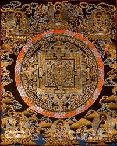
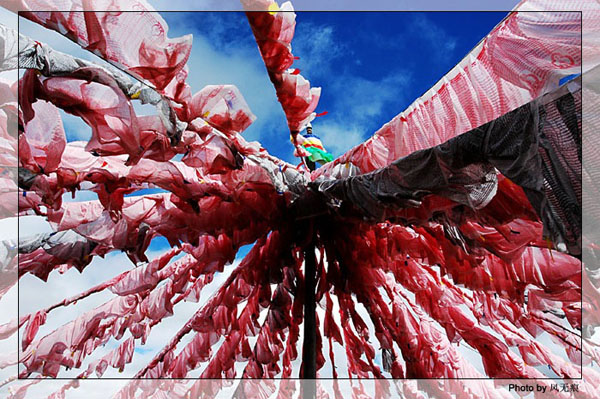

# ＜摇光＞唐卡与莱蒙托夫

**关乎民族独特性的言说，对于游牧文化的迷恋与向往；对于宗教仪式与宗教文化产生盲目的热情，被这种热情所感染，而滋生出的一种浅薄的民族主义，而这一切，几乎是每一个正在经受现代化洗礼的藏族年轻人的共性，他们对十三世达赖喇嘛，更顿群培这些现代化先驱的概念模糊，对于薛东（音译）的批判精神及理念似乎也只是抽象的臆断与偏执的定夺，一个民族盲目的“传统意境”或是“传统洁癖”勾画出的是面对现代化的无力与虚弱，而如何在现代化的进程中构建起智力上的自尊与自信，才是我们这一代人面临的最大问题之一。** 

# 唐卡与莱蒙托夫

## 文/达央（西北民族大学）

 

**因此，我一出生就带着一个过去，在关键的部分，我是我所继承的东西。并且不论我是否喜欢，是否认识到这一点，我都是一个传统的承载者之一。**

**——阿拉斯戴尔·麦金太尔**

接到S的电话是仓促的，我与他有七年未曾谋面，他的父亲在我们那里是个小有名气的唐卡画家，在并不遥远的七十年代，藏文化仍旧被沉重的意识形态所裹挟，艺术只是官方节庆时口号化的宣传与教条，唐卡艺术作为宗教艺术的一部分，被定义为“奴役与压迫人民的毒药”。到了S学习唐卡的时代，已于他父亲所处的时代大相径庭了，这个国家已经成为全球第二大经济体，外界宣称它是“引领世界前进新的力量”。

历史以惊异的方式变化，唐卡艺术也从历史的废墟中重生，它走出神圣的庙宇，出现于高档会所与酒吧，甚至按摩浴池……它不再是令人厌恶与恐惧的“毒药”了，它既是藏族传统文化的瑰宝，也是展示个人身份与地位的工具，是消费世界里文化工业的一部分。原本属于宗教意义范围里的象征和审美意义早已被淡化，甚至遗忘。这种可疑的重生与怀旧，使人马上联想到法兰克福学派令人惊惧的判断“一旦精神变成了文化财富，被用于消费，精神就必定会走向消亡。”

A·马尔洛说过：“21世纪或者会是宗教的世纪，或者它就不会来临。”随着80年代末藏文化开始风靡全世界，到青藏铁路修通，内地开始掀起一轮新的藏文化热潮，这种无处不在的藏式酒吧便是一个例子，与西方在大学里开设专门的藏文化研究院系，严肃地看待和普及佛法的研习与探秘不同，内地的藏文化热显得浅薄而又庸俗，从来没有智力上的探究与审视，或是多元主义的文化情感与文化情绪，有的只是标榜物质与消费主义的集体热情，以及由历史虚无主义引起的布尔乔亚式的肤浅与流俗。这里所有的一切都是“藏族的”甚至饮水也是源于藏区的泉水，高昂的价格与老板滔滔不绝的赞美还是让S掏了腰包，年轻的舞者与歌者以及无处不在的藏族饰物构建起一个虚拟的“藏族意境”，除此之外，只剩下酒鬼的呓语与女人们放浪的欢笑……那些摆在上方的佛像与唐卡，得到的是短暂虚无而又盲目粗鄙的消费热情，在“灵光消逝”的时代里，它们丧失的是尊严与生命。

S的作品被外地的商人看中，购买。他似乎继承了他父亲优秀的艺术素养，以优异的成绩考取了无数人梦寐以求的唐卡绘画班，传统文化的“复兴”也为他带来了人生的第一桶金，和他坐在省城的藏式酒吧里，他急于向我阐释与论证藏族传统文化的伟大与绚丽。他显得激动而又兴奋，体现出对于传统的敬意和感激，“我终于发觉，我们是伟大的民族，有着伟大的民族文化。”

当我具体问起S关于传统文化的细节时，S显得窘迫，他和我一样，对于宗教的文化知之甚少，问题是，传统文化的经院哲学体系与我们这些现代教育体系下产生的知识构成已然相去甚远。

关乎民族独特性的言说，对于游牧文化的迷恋与向往；对于宗教仪式与宗教文化产生盲目的热情，被这种热情所感染，而滋生出的一种浅薄的民族主义，而这一切，几乎是每一个正在经受现代化洗礼的藏族年轻人的共性，他们对十三世达赖喇嘛，更顿群培这些现代化先驱的概念模糊，对于薛东（音译）的批判精神及理念似乎也只是抽象的臆断与偏执的定夺，一个民族盲目的“传统意境”或是“传统洁癖”勾画出的是面对现代化的无力与虚弱，而如何在现代化的进程中构建起智力上的自尊与自信，才是我们这一代人面临的最大问题之一。

在俄罗斯历史上莱蒙托夫曾经形容一种俄罗斯民族的宗教悲剧，东正教为斯拉夫人带来了一切同样也带走了它曾经所给予的一切，比起激进的恰达耶夫，也许莱蒙托夫显得更加深沉与厚重，他向俄罗斯民族指出了转向宗教现实主义的重要性和紧迫性，这种浓重的宗教悲剧意识也曾是那一代俄罗斯知识分子审视民族历史与民族精神的结果。这位伟大的诗人写道：

“造物主啊，

当我从赞颂的渴望中解脱出来时，

便重新转向拯救灵魂的道路。”

 

（采编：麦静；责编：麦静）

 
