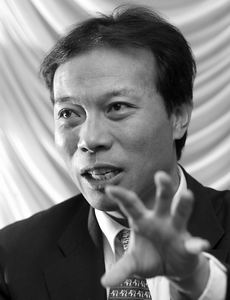

# ＜摇光＞唐骏不过是一根狗骨头

**所以，号召学习唐骏的“上升”、鼓吹所谓的成功学，其实是在逃避任何一个社会管理者都必须面对的最困难的问题。这个最困难的问题，不是怎样把唐老鸭培养成唐骏，而是怎样让普通人能够快快乐乐地做普通人，居者有其屋、耕者有其田，面朝大海，春暖花开。很不幸，中国的统治者总是在逃避这个问题，所以他们不得不以扭曲分裂的人格面对着这个惨淡的国家。**

#  唐骏不过是一根狗骨头

## **文****/ ****黄陀（**Yale University）** **

** **

唐老板的书，叫做《我的成功可以复制》。不才以为一个人自己说自己成功已经够不靠谱；而说自己成功可以复制，则有居心不良诱骗无知少女的嫌疑了。我大致看了一下该书的内容，姑且可以算是职场版的男默女泪吧，和什么艺术人生啊之类的节目一个套路，都是一群所谓的成功人士一把鼻涕一把泪地说自己也不容易呀嘛不容易，恶心至极，我相信随便街边拉一个电焊工，故事都比他们要真实感人得多。然而我实在搞不明白精英们领袖们如此宽容唐老板之类的人，奉为座上宾、礼遇有加，目的是什么，不知是要号召大家都去加州理工打打酱油然后声称自己从那里毕业，还是号召大家买张西太平洋的文凭，以突破“世俗”的“唯文凭论”？ 而南林大校领导之类的人物对唐老板如此力挺，已经让我觉得有点不对劲了，究竟怎么不对劲，我也一时说不上来。后来慢慢明白了，说得不好听一点，唐老板之类的楷模，无外乎就是统治阶级扔给年轻人的一根狗骨头，让年轻人去追、去抢，而不去想想为什么自己要像狗一样争抢一块骨头。 

### 

这些年，经过一轮又一轮的政治运动和国进民退，特权集团的人知道每年几百万的大学毕业生都看着他们那个小集团歌舞升平的日子眼红啊，力挺这个号称自己成功可以复制的楷模，暗示的是混到那个地步不是不可能的，你没混到是你自己不行，从而达到转移视线、推脱责任的目的。可是做过中国人都知道千军万马挤独木桥是什么滋味，有些人挤上了，更多人挤不上；挤不上的人怎么办？ 所以，号召学习唐骏的“上升”、鼓吹所谓的成功学，其实是在逃避任何一个社会管理者都必须面对的最困难的问题。这个最困难的问题，不是怎样把唐老鸭培养成唐骏，而是怎样让普通人能够快快乐乐地做普通人，居者有其屋、耕者有其田，面朝大海，春暖花开。很不幸，中国的统治者总是在逃避这个问题，所以他们不得不以扭曲分裂的人格面对着这个惨淡的国家。他们一方面用统治阶级这一小部分人的金迷纸醉生活作为诱饵让年轻人有“奋斗的目标”，另一方面却不让集团外的任何人染指其中利益；他们一方面声称“关键产业”实行国有垄断是为了保障全体人民的利益，但一边喊着亏损拿着国家补贴一边喝着茅台加着油价；他们一方面赞扬太平天国义和团暴徒们的反抗精神，另一方面却又害怕人民到了要恢复元朝的菜刀管制⋯⋯ 在他们眼里，普通人不过是一群狗，扔一块骨头出去就可以让他们追半天，但想要爬上主人的饭桌啃属于人的骨头，则必须一棒子敲下去。 

 他们为什么不考虑这样下去是不能长久的？我也一直疑惑。其实中国老百姓要的真的不多，况且分一些权力和权利给老百姓，精英该吃香的喝辣的照样吃香喝辣，而且心理还更舒坦，就像以前地主生活富足，但由于和佃农关系处理得好，在土匪和共党来了之前都不必担心被杀被抢。反观今天的官员子女结婚都要避人耳目，高官子女走快速签证通道、被安排进名校读书都要用化名，难道我们的人民公仆地位居然不如旧社会万恶的地主？也许确实如此吧。地主在一个地方的名声直接决定了他能否找到勤劳合适的佃农来耕他的地，所以当然要想尽办法维护自己的好名声，而由于财产私有，地主当然希望能够永续利用，子子孙孙无穷匮，这种长远的眼光岂是把地方当垫脚石、求短期“政绩”以往上升的“父母官”们能比的。 所以我后来明白了，人民公仆捞完了就闪身走人，自然不会考虑国家被糟蹋成什么样子，虽然明知今天尽情搜刮会让后来人无米下炊（就像某地官员抱怨前任把地皮都卖光了），但只要自己能捞到最大利益能够拍拍屁股走人，又有什么呢？反正自己的老婆孩子已经作为前哨在国外扎根了。所以当务之急，乃是要让最有可能闹起来的群狗为了那一块狗骨头去追逐、去争夺、去相互撕咬，而自己把桌上大餐能塞进肚子里塞进肚子里，吃不了的打包带走，趁群狗明白过来之前溜之大吉。 中华民国一〇〇年五月十二日 美国 康州 纽黑文 

### 

### 

（采编：陈锴；责编：陈锴）
