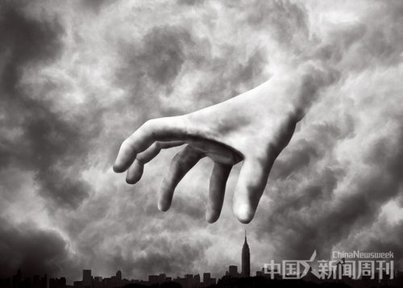

# ＜摇光＞圣诞节，我对基督教的一些思考

**如果生命最基本的功能体蛋白质是随机出现的，就是说DNA的顺序是在地球初形成时期的某一次潮起潮落中偶然聚集起的，在那么长的序列里能恰好排列出这个完美的顺序的意思就是说，给你一把26个字母的骰子，你往桌子上一扔，一部哈姆雷特出来了。而DNA的每个单位上的选择更多，不止26个，科学家的计算是要这样出现一个生命体得概率比宇宙的年龄长，并且，你要保证，出现的这个生命体还能够存活下去，还得世世代代存活下去。**  

# 圣诞节，我对基督教的一些思考

## 文/ 王鹏宇（University of North Dakota）

 

因为显而易见的原因，我甚至一直不敢告诉身边的好朋友们说我在学习圣经，我渴望成为一名基督徒。还因为对自己知识结构的怀疑和思考能力的自卑而导致从没有和任何人好好讨论过下面的事情。今天是圣诞节，因着这样的缘由，我写下我的思考。

人类自我的膨胀似乎是最近三四百年的事情，因为科学技术的伟大发展，人类自信可以了解宇宙的全部秘密，我们开始第一次不在崇拜除了自身以外的东西。有趣的是中国作为低劣的模仿者而叫嚣的最嚣张，”人定胜天“。上个世纪五十年代之后的”后现代主义“似乎替基督教看透了”现代主义“的虚弱，可是在用理性反对理性的过程中，”后现代派“们不承认人的”被造“”有限“和”沾污“，因而他们的反驳也是有缺陷的。首先要承认人理性的”有限性“。我经常打的比喻是，作为鱼缸里的鱼，总以为他是通过自己的努力找到的食吃，他永远也不能明白食物是因为你”喂“才有的，鱼儿会愚蠢到你给鱼缸换水她回拼命的逃，因为他以为这是地震。作为鱼，它能够明白其实你是在照顾他吗？甚至，它会想其实是有”人“在照顾他吗？理性的有限性还体现在对高级智慧的误解。婴儿时期看大人行事完全是”混沌“，毫无道理毫无规律的，人类通过学习蚂蚁的习性可以预判蚂蚁的下一个行为模式，而在蚂蚁看来人的行为完全是随机性的，毫无逻辑。设想一下有一种更高级的智慧出现，投资股票，那么他的行为也会是完全随机没有道理的，因为他占有股市全部的信息，完全随着股市上下起伏。有限的理性加有限的理性加有限的理性不会等于全部的理性，这，注定了人类理解真理的局限性。

是什么决定了人理解真理的局限性。因为人是受造物，是客体，而只有上帝是造物主，是主体。那是什么使受造物的我们有了理解真理的可能？一是人是按照上帝的摸样造出来的，是天地间最尊贵的属性，是承受圣灵（holly sprite）的庙宇（temple），而是上帝愿意让我们了解真理。受造物是偶存的而只有上帝是永存的，绝对的，上帝是道路，是真理，是生命。真理分为’客观真理“和”主观真理“，我们的理性能理解的只是”客观真理“而对主观真理是来自于神的启示，要到神本身里面去找。神是有格位的真理的本体。造成知识分子狂妄的原因之一就是错把”客观的真理“当成”主观真理“。真理是从上帝中来的，通往真理的道路也是从上帝中来的，而耶稣基督的降世告诉我们”道成肉身“，他又是生命。所有他关于真理的论述都是用主体来说的，佛教哲学也很复杂但当佛陀的弟子问佛陀”世界是从哪里来的“时佛陀说苦难这么多我们渡人还来不及呢你考虑这个干嘛？（我没看过佛学啊同志们这个是听一个研究神学的朋友说的如果有错误我虚心领教。）因为无知和狂妄，作为客体的人总在审判神，而在审判的过程中神竟然保持惊人的沉默，在审判中，神对审判者得惩罚是叫他再领受不到真理。因为无知和狂妄有人甚至能在根本没看过圣经一眼的情况下评价圣经，主动地成为审判者的姿态去审判圣经说”这是一本我都能编的比这个好的神话故事书。“因为狂妄和无知产生的愚蠢的攻击只会让人觉得可笑，真正对基督教神学构成挑战的种种批评却都来自与一些谦卑的思想者。

民主国家都是在有基督教传统的国家起源的这不会一个意外，基督教说人是有”原罪“（sin,不是crime）的，皇帝与农民一样有罪，这使限制皇权有了合法性依靠，而中国的道德里喜欢用圣人治国，圣人不能用普通人的思维来理解，圣人带领屁民奔赴天堂。而现代科学也是在基督教国家中产生。现代开端的300位伟大的科学家中有二百四十多位是基督徒（唐崇荣语，我不知道出处，在这里很不谨慎的引用了，但我想，占大多数应该是对的。）不知道有没有人思考过其实科学是人类靠近上帝的工具？达尔文的进化论更应该是一个猜想而不是科学。在谈到信仰时是，信，然后展示给你看。在谈到这里时被朋友半开玩笑的说成是这就是一颗“大力丸”。其实大多数人面对“科学”的进化论时吃的也是这颗“大力丸”，就是信了，然后再说。进化论在各个很多进化关键阶段缺乏考古证据，我们教课书上举例的始祖鸟化石60,70年代就被证明是故意作假；现存的四俱类人猿化石，三颗已经验证是作假，另一颗因为拥有者拒绝检验，我们暂时说这个“存疑”。如果生命最基本的功能体蛋白质是随机出现的，就是说DNA的顺序是在地球初形成时期的某一次潮起潮落中偶然聚集起的，在那么长的序列里能恰好排列出这个完美的顺序的意思就是说，给你一把26个字母的骰子，你往桌子上一扔，一部哈姆雷特出来了。而DNA的每个单位上的选择更多，不止26个，科学家的计算是要这样出现一个生命体得概率比宇宙的年龄长，并且，你要保证，出现的这个生命体还能够存活下去，还得世世代代存活下去。关于科学的争论有很多，除了这个还需要有人说服我宇宙大爆炸的“第一推动力”是哪来的，由猩猩进化成人之中的过程，“自由意志”是怎么进化出来的。

对于“无神论”来说，其实你们要证明的事情更多。所以康德感慨“要证明上帝存在，难；但要证明上帝不存在，更难。”

当上帝用它的爱延续成创造活动时，就产生了从无到有的过程。人是因为上帝无边无际的爱创造出来的。我特别喜欢的一部电影《忠奸人》，我的偶像帅哥约翰尼德普大晚上偷偷的回到家看他的女儿，他的女儿惊醒，他问：who made you? 女儿：GOD made me. “why god made you?" 女儿：”to show his love." 生命来自于god，来自于他无所求无自私无边无际的爱。朋友在这里看出来的是这样的教育能解决中国人的“孝毒”，“愚孝”问题，权利阶级就找不到一个借口来建立权利金字塔了。这是实用论，是因为基督教信仰的果，而不是因为这个才要信教。然而更本质的问题是，你从哪来？还有，更大的问题其实是我们中国人就不相信有爱不相信会有纯洁的无欲无求的爱存在更不会相信爱会有力量，相信爱的都是单纯而且弱智的，可以归为好骗的小孩和傻逼一类，往下根本没法继续思考。上帝是真理，是善，是爱。上面说过了"真理“，而对"善”的思索同样直面上帝。

既然上帝是至善的，是全知的，是创造了万物的，为什么还要创造恶？为什么在亚当夏娃的伊甸园里的智慧树上还要有恶的果实？

这个问题乐趣非常。因为上帝造物中只有人有自由意志，作为最高贵的属性自由代表可以选择，可以选择善与恶。恶不是上帝创造的，但是在上帝的准许下存在的，善乃是出自上帝而恶是出于人。因为爱上帝给予了自由，因为爱上帝选择信任，信任人经过自由的选择还会选择善，选择主动的回归上帝。在亚当夏娃之前人有选择善选择恶的自由，在吃了苹果之后人选择背叛上帝获得了恶因此只有犯罪的自由了，人类的代表亚当已经做出了选择了，这就是为什么人有原罪，自由的第三个阶段里人只有依靠信仰获得救赎，才能够到第四个阶段，至善的阶段，在主里，所有的选择都是善的。再扯一句你看马克思的历史四段论和这个人类堕落再救赎的V字型的历史论多么像。不知道是不是他抄过去的哈哈。基督教被批评为迷信和弱智还有一个原因是他的宿命论，既然一切都安排好了我们还努力什么，你看人类的历史都是要这么写的了那我们混吃等死吧。其实应该叫预定论而不是宿命论，粗略的讲就是你做好你的事神做好神的事（其实这么说也不对但是要讲清楚又要再说被救赎是因信得救还是因义得救了，神学里的太细致了。）人有原罪但靠着圣灵和了解基督的道，人可以得救得永生，不努力，听到了基督的道却要背过身去的不被得救。所以小孩受教育，这个教育不是中国家长式训练他们做动物，长得胖做的乖，前一个可以用来养猪后一个可以用来训狗，没弄好的就会是这样猪狗不如……你看我又激动了对不起。真正的教育是告诉他基督的信息寻找主，了解主，这是做家长的第一使命。朋友说真正的启蒙应该是正义感的启蒙，而这个里面包含的不光是正义感的，还有爱的启蒙，通过看圣经，对圣经框架的了解，把人生各个片段各个知识碎片穿起来，甚至能获得智慧，还有你了解不到可是小孩能了解到的其他信息。由着这个，明白生命来自于上帝而不是父母会解决愚孝问题亲情绑架问题，让家庭回归正确的职能——爱的归属，情感交流的地方，不再成为金融保险的地方。在主面前，只有属灵时间长短的问题没有年龄大小的问题。人能获得知识小鸟和猩猩也能，通过记忆我们能学习小鸟猩猩也能，难道我们比他高明的就只有智商？不知前人有没有人论述过知识可以积累可是智慧呢，智慧可以积累吗。智慧，多么美妙的词儿。知识从世界中来而智慧从父中来，拥有智慧，拥有自由意志（其实用奥古斯丁的“被捆绑的意志”我觉得更好。），明白时间的属性，思考记忆本身，知道自身的局限性，有道德感，努力分清善恶， 难道这些都是在猩猩变成人的某个阶段“突然”出现的？讲逻辑的人们给我讲讲这个逻辑是什么。

人们经常拿来揶揄的是”信上帝得永生“，你祈祷来的上帝都会应允，那哈哈我就天天去教堂祈祷上帝给我两个大花姑娘就是直接掉到我脑袋上都乐意，这个不是骗傻子呢吗。第一永生不会单纯的指字面上的永生，第二个问题说实话关于祷告我看的也不多可是我知道问题肯定不是这么弱智。祷告要由着信，信是由了解了基督的真理后产生的鉴定信仰，而了解要听，听需要有布道人，而真正的布道人是受到召唤的上帝的拣选者，受到召唤的拣选者不会哪里都有的，就是说，能够信，都是恩典。上帝对他使徒的承诺不仅没包括王子和公主从此以后幸福生活到永远也没说跟了我就长生不老（但圣经里是有live forever的话。），甚至告诉了你，信了耶稣基督之后这个人散尽了家财得了麻风双目失明，上帝还要使用你as an instrument，要用苦难试炼你是你失去王子的位置然后跑去荒漠里拯救一群不认识的人，救完了荣耀还不能归于你，要“归于上帝”。不知道这个消息会不会打击在中国那么多“基督教三自爱国运动委员会”里的信徒们。可是，“上帝啊，如果我是因为惧怕地狱的怒火而投靠与你，请你让我下地狱吧，如果我是因为贪恋天堂的繁华而投靠与你，也请你让我下地狱吧。”（大意）

请准许我做一个绝对式的论述，任何一个深刻的思想者，不管他是什么学科，不管他是有神论还是无神论，在追述事物的本源，思想的本源时都会直面上帝。在这个结果上，有人成为上帝坚定的仆人，而有些人不幸的没有。但我敢肯定的是，基督徒在他们那里受到最小程度的误解，不会被当成软弱者和智力低下的人需要投靠的怀抱。

现代知识分子应该做的是直面真理本身，追寻真理，捍卫真理，不应该媚雅，也不媚俗。对真善美的追求贯穿了某些人的一生，为了那个大家都知道的原因可以坐牢，可以不问生死。这些都让人钦佩和崇敬，应该给予最大的溢美之词。但还有一个问题需要考虑，如果他为之死的“真理”“”善“只是局部的真理和善，更甚者，如果不是真理和善本身呢？会不会有点……亏。没有上帝启示的真理是客体真理，不会是主体真理，捍卫主体真理的人才更伟大。”知识分子“是个无上荣耀的头衔，不仅是对思考能力的肯定，更是对其心目中道德律的赞颂，但和他们一起的，甚至在某些方面之上的，还有一帮基督徒们。

在伊甸园里，上帝对亚当夏娃说，你们什么都可以吃，可以做，但是不能吃这个果子，吃了以后人类就堕落的故事包含着这样的启示，自由天生是包含诫命的，在诫命里，人拥有自由，诫命以外的是放纵，要受到惩罚。有爱就有恩典，有权利，就有责任。明白这些在被造之时就有的特点让我能对一些闻起来就很对路的思想能很快接受，因为他显而易见的正确，比如自由的秩序，比如权利的限制，比如有限政府有限政治，比如”自由民主宪政“中最可以省略掉的其实反倒是”民主“，好的”民主政体“应该是有限自由宪政政体。

在某个神奇的国度一切正常的事情都变得不可思议之后，阐述自己对渴望成为一名真正的基督徒的向往变成了一件非常需要勇气的事情，尤其是以上这些话可能得罪所有的无神论者和大部分已经号称归主的基督徒们。

因为一些不太显而易见的原因我没有受过洗，但因为是今天，因为这个显而易见的原因，我终于有勇气说出了自己对基督崇拜。

——by god`s grace

 

（荐稿：王粤北；责编：陈锴）

 
