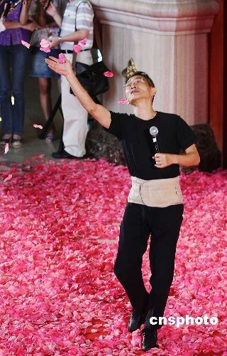

# ＜摇光＞在万事万物中觉醒

**如果说每个人的本能都是寻找属于自己的幸福和快乐，杨丽萍无疑是幸运的。因为很多人就算穷尽一生也无法从一朵茶花，一片行云中体味出感动——正如这个世界上没有多少人可以放下心中的不安全感，用身体的曲线和生命的温度躺着石头上安然入睡。也许有一天，见证“雀之恋”时我们的惊诧感已经远去，也许那时，我们用再精妙的评价也无法凝练和概括出这样用生命去感受的人。** 

# 在万事万物中觉醒

## 文/张一甲（北京大学）

 1 

春晚之后的杨丽萍突然又火了起来。这次她不仅仅是感染了观众，更是吓到了观众。

1986年杨丽萍创作出了《雀之灵》，让但凡有点舞蹈情结的女孩一听到那段音乐就心生万般憧憬。2012年她又以一支《雀之恋》再一次让人们震惊。而人们震惊的理由如此简单：一个不老的红颜。还有怎样的传说可以更加动人？

然而，当网络上铺天盖地传送着杨丽萍的“不老秘籍”时，这位打败了时间的女人可能全然不懂你们的担忧。也许此时此刻的她正在云南乡下的某个地方，用身体的每一个细胞体味春天复苏的感觉。于她而言，一棵树怎么生长，河水怎么流，白云怎么飘，甘露怎么凝结，都充满着觉醒的诗意——而她需要做的，只不过是个生命的旁观者。

其实，这个女人的魅力早已无法用“不老”二字简单概括。她不是用美丽和青春感染我们，而是用她的发现感动我们——她让人动情于自己的发现，她的世界无需用人类的语言便能读懂。 

2 

但凡可以称之为艺术家的，都有一种洁癖，这种洁癖在头脑里。这并不是说他们看不见黑暗和丑恶，而是他们会总有那种长驱直入的洞察力。他们将赤裸的内心沉浸于生命中的美和丑，随时把感受到的东西“擦干净”，沉淀出作品来。

杨丽萍就是用这种全身浸泡的方式将自己沉浸在对艺术的感受中的。

曾经有人拿她小时的贫穷和歧视问她：你在那么艰苦的环境中，在一个根本不可能有任何艺术熏陶的氛围里，能成就这样一番事业，为什么？

杨丽萍回答：你错了！我生活的环境里绝对有艺术氛围。所有的东西都是跟艺术有关系，只是你不在意它而已。而恰恰这些东西给予我最好的启示。

《看见》最近的一期节目，柴静到云南专访杨丽萍，在节目中可以窥见她的生活环境。在每一个角落里，都有着原始的生动：流动的水，鲜艳的花，自然生长的树，毫无隔阂的阳光。

她用这种方式让自己的审美本能觉醒，用最原始和单纯的善意去和自然打交道。

她说，看天的时候，要把天看出洞来。——她在万事万物中，都能看到舞蹈的轨迹。

柴静采访的时候她坐着。她完全是由着自己去展现问题的答案的。面对一个一个环环相扣的问题，她波澜不惊地坐在那里，手里玩弄一朵鲜红的茶花。一边低头抚弄着它，一遍自然而然地回答几句。

可当她说到她体味白云是什么，她就那么坐着自然而然地扭动起来。她说感觉“空气在你的身体里”。说着自然地扭动着，仿佛空气穿过整个肢体，身子在那瞬间透明了，轻盈的几乎要飘起来。 3

杨丽萍让我想起一个人，林怀民。

杨澜写《一问一世界》有整个一章的标题叫“谁能在石头上轻松睡觉？”杨澜的启示就是来自林怀民。

林怀民先生是台湾“云门舞集”现代舞团的创始人。在台北，他那间铁皮屋顶的练功房孤独而倔犟地站立在山草中。杨澜感慨舞团练功条件的简陋，他却认为那是他亲爱的宝贝：安静、接近自然、锻炼舞者的承受力。

为了演绎中华传统文化的神韵，让“静”成为心灵与身体的一种自然状态，他让演员们放低重心，练习太极、吐纳、书法、静坐。

为了体验天人合一的境界，他做过一个有趣的实验，就是让舞者们在河边被水冲刷得光溜溜的大石头上躺下来，放松身体，看谁能先睡着！你一定要完全放松身心，让肌肉顺应石头的弧度，把石头变成一张天底下最舒服的床。——居然，舞者们做到了，他们先后安然入睡。

伟大的艺术果然不是被创作出来，只是被发现出来。但这场发现之旅需要无穷无尽的诚意和辛苦。 

4 

杨丽萍的挑剔和苛刻也是出了名的。对于她参加的任何一个节目，她对光线、布景都有着常人难以理解的挑剔。春晚排练时她让别的演员顶替她跳，她自己在镜头前一个镜头一个镜头地挑选设计。柴静采访她时，她不停指挥柴静调整前后的角度，以避开光线中的阴影。

和她合作了几十年的高成明提到她的苛刻和“不合群”也没有办法。她的苛刻加上她的急性子，让他人脸上挂不住也是常有的事。高成明只得苦笑一句“但是她很健忘，这一点很好。”

正如柴静所说：采访前她很挑剔，采访时很敞开，采访完第二天见面还像不认识你一样。

然而，在很多方面苛责到极致的她，在另一些方面却有出乎意外的通融。

春晚之后，喜欢恶搞的网民们总在说：公孔雀才能开屏。

面对这样的问题她的回答却如同孩子一般：那我喜欢呀，怎么办？ 

5 

对于杨丽萍这样的人，我很怕有人拿“意义”、“成功”这样的命题去问她。不过她的观点让你觉得对于她的一切揣测都是徒劳。

当柴静问她：有人说你做《云南的响声》和《云南映像》是为了你的民族文化尽保存的责任，你是这么想的吗？

她回答说：你看那个大豹子要生孩子，养小豹子，它没觉得它要有责任。它养大了它就走了。只有我们人觉得：哎，我干了这件事怎么没人夸我？大豹子根本没这个想法。

她想了一下，又说：孔雀也没这个想法。

众人纷纷在说杨丽萍为了舞蹈不生孩子。可她认为一直没有生育“跟生孩子没关系，跟当舞蹈家没关系”。

柴静问：这里不存在牺牲吗？

杨丽萍说：我这个人会牺牲吗？我不是那种牺牲者。我恰恰知道怎么享受。

她跳孔雀跳了几十年，问她这么多年的变化在哪里？

她说“人格越来越完善，感情越来越真诚，越是在地上越是超脱。” 6

其实，有谁比生活在聚光灯下的女人更怕老呢？

曾经看到过的一篇文章里，媒体见面会上有人问刘若英，是否想过如果不从事这行，人生将会是怎样？

刘若英哈哈大笑，说：如果不做艺人，以她现在的年龄、慵懒的个性，可能是一个邋遢、臃肿的女人。

然而，面对杨丽萍，她的眼神里除了冷峻和魅惑，也会让人感到一种对万事万物的无畏。这种无畏甚至将时间也抛在了脑后，成就了她凛然不可侵犯的魅力。

《看见》节目的末尾，柴静评论：一个不愿意无知无觉，不愿意机械重复的人，总会有所感受，也总想有所表达。正如杨丽萍说，舞蹈不是职业，是一种对世界的观察和对话。就算是老了，病了，不能动了，也会在头脑当中默舞。

她说，谁能阻止我跳。

或许这才是秘笈。只有永远对生命有所感受，有所表达，对于世间繁衍和一切美丑用一颗赤子之心去面对的女子，才能从容赴老，不畏红颜老去。 7

如果说每个人的本能都是寻找属于自己的幸福和快乐，杨丽萍无疑是幸运的。因为很多人就算穷尽一生也无法从一朵茶花，一片行云中体味出感动——正如这个世界上没有多少人可以放下心中的不安全感，用身体的曲线和生命的温度躺着石头上安然入睡。

也许有一天，见证“雀之恋”时我们的惊诧感已经远去，也许那时，我们用再精妙的评价也无法凝练和概括出这样用生命去感受的人。

但愿彼时我们还记得，在面对那个提起白云身体就几乎会透明轻盈到要飘起来的女人时，我们也曾一度体味到这个世界上最玄妙，最诗意，也最朴实的智慧。 

（采编：何凌昊；责编：尹桑） 

