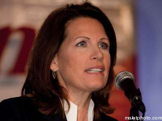
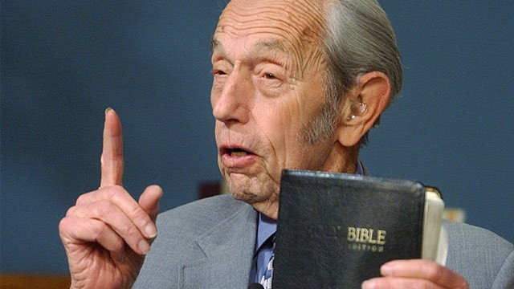
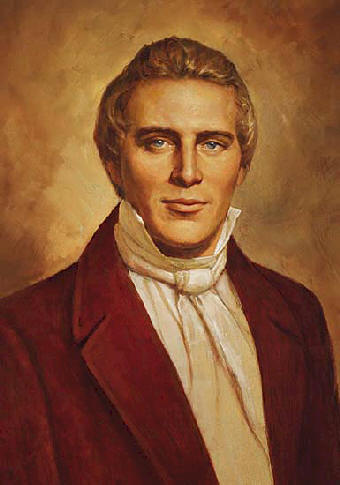
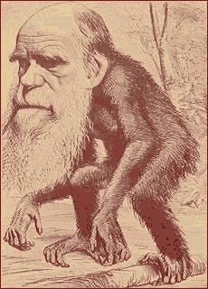
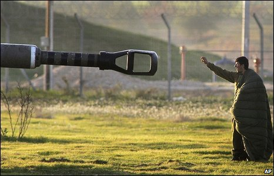

# ＜摇光＞在这片傻逼们自由生长的土壤上

**他们的存在和影响力让人不得不为美国人捏把汗；但也正是他们的存在，让人可以相信在这片傻逼们自由生长的土壤上，牛逼们也可以自由生长，而不会被“封杀”、“引导”，“反三俗”，更不会因为“敏感词”而被禁锢，甚至“被喝茶”、“被失踪”。终有一天，美国的GDP会被中国超过，但只要“thebigbrother”继续存在，中国人继续认为自己的言论需要被“引导”，那么我们“有尊严的生活”就只能是一个梦。**

# 在这片傻逼们自由生长的土壤上

## 陶媛媛（清华大学）

  前些天在广播里听到共和党总统候选人之一MicheleBachmann的关于气候变化和减排二氧化碳的评论，我差点没把刚喝到嘴里的咖啡喷一车窗。她说：“什么是二氧化碳？二氧化碳是一种天然的产物……事实上二氧化碳是完全无害的……”我真想抓着她的肩膀问：“狗屎天然不？您吃一口狗屎试试？”气候变化与人类活动之间的关系的确有争议，但争议点不在于二氧化碳是否有害（二氧化碳在低浓度对人体是无害的，但是在大气中含量上升会导致温室效应，这是很多人都知道的），而是人类活动与二氧化碳在大气中含量的关系。而Bachmann大嘴一张，就给二氧化碳贴上“天然=无害”的标签，傻逼程度令人叹为观止。 

Michele Bachmann

 MicheleBachmann闹出低水平笑话，这并不是第一次。她刚透露出参选总统的意向的时候，有人开玩笑说“MicheleBachmanisrunningtobeSarahPalin”，因为她对美国历史和政治的无知程度直逼几年前声称“能在自家后院看到俄罗斯”的共和党候选人SarahPalin。不久前，MecheleBachmann在一次演讲中说美国的国父们不知疲倦地奋斗，直到最终废除奴隶制；但稍微了解一点美国历史的人（包括我这个外国人）都知道，直接导致废除奴隶制的美国内战发生在1861年，而国父们领导的独立战争是1776年，远早于奴隶制的终结。事实上，独立战争的领导者中好些人自己就拥有奴隶，比如托马斯·杰弗逊。这样的历史知识错误，就像咱们的常委候选人不知道建国或者内战是哪一年一样，毫无悬念地引来了网络上无数骂声。她说过的蠢话还有很多，比如“有一些文明就是比别的高等”，“奥巴马是反美国的”，“国家没有权力在全国人口普查中统计我们的私人信息”，“废除最低工资保障制度可以把失业率减为零”… MicheleBachmann这样明显满脑子豆腐渣的人，竟然是目前共和党最红的候选人之一。每次看到电视上的民调，我都不得不问一声，美国人你们怎么了？不过相比于美国的种种怪象，MicheleBachmann的受欢迎算是小巫见大巫了。之前有一个叫HaroldCamping的人宣称今年的5月21日是世界末日，在那天所有基督的信徒都会被基督本人接上天堂，而不信基督的人会被留在人间，与地球一同被毁灭。按照他的说法，当天下午六点钟会发生史上最强的地震，把所有被留在地球上的人都毁掉。于是有人问，地球上有24个时区，您说的是哪个时区的下午六点？这位HaroldCamping脸不红心不跳，回答说地震会依次在各个时区的当地时间下午六点发生。就是这样一个神棍，却有成千上万的信徒。他们有的在地铁站、十字路口派发世界末日的传单，有的开车四处周游，劝说人们加入他们的信仰，更有人辞去工作、离开学校，花光毕生积蓄，只等着5月21日飞升（rapture）。当然，5月21日那天什么也没发生。六点过后，这些信徒里有的满脸茫然，有的伤心不已，以为基督不愿意拯救自己，有的终于决定再也不相信HaroldCamping这个大骗子，但也有人决定继续相信他。上网查一下HaroldCamping其人，才发现这不是他第一次预言世界末日。他曾经预言过1994年9月世界末日会降临，当时也是有不少人相信他，更有一些死忠信徒在1994、2011年两次预言落空后还愿意追随他。 

Harold Camping

 我每次看见HaroldCamping的新闻，都禁不住想，这货要是在中国预言世界末日，咱们中国人民该干嘛还干嘛，鬼才信他。就算真有人信，没两天政府就把他取缔了，哪里容得他在那里大放厥词。作为一个中国人，我本能地想，HaroldCamping借着世界末日的预言搞得这么多人家财散尽，他自己借机敛了好几百万美元，就没有人管管这事？但是在美国，他不管吹什么牛都是他的权利，那些傻逼愿意相信他，把家产都捐给他也是他们自己的决定，这事儿法律管不着。一句话，人们有胡说的权利，也有犯傻的权利。 

Joseph Smith Jr.

 原来那么多美国人傻到令人发指的地步，还是宪法第一修正案的功劳。再举几个宪法第一修正案保护人们胡说和犯傻权利的例子：十九世纪初一个叫JosephSmithJr.的家伙声称他在纽约州的深山里找到了一位远古先知留下的，用黄金打成的“摩门之书”，以此创立了摩门教。就是这样不着四六的故事，讲给小孩子听都不一定相信，竟然引来大批信徒；现在摩门教在美国已经颇具影响，成为主要的宗教之一。这位JosephSmithJr.放到中国，也早该让政府当邪教给灭了；可仗着第一修正案，在美国就没人能把他怎么样。另一个例子是大学的终身教职制度的“漏洞”：最初终身教职制度的设立，是为了保证学术自由，保护与主流观点相左的学者不受迫害，或者为了利益而迎合主流观点。终身教职制度直接秉承了宪法第一修正案的精神，为美国世界一流的高等教育系统的形成打下了基础。但是终身教职制度也有弊端，比如很多资质不高的教授因为有终身教职而留在教育系统中，一些优秀的人才反而不能进去；更极端的例子是SanFranciscoStateUniversity一个叫DeanH.Kenyon的生物学教授，坚持在他的课堂上教授神创论——先不论一个斯坦福毕业的生物物理博士为什么会相信与他的研究相悖的神创论，关键在于他还要将与生物学相悖的神创论教授给学生，这引来了大批学生投诉和其他教授的批评。1992年，学校的生物系要求他停止教授神创论，但是被他拒绝，同时生物学系的一些教授也反对校方的要求，因为他们认为Kenyon有权利教授他认为是对的东西。Kenyon有终身教职，校方不能解雇他，更不能只因为他持有的观点而解雇他，因为这是违反第一修正案的。就这样，Kenyon手持第一修正案这把尚方宝剑，在生物学系中教授神创论直到退休。这个案例的有趣之处在于，第一修正案曾经保护了进化论者不受主流天主教势力的迫害和影响，后来却保护了神创论者。 

 如果说对末日预言、摩门教、神创论者的保护是宪法第一修正案精神的直接体现，那么一些明显有害和错误的言论也受到保护，就让很多人气结了。如不久前一款以校园枪杀为主题的电子游戏就引发了争议，很多人，尤其是家长，认为这样的游戏会误导未成年人，甚至引起暴力倾向；但是这款游戏的开发者和爱好者认为他们有自由开发和享受任何形式、主题的游戏。这样的争论经常发生，结果多是不了了之，因为影视、游戏的内容不管是暴力也好，色情也好，都是受宪法保护的。不仅如此，即使是新纳粹、三K党这些臭名昭著的组织，也有权利出版、集会。有的言论不仅仅会误导公众，甚至会造成实质性的恶果。HaroldCamping借着末日预言大肆敛财，害得许多人破产不说了，毕竟那些变卖家产、辞去工作的人都是有自由意志的，他们自己决定相信Camping这个神棍，造成的恶果只能怪他们自己；令人扼腕的是很多时候一些人的观点不仅会影响别人的观点，更会造成对无辜的人的伤害，2008年加州废除同性恋婚姻就是一个例子。加州在美国素有自由、开放、多元化的声誉，是美国最早将同性恋婚姻合法化的几个州之一。然而在2008年，加州却通过了不再承认同性恋婚姻的法案。这背后是加州的摩门教利用巨大的财力发动了声势浩大的反同性恋宣传攻势，在对同性恋婚姻持观望态度的选民中造成了很大的影响，以至于当年的选举中同本已经合法化的性恋婚姻又非法了。这种种现象，有时候让我这个外国人都替美国人捉急。 可是美国人真的就这么傻么？他们就不会做点什么来去除傻逼的、错误的、有害的、或者对未成年人有不良影响的言论？他们当然会做点什么，但是“去除”这个字眼，在言论自由的领域是不存在的。对于色情、暴力的影视、游戏，是靠分级制度和对家长的问责来实现对未成年人的保护；明显有害的言论如新纳粹、三K党，也不用“去除”或者“引导”，绝大多数的人不会去理睬这些反人类的观点，所以它们不会造成什么影响。在许多界定模糊的观点，比如同性恋、堕胎上，就只能靠两方公开辩论，把各自的观点和证据呈现给大众，让他们自己选择相信什么。美国的法律系统深知“去除有害言论”、“引导舆论”是很危险的事情。即使一个观点是正确的，有科学依据和大量事实证据的（比如进化论），但如果今天国家立法支持这个观点或者反对另一个观点，就会为以后立法支持或反对别的言论提供合法性，到最后只会威胁言论自由，50年代的麦卡锡主义就是一个例证。良好的教育系统和公正的法律是第一修正案的后盾：越多的人受到好的教育和逻辑训练，就有越多的人做出正确的选择；而公正的法律则提供了一个自由公平的环境，让各种言论进行竞争，优胜劣汰——上面提到的摩门教利用财力发动反同性恋宣战，就已经被人质疑其合法性，因为宗教是不允许利用筹得的善款干预政治的。尽管当下仍然有很多人选择相信傻逼的、错误的、有害的言论，并且可以预见永远都会有人选择相信傻逼的、错误的、有害的言论，却可以寄希望于言论本身的进化，正确的言论可以得到越来越多的支持。 

 MicheleBachman和HaroldCamping算是美国傻逼界的代表，他们的存在和影响力让人不得不为美国人捏把汗；但也正是他们的存在，让人可以相信在这片傻逼们自由生长的土壤上，牛逼们也可以自由生长，而不会被“封杀”、“引导”，“反三俗”，更不会因为“敏感词”而被禁锢，甚至“被喝茶”、“被失踪”。终有一天，美国的GDP会被中国超过，但只要“thebigbrother”继续存在，中国人继续认为自己的言论需要被“引导”，那么我们“有尊严的生活”就只能是一个梦。 

**（采编：黄理罡；责编：黄理罡）**

 
