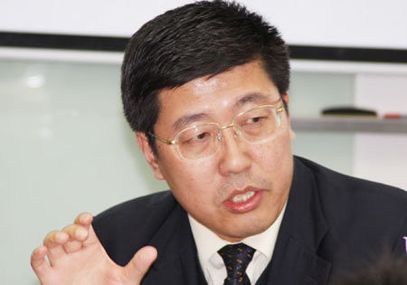
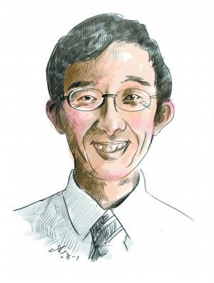
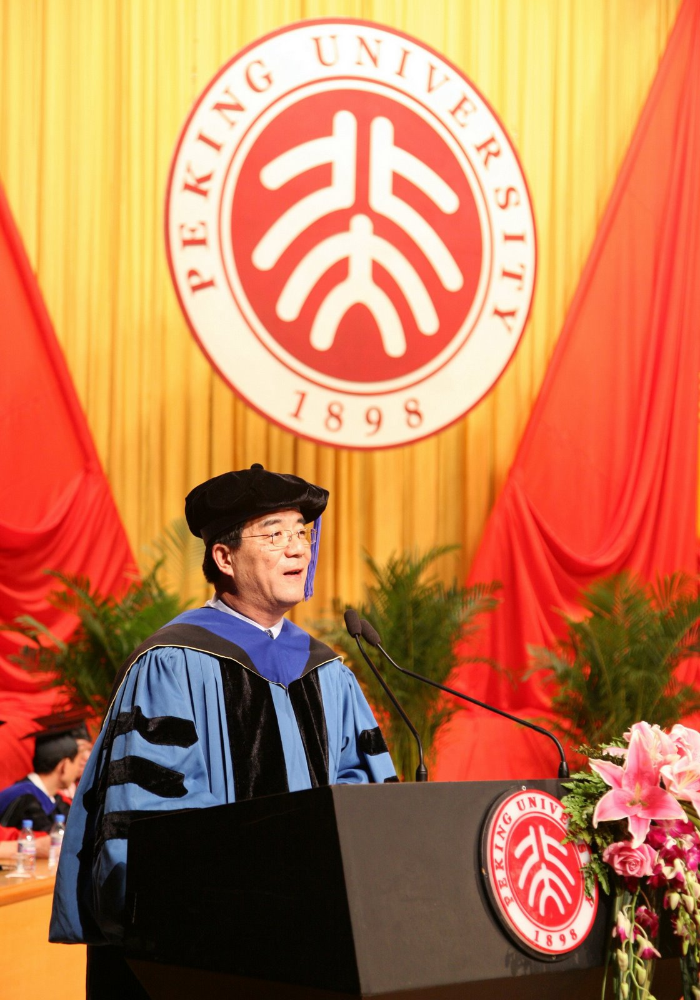

# ＜摇光＞大学应当怎样

**这其实也是整个社会的病症，充斥着人心的仅有是金钱至上的价值观，而诸如“人生自我实现”这样的目标似乎是一个笑话，大学的最重要功能便是培养“全人”(well-rounded person)，然而如今却更像是一个职业培训场，最可悲的是，职业培训机构的毕业生还找不到工作。教育是改善人心，促进进步的希望所在，大学从诞生之时便有象牙塔与警钟之意，然而当董藩之流在大学课堂上高谈阔论，大学能培养出怎样的人才便尤其地让人担忧。**

** **

# 大学应当怎样

## 文/兰启昌（复旦大学）

在看薛涌的《北大批判》时，无意间在网上翻到到了这样的一件事：北师大教授董藩针对《北大批判》写了《薛涌的无耻、无知与放肆》一文，引古罗马的塔西伦所著《历史》一书中的一句名言“近亲之间的憎恶是最恶毒的”，来抨击和指斥薛涌出身北大却又一再批判北大的“逆子”行为，并说薛涌是一个“得鱼忘筌，过河拆桥，名气很大却不值得敬重的人，如农夫怀中那条蛇。

此董藩，就是最近很火的北师大房产研究中心主任，在课堂上宣称“到四十岁没有挣到4000万不要来见我，我不会认你是我的学生”。出身北大就不能批评北大，这种论调在如今的现实中何其耳熟，随便听听：“中国人，应该爱自己的祖国，不能随便批评”，“政府都是为我们好，是它给了我们一切，所以不能盲目抨击”，逻辑一脉相承。

清华百年校庆将至，蒋方舟写文批评母校，引来反弹无数，在清华从教20余年的老师到处发匿名信状告蒋，清华法学院一位不公开姓名的学长以过来人的口气训导这位“天真”的师妹：“爱一个人，就要爱他的全部。如果自己的母亲犯错了，你是不是就不爱她了呢？你是不是就要把她骂得无地自容呢？特别是还选择在母亲过生日地时候。我之所以给蒋方舟写公开信，唯一的理由就是告诫她，她没有任何资格将乱七八糟的标签贴给清华。试问蒋方舟，你为什么不直接给中国写一封信呢？”这一番话，可以算的上是此种逻辑的集大成者。

清华，无疑是中国高校的典型代表，如今不但有写匿名信告状的老师，还有如此的法学院学生，从这一点来看，中国高等教育确实有病，而且病得不轻。幸好，并未病入膏肓，清华大学党委副书记邓卫在接受媒体采访时表示看过蒋方舟的这篇文章，“学生有各种各样的说法是很正常的事情，但我相信每一个清华人都有一个共同的特点，对母校是深深的热爱，爱之越深，责之越切。”清华校方此番表态，倒值得在“会商事件”中陷入泥沼的北大校方汗颜了。

那么中国高等教育病在何处呢？政治课太多且无聊；专业课都是大课，缺少讨论——而通过讨论培训批判性思维与自由表达本应该是大学最重要的教育职能之一；高分考生全都进入经管学院而视人文、基础科学专业为畏途；教授讲课缺乏激情，用着多年不变的教材，使用着反复操练的话语，课本知识与现实世界脱节，专业学习与实践毫无关系，培养出的学生百无一用……这些书中谈到的问题，都已是众人皆知之毛病，在中国的大学，已成公开的事实，让人担忧的是：因为问题的普遍，人们仿佛习惯了当前的现状，并在“迈向世界一流”的美梦中不愿醒来。幸好有薛涌，以相对独立的观察角度当今大学现状，并发出警言。

对于高等教育的批判已经多如牛毛，然而薛涌的论述却了然有新意。他以自己在美国多年的求学与教学经历为例，一一反证中国大学教育的“不正常”。在谈到如今北大经管学院每年大概收纳了全国近五分之一状元时，痛心疾首：“一般而言，18岁孩子中真正的精英，对世界一些核心的抽象问题都会有非常大的激情：人生的意义和使命是什么？我们的价值观念是什么？人类的境况是什么力量塑造的？人类应该向何处去？等等。精英首先意味着对这些大问题的关注和承担。这也是为什么在美国这种非常实际的社会里，常青藤的学生会奔向文史这类看似“无用”、实际上却在回答上述问题的专业。我劝北大的同学好好想一想：这些是否也是你关注的问题？你是否真愿意把你的青春用来折腾什么市场营销？有志者可以学文史，追寻自己内心的声音。毕业后如果想实际些，再到国外去读法学院、商学院也不晚，而且十有八九会更成功”。

这其实也是整个社会的病症，充斥着人心的仅有是金钱至上的价值观，而诸如“人生自我实现”这样的目标似乎是一个笑话，大学的最重要功能便是培养“全人”(well-rounded person)，然而如今却更像是一个职业培训场，最可悲的是，职业培训机构的毕业生还找不到工作。教育是改善人心，促进进步的希望所在，大学从诞生之时便有象牙塔与警钟之意，然而当董藩之流在大学课堂上高谈阔论，大学能培养出怎样的人才便尤其地让人担忧。

如此这些，是大学与社会的弊病。然而这本书的另一个更重要的力量是让大学生明白：即使大学不如人意，你仍然可以塑造你自己。这和胡适的格言“世界像是一艘下沉的船，最要紧的是救出你自己，将自己铸造成一块材料”说得是同一种意思。

薛涌78年进北大，当时的环境相当糟糕：老师大多只会分析马列主义；图书馆、教室缺少自习教室，用功的同学只能在路灯边看书；食堂的饭菜被人戏称猪食。他当年因为“青春期的性压抑”不明不白地选了中文系，最后发现这些男欢女爱的小情调与自己不相符合，所以常常逃课。

不知很多同学读到这里，是否生出“同病相怜”之感？只需将薛涌的境遇稍换一下即可：老师照本宣科，专业不合兴趣等等。大学的弊病有所变化，而大学生的抱怨依旧。

但人不应仅受环境限制，更应改变环境，如果无法改变，便应试着塑造自我，《论语·子罕第九》有这么一段：子欲居九夷。或曰：“陋。如之何？”子曰：“君子居之，何陋之有！

如果大学不是你之前所梦想的那般美好，为什么就一定要放弃，而不努力去成为陋室之“君子”？

进入北大后，看不惯中文系的儿女情长，薛涌对于人类的宏大命运产生浓厚兴趣，从此开始翘本专业的课，旁听历史系的课，比如被他成为“北大文史第一人”的张广达教授的通史课程，在这样的自主选择中，他自认受益匪浅，或许这和他以后最终进行历史学研究，并成为史景迁的弟子大有关系。这些经历，让薛涌虽然批判北大，却对于母校无比怀念。事实上，大学本应该是一个人的“精神原乡”，在大学岁月里，不但可以习得知识，还可与中外古今灵魂对话，体会沉浸在思考之中的魅力，学会如何去感知他人与社会，练习怎样更好地去爱、更有意义地创造，最重要的是，将自我培养成追求善与美的“全人”。

因此，盲目地抱怨环境的糟糕，只会让自我陷入更为悲伤的境地。况且如今的条件与当年不可同日而语，在信息时代，互联网上有几乎所有的知识精华，国外名校的公开课程可随意观看，正在中国大地上进行的突进与变革，也应该让大学生产生探索的勇气与信心。

批判的意义从来不局限于它本身，正如苏格拉底所说“未经反省的人生不值得过”， 批判北大，意在批判中国教育，即是批判每一个大学共同体中的每个人，从大学生，到大学老师，再到大学之体制，进而到整个社会，都需要批判的力量与勇气。只有在不怕丢人嘲笑地深度剖析之后，个人实现与社会进步之路才会现出曙光。

(采编：崔飘扬 编辑：管思聪)
