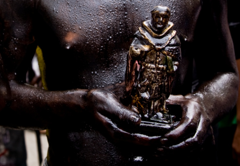
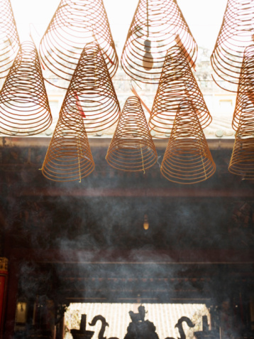
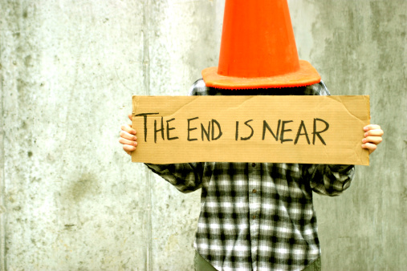

# ＜摇光＞女为君子儒

**他们是有为的人，可是不健全而没追求。他们是有思想的人，可是一切在他们都只是一些概念游戏。前者有术而无道，所以浅薄；后者好学而无德，所以鄙陋。这已经不是个“中西分际”的哲学讨论了，这是时代士风可悲的低迷不振。**  

# 女为君子儒

## 文/陈熹（南开大学）

 

还是刚上大学的时候，有那么一回，我去听一个哲学系的老师演讲。这中年男人据说通晓印度哲学和西洋哲学，我后来还在书店的书架上看过他的名字。那一天他讲的什么东西，到现在我可早忘了，隐约记得是批评了中国传统文化的不上道，比如书法和宋词。不过他有一句话我至今记得特别清楚，“现在有些研究哲学的啊，特别是那些研究中国哲学的，”他笑笑，继续嘲讽道，“哎呦，一个个都好像自己是圣人一样。”

我记得我当时对于这人极度不屑——只因为他这一句所展现的偏狭。中国的“义理学”传统本来就是要做圣人，从儒学到佛学，从孔夫子到冯友兰，中国人讲究的就是“境界”和“气象”。以西绳中，拿着外国的“philosophy”来批评判断中国的“哲学”，这种缺心眼的蠢事近世人们干的太多了。更何况哲学既然以“宇宙”、“人生”并提，那当然既要有西洋所谓“爱智”，又绝不可少中国传统的“为己”。这是传统在旧日的老特点，亦是传统在今日的新价值。

圣人当然是极少数，不过不管是真的成了圣人还是装作“好像自己”是圣人，最起码这是种读书人该有的追求方向。旁人不论，如果连专门研究中国哲学的人都不追求“做圣人”，那才真可怪有可怜又可鄙。

后来我认识的老师和同学稍微多了起来，偶尔又想起这事情，才慢慢发觉，原来这不仅仅是一个“哲学专家”可笑的失言，更是学校里学生老师的一种通病。从普通学生到著名教授，大家似乎只看重了学习学术和能力关系，也有少之又少的看重思想学问，不过所谓“精神”“气象”“境界”这些词，不但几乎听不到，提起来倒要招致不屑和嘲笑。学生拼命地背题目写论文学英语参加活动，老师拼命地申项目做实验出成果误人子弟，当然也有些爱读书会演讲还能写文章作批评，可是他们从来没想过：所谓“人”是怎么一回事，所谓“人”应该是怎么一回事。

他们是有为的人，可是不健全而没追求。他们是有思想的人，可是一切在他们都只是一些概念游戏。前者有术而无道，所以浅薄；后者好学而无德，所以鄙陋。这已经不是个“中西分际”的哲学讨论了，这是时代士风可悲的低迷不振。

所以我常常想起孔子对子夏的教训：“女为君子儒，无为小人儒！”其实“君子儒”做不了，不一定是“小人儒”，今天更多的是昏昏聩聩“庸人儒”。盖周秦以前，“凡有道术者皆称儒”，宽泛地说，凡我辈同学老师有知识而明一理者，皆可名之曰“儒”。今者不妨借这旧锦翻些新样，诸位同学老师：女为君子儒！无为小人儒！无为庸人儒！

有思想的芦苇不是人，那玩意至多只能算芦苇成精。人之异于禽兽者几希，除了能思想，更因为有心。《礼记》说：“故人者，天地之心也。”我们生而为人，就应该活出人生的意义，否则无非是高级禽兽而已。往古以天地人为三才，人所以可以与天地并立，不是因为人能解薛定谔方程，不是因为人能申请美国好大学，也不是因为人能挣大钱娶漂亮媳妇，这一切乃是因为人的精神和境界可以上同于天地。作为读书人或者叫知识人或者叫“儒”，我们好歹是人类文明的传承者，我们好歹是人。人而不人，儒而不图为君子，那是民族悲哀，那是人类不幸。

当然，对知识的执着追求是没什么可非议的，相反，今天中国倒正要鼓励提倡。然则知识若只用于创造和生产而丝毫无可涵养人心，那是知识的无用；思想若只用于考察外物不能对本身进行反思，那是思想的浅薄。或许道德和精神只能作为一种无法定量表达的“迷信”，但我坚信人而不人则一切公理和定律都将失去意义。大概凡是称得上“伟大”的科学家，其知识总归指向境界。天下达道，殊途而同归，否则那将是知识的羞耻，那将是思想的落寞。

说的俗气一点，在今日的中国想做个像我们一样的“儒”，这实在是件历尽千辛万苦的事情。要有足够的智力理解课内和课外的知识，要有足够的毅力完成无尽的练习题目，要有足够的心理承受层层的选拔考试，当然还要有足够的钱。可是这一切都还远远不够，还要有运气，足够的运气。经过这这所有的一切，天哪，我们中的一部分居然尚未完全泯灭了良知和灵性，这简直就是奇迹。只因这一点，我就愿意努力去自新。但凡还有血气者，即应该能体认一种责任。这世界乃由“我”组成，改造世界乃从完善自我开始。即使没有能力转移一时风气，起码也要做个对得起十几年教育的人物——否则实在是太不经济了。

庸人儒与小人儒之可鄙，不在于他们不是君子儒，乃在于他们压根就不为君子儒，而且有人要为的时候还要去非笑他。泛泛地要求道德和精神，这是种危险又愚鲁的行径，正好像帝制时代读书人都要“做圣人”，可真正的情况确是“假道学”大行其道而且还误国亡天下。今天当然不是要复古，可是现实是儒者安于小人庸人：我就是朽木就是粪土之墙，我只要我的美好生活，不需要谁来雕涂。不但如此，谁如果满口君子，那就是虚伪，那就是无聊，那就是幼稚可笑。

这天下评价一个人的标准早就乱了，青年们崇敬的偶像中已经没有道德君子和学术大师了，从父母到朋友，大家都在逼着你成功。所以不难理解为什么有那么多年轻人从楼上跳下来“成仁”，也不难理解为什么大家每年都要拼命找几个人来给我们“感动”一下。庸人儒和小人儒横行在校园的外头，校园则源源不断地进行后续制造。若以个人之功名富贵为成功，则这些有志的“儒”往往是有为的“才俊”；若以国家“富强”为目标，那这些有术的“儒”往往还是有用的“功狗”。但是若要致太平、作新民，则庸人儒为废物，小人儒为蠹虫。废物所以延误天下，蠹虫所以败亡国家，两者皆谓之乱人。

这种造就庸人儒和小人儒的外部环境到底是怎么生发出来的，这我可说不好。现在批评中国教育已经变成和批评中国足球一样时髦又稳妥的事情了，虽然如此，我还是必须将庸人儒和小人儒的横行归罪于它——毕竟凡“儒”都是教育出来的。我国教育从小学入学即有“思想品德”一科，直到大学还有“思想道德修养和法律基础”，按理说已经极尽义务。可是在这些教育之中，所谓“爱国主义”和政党情怀乃是被强调的最多的“道德”和“精神”，像孝亲、仁爱、尚志这样的基本价值反倒“被”不值一提了。爱国主义教育很必要，可是受教育者首先应该被教育成一个人，学者首先应该学成一个人。今天这样的教育很难养成大国之民，相反倒要贼仁贼义。大概相信这教育的容易成一种所谓“爱国贼”——我把贼解释成“贼仁者”，不相信这教育的就容易成为庸人儒和小人儒。

还有执政拙劣的宣传手段。几十年来“道德”“精神”总是被和革命政治或者意识形态捆绑在一起，白沙在涅与之俱黑，“道德”“精神”不断被改换解读成各种促进发展和维护稳定的可笑含义，所以当执政进行道德宣传的时候，民众乃如见便溺掩面而走，儒者乃如闻娼盗猥琐而笑。好像“学雷锋”反而引起质疑雷锋的风潮，中国的青年学子本来少所坚守而易于从众，有关道德和精神的宣传不但没有振起风气，反而引来厌恶和轻视。说句玩笑话，没准有一天执政停止了对道德和精神的宣传，广大儒者广大中国人的道德和精神反倒好起来了。

所谓“民国修身老课本”火了，被广大儒者奉为经典阅读，被一些媒体拿来当礼物分发，还煞有介事地找些老头老太太来降解。这真是这个时代的大讽刺。民国时代的人论及中国人的弊病，常说中国人讲私德而不讲公德。今天中国人的公德大约有些进步，但是私德，可是连讲也不讲了。呜呼。

顺带说一句，近年来“国学热”，老师同学闲来无事也爱读读看看。依我看，故国的趣味历史故事和权谋诈力乃是小儿科和末流，关怀人，是传统文化永恒的价值。发展科学技术和推进民主宪政对于孔墨老庄来说似乎是太吃力了，但是为人则如何，为君子儒如何，这正好可以好好借鉴。故曰：“为己”是传统文化在今天可贵的新价值。

人有病，天知否？提倡精神和道德之类容易被当成哗众取宠，况且任谁也不敢说自己有这资格。不过我以为这时代需要如此之哗，用以蔑视和反抗一切的错乱。提及“道德”“精神”“境界”这些词，说起来乃有似于信仰，可以宣传鼓吹，却很难铁证如山地使旁人信服。今日所谓庸人儒小人儒，有几个当年写作文没引用过张横渠“为天地立心”什么的？朝菌不知晦朔，井蛙不可喻以天，嗟乎。

无论如何，人生应该有向上的追求，人应该有不同禽兽的觉解，更何况我们已经历尽千辛万苦成了亿万同龄人望尘莫及的“儒”。不管你信不信，至少还有不少人信仰于此。

女为君子儒，无为小人儒，无为庸人儒。我用这句和诸位师友共勉。

 

（采编：麦静；责编：麦静）

 
