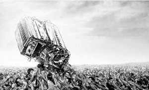

# ＜摇光＞如何让制度改变中国——探讨“人”与“制度”

**让每一个国民都关心政治、介入政治，从而成为现代意义上的国家公民。我们需要解放人的思想，让每一个具体的人知道自己生来就是与他人平等的，生来就是自由的，生来就拥有一份属于自己的并与他人同等的权利时，那民主法治社会就不远了。**  

# 如何让制度改变中国——探讨“人”与“制度”

## 文/兰天（浙江大学）

 

前言：前段时间我写了一篇《制度才能改变中国》（[/?p=12668](/?p=12668)），没想到在网络上引起了一些反响，因为我强调优秀制度确立后作用的更让一些人误会我是制度崇拜者，制定决定论者，否定“人”的作用，其实不然，当时只是发表对《你怎样，你的中国就怎样》一文所倡导的道德救国路线的一些异见，希望大家不要盲目自责，而应对于7.23事件从另外的角度更深入的思考而已，我没有否认人的作用，而是认为人的作用应更多地运用到制度改革中。北京大学研究生丁栩翔在五毛圣地、极左之都——乌有之乡上写了一篇文章《制度不能改变中国》批判拙作，丁文气势恢宏、旁征博引，试图证明制度是国情与权力斗争的结果，用制度变革过程中的反复与代价否定制度确立后的作用，逻辑论证有致命错误，好比追求女生的过程太困难了可能会有很多反复、代价所以我们就不要奢望享受追到以后做爱的感觉。前段时间，我说过有空时会对丁文进行回答，但后面看到有同学已替我回答《短评：<制度不能改变中国>中的荒谬逻辑》，因此今天所做此文不对丁文进行反驳，而是对于很多网友在留言透露出来的“人”与“制度”是鸡生蛋还是蛋生鸡的问题进行一番探讨。国人一般喜欢讲“主义”，再加一个“唯”字：“唯···主义”，或“唯···论”，就把事情绝对化了。我首先不赞成“XX决定论”，也不认为人与制度是对立的，《制度才能改变中国》中，我强调了制度确立后对于国家的作用，本文我想表达的是制度变革过程中人对于制度确立的作用。

对于人类社会，制度无疑是非常重要的。陈独秀在晚年反思无产阶级专政的教训时，曾经明确地指出：“是独裁制产生了斯大林，而不是斯大林才产生独裁制。斯大林的一切罪恶．乃是无产阶级独裁之逻辑的发达。我们若不从制度上寻出缺点，得到教训，只是闭起眼睛反对斯大林。将永远没有觉悟，一个斯大林倒了，会有无数斯大林在俄国及别国产生出来。”这是是陈独秀先生半生革命理论与实践的一个总结．是他在目睹了苏俄革命和经历了中国革命之后，经过多年的思考才得出的结论。然而，是否我们就可以认为只有制度才决定一切而与人并无多大关系呢?

制度确立后，对于人，对于百姓，对于官员，都有深刻的影响，尤其是对于领导者，更是关系到一个国家的命运与前途。对于国家，制度确立后往往起着决定性的作用。但是，无论如何我们不能忘记了人，因为任何制度都是由人来设计和制定的，在制度确立过程中，人则起着至关重要的作用。比如战国时，秦国正是因为“极心无二虑，尽公不顾私”的商鞅和“用人不疑，疑人不用”的秦孝公赢渠梁的同心协力、排出万难，才有了废井田、重农桑、奖军功、实行统一度量和郡县制等等在当时战国纷争，动荡不安环境下先进的制度，又正是因为这些制度让秦国从一个山东六国不屑一顾的弱国，变为了囊括四海、并吞八荒的统一的秦王朝。（PS：虽然我个人对于商鞅的法家学说特别是《商君书》对于中国后世皇权专制制度的巨大影响是持厌憎态度的，对于《商君书》的看法我想以后另文细谈，但不可否认商鞅对于秦国的贡献。）

应该说，在很多历史关头，人的作用倒是具有某种决定性。被称为美国国父的华盛顿，身为大陆军总司令，在独立战争中功勋卓著。战争胜利之后，华盛顿的手下，很多怂恿他登基称帝的人。甚至包括革命功勋汉密尔顿在内，都希望将美国建成类似于英国的君主国。然而，华盛顿的伟大就伟大在这里，他没有“打天下，坐天下”的思想，而是辞去总司令的职务，解甲归田。从1776年7月4日发表《独立宣言》，到1789年宪法的正式实施．经历了整整13年的时间。这13年中，似乎并没有谁想称王称帝，北美民众所做的全部工作便是反复地研讨、争论、交流与磋商，最后，终于为全世界树立了一个“现代国家最完美的例子”（《马克思恩格斯全集》第三卷第70页）。如果当年领导北美独立战争的不是华盛顿，而是与他同时代的罗伯斯庇尔，或是比他晚一百多年的斯大林或者是本朝太祖，会诞生美国这样的国家吗?

我们不妨比照着看看法国大革命：它的《人权宣言》，它的“平等、自由、博爱”的口号，不仅是那样的美丽动听，而且确实是人类社会一笔宝贵的精神遗产．直到今天仍不失为我们汲取不尽的思想资源。然而，问题却出现在革命的领导人身上。罗伯斯庇尔不是华盛顿，一旦成为革命领袖，便权欲膨胀、不容异己，甚至滥施暴力。雅各宾专政把法国带进了长期的动乱，让法国人民流了那么多不该流的血——仅1793年9月巴黎民众就杀害了1300名被怀疑同情王室的囚犯．随后有大约4万名反对派被处决，成千上万的人被监禁。可见，口号和宣言再动听也是无济于事的，关键在于人要实践这一口号和宣言，华盛顿正是实践了他的《独立宣言》。更令人钦佩的是，这位美国的开国元勋，第一任总统只当了8年，从而开创了美国历史上摒弃终身制、和平移交权力的典范。

制度与人可以说是互为因果，这在人类社会的发展史上几乎随处都可以找到正面或反面的例子。如果我们只看到制度的作用而忽视了人，那就未免有失偏颇。在人与制度相辅相成、相互制约的关系中，我们不仅要看到领袖人物的重要作用．还要认识到广大国民的作用。美国民主制度的建立与它的国民素质是有着密切的联系的，“五月花号”船上的41个男人，无疑是后来的美国国民的前驱和榜样。中国争取民主自由、富国强民的启蒙先驱们也早就认识到了这一点，梁启超先生在1901年的《新民说》中明确指出：“苟有新民，何患无新制度，无新政府，无新国家。”也正是由于鲁迅先生认识到，精神上的麻木比身体上的病弱更加可怕，先生才弃医从文醒目地提出“改造国民性”这一警世的重大命题。

即使到了今天“改造国民性”依然是个艰巨的课题，在两千多年的历史长河中，中国一直是个庞大、人口众多、民族众多的国家，但也一直是个专制独裁的国家。权力是个魔鬼，可以肆无忌惮地满足人的各种欲望，可以轻易激发人类本性中最丑恶最肮脏的东西，自秦朝以降，历代的帝王，无不想方设法巩固、健全和强化这一极权制度，哪怕皇帝改了姓，专制制度却依旧从“始皇”开始．“千世万世”地传了下去，其间绝无一人动过变革这一制度的念头。成为一个超稳定的社会结构，其重要原因，就是统治者的愚民政策。让全体民众—— 从士大夫到黎民百姓——永远处于蒙昧之中。直到现在依然如此，“皇帝”仍为人们所称道和艳羡，这点从中年、老年喜欢看《汉武大帝》《康熙王朝》，年轻人喜欢看《宫》《步步惊心》这点就能看出端倪。正如鲁迅先生在《两地书》所言：“说起民元的事来，那时确是光明得多……之后，即渐渐坏下去，坏而又坏……其实这也不是新添的坏，乃是涂饰的新漆剥落已尽，于是旧相又显了出来。使奴才主持家政，哪里会有好样子。最初的革命排满，容易做到的，其次的改革是要国民改革自身的坏根性，于是就不肯了。所以此后最要紧的是改革国民性，否则，无论是专制，是共和，是什么什么，招牌虽换，货色照旧，全不行的。”“启蒙”在中国实在是一个难以继续的话题。当人们都安于做“臣民”“子民”和“顺民”时，期盼出现刘彻、李世民、玄烨这样的明君雄主。“公民意识”何时才能根植于国民的头脑?当我们不能普及人的价值、人的尊严、人的权利的思想时，又如何去建设一个民主与法治的社会?这些都是令我们不能不深思的。

我在以前的文章中就说过，我们中国还需要思想启蒙，需要一些人站出来继承梁启超、陈独秀、胡适、鲁迅们的遗志，给国人普及一些关于制度、关于法治的基本概念。诸如“自由”、“民主”、“人权”、“宪政”等等。不要怕民众不能理解，中国百姓不比西方人民弱智，至少在胡适看来，民主不过是一种“幼稚园政治”，没有什么深不可测高不可攀的，人人都可以参与。比如我在进大学之前，对于自由、民主、法治观念是很模糊的，进入大学之后，大量阅读贺卫方老师的文章，受到启发，慢慢就对这些观念有了比较清晰的理解，并开始喜欢上思考与研究这些问题。

我们需要“围观”，争取他人的权利，也是争取自己的权利。你可以不关心政治，但政治时刻在关心着你：和谐号死难者，肯定有对京珠高速大火漠不关心的；京珠的死难者中，肯定有对上海胶州路大火漠不关心的；胶州路的死难者中，肯定大多数人对汶川豆腐渣难童漠然的；汶川难童家长，又有几个人对克拉玛依大火表示过愤慨的……铁勾勾住嘴，刀子架在脖子，才开始叫的，是猪。正如胡适所言：“争你们个人的自由，便是为国家争自由!争自己的人格，便是为国家争人格!自由平等的国家不是一群奴才建造得起来的!”比如大连福佳大化PX项目，在近十万人抗议以后，当局最终决定搬迁这个项目。一个人反对或许不起作用，但再小的民意乘以13亿也会变成当权者畏惧的海洋。让每一个国民都关心政治、介入政治，从而成为现代意义上的国家公民。我们需要解放人的思想，让每一个具体的人知道自己生来就是与他人平等的，生来就是自由的，生来就拥有一份属于自己的并与他人同等的权利时，那民主法治社会就不远了。

民主先行者的基本思路概括为“启蒙—自由—民主—宪政”，我想大致是不错的，正如如果没有当年欧洲的启蒙运动，让大多数人开始思考封建制度的弊端，民主制度的优越，那怎会有后来的民主制度取代封建制度？胡适先生及其后学殷海光等自由主义者，对台湾民主进程所作的实实在在的努力与贡献，也是有目共睹的。这就足以证明新文化运动的启蒙不仅没有错，而且其薪火始终有人相传。在我们大陆依然可以有人继承他们的衣钵，需要更多的韩寒、李承鹏式的人物，尽管他们的言辞激烈，笔锋犀利，我倒觉得不仅不过分，而且十分必要。终日被困在黑暗的铁屋子里，“呐喊”几声难道不应该么？对于麻木已久的神经，不给以强烈的刺激，它能有感觉或者说它能有痛感么？

我们只有不断传播民主法治知识，维护了每一个“个人”的权利与尊严，才可能抑制住某些强权者无休无止的欲望：也只有建立起一套完整的“以个人为中心”的价值体系。我们的“改革”才能进入一个正常的轨道，才有望良性运行并与世界真正接轨，才能建构一个更为合理的社会制度。

 

（采编自投稿邮箱；责编：麦静）

 
